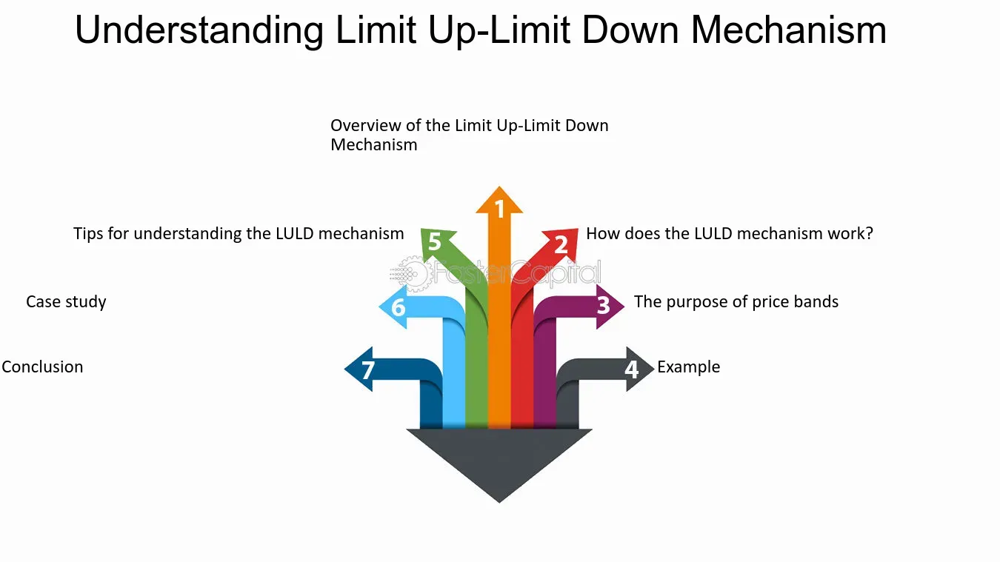

## Table of Contents

## What is a Limit Up/Limit Down mechanism?

A Limit Up/Limit Down mechanism is a rule that stock exchanges use to stop big, sudden price changes in stocks. It works by setting a highest and lowest price that a stock can reach in a day. If the stock's price tries to go above the highest price or below the lowest price, trading stops for a short time. This gives everyone a chance to calm down and think before they keep trading.

The main goal of this mechanism is to keep the market stable and protect investors. Big, sudden price changes can scare people and make them do things they might regret later. By putting these limits in place, the stock exchange helps make sure that trading happens in a more calm and orderly way. This can help prevent panic selling or buying, which can lead to even bigger problems in the market.

## Why was the Limit Up/Limit Down mechanism introduced?

The Limit Up/Limit Down mechanism was introduced to help keep the stock market stable and protect investors from big, sudden price changes. Before this rule, stocks could sometimes jump up or down very quickly, which could scare people and make them sell or buy in a panic. This could lead to even bigger problems in the market. By setting a highest and lowest price that a stock can reach in a day, the mechanism helps to slow things down and give everyone a chance to think before they act.

This rule also helps to make sure that trading happens in a more calm and orderly way. When prices start to move too fast, the mechanism can stop trading for a short time. This pause gives investors a moment to look at the situation and decide what to do next, instead of just reacting quickly. By doing this, the Limit Up/Limit Down mechanism helps to prevent big mistakes and keep the market running smoothly.

## How does the Limit Up/Limit Down mechanism work?

The Limit Up/Limit Down mechanism is a rule that stock exchanges use to stop big, sudden price changes in stocks. It works by setting a highest and lowest price that a stock can reach in a day. If the stock's price tries to go above the highest price or below the lowest price, trading stops for a short time. This gives everyone a chance to calm down and think before they keep trading.

The main goal of this mechanism is to keep the market stable and protect investors. Big, sudden price changes can scare people and make them do things they might regret later. By putting these limits in place, the stock exchange helps make sure that trading happens in a more calm and orderly way. This can help prevent panic selling or buying, which can lead to even bigger problems in the market.

## What are the specific price bands used in the Limit Up/Limit Down mechanism?

The Limit Up/Limit Down mechanism uses price bands to control how much a stock's price can change in a day. These bands are set as a percentage above and below the stock's average price over the last five minutes. For most stocks, the price band is 5% above and below this average price. But for some stocks that are more likely to have big price changes, the band can be wider, like 10% or even 20%.

If the stock's price tries to go outside these bands, trading stops for a short time. This pause can last from 5 to 10 minutes, depending on the rules of the stock exchange. After the pause, trading starts again, but if the price tries to go outside the bands again, there might be another pause. This helps to keep the market calm and gives everyone time to think before they keep trading.

## Which markets implement the Limit Up/Limit Down mechanism?

The Limit Up/Limit Down mechanism is used by many stock markets around the world to help keep trading calm and protect investors. In the United States, the mechanism is used by the major stock exchanges like the New York Stock Exchange (NYSE) and the NASDAQ. These exchanges use the rule to stop big, sudden price changes and give everyone a chance to think before they keep trading.

Other countries also use similar rules to help keep their markets stable. For example, in Japan, the Tokyo Stock Exchange uses a similar system to control price changes. In Europe, some stock exchanges also have rules like this to make sure trading happens in a calm and orderly way. By using these mechanisms, stock exchanges all over the world try to protect investors and keep the market running smoothly.

## What happens when a stock hits the limit up or limit down price?

When a stock hits the limit up or limit down price, trading stops for a short time. This pause can last from 5 to 10 minutes, depending on the rules of the stock exchange. The idea is to give everyone a chance to calm down and think before they keep trading. If the stock's price tries to go above the highest price or below the lowest price, the trading halt happens to prevent big, sudden price changes that could scare people.

After the pause, trading starts again. But if the price tries to go outside the bands again, there might be another pause. This helps to keep the market calm and gives everyone more time to think before they keep trading. By doing this, the Limit Up/Limit Down mechanism helps to prevent panic selling or buying, which can lead to even bigger problems in the market.

## How does the Limit Up/Limit Down mechanism affect trading?

The Limit Up/Limit Down mechanism changes how people trade by setting a highest and lowest price that a stock can reach in a day. If the stock's price tries to go above the highest price or below the lowest price, trading stops for a short time. This pause can last from 5 to 10 minutes, depending on the rules of the stock exchange. It gives everyone a chance to calm down and think before they keep trading. This means that traders can't buy or sell the stock during the pause, which can affect how quickly they can make trades.

This mechanism helps to keep the market stable and protects investors from big, sudden price changes. When a stock's price starts to move too fast, the pause gives everyone a moment to look at the situation and decide what to do next, instead of just reacting quickly. This can stop panic selling or buying, which can lead to even bigger problems in the market. By slowing down trading when prices are moving too fast, the Limit Up/Limit Down mechanism helps to make sure that trading happens in a more calm and orderly way.

## What are the differences between Limit Up/Limit Down and circuit breakers?

Limit Up/Limit Down and circuit breakers are both rules that stock exchanges use to stop big, sudden price changes. But they work a bit differently. Limit Up/Limit Down sets a highest and lowest price that a stock can reach in a day. If the stock's price tries to go above or below these prices, trading stops for a short time, like 5 to 10 minutes. This helps to keep the market calm and gives everyone a chance to think before they keep trading.

Circuit breakers, on the other hand, are used to stop trading for the whole market if the market's price changes too much in a day. For example, if the stock market goes down by a lot in a short time, a circuit breaker might stop all trading for a while. This can be for 15 minutes or even longer, depending on how big the price change is. The idea is to give everyone a chance to calm down and stop a big market crash.

Both rules help to keep the market stable and protect investors, but Limit Up/Limit Down focuses on individual stocks, while circuit breakers look at the whole market. By using these rules, stock exchanges try to make sure that trading happens in a calm and orderly way.

## How is the duration of a Limit Up/Limit Down pause determined?

The duration of a Limit Up/Limit Down pause is decided by the rules of the stock exchange. Most of the time, the pause lasts between 5 to 10 minutes. This short break gives everyone a chance to calm down and think before they keep trading. The exact length of the pause can be different depending on which stock exchange is being used.

The main goal of the pause is to stop big, sudden price changes that could scare people. If a stock's price tries to go above the highest price or below the lowest price set by the Limit Up/Limit Down mechanism, the trading stops for this short time. This helps to keep the market calm and gives everyone a moment to look at the situation and decide what to do next, instead of just reacting quickly.

## What are the potential criticisms or limitations of the Limit Up/Limit Down mechanism?

Some people think the Limit Up/Limit Down mechanism might not work as well as it should. One big worry is that it might stop trading too often, which can make it hard for people to buy or sell stocks when they want to. If the stock market is moving fast, these pauses can slow everything down and make it harder for traders to do their job. Also, some people say that the mechanism might not stop big price changes completely. If the market keeps moving after the pause, the stock price can still go up or down a lot.

Another problem is that the Limit Up/Limit Down mechanism might not be fair for everyone. Big traders with a lot of money and information might be able to use the pauses to their advantage. They can look at what's happening during the pause and then make smart trades when trading starts again. This can make it harder for smaller traders who don't have as much information or money. So, while the mechanism tries to keep the market calm and protect people, it might not work the same way for everyone.

## How do regulatory bodies monitor and adjust the Limit Up/Limit Down mechanism?

Regulatory bodies keep a close eye on the Limit Up/Limit Down mechanism to make sure it's working well. They look at how often trading stops because of the mechanism and if it's helping to keep the market calm. If they see that the pauses are happening too much or not enough, they might change the rules. For example, they could make the price bands wider or narrower, or change how long the trading pauses last. This helps to make sure the mechanism is doing its job without causing too many problems for traders.

Sometimes, regulatory bodies also talk to people in the market to get their thoughts on the mechanism. They might ask traders, investors, and stock exchanges what they think about how it's working. If a lot of people say it's not working well, the regulators might decide to make changes. By listening to everyone and watching how the market acts, regulatory bodies try to keep the Limit Up/Limit Down mechanism fair and helpful for everyone.

## What advanced strategies can traders use in response to the Limit Up/Limit Down mechanism?

Traders can use the Limit Up/Limit Down mechanism to their advantage by watching the price bands closely. When a stock is getting close to hitting the limit up or limit down price, traders might decide to buy or sell before the pause happens. This way, they can make trades before the market stops and everyone has to wait. Some traders also look at how the market is acting during the pause. If they think the price will keep moving in the same direction after the pause, they might get ready to make more trades as soon as trading starts again.

Another strategy is to use the pauses to think about what's happening in the market. During the pause, traders can look at news or other information that might be affecting the stock's price. This can help them decide if they want to keep trading the same way or change their plan. Some traders might also use the pauses to talk to other people in the market and see what they're thinking. By using the time wisely, traders can make better decisions and maybe even find new opportunities to make money.

## References & Further Reading

[1]: SEC (Securities and Exchange Commission). ["Limit Up-Limit Down: Modification of Rules Regarding Limit Up-Limit Down Plans."](https://www.sec.gov/news/press/2011/2011-84.htm)

[2]: CME Group. ["Price Limit Guide."](https://www.cmegroup.com/trading/price-limits.html)

[3]: Lopez de Prado, M. (2018). ["Advances in Financial Machine Learning"](https://www.amazon.com/Advances-Financial-Machine-Learning-Marcos/dp/1119482089). Wiley. 

[4]: Chan, E. (2013). ["Algorithmic Trading: Winning Strategies and Their Rationale"](https://github.com/NehrenD/algo_trading_and_quant_strategies). Wiley. 

[5]: Harris, L. (2003). ["Trading and Exchanges: Market Microstructure for Practitioners"](https://books.google.com/books/about/Trading_and_Exchanges.html?id=xNfnCwAAQBAJ). Oxford University Press.