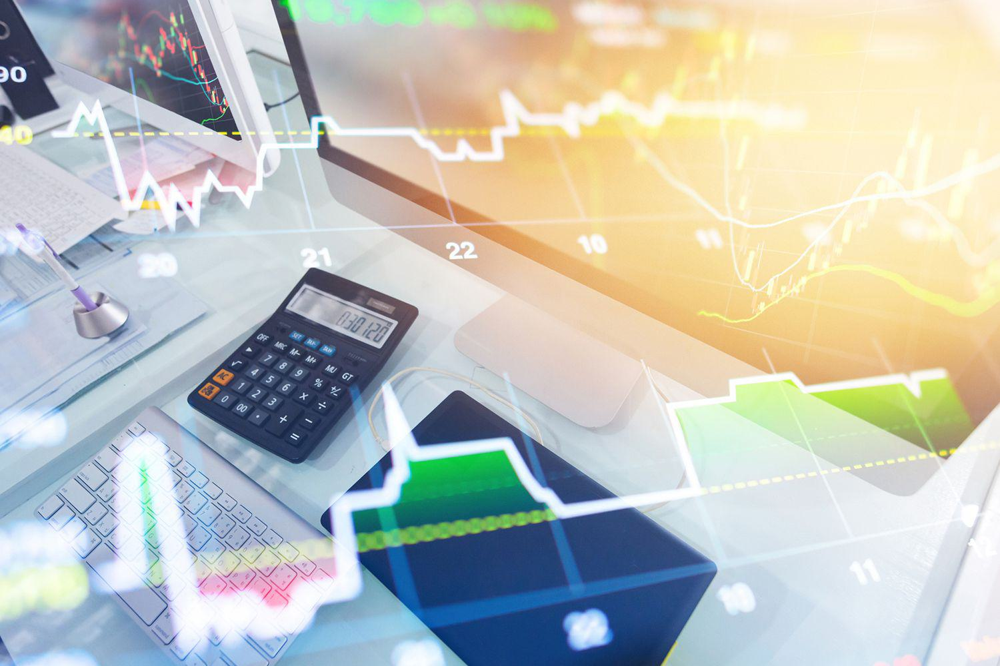

Economics, traditionally viewed as a cornerstone of understanding how societies allocate resources, has increasingly come under intense scrutiny. Critics have noted that while the field offers valuable insights, it is not without significant limitations. Central to these criticisms is the foundational assumption of rational behavior among economic agents, which often diverges from real-world behavior. This discrepancy has been magnified by recent developments in financial markets, notably algorithmic trading—a technological advancement that employs complex algorithms to execute trades at astonishing speeds and volumes.

Algorithmic trading, now a dominant force in financial markets, challenges longstanding economic theories and assumptions. The rapid pace and high-frequency nature of these trades pose questions about market efficiency and the rational actor model traditionally assumed in economic models. This development has added a new layer of complexity to financial markets, necessitating a reevaluation of how these markets function and the assumptions underlying economic theories.

This article intends to scrutinize the economic drawbacks and explore the complexities introduced by algorithmic trading. Traditional economic theories are being tested against a backdrop of rapidly changing financial practices, which are reshaping markets and influencing policy decisions. The aim is to provide a comprehensive overview of the criticisms faced by economics and to understand how these are influenced by the evolving landscape of modern finance.

By examining the convergence of traditional economic principles and modern technological critiques, this article seeks to highlight potential pathways for future theory and policy development. As economic landscapes continue to transform, it becomes crucial to bridge the gap between historical economic paradigms and contemporary realities driven by technological progress. Such an approach will likely inform more adaptive and robust economic policies capable of navigating the intricacies of modern financial environments.

## Table of Contents

## Understanding the Limitations of Economics

Economics, as a social science, primarily investigates the mechanisms through which goods and services are produced, distributed, and consumed. This field is significantly influenced by human behavior, which adds layers of complexity and unpredictability. One of the core limitations of economics is its reliance on the assumption of rationality. Traditional economic theories often assume that individuals act rationally, optimizing their decisions to maximize utility or profit. However, real-world scenarios frequently demonstrate deviations from rational behavior due to psychological, emotional, and social factors.

This assumption of rationality poses a challenge for economists as they attempt to model and predict market behaviors. The difficulty is compounded by economics' struggle with non-replicability. Unlike the hard sciences, where experiments can be replicated to confirm a hypothesis or model, economic conditions are difficult to reproduce. This lack of replicability leads to challenges in predicting how markets will behave under varying conditions.

Normative economics, which involves value judgments about how economies should be structured or how policies ought to be implemented, introduces further intricacies. It often results in differing opinions and creates insufficient conclusions due to its subjective nature. Policymakers and economists frequently disagree on the best approaches, leading to debates that hinge on ethical, cultural, and social perspectives rather than empirical evidence alone.

Moreover, economists face substantial difficulties in isolating variables related to human behavior and market responses. When compared to hard sciences like physics or chemistry, where variables can be controlled and isolated with relative accuracy, the dynamic nature of human and market interactions results in predictions that are less concrete and frequently subject to significant revision.

Critics also argue that traditional economic theories often disregard important environmental and social factors. These factors play a critical role in real economic systems and their impacts cannot be easily quantified or ignored if one is to understand a comprehensive economic impact. For instance, economic models traditionally focus on growth and efficiency but may neglect sustainability and equity, which are essential for long-term economic stability and social well-being.

In summary, economics faces substantial limitations due to its foundational assumptions, challenges with replicability, and variable isolation complexities. There is a growing consensus that incorporating interdisciplinary approaches, including insights from psychology and environmental science, is essential to develop more robust and comprehensive economic models. This approach will enable economics to better address the multifaceted challenges presented by modern economic environments and societal needs.

## Criticism of Economics in Algorithmic Trading

Algorithmic trading presents significant challenges to traditional economic theories that assume market efficiency and rational actors. The primary contention arises from the extraordinary speed and complexity with which algorithmic trades occur, questioning the notion of markets being self-correcting and informationally efficient. Traditional economic models often rely on the Efficient Market Hypothesis (EMH), which posits that financial markets reflect all available information. Algorithmic trading, however, can disrupt this assumption. Highly automated and high-frequency trades execute transactions in milliseconds, making it difficult for market prices to consistently reflect the immediate flow of information, potentially leading to inefficiencies.

The phenomenon of flash crashes exemplifies these inefficiencies. Such events occur when rapid and automated sell-offs cause significant market disruptions. Notable instances include the 2010 Flash Crash, where the Dow Jones Industrial Average plunged by about 1,000 points within minutes before recovering. These anomalies expose the limitations of existing regulatory frameworks, which often struggle to keep pace with the technological advancements in trading mechanisms. The Securities and Exchange Commission (SEC) and other regulatory bodies have recognized the need for updated policies to address the risks posed by high-frequency trading.

Algorithmic trading raises ethical concerns about market manipulation and fairness, particularly with practices like spoofing and layering, where traders place false orders to manipulate prices. These practices undermine market integrity and highlight the need for stringent surveillance and regulation to ensure a level playing field.

The rise of [algorithmic trading](/wiki/algorithmic-trading) necessitates a re-evaluation of economic theories to incorporate technological impacts on market dynamics. While classical theories emphasize equilibrium and market efficiency, algorithmic trading reveals the importance of incorporating factors such as the impact of technology on market [liquidity](/wiki/liquidity-risk-premium), [volatility](/wiki/volatility-trading-strategies), and price discovery. This evolution calls for an interdisciplinary approach, combining insights from computer science, behavioral economics, and traditional economic theory to develop robust models that can better predict and respond to the complexities of modern financial markets. Economic models must adapt to these rapid technological changes to ensure their relevance and applicability in policy-making and regulatory frameworks.

## Integrating Modern Critiques with Economic Practice

In the rapidly evolving landscape of modern economics, integrating contemporary critiques, such as those from behavioral economics, is crucial for developing a comprehensive economic framework. Behavioral economics enhances traditional models by incorporating psychological insights into decision-making processes. This approach challenges the classic assumption of fully rational actors, offering a nuanced understanding of human behavior in economic contexts. For example, the concept of bounded rationality, introduced by Herbert A. Simon, illustrates how cognitive limitations impact decision-making, diverging from the ideal of perfectly rational choices.

Algorithmic trading exemplifies the necessity for adaptive economic models that account for technological advancements. The interplay between this technology and economic policy illustrates the need for frameworks that can accommodate rapid evolutions in market behavior driven by data and automated processes. Traditional economic models, which often assume static conditions and linear progressions, are being tested against the dynamic and complex nature of algorithmic trading. To address these challenges, economic theories must incorporate elements such as adaptive algorithms, which can adjust to market changes in real-time, thereby increasing the robustness and effectiveness of economic policy.

These modern critiques stress the importance of interdisciplinary approaches, advocating for the integration of economics, technology, and psychology to devise better policy outcomes. This approach acknowledges that economic systems operate within a broader socio-technological context. By merging insights from multiple disciplines, policymakers and economists can formulate strategies that offer more resilient solutions to economic challenges. For instance, game theory, a branch of mathematics dealing with strategic interactions, can be employed alongside psychological insights to anticipate and influence participant behaviors in financial markets more effectively.

Economic models should evolve continuously to reflect technological changes, ensuring they remain relevant and applicable. This evolution can be facilitated by adopting computational techniques and [machine learning](/wiki/machine-learning) algorithms to simulate complex systems and predict outcomes under various scenarios. Python, due to its versatility and rich ecosystem of libraries like NumPy and pandas, provides an excellent toolset for developing such models. By leveraging these computational methods, economists can create adaptable frameworks capable of responding to unforeseen shifts in market dynamics, maintaining system stability, and supporting informed policy decisions. 

In summary, the integration of modern critiques into economic practice is essential for developing resilient and adaptable economic models. Embracing interdisciplinary perspectives and technological innovations will equip economic frameworks to better address the complex realities of contemporary financial systems.

## Conclusion

The ongoing evolution in economics highlights the necessity of addressing its criticisms through a strategic integration of traditional and modern theories. Algorithmic trading serves as a prime example of why economic policies must adapt to technological advancements to ensure both informed decision-making and market stability. As the pace of technological change accelerates, reconciling economic criticisms with these new technologies becomes imperative to develop a comprehensive and adaptable economic framework.

The future success of economic systems will rely significantly on the ability to adjust theories and practices to align with the complexities introduced by modern financial environments. In particular, algorithmic trading, with its high-speed transactions and advanced data analysis capabilities, challenges existing economic paradigms and prompts a reevaluation of market dynamics. Thus, creating models that reflect the rapid pace of technological innovation will be crucial.

Furthermore, the emphasis on interdisciplinary collaboration will play a pivotal role. By merging insights from economics, technology, and psychology, policymakers can navigate the multifaceted challenges presented by swift economic and technological changes. The integration of such diverse perspectives not only enhances the robustness of economic models but also ensures resilience and adaptability in policy frameworks. As economic environments continue to transform, cultivating a multifaceted approach that embraces both technological and human elements will be essential for enduring success.

## References & Further Reading

- Investopedia: Understanding the Limitations and Drawbacks of Economics offers a comprehensive overview of the foundational assumptions of economics and highlights the challenges in applying economic theories to real-world scenarios. The article discusses issues such as the assumption of rationality and the difficulties of market prediction due to non-replicability. [Investopedia](https://www.investopedia.com) provides a valuable resource for understanding these fundamental concerns.

- Papers with Backtest: Mainstream Economics Overview and Criticisms is an academic paper that critically assesses mainstream economic theories, focusing on their limitations. This paper explores the discrepancies that arise when traditional models face new economic phenomena, such as those introduced by algorithmic trading.

- GNLU Journal of Law & Economics: Economic Implications of Algorithmic Trading examines the intersection of law, economics, and technology. This journal article investigates into how algorithmic trading challenges existing regulatory frameworks and economic theories, offering insight into the complexities of modern financial markets.

- Additional academic literature on behavioral economics and algorithmic trading provides in-depth analysis and empirical studies on integrating psychological aspects into economic models. These works emphasize the necessity of adapting economic theories to account for technological advancements, especially in the context of high-frequency trading environments. Key contributors in this field include Richard H. Thaler and Daniel Kahneman, whose works on behavioral economics have significantly influenced contemporary economic thought.

These references and readings are essential for anyone looking to understand the evolving landscape of economics, especially in light of technological advancements like algorithmic trading.

