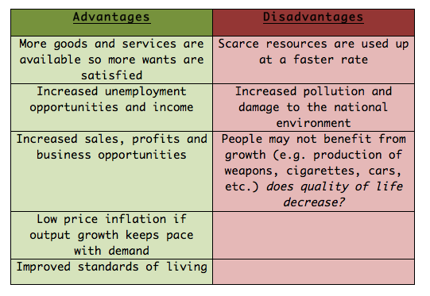

## Table of Contents

## What is economics and why is it important to understand its limitations?

Economics is a social science that studies how people use resources to meet their needs and wants. It looks at things like how much stuff we produce, how we trade it, and how we decide what to do with it. Economists try to figure out how to make the best use of what we have, like money, time, and natural resources. They use theories and models to predict how people and businesses will act, and to help make decisions about things like taxes, prices, and jobs.

Understanding the limitations of economics is important because it helps us see that it's not perfect and can't solve all our problems. Economics uses models and theories that are based on certain assumptions, but real life is often more complicated than these assumptions. For example, economists might assume that people always make rational choices, but in reality, people can be influenced by emotions or make mistakes. Knowing these limitations helps us use economic ideas more wisely and reminds us to consider other factors, like social and environmental issues, when making decisions.

## Can you explain what we mean by 'limitations' and 'drawbacks' in the context of economics?

In economics, 'limitations' refer to the boundaries or constraints within which economic theories and models operate. These limitations come from the assumptions economists make to simplify complex real-world situations. For example, many economic models assume that people always make rational decisions, but in reality, people can be influenced by emotions or lack of information. These assumptions help economists create models that are easier to work with, but they don't always match what happens in real life. Understanding these limitations helps us see where economic theories might not be accurate or complete.

'Drawbacks' in economics are the negative aspects or problems that arise from using economic theories and models. These drawbacks can occur when the models fail to predict real-world outcomes accurately because they don't account for all the factors that influence economic behavior. For instance, an economic model might suggest that lowering taxes will always lead to more economic growth, but in reality, other factors like public spending or international trade can change the outcome. Recognizing these drawbacks is important because it reminds us to be cautious when using economic theories to make decisions and to consider other perspectives, like social and environmental impacts, which might not be included in the models.

## What are some common assumptions made in economic models and how do they limit the field?

Economic models often assume that people always make rational choices. This means they think people will always do what's best for them, like choosing the cheapest product or saving money for the future. But in real life, people can be influenced by emotions, make mistakes, or not have all the information they need. This assumption limits economics because it doesn't always match how people really behave. For example, someone might buy a more expensive product because it makes them feel good, even if it's not the best financial decision.

Another common assumption is that markets are always perfect and efficient. This means that prices will always adjust to balance supply and demand, and everyone can get what they need. But in the real world, markets can have problems like monopolies or information gaps, where some people know more than others. This assumption limits economics because it can't explain why some markets fail or why some people can't get what they need, even if they want to. Understanding these limits helps us see why economic models might not always work as expected in real life.

## How does the reliance on quantitative data affect the accuracy of economic predictions?

Economic predictions often rely a lot on numbers and data. This can be good because numbers help economists see patterns and make guesses about what might happen next. For example, if they see that people are buying more cars, they might predict that the car industry will grow. But, numbers can also make predictions less accurate because they don't tell the whole story. They can miss important things like people's feelings or unexpected events, like a sudden change in the weather or a new law.

Because of this, economic predictions can sometimes be wrong. If economists only look at numbers, they might not see that people are worried about their jobs or that a new technology could change how people buy things. These things can affect the economy in big ways, but they don't always show up in the numbers. So, while numbers are important, economists need to think about other things too if they want their predictions to be more accurate.

## What role does human behavior play in the limitations of economic theories?

Human behavior plays a big role in the limitations of economic theories because people don't always act the way the theories say they should. Economic theories often assume that people make rational choices, meaning they always pick the option that gives them the most benefit. But in real life, people can be influenced by their feelings, make mistakes, or not have all the information they need. For example, someone might spend a lot of money on a fancy coffee because it makes them feel good, even if it's not the best financial choice. This shows that human behavior can be unpredictable and doesn't always fit neatly into economic models.

Because of this, economic theories can't always predict what will happen in the real world. If economists only use models that assume people are always rational, they might miss important things like how people's moods or social trends can affect the economy. For instance, if a lot of people start buying less because they're worried about the future, this could slow down the economy in ways that the models didn't predict. Understanding that human behavior is complex helps economists see the limits of their theories and reminds them to consider other factors when making predictions or decisions.

## How do external factors, such as political events or natural disasters, impact the reliability of economic models?

Economic models try to predict how things like money, jobs, and prices will change. But these models can be thrown off by big events outside of the economy, like political changes or natural disasters. For example, if a new government comes in and changes a lot of laws, this can make the economy act in ways the models didn't expect. Or if a big hurricane hits, it can destroy businesses and homes, which can slow down the economy and make the models' predictions wrong.

These external factors are hard to predict and can change the economy in big ways. Economic models usually don't include these events because they are so unpredictable. So, when something big happens, like a war or a global health crisis, the models can't tell us what will happen next. This shows that while economic models are useful, they have limits and can't always be relied on when the world changes suddenly.

## Can you discuss the concept of ceteris paribus and its implications for economic analysis?

Ceteris paribus is a Latin phrase that means "all other things being equal." In economics, it's used to help make predictions easier. When economists use ceteris paribus, they look at how one thing affects the economy while pretending that nothing else changes. For example, they might want to see what happens to the price of apples if the weather gets warmer. They would assume that everything else, like people's tastes and other fruit prices, stays the same. This helps them focus on just one thing at a time.

But the real world is not so simple. Things are always changing, and it's hard to keep everything else the same. So, using ceteris paribus can make economic models less accurate because they don't show the whole picture. If economists only look at one change and ignore everything else, they might miss important effects. For instance, if the weather gets warmer, it might also affect other fruits, which could change apple prices in ways the model didn't predict. Knowing this helps economists understand the limits of their models and be more careful when they make predictions.

## What are the criticisms of mainstream economic theories like neoclassical economics?

Neoclassical economics is a big part of what many economists learn and use. It says that people always make choices that give them the most benefit, and markets work well to balance what people want with what's available. But some people think this way of looking at the economy has problems. They say it doesn't think about how people's feelings or not having enough information can change their choices. It also doesn't look at how power or unfairness can affect markets. Critics think neoclassical economics focuses too much on math and not enough on real life.

Another big criticism is that neoclassical economics doesn't pay enough attention to things like the environment or how fair the economy is for everyone. It mostly looks at how to make the economy grow bigger, but it doesn't think about what that growth might cost in terms of pollution or using up resources. Some people also say that it doesn't help us understand why some people stay poor even when the economy is doing well. They think we need different ways of thinking about the economy that include these important issues.

## How do different schools of economic thought address or fail to address the limitations of economics?

Different schools of economic thought have their own ways of looking at the economy, and they deal with its limitations differently. Neoclassical economics, which is very popular, focuses on how people make rational choices and how markets work well. But it often misses out on things like how people's feelings or not having enough information can change their choices. It also doesn't think much about the environment or how fair the economy is for everyone. Critics say this focus on math and not on real life makes neoclassical economics less useful for understanding big problems like poverty or climate change.

On the other hand, other schools of thought like Keynesian economics pay more attention to how government spending and policies can help fix economic problems. Keynesians look at how things like unemployment and inflation can be managed by the government, which is something neoclassical economics might not focus on as much. But even Keynesian economics has its limits. It can be hard to predict how people will react to government actions, and it might not consider long-term issues like environmental damage. Meanwhile, schools like behavioral economics try to understand how people really make choices, including their emotions and mistakes, but they might struggle to make big, simple models that can be used easily in policy-making.

Overall, each school of economic thought has its strengths and weaknesses. They all try to make sense of the economy in different ways, but none of them can capture everything. Recognizing the limitations of each approach helps economists use them more wisely and reminds them to look at other factors, like social and environmental issues, when making decisions.

## What are the ethical considerations and potential biases in economic research and policy-making?

Economic research and policy-making can be affected by ethical issues and biases. One big problem is that economists might have their own ideas or beliefs that can change how they do their research or make policies. For example, if an economist believes strongly in free markets, they might ignore data that shows markets can be unfair or hurt the environment. This can lead to policies that don't help everyone and might even make some people worse off. It's important for economists to be aware of their own biases and try to be fair when they look at data and make decisions.

Another ethical issue is how economic policies can affect different groups of people differently. For instance, a policy that cuts taxes might help rich people more than poor people, making the gap between them even bigger. Economists need to think about fairness and make sure their policies don't hurt certain groups more than others. This means looking at things like race, gender, and income to see who might be affected and trying to make policies that are fair for everyone. By considering these ethical issues, economists can help create a better and more equal economy.

## How have historical economic failures highlighted the drawbacks of certain economic approaches?

Historical economic failures have shown us that some economic approaches don't always work as planned. For example, the Great Depression in the 1930s showed that relying too much on free markets, like neoclassical economics suggests, can lead to big problems. During the Depression, many people lost their jobs and money because banks failed and businesses closed. This made economists and governments realize that they needed to step in and help, which is what Keynesian economics is about. The Depression showed that markets don't always fix themselves and that government action can be important to get the economy back on track.

Another example is the 2008 financial crisis, which highlighted the dangers of deregulation and risky financial practices. Many economists and policymakers believed that markets would self-regulate and that less government control would lead to growth. But when banks took too many risks and the housing market crashed, it caused a global economic meltdown. This crisis showed that ignoring the need for oversight and regulation can lead to huge problems. It also pointed out that economic models didn't always account for human behavior and the possibility of widespread panic, which made the crisis worse. These historical events remind us that economic theories have limits and that we need to be careful and consider many factors when making economic decisions.

## What advancements in economic theory and methodology are being pursued to overcome these limitations?

Economists are working on new ideas and methods to make their theories better and fix some of the old problems. One big change is the growth of behavioral economics, which looks at how people really make choices, including their feelings and mistakes. This helps economists understand why people might not always do what the old models said they would. Another important advancement is the use of big data and computers to study the economy. With lots of information and powerful computers, economists can look at more things at once and see patterns that were hard to find before. This can make their predictions more accurate and help them understand the economy better.

Also, economists are trying to include more factors in their models, like the environment and fairness. They know that the economy doesn't just affect money and jobs but also things like the air we breathe and how fair life is for different people. By thinking about these things, economists can make better policies that help everyone and don't just focus on making the economy bigger. These new approaches show that economists are trying to learn from past mistakes and make their work more useful for real life.

## References & Further Reading

- Investopedia: Understanding the Limitations and Drawbacks of Economics offers a comprehensive overview of the foundational assumptions of economics and highlights the challenges in applying economic theories to real-world scenarios. The article discusses issues such as the assumption of rationality and the difficulties of market prediction due to non-replicability. [Investopedia](https://www.investopedia.com) provides a valuable resource for understanding these fundamental concerns.

- Papers with Backtest: Mainstream Economics Overview and Criticisms is an academic paper that critically assesses mainstream economic theories, focusing on their limitations. This paper explores the discrepancies that arise when traditional models face new economic phenomena, such as those introduced by algorithmic trading.

- GNLU Journal of Law & Economics: Economic Implications of Algorithmic Trading examines the intersection of law, economics, and technology. This journal article investigates into how algorithmic trading challenges existing regulatory frameworks and economic theories, offering insight into the complexities of modern financial markets.

- Additional academic literature on behavioral economics and algorithmic trading provides in-depth analysis and empirical studies on integrating psychological aspects into economic models. These works emphasize the necessity of adapting economic theories to account for technological advancements, especially in the context of high-frequency trading environments. Key contributors in this field include Richard H. Thaler and Daniel Kahneman, whose works on behavioral economics have significantly influenced contemporary economic thought.

These references and readings are essential for anyone looking to understand the evolving landscape of economics, especially in light of technological advancements like [algorithmic trading](/wiki/algorithmic-trading).

