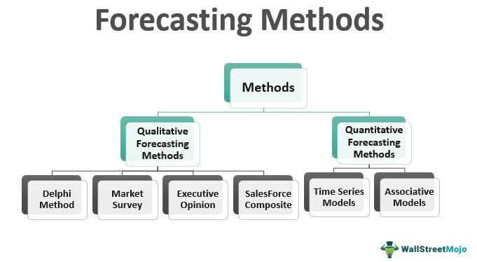

The stock market has been a significant arena for investment for decades, evolving with technology to address the needs of diverse investor profiles. It serves as a critical mechanism for economic growth, enabling the exchange of securities between investors and corporations, thus fostering capital formation. Understanding stock market investments is imperative due to the intricacy involved, with market forces such as supply and demand, macroeconomic indicators, geopolitical events, and human behavior all influencing market dynamics. Investors aim to generate returns by navigating these complex factors, but achieving proficiency requires a deep comprehension of both theoretical principles and practical application.

Algorithmic trading, also known as algo trading, has emerged as a transformative force in stock investments. This innovative approach leverages computer algorithms to make trading decisions with minimal human intervention, executing trades at speeds and frequencies unachievable by manual trading. Algorithms can analyze vast datasets, identify trading opportunities, and execute orders in milliseconds, providing a competitive edge. Despite its potential, algorithmic trading presents several challenges and limitations. These include the requirement for sophisticated technological infrastructure, potential systemic risks like flash crashes, and the need for stringent regulatory compliance. This article investigates into the complexities of learning stock market investment and examines the multifaceted challenges posed by algorithmic trading in today's financial environment.



## Table of Contents

## Understanding the Stock Market

The stock market is a complex system influenced by numerous factors that interact dynamically to affect stock prices and investor behavior. Market behavior is largely shaped by the intricate balance of supply and demand among market participants, which include individual investors, institutions, and automated trading entities. Human psychology also plays a critical role, with investor sentiment and behavioral biases often leading to herd behavior, overreactions, or irrational decision-making.

Economic indicators are fundamental in setting expectations about future market movements. Metrics such as gross domestic product (GDP), unemployment rates, inflation rates, and interest rates provide insights into the economic health of a country, directly affecting corporate earnings and, consequently, stock prices. Global events, such as geopolitical tensions, natural disasters, and pandemics, introduce additional layers of uncertainty, influencing market volatility and investor risk perception.

Despite advances in financial analysis and modeling, predicting market outcomes with certainty remains elusive. The inherent volatility and unpredictability of the stock market arise from its complex adaptive nature, where countless variables interact and lead to non-linear outcomes. For instance, even a well-substantiated forecast can be upended by an unforeseen event or a sudden change in market sentiment.

Historical data, while offering valuable insights into market trends and behaviors, is not entirely predictive. Each market event is unique in its specific context and contributing factors, limiting the applicability of past data for future predictions. This limitation is often encapsulated in the saying, "past performance is not indicative of future results." Statistical models and algorithms can analyze historical patterns, but their effectiveness is constrained by the range of scenarios they have previously encountered.

In summary, the stock market operates under the influence of various factors, each contributing to its complexity and unpredictability. Continuous learning and adaptation are essential for investors to navigate this inherently volatile environment, acknowledging that no analysis method can provide absolute certainty in predicting market movements.

## Common Limitations in Stock Market Investment Learning

Relying solely on educational resources such as [books](/wiki/algo-trading-books) and seminars may not adequately prepare investors for the complexities of real-world market dynamics. While these resources provide foundational knowledge, they often lack the ability to fully convey the intricate and rapidly changing nature of financial markets. Market behavior can be unpredictable and influenced by numerous variables, including economic indicators, geopolitical events, and human psychology. Consequently, knowledge derived from textbooks or lectures may not translate directly into successful investment strategies.

The variability in market predictions adds another layer of complexity. Even when utilizing robust datasets, predictions about market performance can often be inconsistent. Markets are inherently volatile, with price movements influenced by myriad unforeseen factors. As a result, two investors using similar datasets might reach different conclusions, leading to divergent investment outcomes. This inconsistency highlights the limitations of relying on historical data alone to forecast future market trends.

Investors often face additional challenges when focusing on short-term investments. The nature of short-term trading inherently involves higher risk due to increased market [volatility](/wiki/volatility-trading-strategies). Whereas long-term strategies may capitalize on market stability over time, short-term trades are particularly susceptible to rapid and unexpected price shifts. This variability can result in substantial financial losses if not managed with caution and adequate risk assessment measures.

These challenges underscore the importance of adaptive learning and strategy development beyond conventional educational methods. Incorporating real-time market analysis, utilizing advanced financial technologies, and engaging in continuous skill development are critical components for an investor seeking to navigate the dynamic and often unpredictable landscape of stock market investment successfully.

 to Algorithmic Trading

Algorithmic trading, often referred to as algo trading, utilizes predefined strategies and sophisticated computer algorithms to execute trades automatically and at optimal speeds. This approach leverages technology to [carry](/wiki/carry-trading) out trading operations more efficiently than human traders could perform manually. The foundation of [algorithmic trading](/wiki/algorithmic-trading) lies in the ability to process large volumes of data quickly and to execute orders in fragmented markets without direct human intervention. 

The initial adoption of algorithmic trading can be traced back to the 1970s, during which financial markets started incorporating computer systems to facilitate trading activities. The advent of electronic communication networks (ECNs) in the 1980s and 1990s further accelerated the use of algorithms, paving the way for automated trading to become an integral part of modern financial markets. By the late 1990s and early 2000s, algorithmic trading had gained substantial traction, significantly transforming trading landscapes.

Today, algorithmic trading accounts for a substantial portion of all trading activities in major stock markets. Its appeal largely rests on the considerable advantages it offers, particularly regarding speed and efficiency. Algorithms can execute orders in milliseconds or even microseconds, enabling traders to capitalize on fleeting market opportunities that would be impossible to seize manually. This speed is critical not only for exploiting minute price discrepancies but also for enabling trading strategies such as [arbitrage](/wiki/arbitrage), [market making](/wiki/market-making), and [statistical arbitrage](/wiki/statistical-arbitrage).

Efficiency comes from the algorithms' ability to handle large-scale and complex calculations quickly, which aids in optimizing trades in terms of cost and timing. This technology allows for the minimization of market impact by carefully breaking down large orders into smaller ones and executing them across different venues, thus ensuring the trader achieves the best possible price without unduly affecting the market.

Algorithmic trading has evolved to incorporate advanced technologies such as [artificial intelligence](/wiki/ai-artificial-intelligence) (AI) and [machine learning](/wiki/machine-learning), which enhance trade execution by analyzing extensive datasets and adapting to changing market conditions in real-time. These advancements underscore the continually evolving nature of algorithmic trading, propelling it into a future where enhanced computational capabilities promise even greater trading efficiencies.

## Risks and Limitations of Algorithmic Trading

Algorithmic trading, while offering speed and efficiency, is fraught with various risks and limitations. A primary concern is the technical issues inherent in utilizing sophisticated computer programs for trading. Glitches and system failures can occur unexpectedly, sometimes resulting in significant financial losses for traders. For instance, in August 2012, Knight Capital Group experienced a trading glitch that resulted in a $440 million loss in just 45 minutes due to faulty software deployment.

Algorithmic trading also has the potential to exacerbate market volatility. This was notably demonstrated during the May 6, 2010 "Flash Crash," where the Dow Jones Industrial Average plummeted approximately 1,000 points only to recover swiftly, all within the span of around 30 minutes. It was discovered that high-frequency trading algorithms contributed to the rapid escalation and subsequent disappearance of [liquidity](/wiki/liquidity-risk-premium), amplifying the volatility and scale of the crash.

High-frequency trading ([HFT](/wiki/high-frequency-trading-strategies)), a subset of algorithmic trading, is particularly sensitive to latency— the delay between the input and execution of trade orders. For HFT strategies to succeed, they must operate on extremely robust and reliable systems as even minute delays can turn profitable strategies into unprofitable ones. Maintaining low latency often requires significant investment in technology infrastructure, including co-location services, high-speed data feeds, and advanced networking equipment. Here’s a simple Python example to illustrate the importance of latency:

```python
import time

def simulate_trade_order():
    start_time = time.time()
    # Simulating a 1 millisecond delay
    time.sleep(0.001)
    end_time = time.time()
    latency = end_time - start_time
    return latency

latency = simulate_trade_order()
print(f"Trade execution latency: {latency*1000} milliseconds")
```

Regulatory challenges are another critical aspect affecting algorithmic trading. Authorities continually update compliance requirements to ensure fair and transparent markets, imposing significant demands on algorithm designers and traders. Regulatory bodies such as the Securities and Exchange Commission (SEC) and the Commodity Futures Trading Commission (CFTC) in the United States often introduce new rules aimed at mitigating risks associated with high-speed trading. Adapting to these evolving regulations requires continuous monitoring and adjustment of trading algorithms to align with legal frameworks.

Overall, while algorithmic trading offers immense benefits, understanding and managing its inherent risks, including technical, market volatility, and regulatory challenges, is crucial for successful implementation.

## Ethical and Regulatory Challenges in Algo Trading

Algorithmic trading presents significant ethical and regulatory challenges, which require concerted efforts to mitigate. A primary ethical concern associated with algorithmic trading is the potential for market manipulation. Algorithms, inadvertently or otherwise, can create false market trends, impacting price discovery and market integrity. Such manipulative practices can mislead investors, leading to unfair trading conditions and financial losses.

Another critical issue is the disparity in technological capabilities between large firms and smaller traders. Technologically advanced firms possess superior infrastructure, such as high-frequency trading systems, which enable them to execute trades at milliseconds speeds. This capability provides them with a distinct advantage over smaller traders who lack access to similar resources, raising questions about the fairness and equality of trading opportunities in financial markets.

Regulatory compliance is essential to ensure the ethical use of algorithmic trading systems. The regulatory landscape for algorithmic trading is continuously evolving, with authorities striving to keep pace with technological advancements. Maintaining compliance is a complex task, demanding that traders adapt to new rules and standards designed to prevent abuses like market manipulation and ensure fair market access.

Algorithm developers and traders must integrate ethical considerations into their trading strategies by fostering transparency and accountability. Emphasizing comprehensive testing and validation of algorithms can help mitigate potential negative impacts on market behavior. Additionally, ongoing collaboration between regulatory bodies and market participants is crucial for the formulation of effective policies that address the challenges posed by rapid technological progress in trading practices.

## Risk Management Strategies in Algorithmic Trading

Algorithmic trading is a complex financial strategy that demands robust risk management to mitigate potential losses and optimize outcomes. Key strategies include diversification, the use of stop-loss orders, and implementing comprehensive risk management protocols. 

Diversification is a fundamental risk management tactic, not only in traditional investing but also in algorithmic trading. By spreading investments across multiple asset classes, sectors, or geographic regions, traders can reduce the impact of any single asset's volatility on the overall portfolio. For example, if a specific stock or commodity experiences a downturn, the negative effect on the portfolio might be offset by gains in other assets. This approach limits the potential for significant losses when market conditions are unfavorable for a particular asset group.

Stop-loss orders are an essential tool in algorithmic trading to automatically limit potential losses. These orders instruct the trading system to sell a particular asset or terminate a position once the asset's price falls below a specified threshold. This automatic selling helps preserve capital and prevents further losses if the market continues to decline. The use of stop-loss orders is a proactive way to enforce discipline, especially in the fast-paced environment of algorithmic trading, where timely decisions are paramount.

An effective risk management framework in algorithmic trading must also incorporate other comprehensive strategies, such as risk assessment models, regular system audits, and continuous monitoring of trading algorithms. Risk assessment models can include scenarios such as Value at Risk (VaR) and stress testing to evaluate potential losses in adverse conditions. These models help in understanding the maximum probable loss over a stipulated period under normal market conditions, thereby allowing traders to set appropriate capital reserves.

Regular system audits and updates ensure that algorithms remain robust and align with the intended risk tolerance levels. Monitoring the performance of trading systems in real-time with advanced analytics tools can help identify and rectify potential faults before they result in significant losses. Traders can use Python to build adaptable monitoring systems. For example, a simple Python script can track asset prices and execute predefined risk management rules:

```python
def stop_loss_trigger(current_price, stop_loss):
    if current_price < stop_loss:
        execute_sell_order()
        print("Stop-loss order executed.")
    else:
        print("Price is above stop-loss threshold.")

# example usage:
def execute_sell_order():
    # Logic to execute sell order goes here
    pass

current_stock_price = 150  # hypothetical current price
stop_loss_price = 145      # hypothetical stop-loss threshold

stop_loss_trigger(current_stock_price, stop_loss_price)
```

Incorporating these risk management strategies equips algorithmic traders with the necessary tools to minimize risks and enhance their ability to withstand market fluctuations, thereby safeguarding investor capital in a high-frequency trading environment.

## The Future of Algorithmic Trading

Algorithmic trading continues to evolve as technological advancements pave the way for more sophisticated and efficient trading strategies. The incorporation of artificial intelligence (AI) and machine learning is particularly transformative, allowing traders to sift through vast datasets with unprecedented speed and accuracy. These technologies enable algorithms to identify patterns and insights that are not immediately obvious to human analysts, leading to more informed decision-making processes.

AI systems improve trading algorithms by employing methods such as natural language processing (NLP), which can analyze financial news and sentiment, and predictive analytics, which forecast market movements. Machine learning models, such as supervised learning algorithms, refine trading strategies by learning from historical data. A significant benefit is the ability of these models to adapt to new data, continuously improving their predictive capabilities.

```python
import numpy as np
from sklearn.model_selection import train_test_split
from sklearn.ensemble import RandomForestRegressor

# Sample dataset generation (for illustrative purposes)
X = np.random.rand(100, 5)  # Features such as past stock prices, [volume](/wiki/volume-trading-strategy), etc.
y = np.random.rand(100)     # Target variable such as future stock price

# Split dataset into training and testing sets
X_train, X_test, y_train, y_test = train_test_split(X, y, test_size=0.2, random_state=42)

# Random Forest Regressor for predicting stock prices
model = RandomForestRegressor(n_estimators=100, random_state=42)
model.fit(X_train, y_train)

# Predicting stock prices
predictions = model.predict(X_test)
```

Quantum computing is another frontier in algorithmic trading, promising to exponentially increase computational power. Quantum algorithms have the potential to solve complex optimization problems much faster than classical computers. This capability could revolutionize portfolio optimization, risk management, and option pricing by performing tasks in seconds that would take even the most powerful traditional computers hours or days.

Traders must remain vigilant to both technological and regulatory developments to continue thriving in this competitive landscape. As AI and quantum computing evolve, they also present new challenges related to data privacy, algorithmic transparency, and ethical considerations. Moreover, regulatory frameworks must adapt to accommodate these technologies while ensuring market integrity and fairness.

In conclusion, the future of algorithmic trading will be shaped significantly by continued advancements in AI, machine learning, and quantum computing. By embracing these technologies and staying informed of regulatory changes, traders can enhance their strategies and maintain a competitive edge in the dynamically changing financial markets.

## Conclusion

The exploration of stock market investment learning and algorithmic trading highlights significant potential, yet these areas are not without inherent limitations. An understanding of these constraints is pivotal for investors aiming to adeptly navigate the complexities of financial markets. Stock market investments are inherently volatile, influenced by a myriad of factors such as market psychology and economic indicators. Despite historical data providing some insight, the inherent unpredictability of the market implies that absolute certainty in predictions remains unattainable.

Algorithmic trading offers substantial advantages in speed and efficiency, facilitating rapid executions that are vital in fluctuating markets. However, it is equally challenged by technical risks, increased volatility, and complex regulatory landscapes. The reliance on technology exposes market participants to technical failures and necessitates constant technological advancements and compliance to stay competitive.

Integrating human oversight can enhance the efficacy of both traditional and algorithmic trading. A balanced strategy that incorporates human judgment with automated systems can optimize decision-making processes, ensuring more robust risk management. Diversification, strategic use of tools like stop-loss orders, and ongoing adaptation to technological and regulatory changes further improve trading outcomes. By marrying human intuition with algorithmic precision, investors can craft well-rounded approaches that maximize opportunities while mitigating potential risks in these financial domains.

## References & Further Reading

[1]: Bergstra, J., Bardenet, R., Bengio, Y., & Kégl, B. (2011). ["Algorithms for Hyper-Parameter Optimization."](https://dl.acm.org/doi/10.5555/2986459.2986743) Advances in Neural Information Processing Systems 24.

[2]: ["Advances in Financial Machine Learning"](https://www.amazon.com/Advances-Financial-Machine-Learning-Marcos/dp/1119482089) by Marcos Lopez de Prado

[3]: ["Evidence-Based Technical Analysis: Applying the Scientific Method and Statistical Inference to Trading Signals"](https://www.amazon.com/Evidence-Based-Technical-Analysis-Scientific-Statistical/dp/0470008741) by David Aronson

[4]: ["Machine Learning for Algorithmic Trading"](https://github.com/stefan-jansen/machine-learning-for-trading) by Stefan Jansen

[5]: ["Quantitative Trading: How to Build Your Own Algorithmic Trading Business"](https://www.amazon.com/Quantitative-Trading-Build-Algorithmic-Business/dp/1119800064) by Ernest P. Chan