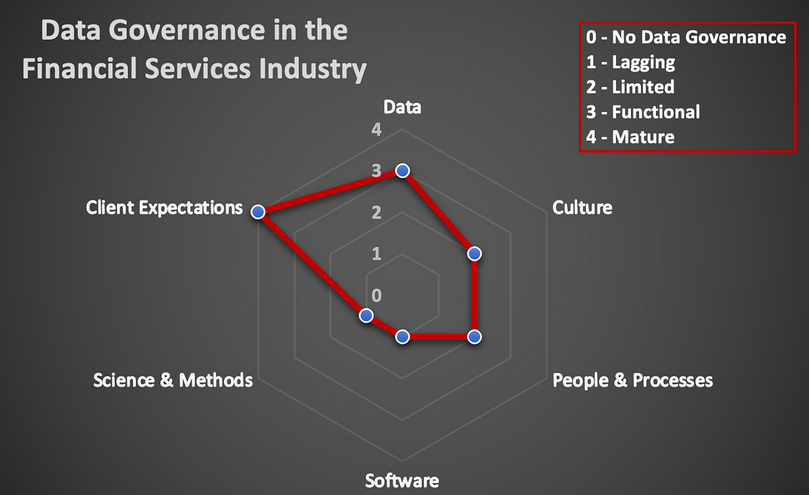

## Table of Contents

## What is the stock market and how does learning about it benefit investors?

The stock market is a place where people can buy and sell pieces of companies, called stocks. When you buy a stock, you own a little bit of that company. The price of stocks goes up and down based on how well the company is doing and what people think about it. The stock market is like a big store where you can trade these pieces of companies with other people.

Learning about the stock market can help investors make better choices about which stocks to buy and sell. When you know more about how the market works, you can understand why stock prices change and make smarter decisions. This can help you earn more money over time because you'll be able to pick stocks that are likely to grow in value. Also, understanding the stock market can help you feel more confident and less worried about your investments.

## What are common misconceptions beginners have about learning to invest in the stock market?

One common misconception beginners have about learning to invest in the stock market is that it's too hard or complicated. They think you need to be a math genius or have a finance degree to understand it. But really, the basics of investing are pretty simple. You just need to learn about stocks, how to buy and sell them, and how to manage your money. There are lots of easy resources and tools that can help you get started.

Another misconception is that you need a lot of money to start investing. Many people believe that only rich people can invest in the stock market. But that's not true. You can start with a small amount of money and still make good investments. There are even apps and platforms that let you invest with just a few dollars. The key is to start small, learn as you go, and gradually increase your investments as you become more comfortable and knowledgeable.

Lastly, some beginners think that investing in the stock market is like gambling, where you just hope to get lucky. This can make them scared to invest because they think they'll lose all their money. But investing isn't about luck; it's about making smart choices based on research and understanding the market. While there are risks, you can lower them by learning about the companies you invest in and making well-thought-out decisions.

## How can emotional biases affect learning and decision-making in the stock market?

Emotional biases can really mess up how you learn and make choices in the stock market. One big problem is that feelings like fear and greed can make you do things without thinking. For example, if you see a stock price going up fast, you might feel greedy and buy it without looking at if it's a good investment. Or, if the market goes down a lot, you might get scared and sell all your stocks, even if holding onto them would be a better choice in the long run. These quick decisions based on emotions can stop you from learning the right way to invest because you're not taking the time to study and understand the market.

Another way emotions can affect you is by making you stick to your first ideas too much. This is called confirmation bias. If you really like a company, you might only look for information that says it's a good investment and ignore anything that says it might not be. This can stop you from learning all the facts and making smart choices. It's important to try to keep your emotions in check and look at all the information, even if it's not what you want to hear. By doing this, you can learn more about the stock market and make better decisions over time.

## What role does market volatility play in the learning curve for new investors?

Market [volatility](/wiki/volatility-trading-strategies), which is when stock prices go up and down a lot, can be a big part of what new investors learn. When the market is volatile, it can be scary because your investments might lose value quickly. But this can also be a good chance to learn. By watching how the market moves and why, new investors can start to understand what affects stock prices. They can learn about things like news events, company earnings, and overall market feelings that make prices change. This helps them get better at [picking](/wiki/asset-class-picking) stocks and knowing when to buy or sell.

Dealing with market volatility also teaches new investors about their own feelings and how to manage them. When prices drop a lot, it's easy to feel scared and want to sell everything. But learning to stay calm and stick to a plan can be really important. Over time, new investors can learn to see volatility as a normal part of the market and not something to be too worried about. This understanding can help them make smarter choices and become more confident in their investing journey.

## Can you explain the impact of information overload on a learner's ability to make informed stock market decisions?

Information overload can make it really hard for someone learning about the stock market to make good choices. When there's too much information, it can be overwhelming and confusing. You might see so many news articles, financial reports, and opinions that it's tough to figure out what's important and what's not. This can lead to feeling stressed and unsure about what to do with your investments. Instead of helping you make better decisions, all this extra information can actually make you feel more lost and less confident.

To deal with information overload, it's important to learn how to sort through all the data and focus on what really matters. One way to do this is by setting clear goals for your investments and looking for information that helps you reach those goals. You can also use tools like stock screeners and financial news summaries to help you find the most important information without getting bogged down in too many details. By learning to manage information overload, you can make more informed decisions and feel more in control of your investments in the stock market.

## How do different learning styles influence the effectiveness of stock market education?

Different people learn in different ways, and this can affect how well they understand the stock market. Some people learn best by reading [books](/wiki/algo-trading-books) or articles, while others prefer watching videos or listening to podcasts. If someone likes to read, they might find it easier to learn about stocks by studying books on investing. But if someone learns better by listening, they might do better with financial podcasts or online courses that they can listen to. Knowing your own learning style can help you pick the best ways to learn about the stock market, making it easier and more fun to understand.

Another thing to think about is how some people learn by doing, called hands-on learning. For these people, trying out investing with a practice account, or "paper trading," can be a great way to learn. They can see how the stock market works by making pretend investments and watching what happens. On the other hand, people who learn best by talking things out might benefit more from joining a stock market club or discussing investments with friends. By using learning methods that match your style, you can get a better grip on the stock market and make smarter choices about your investments.

## What are the limitations of relying solely on historical data for learning stock market trends?

Relying only on historical data to learn about stock market trends can be tricky. The past can give you some ideas about what might happen, but it doesn't always tell the whole story. Things change all the time in the stock market because of new technology, laws, and world events. So, just because a stock went up in the past doesn't mean it will do the same thing again. If you only look at what happened before, you might miss out on important new information that could affect your investments.

Another problem with using only historical data is that it can make you think the future will be just like the past. This can lead to overconfidence and bad decisions. For example, if a stock always went up in the summer for the last five years, you might think it will do the same this year. But if there's a big change, like a new competitor or a global crisis, that stock might not go up at all. So, while historical data is helpful, it's important to also pay attention to what's happening now and what might happen next.

## How does the complexity of financial instruments like derivatives affect the learning process for intermediate investors?

Learning about complex financial instruments like derivatives can be tough for intermediate investors. Derivatives are things like options and futures, which are based on the value of other things like stocks or commodities. They can be hard to understand because they have their own special rules and ways of working. For someone who is just getting used to the stock market, adding derivatives into the mix can make things feel a lot more complicated. It's like trying to learn a new language on top of the one you're already studying.

Even though derivatives can be hard to learn, they can also be really useful once you get the hang of them. They can help you do things like protect your investments from big losses or make money in different ways than just buying and selling stocks. But to really use them well, intermediate investors need to take their time to learn about them. They should start with the basics, maybe using books or online courses, and then slowly try out small investments in a safe way, like with a practice account. By doing this step-by-step, they can build up their understanding and confidence without getting too overwhelmed.

## What are the challenges of keeping up with rapidly changing market regulations and how does it impact continuous learning?

Keeping up with the fast-changing rules of the stock market can be really hard. The rules can change because of new laws or because something big happens in the world. This means that what you learned before might not be true anymore. You have to keep reading and learning new things to make sure you're doing everything right. It can feel like you're always trying to catch up, and it can be tiring to always be learning new stuff.

This need to keep learning all the time can be tough, but it's also good for you. It makes sure that you stay sharp and know what's going on. If you don't keep up with the new rules, you might make mistakes with your investments or even break the law without meaning to. So, even though it's hard, learning about the new rules helps you make better choices and keep your investments safe. It's like staying in shape, but for your brain and your money.

## How can advanced technical analysis tools both aid and hinder the learning process in the stock market?

Advanced technical analysis tools can be really helpful for learning about the stock market. These tools let you see lots of information about stocks, like charts and patterns, that can help you understand how prices move. By using these tools, you can spot trends and make guesses about where prices might go next. This can make you feel more confident in your choices and help you learn faster because you can see how your ideas work out in real time. It's like having a map that shows you the way through the tricky world of stocks.

But these tools can also make things harder. They can be very complicated, and if you don't understand them well, you might get confused. Sometimes, people can start to depend too much on these tools and forget to think for themselves. They might follow what the tools say without really understanding why. This can stop you from learning the deeper reasons behind stock price changes. It's important to use these tools as helpers, not as the only thing you rely on, so you can keep learning and growing as an investor.

## What are the psychological barriers that expert investors face when adapting to new market conditions?

Expert investors sometimes find it hard to change their ways when the market changes. They might have been doing things the same way for a long time and feel very sure about it. But when new things happen, like new laws or big world events, the market can change a lot. It's tough for them to let go of old ideas and try new ones. They might feel scared or unsure about making different choices, even if they know it's the smart thing to do.

Another problem is that experts can get too proud of their past successes. They might think they know everything and not listen to new information. This can make them miss out on important changes in the market. It's important for them to stay open-minded and keep learning, even if they've been doing well for a long time. By being willing to change and adapt, they can keep making good choices and stay successful in the new market conditions.

## How does the availability of advanced algorithmic trading strategies influence the learning trajectory of expert traders?

The availability of advanced [algorithmic trading](/wiki/algorithmic-trading) strategies can really change how expert traders learn and grow. These strategies use computers to make trading decisions based on lots of data and math. For expert traders, this means they can learn new ways to trade that they might not have thought of before. They can see how these strategies work in real-time and learn from them. This can help them get better at understanding the market and finding new ways to make money. But it also means they need to keep learning new things about technology and how to use these tools the right way.

On the other hand, relying too much on algorithmic trading can make it hard for expert traders to keep learning in a good way. They might start to depend on the computer to do all the thinking for them, instead of using their own skills and knowledge. This can make them less able to understand the market on their own. It's important for expert traders to use these strategies as tools to help them, but not to let the tools do all the work. By finding a balance, they can keep learning and growing as traders, even as the market and technology keep changing.

## References & Further Reading

[1]: Bergstra, J., Bardenet, R., Bengio, Y., & Kégl, B. (2011). ["Algorithms for Hyper-Parameter Optimization."](https://dl.acm.org/doi/10.5555/2986459.2986743) Advances in Neural Information Processing Systems 24.

[2]: ["Advances in Financial Machine Learning"](https://www.amazon.com/Advances-Financial-Machine-Learning-Marcos/dp/1119482089) by Marcos Lopez de Prado

[3]: ["Evidence-Based Technical Analysis: Applying the Scientific Method and Statistical Inference to Trading Signals"](https://www.amazon.com/Evidence-Based-Technical-Analysis-Scientific-Statistical/dp/0470008741) by David Aronson

[4]: ["Machine Learning for Algorithmic Trading"](https://github.com/stefan-jansen/machine-learning-for-trading) by Stefan Jansen

[5]: ["Quantitative Trading: How to Build Your Own Algorithmic Trading Business"](https://www.amazon.com/Quantitative-Trading-Build-Algorithmic-Business/dp/1119800064) by Ernest P. Chan