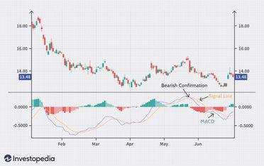

## Table of Contents

## What is MACD divergence and how is it used in trading?

MACD divergence happens when the price of a stock or asset moves in one direction, but the MACD indicator moves in the opposite direction. MACD stands for Moving Average Convergence Divergence. It's a tool traders use to spot changes in the strength, direction, momentum, and duration of a trend in a stock's price. When you see a divergence, it can be a sign that the current trend might be losing steam and could reverse soon.

Traders use MACD divergence to make decisions about buying or selling. If the price of a stock is going up but the MACD is going down, it's called a bearish divergence. This might mean the price will start to fall soon, so a trader might decide to sell. On the other hand, if the price is going down but the MACD is going up, it's called a bullish divergence. This could mean the price will start to rise, so a trader might decide to buy. By watching for these divergences, traders try to get in or out of trades at the best times.

## Can you explain the basic concept of a bullish and bearish divergence using MACD?

A bullish divergence with MACD happens when the price of a stock is going down, but the MACD line is going up. Imagine the price is making lower lows, but the MACD is making higher lows. This difference, or divergence, suggests that even though the price is falling, the downward momentum is weakening. It's like the stock is getting tired of going down and might start going up soon. Traders see this as a sign that it could be a good time to buy the stock because they think the price will start to rise.

On the other hand, a bearish divergence with MACD occurs when the price of a stock is going up, but the MACD line is going down. Picture the price making higher highs, but the MACD making lower highs. This divergence indicates that even though the price is rising, the upward momentum is fading. It's as if the stock is running out of steam to keep going up and might start to fall. Traders might see this as a signal to sell the stock because they believe the price could start to drop soon.

## What are the common misconceptions about MACD divergence?

One common misconception about MACD divergence is that it always signals an immediate trend reversal. People often think that as soon as they see a bullish or bearish divergence, the price will instantly change direction. But that's not always true. Sometimes, the price can keep moving in the same direction for a while even after a divergence shows up. It's more like a warning sign that a change might happen, not a guarantee.

Another misconception is that MACD divergence is a foolproof way to make money. Some folks believe that if they just follow the divergences, they'll always make the right trading decisions. But trading is never that simple. There are lots of other things that can affect the price of a stock, like news events or changes in the market. So, while MACD divergence can be a helpful tool, it shouldn't be the only thing traders rely on. It's best used along with other indicators and analysis to get a fuller picture of what's going on.

## How reliable is MACD divergence as a standalone trading signal?

MACD divergence is not very reliable as a standalone trading signal. It can give you hints about when a price might change direction, but it doesn't always happen right away. Sometimes, the price can keep going the same way for a while after you see a divergence. This means if you only use MACD divergence to decide when to buy or sell, you might make the wrong move and lose money.

Because of this, it's better to use MACD divergence along with other tools and information. Things like other technical indicators, chart patterns, and even news about the company or the market can help you make better decisions. By looking at all these things together, you can get a clearer idea of what might happen next with the price, and that can make your trading more successful.

## What are the main limitations of using MACD divergence for predicting price movements?

MACD divergence can be tricky because it doesn't always mean the price will change direction right away. You might see a divergence and think the price is about to turn around, but sometimes the price keeps going the same way for a while longer. This can be frustrating if you're trying to use it to decide when to buy or sell a stock. It's like seeing a yellow light at a traffic signal; it might mean slow down because the light could turn red, but it doesn't always happen immediately.

Another problem is that MACD divergence can give you false signals. Sometimes, you might see a divergence, but the price doesn't end up changing direction at all. This can lead to bad trading decisions if you're only relying on MACD divergence. It's important to use other tools and information too, like other indicators or news about the market, to get a better idea of what might happen next with the price. By looking at everything together, you can make smarter choices about when to buy or sell.

## How does market volatility affect the effectiveness of MACD divergence signals?

Market [volatility](/wiki/volatility-trading-strategies) can make MACD divergence signals less reliable. When the market is moving a lot, prices can swing up and down quickly. This can cause more false signals with MACD divergence, where you might think the price is going to change direction, but it doesn't. It's like trying to read a map in a storm; the map is still useful, but it's harder to use it correctly when everything is moving around so much.

Because of this, it's important to be extra careful when using MACD divergence during volatile times. You might want to use other tools and information to help you make better decisions. Things like other indicators or news about the market can give you a fuller picture of what's happening. By considering all these things together, you can be more confident in your trading choices, even when the market is jumping around.

## Can you discuss the impact of false signals generated by MACD divergence?

False signals from MACD divergence can lead to bad trading decisions. When you see a divergence and think the price will change direction, but it doesn't, you might buy or sell at the wrong time. This can make you lose money because you acted on a signal that turned out to be wrong. It's like seeing a sign that says "turn here," but it leads you the wrong way.

These false signals can also make you lose trust in the MACD indicator. If you keep seeing signals that don't work out, you might start to doubt whether the tool is helpful at all. This can be frustrating and might make you miss out on real opportunities when the MACD divergence does give a correct signal. It's important to use other tools and information along with MACD divergence to help you make better trading choices and avoid getting tricked by false signals.

## What other technical indicators should be used alongside MACD divergence to improve accuracy?

To make MACD divergence more reliable, you can use it together with other technical indicators. One good one is the Relative Strength Index (RSI). The RSI helps you see if a stock is overbought or oversold. If you see a bullish MACD divergence and the RSI is also moving up from being oversold, it can be a stronger sign that the price might go up. On the other hand, if you see a bearish MACD divergence and the RSI is moving down from being overbought, it might be a good time to sell.

Another helpful indicator to use with MACD divergence is the Stochastic Oscillator. This tool also tells you if a stock is overbought or oversold, but it can be quicker to spot changes. If the Stochastic Oscillator and MACD divergence are both showing the same thing, like a bullish or bearish signal, it can give you more confidence in your trading decision. By using these other indicators alongside MACD divergence, you can get a clearer picture of what might happen next with the price and make better choices about when to buy or sell.

## How does the choice of MACD settings affect the interpretation of divergence signals?

The choice of MACD settings can change how you see divergence signals. The MACD has three main settings: the fast moving average, the slow moving average, and the signal line. If you use shorter time periods for these settings, like 12, 26, and 9, you'll get more signals, but they might be less reliable. This is because shorter periods make the MACD more sensitive to price changes, so you might see more false signals. On the other hand, if you use longer time periods, like 24, 52, and 18, you'll get fewer signals, but they might be more reliable because the MACD is less sensitive to small price movements.

Choosing the right settings depends on what you're trying to do. If you're a short-term trader looking for quick trades, you might want to use shorter settings to catch more signals. But if you're a long-term investor looking for bigger trends, longer settings might be better because they can help you avoid getting tricked by small price changes. It's important to test different settings and see what works best for your trading style and the market you're trading in.

## What are the statistical probabilities of success when trading based on MACD divergence?

The success rate of trading based on MACD divergence alone is not very high. Studies and real-world trading experiences show that using MACD divergence as your only signal can lead to a lot of false alarms. This means you might think the price is going to change direction, but it doesn't always happen. Because of this, many traders end up losing money if they rely only on MACD divergence. It's like trying to guess the weather by looking at one cloud; sometimes you get it right, but often you don't.

To improve your chances of success, it's better to use MACD divergence along with other tools. When you combine it with other indicators like the RSI or Stochastic Oscillator, you can get a clearer picture of what might happen next with the price. This can help you make better trading decisions and increase your chances of making money. It's like using a whole weather report instead of just one cloud; you get more information, so you can make smarter choices.

## How do different market conditions (e.g., trending vs. ranging markets) influence the performance of MACD divergence?

In a trending market, where prices are clearly moving up or down, MACD divergence can work pretty well. When you see a bullish divergence during an uptrend, it might mean the price will keep going up. And if you see a bearish divergence during a downtrend, it might mean the price will keep falling. But even in trending markets, you have to be careful because MACD divergence can still give you false signals. It's like driving on a highway with clear signs; you can usually follow the road, but sometimes you might miss a turn.

In a ranging market, where prices are moving sideways without a clear direction, MACD divergence can be trickier to use. You might see a lot of false signals because the price isn't going up or down in a strong way. A bullish divergence might not lead to a big price increase, and a bearish divergence might not lead to a big drop. It's like trying to drive in a city with lots of stop-and-go traffic; you have to be more careful and use other tools to help you make better decisions.

## What advanced strategies can traders employ to mitigate the limitations of MACD divergence?

Traders can use other indicators along with MACD divergence to make better choices. One good way is to use the Relative Strength Index (RSI) or the Stochastic Oscillator. These tools help you see if a stock is overbought or oversold. If you see a bullish MACD divergence and the RSI is also moving up from being oversold, it can be a stronger sign that the price might go up. And if you see a bearish MACD divergence and the Stochastic Oscillator is moving down from being overbought, it might be a good time to sell. By using these other indicators, you can get a clearer picture of what might happen next with the price and avoid getting tricked by false signals.

Another smart strategy is to pay attention to the bigger picture of the market. This means looking at things like chart patterns and the overall trend of the market. For example, if you see a bullish MACD divergence during a strong uptrend, it might be a good sign that the price will keep going up. But if you see the same divergence during a time when the market is moving sideways, it might not mean much. By considering the bigger picture, you can make better decisions about when to buy or sell. It's also a good idea to use different time frames when looking at MACD divergence. Checking both short-term and long-term charts can help you see if the divergence is a real sign of a price change or just a small blip.

## What are the basics and beyond of understanding MACD?

MACD, or Moving Average Convergence Divergence, is a widely used momentum oscillator in technical analysis. It provides potential buy and sell signals through its composition, which includes two primary elements: Exponential Moving Averages (EMAs) and a histogram. The primary function of MACD is to indicate changes in the strength, direction, momentum, and duration of a trend, making it a valued tool among traders.

### Components of MACD

1. **Exponential Moving Averages (EMAs):** 
   - The MACD line is derived from two EMAs: a short-term EMA and a long-term EMA. Typically, the 12-day EMA is used as the short-term average and the 26-day EMA as the long-term average. The MACD line itself is the difference between these two averages:
$$
     \text{MACD Line} = \text{EMA}_{\text{short}} - \text{EMA}_{\text{long}}

$$

2. **Signal Line:**
   - A 9-day EMA of the MACD line is often called the signal line, placed on top of the MACD line to function as a trigger for buy and sell signals. When the MACD line crosses above the signal line, it indicates a potential bullish signal, suggesting it might be a good time to buy. Conversely, when the MACD line crosses below the signal line, it suggests a bearish signal, potentially indicating a time to sell.

3. **Histogram:**
   - The histogram represents the difference between the MACD line and the signal line. It provides a visual representation of the distance between these two lines. The histogram oscillates above and below the zero line, indicating the strength of the bullish or bearish movement. A growing histogram suggests strengthening momentum, while a declining histogram points to weakening momentum.

### Application in Technical Analysis

The MACD is particularly useful for its simplicity and clarity in depicting trading signals. Traders utilize the MACD to identify changes in market trends. For example, when the MACD crosses above the signal line, it can signify an upward trend, while crossing below the signal line might indicate a downward trend. This makes it invaluable for traders looking to capitalize on trend reversals or continuations.

### Calculation and Usage

Calculating the MACD can be implemented programmatically for precision and speed, especially for those involved in [algorithmic trading](/wiki/algorithmic-trading). Below is a basic Python example utilizing the popular `pandas` library:

```python
import pandas as pd

def calculate_macd(data, short_window=12, long_window=26, signal_window=9):
    data['EMA_short'] = data['Close'].ewm(span=short_window, adjust=False).mean()
    data['EMA_long'] = data['Close'].ewm(span=long_window, adjust=False).mean()
    data['MACD'] = data['EMA_short'] - data['EMA_long']
    data['Signal_Line'] = data['MACD'].ewm(span=signal_window, adjust=False).mean()
    data['Histogram'] = data['MACD'] - data['Signal_Line']

    return data[['MACD', 'Signal_Line', 'Histogram']]

# Example usage with a pandas DataFrame containing a 'Close' price column:
# macd_data = calculate_macd(price_data)
```

Understanding the components and calculations of the MACD is essential before exploring more advanced topics such as divergence, which further enhances the application of this oscillator in trading. This knowledge enables traders to make informed decisions based on technical signals derived from past price movements.

## What is Decoding MACD Divergence?

Divergence in the context of the Moving Average Convergence Divergence (MACD) occurs when there is a discrepancy between the direction of an asset's price and the direction of the MACD indicator. This phenomenon is a critical concept for traders looking for potential reversal signals in market trends. By identifying divergences, traders can make more informed decisions about potential buy or sell actions.

There are two primary types of MACD divergences: bullish and bearish. Bullish divergence is identified when the price of an asset reaches lower lows while the MACD line forms higher lows. This is often interpreted as a signal that the downward trend in the asset's price might be losing [momentum](/wiki/momentum), suggesting a potential upward reversal. The equation representing bullish divergence is as follows:

$$
\text{Price}_1 < \text{Price}_2 \quad \text{and} \quad \text{MACD}_1 > \text{MACD}_2
$$

where $\text{Price}_1$ and $\text{MACD}_1$ represent earlier values, and $\text{Price}_2$ and $\text{MACD}_2$ represent more recent values.

Conversely, bearish divergence appears when the price of an asset achieves higher highs, but the MACD line forms lower highs. This pattern suggests that despite the rise in price, the upward momentum is weakening, indicating a potential for a downward reversal. The corresponding equation for bearish divergence is:

$$
\text{Price}_1 > \text{Price}_2 \quad \text{and} \quad \text{MACD}_1 < \text{MACD}_2
$$

Traders can spot these divergences by closely monitoring both price movements and the MACD line, typically using charting software that allows for the visualization of price charts along with the MACD indicator. The MACD itself is calculated using the formula:

$$
\text{MACD} = \text{EMA}_{\text{fast}} - \text{EMA}_{\text{slow}}
$$

where $\text{EMA}_{\text{fast}}$ and $\text{EMA}_{\text{slow}}$ are exponential moving averages over shorter and longer periods, respectively.

Utilizing MACD divergence as a trading signal involves recognizing these patterns and integrating them within a broader trading strategy. Experienced traders often combine divergence signals with other technical analysis tools to confirm the likelihood of a trend reversal and to mitigate the risk of false signals. By understanding how to effectively identify and interpret these divergences, traders can enhance their ability to forecast significant market movements.

## References & Further Reading

[1]: Bergstra, J., Bardenet, R., Bengio, Y., & Kégl, B. (2011). ["Algorithms for Hyper-Parameter Optimization."](https://papers.nips.cc/paper/4443-algorithms-for-hyper-parameter-optimization) Advances in Neural Information Processing Systems 24.

[2]: ["Advances in Financial Machine Learning"](https://www.amazon.com/Advances-Financial-Machine-Learning-Marcos/dp/1119482089) by Marcos Lopez de Prado

[3]: ["Evidence-Based Technical Analysis: Applying the Scientific Method and Statistical Inference to Trading Signals"](https://www.amazon.com/Evidence-Based-Technical-Analysis-Scientific-Statistical/dp/0470008741) by David Aronson

[4]: ["Machine Learning for Algorithmic Trading"](https://github.com/stefan-jansen/machine-learning-for-trading) by Stefan Jansen

[5]: ["Quantitative Trading: How to Build Your Own Algorithmic Trading Business"](https://www.amazon.com/Quantitative-Trading-Build-Algorithmic-Business/dp/1119800064) by Ernest P. Chan