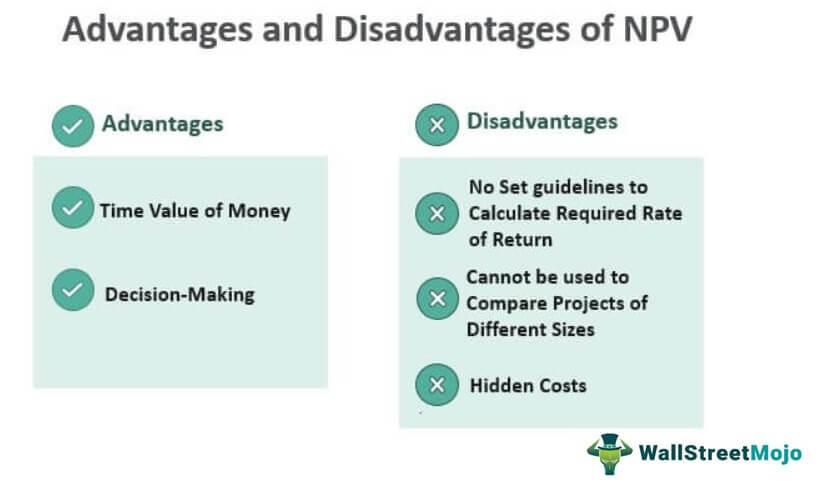

## Table of Contents

## What is Net Present Value (NPV) and how is it used in investment analysis?

Net Present Value (NPV) is a way to figure out how much a future stream of money is worth right now. It takes into account that money you get in the future is not as valuable as money you have today because you could invest today's money and earn more from it. To calculate NPV, you need to know the amount of money you expect to receive in the future, the time when you will receive it, and a discount rate, which is like an interest rate that shows how much you value money now compared to money later.

In investment analysis, NPV helps you decide if an investment is a good idea. If the NPV of an investment is positive, it means the investment is expected to make more money than it costs, after considering the time value of money. So, a positive NPV suggests you should go ahead with the investment. On the other hand, if the NPV is negative, it means the investment is likely to lose money, and you might want to avoid it. By comparing the NPVs of different investment options, you can choose the one that is expected to be the most profitable.

## Can you explain the basic formula for calculating NPV?

The basic formula for calculating Net Present Value (NPV) is to add up all the future cash flows, but first, you need to discount them. You do this by dividing each future cash flow by (1 + the discount rate) raised to the power of the number of periods into the future the cash flow will happen. The formula looks like this: NPV = (Cash Flow1 / (1 + r)^1) + (Cash Flow2 / (1 + r)^2) + ... + (Cash Flown / (1 + r)^n) - Initial Investment. Here, 'r' is the discount rate, and 'n' is the number of periods.

Let's break it down simply. Imagine you have an investment that will give you money in the future. To find out what that money is worth now, you take each future payment and reduce it based on how far in the future it is and the discount rate. Then, you add all these reduced values together. Don't forget to subtract the cost of the investment at the start. If the total (NPV) is more than zero, the investment is worth considering because it's expected to be profitable after accounting for the time value of money.

## What are the key assumptions made when using NPV for investment decisions?

When using NPV for investment decisions, a key assumption is that the discount rate used is accurate. This rate reflects how much you value money now compared to money in the future. If the discount rate is too high or too low, it can make the NPV calculation less reliable. Another assumption is that all the cash flows used in the calculation can be predicted accurately. This means you need to have a good idea of how much money the investment will bring in and when it will come in. If these predictions are wrong, the NPV won't give you a good picture of the investment's value.

Another important assumption is that the investment's risk is properly reflected in the discount rate. Different investments have different levels of risk, and a higher risk should mean a higher discount rate. If the discount rate doesn't correctly account for the risk, the NPV might suggest an investment is better or worse than it really is. Also, NPV assumes that cash flows can be reinvested at the same discount rate. This means if you get money back from the investment, you can put it into something else that earns the same rate. If this isn't possible, the NPV might not accurately show the true value of the investment.

## How does the accuracy of cash flow projections affect the reliability of NPV?

The accuracy of cash flow projections is really important for the reliability of Net Present Value (NPV). If the cash flow numbers you use are not correct, the NPV won't give you a good idea of how valuable the investment really is. Imagine you think an investment will bring in a lot of money, but it ends up bringing in less. The NPV would have been too high, making the investment seem better than it is. On the other hand, if you think it will bring in less money than it actually does, the NPV would be too low, making the investment seem worse than it is.

Because of this, it's crucial to make your cash flow predictions as accurate as possible. If your predictions are off, it can lead to bad investment decisions. For example, you might decide not to invest in something that could have been profitable, or you might go ahead with an investment that ends up losing money. So, when using NPV, always try to get the best information you can about future cash flows to make sure your investment decisions are based on reliable numbers.

## What role does the discount rate play in NPV calculations, and how can its selection impact results?

The discount rate in NPV calculations is like an [interest rate](/wiki/interest-rate-trading-strategies) that shows how much you value money now compared to money in the future. It's used to adjust future cash flows to their present value. When you calculate NPV, you divide each future cash flow by (1 + the discount rate) raised to the power of how many periods away the cash flow is. This makes future money worth less today, because you could invest today's money and earn more from it. So, the discount rate is super important because it affects how much each future dollar is worth right now.

Choosing the right discount rate can really change the NPV results. If you pick a high discount rate, it means you think money now is a lot more valuable than money later. This makes the present value of future cash flows smaller, and can turn a positive NPV into a negative one, making an investment look less attractive. On the other hand, if you use a low discount rate, it means you don't mind waiting for your money as much, so future cash flows are worth more today, which can make the NPV higher and the investment look better. That's why it's important to pick a discount rate that matches the risk and opportunity cost of the investment you're looking at.

## How does NPV handle the timing of cash flows, and what are the potential limitations of this approach?

NPV takes into account the timing of cash flows by discounting them. This means that money you get in the future is worth less today. The further away the cash flow is, the more it gets discounted. For example, if you expect to get $100 in a year and the discount rate is 10%, that $100 is only worth about $90.91 today. NPV adds up all these discounted cash flows and subtracts the initial cost of the investment. This way, NPV shows you the value of an investment today, considering when you'll get the money back.

However, there are some limitations to using NPV. One big one is that it relies on accurate predictions of future cash flows. If these predictions are off, the NPV won't be reliable. Another limitation is choosing the right discount rate. If it's too high or too low, it can make the NPV misleading. Also, NPV assumes you can reinvest any money you get back at the same discount rate, which might not always be true. So, while NPV is a helpful tool, it's important to use it carefully and understand its limits.

## Can NPV adequately account for project risk and uncertainty? If not, why?

NPV tries to account for project risk and uncertainty by using a discount rate that reflects the riskiness of the investment. A higher discount rate means the project is riskier, so future cash flows are worth less today. But, NPV can't fully capture all the risks and uncertainties because it relies on a single discount rate and fixed cash flow predictions. Real-world projects often have many different kinds of risks, like market changes or unexpected costs, and these can be hard to fit into one number.

Because of this, NPV might not give you a complete picture of how risky a project really is. It assumes that all future cash flows and the discount rate are known with certainty, which is rarely the case. To get a better handle on risk and uncertainty, you might need to use other tools, like sensitivity analysis or scenario planning, to see how changes in assumptions could affect the NPV. These methods can help you understand the range of possible outcomes and make better decisions.

## How does NPV compare to other investment appraisal techniques like IRR and payback period?

NPV, IRR, and payback period are all ways to figure out if an investment is a good idea, but they look at it from different angles. NPV tells you how much more money you'll make from an investment than what you put in, after adjusting for the time value of money. It's great because it shows you the actual value added by the investment in today's dollars. IRR, or Internal Rate of Return, is different because it tells you the rate at which the investment breaks even, meaning the rate that makes the NPV zero. It's useful for comparing the profitability of different investments, but it can be tricky to use if the cash flows change a lot over time. The payback period is the simplest of the three; it tells you how long it will take to get back the money you invested. It's easy to understand but doesn't consider the time value of money or what happens after you get your money back.

While NPV gives a comprehensive view of an investment's value by considering all cash flows and the time value of money, IRR and payback period each have their own strengths and weaknesses. IRR is helpful for comparing investments because it gives you a percentage return, but it can be misleading if there are multiple IRRs or if cash flows are unconventional. Payback period is good for quick decisions and understanding [liquidity](/wiki/liquidity-risk-premium), but it ignores cash flows after the payback period and doesn't account for the time value of money. So, while NPV is often seen as the most reliable method for investment appraisal, using a combination of these techniques can give you a fuller picture of an investment's potential.

## What are the challenges in applying NPV to projects with non-conventional cash flows?

Applying NPV to projects with non-conventional cash flows can be tricky. Non-conventional cash flows are when the money coming in and going out doesn't follow a simple pattern. For example, you might have money going out at the start, then coming in, then going out again. This makes it hard to use NPV because the formula assumes cash flows are more straightforward. When cash flows are all over the place, it's tough to figure out what the investment is really worth today.

Another challenge is that non-conventional cash flows can mess up the discounting process. With NPV, you're supposed to discount each cash flow based on when it happens. But if the cash flows are jumping around, it's hard to know which rate to use for each one. This can lead to mistakes in the calculation, making the NPV less reliable. So, when dealing with projects that have these kinds of cash flows, you might need to use other tools alongside NPV to get a better understanding of the investment's value.

## How does NPV deal with the issue of mutually exclusive projects, and what are the limitations in this context?

When you have to choose between two or more projects where you can only pick one, these are called mutually exclusive projects. NPV helps you decide by calculating the value of each project in today's dollars. You pick the project with the highest NPV because it's expected to add the most value to your money. But, NPV assumes that the money you get back from one project can be reinvested at the same discount rate used for the NPV calculation. If this isn't true, the NPV might not show the real value of the projects.

One big limitation of using NPV for mutually exclusive projects is that it doesn't consider the size of the investment. A project with a smaller initial cost might have a lower NPV but could be a better choice if you're limited on how much you can spend. Also, NPV doesn't account for differences in project risk. If one project is riskier than another, the NPV might not reflect that well. So, while NPV is a good tool, you might need to look at other factors like project size and risk to make the best choice between mutually exclusive projects.

## In what ways can NPV fail to capture the strategic value or intangible benefits of an investment?

NPV looks at the money coming in and going out of an investment to see if it's worth it. But it doesn't always see the big picture, like the strategic value or the things you can't put a price on. For example, if a company invests in a project that helps them learn new skills or get into a new market, NPV might not show how important that is. It focuses on numbers and cash flows, so it might miss out on the long-term benefits that don't show up as money right away.

Also, NPV can't capture things like how an investment makes people feel or how it affects the company's reputation. If a project makes employees happier or customers trust the company more, these things are hard to measure with dollars. NPV is good for understanding the financial side of an investment, but it might not give you the full story when it comes to the bigger, more intangible benefits that can be just as important for the company's future.

## How can advanced techniques like real options analysis address some of the limitations of traditional NPV?

Real options analysis is a way to look at investments that can help with some of the problems of traditional NPV. It's like looking at an investment as if it were a series of choices, kind of like options you can buy and sell in the stock market. With real options, you can see the value of being able to change your mind or do something different later on. For example, if you start a project and later find out it's not going well, you might have the option to stop it or switch to something else. Traditional NPV might not see the value in these choices, but real options analysis can show how having these options makes the investment more valuable.

This approach is helpful when dealing with uncertainty and risk, which NPV struggles with. Real options let you put a price on the flexibility to adapt to new information or changes in the market. So, even if a project looks risky at first, the ability to make changes along the way can make it a better choice. By considering these options, real options analysis gives a more complete picture of an investment's potential value, helping you make better decisions when the future is hard to predict.

## What is Understanding Net Present Value (NPV)?

Net Present Value (NPV) is a crucial financial metric used in investment analysis to assess the value of a series of future cash flows in today's terms. To calculate NPV, future cash flows are discounted back to their present value using a specified discount rate. This approach provides a clear measure of how much an investment is worth in today's money, accounting for the time value of money—the principle that a dollar today is worth more than a dollar in the future due to its potential [earning](/wiki/earning-announcement) capacity.

Mathematically, NPV is represented as:

$$

NPV = \sum_{t=0}^{N} \frac{CF_t}{(1 + r)^t} 
$$

where $CF_t$ is the cash flow at time $t$, $r$ is the discount rate, and $N$ is the total number of periods.

A positive NPV implies that the projected earnings from an investment exceed the anticipated costs, suggesting that the investment is likely to yield a profit. Conversely, a negative NPV indicates potential losses, as the costs are expected to outweigh the benefits. Therefore, NPV provides an essential criterion for deciding whether to proceed with an investment.

The calculation of NPV involves two main components: the projection of future cash flows and the selection of an appropriate discount rate. Projecting cash flows requires an estimation of all expected revenues and expenses related to the investment, often relying on market research, historical data, and expert forecasts. The choice of a discount rate, which reflects the investment's risk profile and the opportunity cost of capital, is crucial since it significantly impacts the computed NPV.

NPV's consideration of the time value of money makes it a powerful tool for capital budgeting and strategic investment decision-making. By quantifying the expected profitability of an investment in present value terms, NPV helps investors and financial analysts prioritize among competing projects, ensuring that capital is allocated efficiently to maximize returns.

## What are Complementary Methods to Address NPV Limitations?

To address the limitations inherent in the Net Present Value (NPV) methodology, several complementary approaches are typically employed. The Internal Rate of Return (IRR) is a commonly used method that calculates the discount rate at which the present value of future cash flows equals zero. This provides a percentage return expected from the investment, allowing for easier comparison with other potential investments. However, IRR can be misleading if used alone, particularly when comparing projects of different duration or scale, as it may not adequately reflect the total value created.

Another complementary method is the Profitability Index (PI), which measures the present value of future cash flows per unit of investment cost. It is calculated as:

$$
\text{PI} = \frac{\text{Present Value of Future Cash Flows}}{\text{Initial Investment}}
$$

A PI greater than 1.0 suggests the investment is expected to generate more value than its cost, providing a quick assessment of investment efficiency.

Sensitivity analysis and scenario planning are additional techniques that improve the reliability and robustness of investment appraisals by examining how variations in key assumptions, like discount rates or cash flow projections, affect NPV outcomes. This involves stress-testing the assumptions to identify potential risks and uncertainties, enhancing decision-making under varying economic landscapes.

Monte Carlo simulations offer another advanced approach, providing risk-adjusted insights by simulating a range of possible outcomes based on probability distributions for variables such as cash flows and discount rates. Implementing these simulations can give a more comprehensive view of the variability and potential risk associated with future scenarios.

Economic Value Added (EVA) presents a holistic view of profitability by considering the opportunity cost of invested capital. EVA is defined as the net operating profit after tax (NOPAT) minus the product of capital employed and the weighted average cost of capital (WACC):

$$
\text{EVA} = \text{NOPAT} - (\text{Capital Employed} \times \text{WACC})
$$

By factoring in the cost of capital, EVA highlights whether a project is truly generating value above the financial cost of investments, offering further insights beyond what NPV can provide.

These complementary methods enhance the evaluation of investment opportunities, providing a broader and more nuanced perspective than relying solely on NPV. They allow investors to assess projects on multiple dimensions, such as risk, return, and value creation, leading to more informed and strategic investment decisions.

## References & Further Reading

[1]: Damodaran, A. (2012). ["Investment Valuation: Tools and Techniques for Determining the Value of Any Asset."](https://books.google.com/books/about/Investment_Valuation.html?id=5SRHAAAAQBAJ) Wiley.

[2]: Brealey, R., Myers, S., & Allen, F. (2017). ["Principles of Corporate Finance."](https://www.mheducation.com/highered/product/Principles-of-Corporate-Finance-Brealey.html) McGraw-Hill Education.

[3]: ["The Known, the Unknown, and the Unknowable in Financial Risk Management: Measurement and Theory Advancing Practice"](https://www.sas.upenn.edu/~fdiebold/papers/paper82/ddh.pdf) by Francis X. Diebold, Neil A. Doherty, and Richard J. Herring.

[4]: Pardo, R. (2008). ["The Evaluation and Optimization of Trading Strategies."](https://onlinelibrary.wiley.com/doi/book/10.1002/9781119196969) Wiley.

[5]: Hull, J. (2018). ["Risk Management and Financial Institutions."](https://books.google.com/books/about/Risk_Management_and_Financial_Institutio.html?id=1J1QDwAAQBAJ) Wiley.