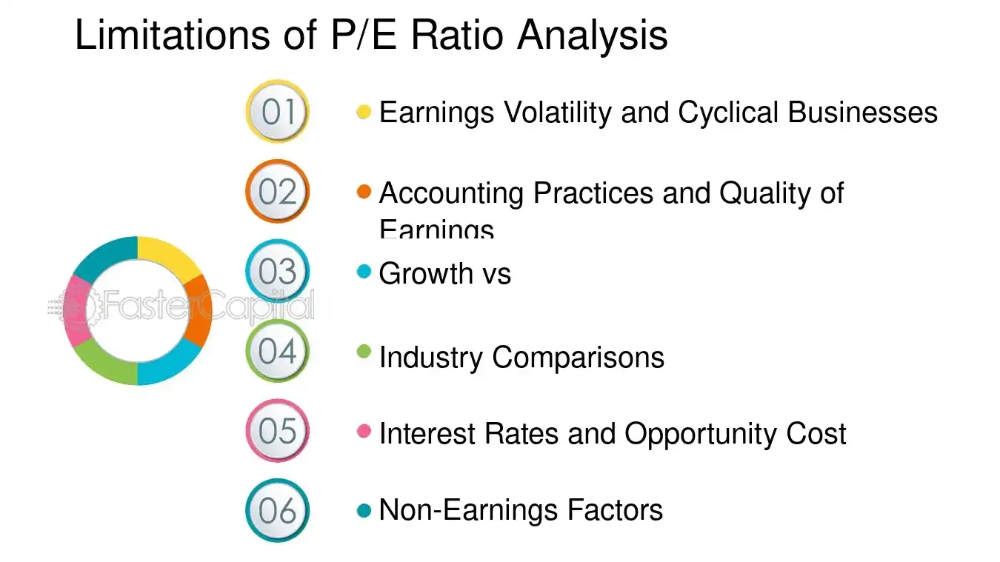

## Table of Contents

## What is the P/E ratio and how is it calculated?

The P/E ratio, or Price-to-Earnings ratio, is a way to figure out how much investors are willing to pay for a company's earnings. It's like a tool that helps you see if a stock is a good buy or if it's too expensive. The P/E ratio is calculated by taking the current stock price and dividing it by the earnings per share (EPS). For example, if a company's stock is trading at $50 per share and its earnings per share is $5, the P/E ratio would be 10. This means investors are willing to pay $10 for every $1 of the company's earnings.

The P/E ratio can be useful when comparing companies in the same industry. A lower P/E might mean the stock is undervalued, or a good deal, while a higher P/E might mean it's overvalued, or too expensive. But, it's important to remember that the P/E ratio is just one piece of the puzzle. Other things like the company's growth, the economy, and interest rates can also affect whether a stock is a good investment. So, while the P/E ratio is helpful, it shouldn't be the only thing you look at when deciding to buy a stock.

## Why is the P/E ratio commonly used in financial analysis?

The P/E ratio is commonly used in financial analysis because it's a simple way to see how much investors are willing to pay for a company's earnings. It helps people quickly figure out if a stock might be a good buy or if it's too expensive. By comparing the P/E ratios of different companies in the same industry, investors can get a sense of which stocks might be undervalued or overvalued. This makes the P/E ratio a handy tool for making quick comparisons and decisions.

However, the P/E ratio isn't perfect and shouldn't be the only thing investors look at. It's just one piece of the puzzle. Other factors like the company's growth prospects, the overall economy, and interest rates can also affect whether a stock is a good investment. So, while the P/E ratio is useful for a quick snapshot, it's important to consider other information too before making any investment decisions.

## Can the P/E ratio be misleading for companies with no earnings?

Yes, the P/E ratio can be misleading for companies with no earnings. The P/E ratio is calculated by dividing the stock price by the earnings per share. If a company has no earnings, the earnings per share is zero, which means the P/E ratio becomes undefined or infinite. This makes it impossible to use the P/E ratio to value the company or compare it to other companies.

In cases like this, investors often look at other metrics like the price-to-sales ratio or the price-to-book ratio to get a better sense of the company's value. These alternative ratios can provide a more accurate picture for companies that are not yet profitable but might have strong sales or valuable assets. So, while the P/E ratio is a useful tool, it has its limits, especially when dealing with companies that don't have earnings yet.

## How does the P/E ratio vary across different industries?

The P/E ratio can be very different from one industry to another. This is because each industry has its own way of making money and growing. For example, tech companies often have higher P/E ratios because people expect them to grow a lot in the future. They might not make a lot of money now, but investors think they will in the future. On the other hand, industries like utilities or consumer staples, which are more stable and don't grow as fast, usually have lower P/E ratios. Investors don't expect big growth from these companies, so they're not willing to pay as much for their earnings.

It's important to compare P/E ratios within the same industry. A P/E ratio that seems high in one industry might be normal in another. For example, a P/E ratio of 30 might be seen as expensive for a utility company, but it could be typical for a tech company. This is why investors need to know the industry norms when using the P/E ratio to decide if a stock is a good buy or not. By understanding these differences, investors can make better choices about where to put their money.

## What are the limitations of using the P/E ratio for cyclical businesses?

The P/E ratio can be tricky to use for cyclical businesses, which are companies whose earnings go up and down with the economy. When the economy is doing well, these companies make more money, and their P/E ratio might look low because their earnings are high. But when the economy is not doing well, their earnings drop, making the P/E ratio look high. This means the P/E ratio can make a cyclical business look like a good buy when it's not, or a bad buy when it's actually a good time to invest.

Because of this, it's important not to just look at the P/E ratio when thinking about investing in a cyclical business. You need to think about where the company is in its business cycle. Is it at the top, where earnings are high but might soon go down? Or is it at the bottom, where earnings are low but might soon go up? By understanding the cycle, you can get a better idea of whether the P/E ratio is telling you the whole story or if it's being affected by the ups and downs of the economy.

## How can growth expectations affect the interpretation of the P/E ratio?

Growth expectations can really change how we look at a company's P/E ratio. If people think a company is going to grow a lot in the future, they might be okay with paying more for its earnings right now. This means the P/E ratio can be high, but it's not necessarily a bad thing. For example, if a tech company is working on a new product that everyone thinks will be a big hit, investors might be willing to pay a lot for the company's current earnings because they expect even bigger earnings down the road.

On the other hand, if people don't think a company is going to grow much, they won't want to pay as much for its earnings. This can make the P/E ratio look low, but it doesn't always mean the stock is a good deal. For instance, if a company in a slow-moving industry like utilities has a low P/E ratio, it might be because investors don't expect the company to make much more money in the future. So, when looking at the P/E ratio, it's important to think about what people expect the company to do in the future, not just what it's doing right now.

## What role do accounting practices play in distorting the P/E ratio?

Accounting practices can make the P/E ratio look different from what it really is. Sometimes, companies can use different ways to count their earnings, like choosing to report earnings before or after certain costs. This can make their earnings per share go up or down, which changes the P/E ratio. For example, if a company decides to include a one-time gain in its earnings, it might look like they're making more money than they really are, making the P/E ratio lower and the stock seem like a better deal.

It's important for investors to know about these accounting tricks. They need to look at the company's financial statements carefully to see if the earnings are being reported in a fair way. If the earnings are being changed a lot by accounting choices, the P/E ratio might not be a good way to decide if the stock is a good buy. So, understanding how a company reports its earnings can help investors see the true value of a stock and make better choices.

## How does the P/E ratio fail to account for debt levels of a company?

The P/E ratio looks at how much investors are willing to pay for a company's earnings, but it doesn't tell you anything about the company's debt. Debt is important because it can affect how much money the company actually keeps after paying off what it owes. A company might have a low P/E ratio, which makes it look like a good deal, but if it has a lot of debt, it might not be as good as it seems. The debt can eat into the company's earnings, making the stock less valuable than the P/E ratio suggests.

Because the P/E ratio doesn't consider debt, investors need to look at other things too. They can check the company's debt-to-equity ratio to see how much debt the company has compared to its equity. This gives a better picture of the company's financial health. By looking at both the P/E ratio and the company's debt levels, investors can make smarter decisions about whether a stock is really a good buy or not.

## Can the P/E ratio be manipulated through earnings management?

Yes, the P/E ratio can be manipulated through earnings management. Companies can play with their earnings numbers to make them look better or worse than they really are. They might do this by choosing when to recognize revenue, how to account for expenses, or even by making one-time gains or losses look like regular earnings. If a company makes its earnings look higher, the P/E ratio will go down, making the stock seem like a better deal to investors. On the other hand, if they make earnings look lower, the P/E ratio goes up, which might make investors think the stock is too expensive.

This kind of manipulation can be a problem because it makes it hard for investors to trust the P/E ratio. They need to dig deeper into the company's financial statements to see if the earnings numbers are fair. By understanding how the company is reporting its earnings, investors can get a better idea of whether the P/E ratio is showing the true value of the stock or if it's been messed with.

## What are the alternatives to the P/E ratio that address its limitations?

When the P/E ratio isn't enough, investors can look at other ways to figure out if a stock is a good buy. One popular alternative is the price-to-sales (P/S) ratio, which looks at how much the stock costs compared to the company's sales. This is useful for companies that aren't making a profit yet but are still growing their sales. Another option is the price-to-book (P/B) ratio, which compares the stock price to the company's book value, or what the company would be worth if it sold all its assets and paid off all its debts. This can be helpful for companies with a lot of valuable stuff, like real estate or machinery.

There are also other ratios that can help. The price-to-cash-flow (P/CF) ratio looks at the stock price compared to the cash the company is making, which can be a more reliable measure than earnings because it's harder to mess with cash flow numbers. The enterprise value-to-EBITDA (EV/EBITDA) ratio is another useful tool, especially for companies with a lot of debt. It looks at the total value of the company, including debt, compared to its earnings before interest, taxes, depreciation, and amortization. By using these different ratios, investors can get a fuller picture of a company's value and make smarter choices about where to put their money.

## How does the P/E ratio perform when comparing companies with different capital structures?

The P/E ratio can be tricky when you're trying to compare companies that have different ways of using money, like different levels of debt. This is because the P/E ratio only looks at the stock price and the company's earnings per share. It doesn't care about how the company is paying for its stuff, whether it's through borrowing money or using its own cash. So, if one company has a lot of debt and another doesn't, the P/E ratio might make them look more similar than they really are. The company with a lot of debt might have to use a big chunk of its earnings to pay off what it owes, which can make the stock less valuable than the P/E ratio suggests.

To get a better idea of how these companies stack up, you need to look at other things too. One good way is to use the enterprise value-to-EBITDA ratio. This ratio looks at the total value of the company, including any debt it has, compared to its earnings before interest, taxes, depreciation, and amortization. This gives you a clearer picture of the company's value because it takes into account how the company is using money, not just how much it's [earning](/wiki/earning-announcement). By using this and other ratios, you can make smarter choices about which company might be a better investment, even if they have different ways of managing their money.

## What advanced statistical methods can be used to enhance the analysis of the P/E ratio?

To make the P/E ratio more useful, people can use fancy math called regression analysis. This method helps see how the P/E ratio connects with other important numbers like a company's growth, how much money it makes, and how risky it is. By looking at these connections, investors can figure out if a high or low P/E ratio is good or bad for a specific company. For example, if a company's P/E ratio is high but it's growing fast, the high ratio might be okay because the company is expected to make more money in the future.

Another cool method is time-series analysis, which looks at how the P/E ratio changes over time. This can help investors spot patterns and predict where the P/E ratio might go next. By understanding these patterns, investors can make better guesses about whether a stock's price will go up or down. Both regression and time-series analysis can make the P/E ratio a stronger tool for figuring out if a stock is a good buy or not, by giving a fuller picture of what's going on with the company.

## What is the process for understanding investment signals and financial analysis?

Investment signals form a critical component of financial markets, acting as indicators for determining optimal moments to buy or sell assets. These signals emerge from comprehensive financial analysis, which requires a thorough examination of a company’s financial health using various metrics and tools, such as the Price-to-Earnings (P/E) ratio, balance sheets, and income statements.

Financial analysis begins with the evaluation of a company’s balance sheet, which provides insights into its assets, liabilities, and shareholders' equity. This evaluation helps analysts understand the company’s [liquidity](/wiki/liquidity-risk-premium), financial stability, and capital structure. The income statement is another essential tool that outlines the company’s revenues and expenses, offering a snapshot of profitability over a specific period. 

The P/E ratio is a particularly vital metric in this context, offering a baseline for assessing a stock's market value relative to its earnings. The formula for the P/E ratio is:

$$
\text{P/E Ratio} = \frac{\text{Market Price per Share}}{\text{Earnings per Share (EPS)}}
$$

A detailed analysis using these financial statements and ratios can reveal undervalued stocks, which present potential growth opportunities. For instance, a low P/E ratio might suggest that a stock is undervalued compared to its earnings potential, making it an attractive investment candidate. Conversely, a high P/E ratio can indicate overvaluation or high market expectations for future growth.

Furthermore, transforming raw financial data into actionable investment signals involves leveraging this analytical process to identify patterns and indicators of future price movements. Advanced techniques, such as statistical models and [machine learning](/wiki/machine-learning) algorithms, can help in analyzing historical data to generate predictive insights. These methodologies can act as a foundation to develop strategies that enhance portfolio management by optimizing asset allocation based on identified signals.

Investment signals and financial analysis combined provide investors with a robust framework for making informed decisions, ultimately aiming to improve investment returns and manage risk effectively. By continuously refining these tools and methodologies, investors can adapt to changing market conditions and maintain a competitive edge.

## What is the P/E Ratio and why is it an essential metric in financial analysis?

The Price-to-Earnings (P/E) ratio is a crucial metric in financial analysis, providing insight into how the market values a company's earnings. It serves as a yardstick for comparing relative market value, helping investors assess whether a stock is over- or undervalued by comparing its current share price to its per-share earnings.

Calculating the P/E ratio involves a straightforward formula:

$$
\text{P/E Ratio} = \frac{\text{Market Price per Share}}{\text{Earnings per Share (EPS)}}
$$

The outcome reflects what the market is willing to pay today for a dollar of earnings, thus offering a snapshot of investor sentiment and a company’s anticipated growth prospects.

A high P/E ratio typically suggests that investors expect higher earnings growth in the future compared to companies with a lower P/E. Conversely, a lower P/E might be interpreted as a stock being undervalued or that the company is experiencing challenges that might slow its growth. While a lower P/E can present an opportunity, it also requires careful analysis to ensure that the low valuation is not a signal of deeper issues.

Two primary types of P/E ratios provide insights into a company's financial health: 

1. **Trailing P/E Ratio**: This measures a company's current share price relative to its earnings per share over the past 12 months. It is often used due to its basis on actual performance, helping investors understand how the market values a company based on its historical earnings.

2. **Forward P/E Ratio**: This estimation compares the company’s current share price to its expected future earnings, typically over the next 12 months. It provides a forward-looking view, reflecting the market’s expectations for the company’s future profitability.

Both variants of the P/E ratio offer insights into different aspects of a company’s financial status and market expectations. While the trailing P/E focuses on historical performance, the forward P/E accounts for growth potential. Investors often use both ratios in tandem to obtain a balanced view.

Understanding and calculating the P/E ratio is foundational for making informed investment decisions. By analyzing P/E metrics, investors can identify trends, gauge market expectations, and discern valuation gaps. However, these insights should be complemented with other financial metrics and qualitative factors to form a comprehensive investment strategy.

## References & Further Reading

Graham, B., & Dodd, D. (2009). *Security Analysis*. This book is a seminal work in the field of financial analysis and investing. It provides deep insights into evaluating securities, emphasizing the importance of intrinsic value and the careful analysis of company financials. The text is fundamental for understanding the principles of value investing and the methodology to scrutinize a company's financial health.

Penman, S. H. (2013). *Financial Statement Analysis and Security Valuation*. Penman's book is an authoritative resource on analyzing and interpreting financial statements to appraise a company's value accurately. It bridges the gap between accounting and finance, offering practical strategies for evaluating investment opportunities using financial ratios like the P/E ratio, among others.

Damodaran, A. (2012). *Investment Valuation*. Aswath Damodaran's text is a comprehensive guide for measuring and managing the value of companies, providing in-depth methodologies for investment valuation. The book is essential for understanding different valuation techniques, including discounted cash flow analysis and the application of earnings multiples, such as the P/E ratio, in assessing company worth.

Lopez de Prado, M. (2018). *Advances in Financial Machine Learning*. This book explores the application of machine learning techniques to financial markets. It provides insights into how modern algorithms can be developed for trading strategies, highlighting the potential of integrating machine learning methods with traditional financial metrics like the P/E ratio to enhance prediction accuracy and investment performance.

These references collectively offer a robust foundation for understanding financial analysis, valuation, and the integration of modern computational techniques into investment strategies, serving both traditional and algorithmic traders.

