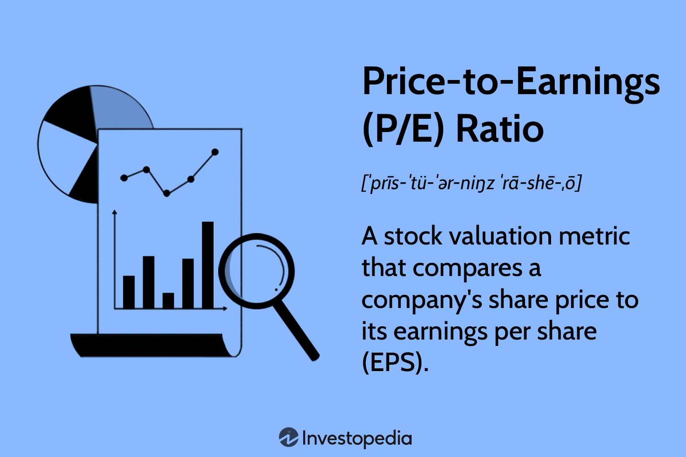

Investing in the stock market requires a strong grasp of various financial metrics and tools, among which the Price-to-Earnings (P/E) ratio stands out as a fundamental indicator. This ratio is pivotal for gauging the valuation and predicting the future profitability of a company. The P/E ratio is calculated by dividing a company's current share price by its earnings per share (EPS), with its formula expressed as:

$$
\text{P/E Ratio} = \frac{\text{Market Value per Share}}{\text{Earnings per Share (EPS)}}
$$



This metric provides a snapshot of what the market is willing to pay today for a stock based on its past or future earnings. A high P/E ratio can suggest that investors anticipate higher growth in the future, while a low P/E might imply that the stock is undervalued or that the company's future growth prospects are weak.

As trading technologies evolve, algorithmic trading systems have become central to contemporary market strategies. These systems automate and optimize trading activities, thereby enhancing execution speed and accuracy. Algorithmic trading employs predefined criteria—often incorporating financial metrics like the P/E ratio—to make informed trading decisions without human intervention. This integration allows for more refined and efficient trading techniques.

By embedding the P/E ratio within algorithmic trading systems, investors can potentially improve market efficiency and achieve better investment outcomes. Such a convergence of investment signals, financial analysis, and algorithmic mechanisms symbolizes a sophisticated approach to modern trading practices. This article examines the interplay between these aspects, illustrating how the P/E ratio can be effectively utilized in algorithmic trading to generate insightful investment signals and enhance decision-making in evolving financial markets.

## Table of Contents

## Understanding Investment Signals and Financial Analysis

Investment signals form a critical component of financial markets, acting as indicators for determining optimal moments to buy or sell assets. These signals emerge from comprehensive financial analysis, which requires a thorough examination of a company’s financial health using various metrics and tools, such as the Price-to-Earnings (P/E) ratio, balance sheets, and income statements.

Financial analysis begins with the evaluation of a company’s balance sheet, which provides insights into its assets, liabilities, and shareholders' equity. This evaluation helps analysts understand the company’s [liquidity](/wiki/liquidity-risk-premium), financial stability, and capital structure. The income statement is another essential tool that outlines the company’s revenues and expenses, offering a snapshot of profitability over a specific period. 

The P/E ratio is a particularly vital metric in this context, offering a baseline for assessing a stock's market value relative to its earnings. The formula for the P/E ratio is:

$$
\text{P/E Ratio} = \frac{\text{Market Price per Share}}{\text{Earnings per Share (EPS)}}
$$

A detailed analysis using these financial statements and ratios can reveal undervalued stocks, which present potential growth opportunities. For instance, a low P/E ratio might suggest that a stock is undervalued compared to its earnings potential, making it an attractive investment candidate. Conversely, a high P/E ratio can indicate overvaluation or high market expectations for future growth.

Furthermore, transforming raw financial data into actionable investment signals involves leveraging this analytical process to identify patterns and indicators of future price movements. Advanced techniques, such as statistical models and [machine learning](/wiki/machine-learning) algorithms, can help in analyzing historical data to generate predictive insights. These methodologies can act as a foundation to develop strategies that enhance portfolio management by optimizing asset allocation based on identified signals.

Investment signals and financial analysis combined provide investors with a robust framework for making informed decisions, ultimately aiming to improve investment returns and manage risk effectively. By continuously refining these tools and methodologies, investors can adapt to changing market conditions and maintain a competitive edge.

## The P/E Ratio: An Essential Metric in Financial Analysis

The Price-to-Earnings (P/E) ratio is a crucial metric in financial analysis, providing insight into how the market values a company's earnings. It serves as a yardstick for comparing relative market value, helping investors assess whether a stock is over- or undervalued by comparing its current share price to its per-share earnings.

Calculating the P/E ratio involves a straightforward formula:

$$
\text{P/E Ratio} = \frac{\text{Market Price per Share}}{\text{Earnings per Share (EPS)}}
$$

The outcome reflects what the market is willing to pay today for a dollar of earnings, thus offering a snapshot of investor sentiment and a company’s anticipated growth prospects.

A high P/E ratio typically suggests that investors expect higher earnings growth in the future compared to companies with a lower P/E. Conversely, a lower P/E might be interpreted as a stock being undervalued or that the company is experiencing challenges that might slow its growth. While a lower P/E can present an opportunity, it also requires careful analysis to ensure that the low valuation is not a signal of deeper issues.

Two primary types of P/E ratios provide insights into a company's financial health: 

1. **Trailing P/E Ratio**: This measures a company's current share price relative to its earnings per share over the past 12 months. It is often used due to its basis on actual performance, helping investors understand how the market values a company based on its historical earnings.

2. **Forward P/E Ratio**: This estimation compares the company’s current share price to its expected future earnings, typically over the next 12 months. It provides a forward-looking view, reflecting the market’s expectations for the company’s future profitability.

Both variants of the P/E ratio offer insights into different aspects of a company’s financial status and market expectations. While the trailing P/E focuses on historical performance, the forward P/E accounts for growth potential. Investors often use both ratios in tandem to obtain a balanced view.

Understanding and calculating the P/E ratio is foundational for making informed investment decisions. By analyzing P/E metrics, investors can identify trends, gauge market expectations, and discern valuation gaps. However, these insights should be complemented with other financial metrics and qualitative factors to form a comprehensive investment strategy.

## Beware of False Signals from the P/E Ratio

Investors must tread carefully as the P/E ratio, despite its widespread use, can sometimes provide misleading signals. One primary reason for this is the influence of external factors, such as market conditions or macroeconomic variables, which can distort the ratio's efficacy as an indicator of true value. For instance, during a bull market, P/E ratios tend to rise because investors are more optimistic about future earnings, which may not always align with the actual performance of a company. Conversely, during a bear market, overly pessimistic sentiments might suppress P/E ratios, painting an inaccurate picture of undervaluation.

Internal issues like manipulated earnings can also affect the accuracy of P/E ratios. Companies may engage in accounting practices that enhance reported earnings without reflecting true economic value, such as through earnings management or creative accounting techniques. This manipulation skews the E (Earnings) component of the ratio, rendering it unreliable. For example, when companies employ aggressive revenue recognition methods, it inflates earnings artificially and lowers the P/E ratio, potentially misleading investors into perceiving the stock as undervalued.

Moreover, P/E ratios should be contextualized within their respective industries to avoid inaccuracies. Industries exhibit varying growth potentials, capital structures, and risk profiles, leading to different average P/E benchmarks. A P/E ratio that is high for one sector might be normal for another. Therefore, comparing P/E ratios across different industries can lead to erroneous conclusions. Industry-specific factors should always be considered to contextualize the ratio accurately.

To mitigate these potential pitfalls, it is advisable to analyze the P/E ratio in conjunction with other financial metrics and indicators. Complementary analysis might include considering other valuation metrics such as Price-to-Book (P/B) ratios, Debt-to-Equity ratios, and Price-to-Cash Flow ratios. Additionally, qualitative factors like management quality, competitive positioning, and market dynamics should not be overlooked. This multifaceted analysis provides a more comprehensive view of a company's valuation and reduces the risk of relying on misleading P/E signals alone.

By adopting a holistic approach, investors can navigate the complexities introduced by the limitations of the P/E ratio and improve their investment decision-making processes.

## Algorithmic Trading: Revolutionizing Market Strategies

Algorithmic trading utilizes computer algorithms to automate trading decisions, a method that has transformed how financial markets operate. These algorithms often incorporate financial metrics, such as the Price-to-Earnings (P/E) ratio, to determine the valuation of stocks and make informed trading moves. By executing trades based on pre-set rules, [algorithmic trading](/wiki/algorithmic-trading) enhances both speed and accuracy, allowing trades to be executed at optimal prices without the delay typically associated with human traders.

One key advantage of algorithmic trading is its ability to process and analyze large datasets rapidly. This computational capacity enables the identification of market opportunities that might be too subtle or transient for human traders to detect. For instance, algorithms can instantly evaluate vast amounts of historical and real-time market data to discern patterns that suggest overvalued or undervalued stocks, adjusting strategies to current market conditions dynamically.

The integration of the P/E ratio into algorithmic trading strategies plays a pivotal role in this automated identification process. By predefining specific P/E ratio parameters, algorithms can systematically screen for stocks that meet criteria suggestive of potential investment opportunities. This approach facilitates the detection of undervalued stocks that may offer growth potential or overvalued stocks that could imply a future decline in price.

In practical terms, an algorithm may consider a stock with a P/E ratio significantly lower than the industry average as potentially undervalued. This stock would then be flagged for purchase if other metrics also align positively. Conversely, a stock with a P/E ratio markedly higher than its peers might be flagged for sale. By executing trades based on clearly defined parameters, these systems remove emotional and psychological biases, adhering strictly to the logic encoded within the algorithm.

Algorithmic systems also leverage machine learning techniques to improve their efficacy. These systems can adapt and refine their decision-making processes by learning from past performance data, allowing for the continuous enhancement of trading strategies. This adaptive learning capability is crucial as it ensures that algorithmic models remain relevant in the ever-evolving financial markets.

In conclusion, algorithmic trading revolutionizes market strategies by automating decision-making processes, considerably boosting the efficiency of trade execution. By employing metrics such as the P/E ratio within these algorithms, traders can automate the assessment of stock valuations, enhancing the ability to capitalize on market mispricings swiftly.

## Integrating P/E Ratio Analysis in Algorithmic Trading

Integrating the Price-to-Earnings (P/E) ratio into algorithmic trading systems involves creating sophisticated algorithms capable of automating stock selection based on this financial metric. The fundamental principle is to establish criteria that evaluate and filter stocks, enhancing automated trading strategies through predefined P/E thresholds.

### Setting Criteria for P/E Ratios

Trading algorithms rely on the definition of specific P/E ratio thresholds to trigger buy or sell signals. For instance, a lower P/E ratio might indicate undervaluation, prompting a buy signal, whereas a higher P/E ratio could suggest overvaluation, resulting in a sell signal. This approach enables the alignment of trades with specific investment goals, such as maximizing returns or minimizing risks. Here is a Python example of how an algorithm might filter stocks based on P/E criteria:

```python
def filter_stocks(stocks, pe_threshold):
    """
    Filters stocks based on the provided P/E ratio threshold.

    Parameters:
        stocks (list of dict): List of stocks with 'name' and 'pe_ratio'
        pe_threshold (float): The P/E ratio threshold for filtering

    Returns:
        list: Filtered list of stock names that meet the criteria
    """
    return [stock['name'] for stock in stocks if stock['pe_ratio'] <= pe_threshold]

# Example usage:
stocks = [{'name': 'Company A', 'pe_ratio': 10},
          {'name': 'Company B', 'pe_ratio': 15},
          {'name': 'Company C', 'pe_ratio': 8}]

filtered_stocks = filter_stocks(stocks, 12)
print(filtered_stocks)  # Output: ['Company A', 'Company C']
```

### Enhancing Predictive Power with Machine Learning

Leveraging machine learning techniques can significantly augment the predictive capabilities of P/E-based trading models. By analyzing data patterns and inconsistencies, models employing supervised learning algorithms can better predict stock movements and optimize trading decisions. A typical approach involves training a machine learning model using historical stock data, where input features might include the P/E ratio, earnings growth rates, and other relevant financial indicators, and the output is the expected future stock performance.

### Systematic Integration and Dynamic Trading Rules

Successful algorithmic trading strategies utilizing the P/E ratio depend on the systematic integration of this metric with dynamic trading rules. It is crucial to combine P/E ratio analysis with real-time market data and other financial indicators to refine trading decisions continually. Algorithms should be capable of dynamically adjusting trading parameters in response to market conditions, ensuring they remain effective under varying economic environments.

In conclusion, the integration of P/E ratio analysis in algorithmic trading can greatly enhance the efficacy of trading strategies. By setting specific P/E thresholds, incorporating machine learning for improved predictions, and implementing adaptive trading rules, investors can achieve positive outcomes and maintain a competitive edge in the financial markets.

## Case Studies and Real-world Applications

Examining successful P/E-based algorithmic trading strategies offers valuable insights into how these approaches can yield superior investment outcomes compared to traditional methods. This section highlights several key case studies illustrating the efficacy of P/E ratio algorithms and underscores the necessity of contextual understanding and supplementary analysis in achieving consistent gains.

One exemplary case involves a [hedge fund](/wiki/hedge-fund-trading-strategies) that implemented a P/E-based trading strategy, combining it with other financial indicators such as the debt-to-equity ratio and return on equity. By integrating these metrics into a machine learning algorithm, the fund was able to dynamically adjust its trading positions as new data became available. This adaptive approach allowed the fund to capitalize on short-term market inefficiencies while maintaining a focus on long-term valuation accuracy. The result was a consistently higher risk-adjusted return compared to benchmarks using traditional analysis techniques.

In another instance, a quant-driven investment firm employed a strategy focusing on stocks with low trailing P/E ratios that also demonstrated strong growth potential. The algorithm screened for stocks across multiple industries, considering sector-specific median P/E levels to avoid cross-industry misinterpretations. By leveraging Python's data analysis libraries, such as pandas and NumPy, the firm created a powerful algorithm capable of processing real-time data and making rapid trading decisions. This strategic use of technology resulted in an enhanced ability to identify undervalued stocks, leading to significant returns over a five-year period.

Moreover, a study by researchers at a prominent university developed a hybrid model combining P/E ratios with sentiment analysis derived from social media platforms and financial news. Using natural language processing (NLP) techniques, the model assessed market sentiment and integrated it with traditional P/E analysis to refine trading signals. The implementation of this multifaceted model successfully improved the prediction of price movements, showcasing how supplementary analysis enhances the application of P/E-focused strategies.

These cases highlight not only the effectiveness of algorithmic trading utilizing P/E ratios but also the importance of context and comprehensive analysis. Integrating additional financial metrics and honing in on industry-specific trends are crucial for mitigating the limitations inherent in relying solely on P/E ratios. Furthermore, the inclusion of advanced technologies like machine learning and NLP can significantly increase the predictive power and adaptability of algorithmic strategies, leading to sustained success in various market conditions.

## Conclusion

The fusion of financial analysis, P/E ratios, and algorithmic trading presents a powerful strategy for modern investors. By synergistically combining these elements, investors can enhance both the efficiency and accuracy of their investment decisions. The Price-to-Earnings (P/E) ratio, a cornerstone of financial analysis, remains a valuable tool; however, its usefulness hinges on careful assessment and strategic integration. Investors should recognize that the P/E ratio's value lies not just in its raw figures but in the context and additional financial data that support its interpretation. 

Algorithmic trading systems can serve as the mechanism to operationalize the insights derived from P/E ratios. These systems can automate repetitive and complex tasks, allowing investors to respond swiftly to market changes. However, the successful incorporation of P/E analysis into algorithmic strategies requires a deep understanding of both the metric's limitations and the dynamic nature of financial markets. 

As market dynamics continue to evolve, staying adaptable and informed about integrating new technologies and methodologies is imperative. This adaptability includes learning about advancements in areas such as machine learning, which can enhance the predictive power and adaptability of trading algorithms. By constantly updating their knowledge base and remaining open to innovative strategies, investors can maintain a competitive edge.

Investors and traders should continue educating themselves on blending traditional analysis with state-of-the-art algo strategies. This ongoing education is vital to understanding how to leverage technology effectively while acknowledging the nuances of financial metrics like the P/E ratio. Fostering a balance between time-tested analytical approaches and cutting-edge technological solutions will remain a hallmark of successful investment strategies.

## References & Further Reading

Graham, B., & Dodd, D. (2009). *Security Analysis*. This book is a seminal work in the field of financial analysis and investing. It provides deep insights into evaluating securities, emphasizing the importance of intrinsic value and the careful analysis of company financials. The text is fundamental for understanding the principles of value investing and the methodology to scrutinize a company's financial health.

Penman, S. H. (2013). *Financial Statement Analysis and Security Valuation*. Penman's book is an authoritative resource on analyzing and interpreting financial statements to appraise a company's value accurately. It bridges the gap between accounting and finance, offering practical strategies for evaluating investment opportunities using financial ratios like the P/E ratio, among others.

Damodaran, A. (2012). *Investment Valuation*. Aswath Damodaran's text is a comprehensive guide for measuring and managing the value of companies, providing in-depth methodologies for investment valuation. The book is essential for understanding different valuation techniques, including discounted cash flow analysis and the application of earnings multiples, such as the P/E ratio, in assessing company worth.

Lopez de Prado, M. (2018). *Advances in Financial Machine Learning*. This book explores the application of machine learning techniques to financial markets. It provides insights into how modern algorithms can be developed for trading strategies, highlighting the potential of integrating machine learning methods with traditional financial metrics like the P/E ratio to enhance prediction accuracy and investment performance.

These references collectively offer a robust foundation for understanding financial analysis, valuation, and the integration of modern computational techniques into investment strategies, serving both traditional and algorithmic traders.