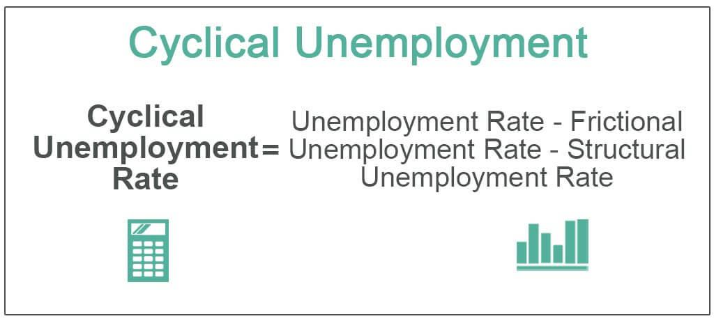

## Table of Contents

## What is the unemployment rate and how is it calculated?

The unemployment rate is a measure that tells us the percentage of people who are not working but are actively looking for a job. It helps us understand how well the economy is doing. If the unemployment rate is high, it means many people are out of work and it might be hard for them to find a job. If it's low, more people have jobs and the economy is doing better.

To calculate the unemployment rate, we first count the number of people who are unemployed. These are people who don't have a job but have looked for one in the past four weeks. Then, we count the total number of people in the labor force. The labor force includes both people who are working and those who are unemployed but looking for work. After that, we divide the number of unemployed people by the total labor force and multiply by 100 to get a percentage. For example, if there are 100 unemployed people and the labor force is 1,000, the unemployment rate would be (100 / 1,000) * 100 = 10%.

## Why is the unemployment rate an important economic indicator?

The unemployment rate is an important economic indicator because it shows how many people are out of work and looking for jobs. This helps us understand if the economy is doing well or not. When the unemployment rate is low, it means more people have jobs, and this usually means the economy is strong. On the other hand, a high unemployment rate can mean that the economy is struggling, and it might be harder for people to find work.

This rate also affects how people feel about the future. If many people are unemployed, they might spend less money because they are worried about their jobs. This can slow down the economy even more. Governments and businesses watch the unemployment rate closely because it helps them make decisions. For example, if the unemployment rate is high, the government might start programs to help people find jobs or give money to businesses to create more jobs.

## What are the different types of unemployment?

There are several types of unemployment, and each one happens for different reasons. Frictional unemployment is when people are between jobs or just starting to look for work. It's normal and happens when people take time to find a job that's right for them. Structural unemployment happens when there's a mismatch between the skills workers have and the skills needed for available jobs. This can happen because of changes in technology or the economy. For example, if factories start using more machines, workers who used to work there might need new skills to get a job.

Cyclical unemployment is linked to the ups and downs of the economy. When the economy is doing badly, like during a recession, businesses might lay off workers because they don't need as many. When the economy gets better, these workers might get their jobs back. Seasonal unemployment happens because some jobs are only needed at certain times of the year. For example, lifeguards at a beach might only work during the summer.

There's also something called voluntary unemployment, where people choose not to work even though they could. This might happen if they don't want to take the jobs that are available or if they want to wait for a better job. Lastly, involuntary unemployment is when people want to work but can't find a job. This is the type that most people think of when they hear the word "unemployment."

## How does the unemployment rate fail to account for underemployment?

The unemployment rate only counts people who don't have a job but are actively looking for one. It doesn't consider people who are working but not as much as they want to or in jobs that don't use their skills. This is called underemployment. For example, if someone with a college degree is working part-time at a fast food restaurant because they can't find a full-time job in their field, they are underemployed. The unemployment rate won't show this because it only looks at whether someone has a job or not, not if the job is a good fit for them.

Underemployment can be a big problem because it means people aren't using their skills and might not be [earning](/wiki/earning-announcement) as much money as they could. This can affect the economy too, because if lots of people are underemployed, they might spend less money. The unemployment rate doesn't give us the full picture of how many people are struggling to find the right job. So, while it's a useful measure, it's important to also look at underemployment to understand the health of the job market.

## Can the unemployment rate accurately reflect the health of the economy?

The unemployment rate can give us a good idea about the health of the economy, but it's not perfect. It tells us how many people are out of work and looking for jobs. If the unemployment rate is low, it usually means more people have jobs and the economy is doing well. But if it's high, it can mean the economy is struggling and it's hard for people to find work. Governments and businesses use this rate to make decisions, like starting job programs or creating more jobs.

However, the unemployment rate doesn't tell the whole story. It doesn't count people who have given up looking for work or those who are working part-time but want full-time jobs. These people are underemployed, and the unemployment rate doesn't show that. Also, the rate doesn't consider if the jobs people have are good matches for their skills or if they pay enough. So, while the unemployment rate is helpful, we need to look at other things too to really understand how the economy is doing.

## What is the impact of discouraged workers on the unemployment rate?

Discouraged workers are people who want a job but have stopped looking for one because they think they won't find anything. When these people give up looking for work, they are not counted as unemployed anymore. This happens because the unemployment rate only includes people who are actively looking for a job. So, if a lot of people become discouraged and stop looking, the unemployment rate might go down, even though the real situation hasn't gotten better.

This can make the unemployment rate misleading. It might look like the job market is doing better than it really is. If we want to understand the true health of the economy, we need to think about these discouraged workers too. They are still without a job and would take one if they could find it, so leaving them out of the unemployment numbers means we're missing an important part of the picture.

## How does the labor force participation rate affect the interpretation of the unemployment rate?

The labor force participation rate tells us the percentage of people who are either working or looking for work. It's important because it helps us understand the unemployment rate better. If the labor force participation rate goes down, it means fewer people are working or looking for jobs. This can happen if a lot of people get discouraged and stop looking for work. When this happens, the unemployment rate might look better than it really is, because it only counts people who are actively looking for a job.

So, if the labor force participation rate drops a lot, the unemployment rate might not show the full picture of how many people are out of work. For example, if many people retire or go back to school and stop looking for jobs, the labor force participation rate will go down. This can make the unemployment rate seem lower, even if the number of unemployed people hasn't changed much. To really understand the health of the job market, we need to look at both the unemployment rate and the labor force participation rate together.

## What are the limitations of using monthly unemployment data?

Monthly unemployment data can help us see how the job market is changing from one month to the next. But it has some problems. One big issue is that the numbers can change a lot from month to month because of things like seasonal jobs. For example, more people might be working in the summer because of jobs like lifeguarding or farming. This can make the unemployment rate look better in the summer, even if the overall job market hasn't changed much. Also, the monthly data can be affected by how people answer surveys. If someone stops looking for a job because they're discouraged, they won't be counted as unemployed anymore, which can make the rate look lower than it really is.

Another limitation is that monthly unemployment data doesn't tell us everything about the job market. It only shows if someone has a job or not, but it doesn't say if the job is good for them or if they're working as much as they want. People might be working part-time but want full-time jobs, or they might have jobs that don't use their skills. This is called underemployment, and the monthly unemployment rate doesn't show that. So, while the monthly data can give us a quick look at the job market, we need to look at other information too to really understand what's going on.

## How do seasonal adjustments influence the unemployment rate?

Seasonal adjustments help make the unemployment rate more useful by taking out changes that happen every year at the same time. For example, more people might work in the summer because of jobs like lifeguarding or farming. If we don't adjust for this, the unemployment rate could look better in the summer just because of these seasonal jobs, even if the overall job market hasn't changed much. By making seasonal adjustments, we can see a clearer picture of how the job market is doing without these regular ups and downs.

However, even with seasonal adjustments, the unemployment rate can still be tricky. The adjustments are based on what happened in the past, so if something new happens, like a big change in the economy, the adjustments might not be perfect. Also, the unemployment rate only looks at if someone has a job or not. It doesn't show if people are working as much as they want or if their jobs match their skills. So, while seasonal adjustments help, we need to look at other information too to really understand the job market.

## What role do demographic factors play in the unemployment rate?

Demographic factors like age, gender, race, and education can change how the unemployment rate looks. For example, young people often have a higher unemployment rate because they might be new to the job market and still looking for the right job. Also, people with less education might have a harder time finding work because they might not have the skills that many jobs need. This means that if a lot of young people or people with less education are looking for jobs, the overall unemployment rate might be higher.

Race and gender can also affect the unemployment rate. Sometimes, certain groups of people, like women or minorities, might face more challenges in finding work. This can be because of discrimination or because they might not have the same access to good education and job opportunities. So, when we look at the unemployment rate, it's important to think about these different groups to really understand what's going on in the job market.

## How does the unemployment rate vary by region and what does this indicate?

The unemployment rate can be different in different parts of a country. Some areas might have more jobs and a lower unemployment rate, while others might have fewer jobs and a higher unemployment rate. This can happen because of things like where businesses are located, what kind of work people do in that area, and how strong the local economy is. For example, cities with big companies or industries might have more jobs and lower unemployment rates than smaller towns or rural areas where there might not be as many job opportunities.

These differences in unemployment rates by region can tell us a lot about the economy. If one part of the country has a much higher unemployment rate, it might mean that the local economy there is struggling. It could also mean that people in that area might need more help finding jobs or getting the skills they need for work. By looking at unemployment rates in different regions, governments and businesses can make better decisions about where to focus their efforts to help people find work and improve the economy.

## What alternative measures of employment exist and how do they compare to the standard unemployment rate?

Besides the standard unemployment rate, there are other ways to measure how people are doing in the job market. One of these is the underemployment rate. This looks at people who have jobs but are not working as much as they want or are working in jobs that don't use their skills. For example, if someone with a college degree is working part-time at a store because they can't find a full-time job in their field, they are underemployed. The underemployment rate gives us a better idea of how many people are struggling to find the right job, even if they are not counted as unemployed.

Another measure is the labor force participation rate. This tells us the percentage of people who are either working or looking for work. If this rate goes down, it might mean that a lot of people have given up looking for jobs because they think they won't find any. These people are called discouraged workers, and they are not counted in the standard unemployment rate. So, if the labor force participation rate is low, the unemployment rate might look better than it really is. Looking at both the unemployment rate and the labor force participation rate together gives us a clearer picture of the job market.

There's also something called the employment-to-population ratio, which shows the percentage of the working-age population that is employed. This measure helps us see how many people have jobs out of everyone who could be working. Unlike the unemployment rate, it doesn't just focus on people who are looking for work. So, it can give us another view of how well the economy is doing in terms of providing jobs for people. Each of these measures helps us understand different parts of the job market and gives us a more complete picture than just looking at the unemployment rate alone.

## How can economic indicators be integrated into algo trading strategies?

Integrating economic indicators into [algorithmic trading](/wiki/algorithmic-trading) strategies involves utilizing a wide array of data points to inform and optimize trading decisions. This process requires building sophisticated models capable of analyzing large datasets and identifying potential trading signals. A typical approach employs both historical data and real-time economic indicators such as GDP growth, inflation rates, employment [statistics](/wiki/bayesian-statistics), and more.

These indicators serve as inputs to predictive models that forecast price movements and identify market trends. For example, when an economic report is released showing higher-than-expected GDP growth, an algorithm might predict an appreciation in the local currency or a rise in stock indices. One common method is using regression analysis to establish relationships between economic indicators and asset prices. The model might look something like this:

$$
P_t = \beta_0 + \beta_1 \times \text{GDP}_t + \beta_2 \times \text{Inflation}_t + \ldots + \epsilon_t
$$

where:
- $P_t$ is the price of the asset at time $t$,
- $\beta_0, \beta_1, \ldots$ are coefficients,
- $\text{GDP}_t, \text{Inflation}_t, \ldots$ are various economic indicators,
- $\epsilon_t$ is the error term.

Algorithmic systems further utilize [machine learning](/wiki/machine-learning) techniques to refine these models. Machine learning can automatically detect patterns and adapt to new data, allowing the models to evolve alongside changing market conditions. In Python, this might involve libraries such as scikit-learn or TensorFlow to implement machine learning models which can update and optimize trading strategies in real-time. For example:

```python
from sklearn.ensemble import RandomForestRegressor
import numpy as np

# Sample economic data
X = np.array([[gdp, inflation, employment] for gdp, inflation, employment in zip(gdp_data, inflation_data, employment_data)])
y = np.array(asset_prices)

# Train model
model = RandomForestRegressor(n_estimators=100)
model.fit(X, y)

# Predicting future price
future_data = np.array([[future_gdp, future_inflation, future_employment]])
predicted_price = model.predict(future_data)
```

To maintain a competitive edge, traders must continuously refine their algorithms to account for new economic insights and changing market dynamics. This requires constant monitoring of model performance and retraining the model with new data as it becomes available. The timeliness and accuracy of the integrated data are pivotal in ensuring that trading decisions are grounded in current economic conditions.

By effectively incorporating economic indicators, traders not only improve their decision-making processes but also enhance overall trading performance. This integration provides a strategic advantage, allowing traders to preempt market movements and capitalize on emerging opportunities. As financial markets continue to evolve, the ability to dynamically adapt trading strategies using robust economic data remains a cornerstone of successful algorithmic trading.

## References & Further Reading

[1]: Biau, G., & Scornet, E. (2016). ["A Random Forest Guided Tour."](https://link.springer.com/article/10.1007/s11749-016-0481-7) Test, 25(2), 197-227.

[2]: ["Advances in Financial Machine Learning"](https://www.amazon.com/Advances-Financial-Machine-Learning-Marcos/dp/1119482089) by Marcos Lopez de Prado

[3]: Kroll, J. A., & Duhigg, C. (2010). ["How Companies Learn Your Secrets"](https://drive.google.com/file/d/0B6u2M4jm5HJRMHAtUEZfMUtKd2M/view) The New York Times.

[4]: ["Evidence-Based Technical Analysis: Applying the Scientific Method and Statistical Inference to Trading Signals"](https://www.amazon.com/Evidence-Based-Technical-Analysis-Scientific-Statistical/dp/0470008741) by David Aronson

[5]: Cartea, Á., Jaimungal, S., & Penalva, J. (2015). ["Algorithmic and High-Frequency Trading."](https://assets.cambridge.org/97811070/91146/frontmatter/9781107091146_frontmatter.pdf) Cambridge University Press.

[6]: ["Machine Learning for Algorithmic Trading"](https://github.com/stefan-jansen/machine-learning-for-trading) by Stefan Jansen

[7]: ["Quantitative Trading: How to Build Your Own Algorithmic Trading Business"](https://books.google.com/books/about/Quantitative_Trading.html?id=j70yEAAAQBAJ) by Ernest P. Chan