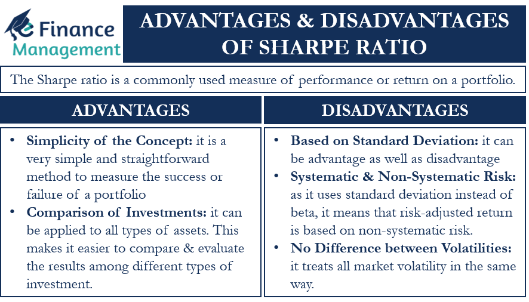

The Sharpe Ratio, pioneered by Nobel laureate William F. Sharpe, stands as a cornerstone in the field of investment analysis. This metric is designed to evaluate the risk-adjusted return of an investment, offering valuable insights into the relationship between risk and return. Essentially, it measures how well the return on an investment compensates for the risk taken. 

In more technical terms, the Sharpe Ratio assesses the excess return earned per unit of risk. It is calculated using the formula: 
$$
\text{Sharpe Ratio} = \frac{R_p - R_f}{\sigma_p}
$$
where $R_p$ is the return of the portfolio, $R_f$ is the risk-free rate, and $\sigma_p$ is the standard deviation of the portfolio’s excess return. A higher Sharpe Ratio indicates a more attractive risk-adjusted return, allowing investors to effectively compare the performance of various investments or portfolios.



This article will explore the pivotal role of the Sharpe Ratio in evaluating investment risk and its application within the domain of algorithmic trading. By understanding its calculation, interpretation, and practical usage, investors can sharpen their decision-making processes, thereby optimizing their investment strategies using this influential tool. The goal is to enable investors to make informed choices that align with their risk tolerance and return expectations.

## Table of Contents

## Understanding the Sharpe Ratio

The Sharpe Ratio, a crucial indicator in the field of finance and investment, provides insights into the risk-adjusted returns of an investment or portfolio. Developed by William F. Sharpe in the 1960s, this metric facilitates the comparison of different investments' performance by adjusting the returns based on their associated financial risk. The fundamental formula for calculating the Sharpe Ratio is:

$$
\text{Sharpe Ratio} = \frac{\text{Return of Portfolio} - \text{Risk-Free Rate}}{\text{Standard Deviation of Portfolio's Excess Return}}
$$

### Explanation of Components:
- **Return of Portfolio**: This refers to the total gains or losses generated by the investment portfolio over a specific period.
- **Risk-Free Rate**: Typically represented by the returns from government bonds or treasury bills, the risk-free rate is the theoretical rate of return of an investment with zero risk.
- **Standard Deviation of Portfolio's Excess Return**: This measures the volatility or risk associated with the investment's returns when compared to the risk-free rate.

A higher Sharpe Ratio suggests that the investment is providing higher returns for each unit of risk, making it a more attractive option for investors. Conversely, a lower Sharpe Ratio indicates less favorable risk-adjusted returns. This capability to standardize returns across different risk levels makes the Sharpe Ratio an indispensable tool for evaluating investment performance effectively.

### Importance in Investment Analysis:
The Sharpe Ratio's value lies in its ability to simplify and streamline the evaluation of investments from various classes by taking into account both risk and return. By doing this, it helps investors and analysts to understand whether they're sufficiently compensated for the additional risk they've taken compared to a risk-free investment.

The widespread adoption of the Sharpe Ratio since its introduction in the 1960s has made it a staple in modern investment analysis, providing a straightforward yet powerful way to compare different portfolios. Whether assessing mutual funds, hedge funds, or individual securities, the Sharpe Ratio remains a primary metric for understanding risk-adjusted performance and guiding investment decisions.

## Calculation and Interpretation

The Sharpe Ratio is a pivotal concept in evaluating the risk-adjusted performance of an investment portfolio. It utilizes three primary components: the portfolio's return, the risk-free rate of return, and the standard deviation of the portfolio’s excess return over the risk-free rate. The formula for calculating the Sharpe Ratio is:

$$
\text{Sharpe Ratio} = \frac{R_p - R_f}{\sigma_p}
$$

where $R_p$ is the expected return of the portfolio, $R_f$ is the risk-free rate, and $\sigma_p$ is the standard deviation of the portfolio’s excess return.

1. **Portfolio Returns, Risk-Free Rate, and Standard Deviation:**
   - **Portfolio Returns ($R_p$)**: This represents the average return that an investment portfolio generates over a specific period.
   - **Risk-Free Rate ($R_f$)**: Typically, the yield on short-term government securities is used as the risk-free rate, as they are considered to have little risk of default.
   - **Standard Deviation ($\sigma_p$)**: This measures the portfolio's return volatility, reflecting the extent of deviation from the expected return.

2. **Importance of Benchmark and Risk-Free Rate Selection:**
   - The accuracy of the Sharpe Ratio largely depends on selecting an appropriate benchmark and risk-free rate. A mismatch can lead to misleading results, obscuring the true performance analysis.

3. **Examples of Calculation:**
   - **Portfolio A**: Consider a portfolio with an average annual return of 10% and a standard deviation of 8%. If the risk-free rate is 2%, the Sharpe Ratio for Portfolio A is calculated as follows:
$$
   \text{Sharpe Ratio of A} = \frac{10\% - 2\%}{8\%} = 1.0

$$

   - **Portfolio B**: Suppose another portfolio has a return of 12% with a standard deviation of 10%. With the same risk-free rate, its Sharpe Ratio is:
$$
   \text{Sharpe Ratio of B} = \frac{12\% - 2\%}{10\%} = 1.0

$$

Both portfolios showcase the same Sharpe Ratio despite different return and risk profiles, indicating equivalent risk-adjusted returns given their differences in total risk. This example highlights the utility of the Sharpe Ratio in standardizing comparisons. However, it's essential to remember that while useful, the Sharpe Ratio should be complemented with other metrics to provide a comprehensive performance assessment.

## Sharpe Ratio in Algorithmic Trading

Algorithmic trading employs the Sharpe Ratio as a critical metric for assessing the risk-adjusted returns of various trading strategies. The formula for the Sharpe Ratio is given by:

$$
\text{Sharpe Ratio} = \frac{E(R) - R_f}{\sigma}
$$

where $E(R)$ represents the expected return of the strategy, $R_f$ denotes the risk-free rate of return, and $\sigma$ is the standard deviation of the strategy's excess return. This calculation enables traders to assess how well the returns of a trading strategy are compensating for the associated risks.

The Sharpe Ratio aids in decision-making by allowing traders to compare the performance of different algorithmic strategies. A higher Sharpe Ratio indicates a more attractive risk-adjusted return, making the strategy more appealing. Consequently, traders can prioritize or select strategies with higher Sharpe Ratios over others.

In [algorithmic trading](/wiki/algorithmic-trading), optimizing strategies for an improved Sharpe Ratio involves several factors. Adjusting leverage is one approach; by carefully managing leverage, traders can enhance returns relative to risk, leading to a higher Sharpe Ratio. Trade frequency is another consideration—determining the optimal number of trades can reduce [volatility](/wiki/volatility-trading-strategies) and improve the risk-return profile of a strategy. Additionally, asset selection plays a vital role. Selecting assets with expected returns that better compensate for their risk can substantially impact the strategy's overall Sharpe Ratio.

Algorithmic traders often use simulations and [backtesting](/wiki/backtesting) to refine these components. By testing various scenarios, traders can identify the configuration that maximizes the Sharpe Ratio. This thorough analysis helps traders develop more robust strategies that are better equipped to handle market fluctuations, thus optimizing performance.

In conclusion, the Sharpe Ratio is a powerful tool in algorithmic trading for evaluating the balance between return and risk. By focusing on maximizing the Sharpe Ratio, traders can make informed decisions about strategy implementation and modifications, ultimately enhancing their potential for achieving superior risk-adjusted returns.

## Pitfalls and Limitations

The Sharpe Ratio, despite its widespread use and utility in assessing the risk-adjusted return of investments, possesses several pitfalls and limitations that investors should consider. 

One primary assumption of the Sharpe Ratio is that investment returns are normally distributed. However, in practice, this assumption often falls short. Asset returns can exhibit skewness and kurtosis, resulting in distributions that deviate significantly from the normal curve. In cases where returns are not normally distributed, the accuracy of the Sharpe Ratio is compromised, potentially leading to erroneous conclusions about an investment's risk-adjusted performance.

Another significant pitfall of the Sharpe Ratio is the potential for manipulation through the alteration of measurement intervals. By selecting specific time periods for evaluation, one can artificially inflate or deflate the ratio, leading to misleading investment insights. For instance, calculating the ratio over a short period with anomalous high returns can present an overly favorable view of an investment's performance, while longer periods may provide a more balanced perspective.

During extreme market conditions and for unconventional investments, the Sharpe Ratio may also fail to provide accurate insights. In highly volatile or crisis-induced markets, traditional risk metrics like the standard deviation can underestimate the true risk, rendering the Sharpe Ratio less effective. Moreover, unconventional investments, such as those involving derivatives or other complex instruments, may exhibit return profiles not adequately captured by the Sharpe framework.

Given these limitations, investors often turn to alternative metrics like the Sortino and Treynor Ratios to gain additional insights. The Sortino Ratio, for instance, focuses only on the downside deviation, considering only negative asset volatility, thus addressing some limitations of the Sharpe Ratio related to asymmetric return distributions. The Treynor Ratio, on the other hand, measures returns in excess of the risk-free rate relative to systematic risk as represented by beta, offering a perspective more aligned with market risk considerations.

Overall, while the Sharpe Ratio remains a valuable tool for assessing investment performance, its limitations necessitate a cautious and comprehensive approach, using it in conjunction with other financial metrics to achieve a more robust assessment.

## Practical Application and Examples

The Sharpe Ratio serves as a valuable tool for evaluating and adjusting the performance of portfolios and trading strategies across various investment landscapes. In quantitative hedge funds, the Sharpe Ratio often guides the allocation of capital to different strategies. By measuring the risk-adjusted return, fund managers can prioritize strategies that offer higher returns for a given level of volatility, enhancing overall portfolio performance. A practical example is a [hedge fund](/wiki/hedge-fund-trading-strategies) evaluating multiple strategies where each strategy's Sharpe Ratio is computed to decide on resource allocation. 

In the field of [machine learning](/wiki/machine-learning), the Sharpe Ratio can be incorporated into models to optimize trading strategies. For instance, algorithms can be programmed to select assets or adjust trading positions based on real-time Sharpe Ratio calculations. This dynamic approach allows the algorithm to respond quickly to changes in market conditions, maintaining an optimal risk-return balance.

As market conditions shift, the Sharpe Ratio aids in strategy adjustments. For instance, during market volatility, a strategy might initially have a promising Sharpe Ratio; however, as volatility increases, the risk (denoted by standard deviation) may also increase, potentially reducing the Sharpe Ratio. In this scenario, investors might adjust their strategy by either reducing exposure to high-volatility assets or increasing allocations to less correlated, stable investments to rebalance the portfolio’s risk-adjusted returns.

An illustrative Python example of computing the Sharpe Ratio for a hypothetical portfolio might look like this:

```python
import numpy as np

# Hypothetical data
returns = [0.10, 0.12, 0.08, 0.11, 0.09]  # Portfolio returns
risk_free_rate = 0.03  # Risk-free rate, e.g., treasury bond yield
excess_returns = np.array(returns) - risk_free_rate

# Calculating Sharpe Ratio
sharpe_ratio = excess_returns.mean() / excess_returns.std()

print(f"The Sharpe Ratio of the portfolio is {sharpe_ratio:.2f}")
```

By integrating the Sharpe Ratio in this manner, investors and traders can empirically back-test strategies and simulate market conditions to understand how different strategies might perform in varied scenarios. This risk assessment tool not only informs better decision-making but also contributes significantly to strategic adjustments that reflect ongoing market dynamics.

## Conclusion

The Sharpe Ratio serves as a crucial metric in evaluating investment risk and performance. Its approach simplifies the process of comparing different investment portfolios by quantifying the return earned per unit of risk. The elegance of the Sharpe Ratio lies in its ability to distill complex risk-return assessments into a single, comprehensible figure. This makes it an attractive tool for investors looking to optimize their portfolios or for fund managers aiming to benchmark performance against competitors.

However, the Sharpe Ratio is not without its shortcomings. It operates under the assumption that investment returns are normally distributed, which is not always the case in real-world markets. During periods of extreme volatility or when assessing unconventional assets, the results may not accurately reflect the true risk associated with a given investment. Furthermore, the metric can be manipulated by altering the frequency of data measurement, leading to potentially misleading conclusions.

To counter these limitations, it is beneficial to use the Sharpe Ratio in conjunction with other performance metrics such as the Sortino and Treynor Ratios. These complementary tools can provide a more nuanced view of the strategy evaluation and risk management processes. Strategically combining multiple metrics allows investors to gain deeper insights and make more informed decisions, thereby enhancing the robustness of their investment strategies. By leveraging the strengths of the Sharpe Ratio alongside other analytical methods, a more comprehensive assessment of investment performance and risk can be achieved.

## References & Further Reading

[1]: Sharpe, W. F. (1994). ["The Sharpe Ratio."](https://web.stanford.edu/~wfsharpe/art/sr/SR.htm) The Journal of Portfolio Management, 21(1), 49-58.

[2]: Marcos López de Prado. ["Advances in Financial Machine Learning."](https://www.amazon.com/Advances-Financial-Machine-Learning-Marcos/dp/1119482089) John Wiley & Sons, 2018.

[3]: David Aronson. ["Evidence-Based Technical Analysis: Applying the Scientific Method and Statistical Inference to Trading Signals."](https://www.amazon.com/Evidence-Based-Technical-Analysis-Scientific-Statistical/dp/0470008741) Wiley, 2006.

[4]: Stefan Jansen. ["Machine Learning for Algorithmic Trading."](https://github.com/stefan-jansen/machine-learning-for-trading) 2nd Edition, Packt Publishing, 2020.

[5]: Ernest P. Chan. ["Quantitative Trading: How to Build Your Own Algorithmic Trading Business."](https://www.amazon.com/Quantitative-Trading-Build-Algorithmic-Business/dp/0470284889) Wiley, 2008.