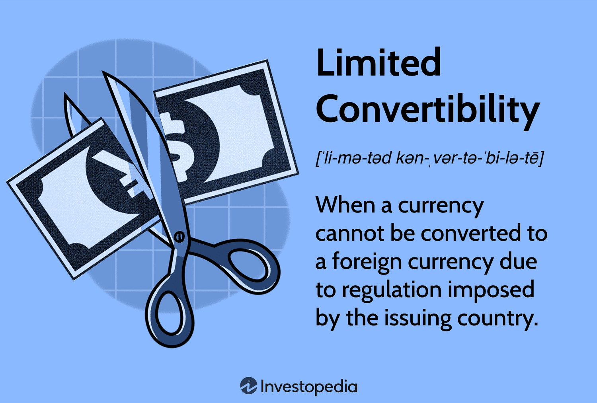

Forex trading, or foreign exchange trading, has undergone a transformative journey with the continuous advancements in technology and the digitization of financial markets. Historically, forex trading had been limited to large financial institutions, multinational corporations, and high-net-worth individuals. However, the proliferation of digital platforms and advanced technologies has democratized access, allowing individual traders to participate in this global market. 

A fundamental aspect of forex trading is the concept of currency convertibility. This refers to the ease with which a currency can be exchanged for another. Fully convertible currencies like the US dollar or the euro are traded freely without restrictions, facilitating seamless international transactions and supporting global trade. Conversely, some currencies have limited convertibility, with restrictions imposed by governments to control capital flow, often to protect domestic economies or stabilize inflation.



In recent years, algorithmic trading has emerged as a significant innovation, reshaping how trades are executed in the forex market. By employing complex algorithms, traders can automate the trading process, optimize transaction timing, and manage substantial volumes of data. This capability not only improves execution efficiency but also minimizes human error, allowing traders to respond swiftly to market changes.

As the forex market continues to evolve, understanding these foundational principles—currency convertibility and algorithmic trading—becomes essential. These elements influence how currencies are traded globally and determine the strategies employed by traders to navigate the complex dynamics of the foreign exchange market.

## Table of Contents

## Understanding Currency Convertibility

Currency convertibility refers to the ease with which a country's currency can be exchanged for foreign currency. This concept is pivotal in facilitating international trade and investment, resonating with the dynamics of the global economy. Fully convertible currencies are those that can be freely exchanged on the international market without any restrictions or governmental control. This level of convertibility offers significant advantages for international trade by simplifying transactions, promoting foreign investment, and reducing the risks associated with currency fluctuations. Notable examples of fully convertible currencies include the US dollar, the Euro, and the British pound.

In contrast, some currencies are only partially convertible, meaning they are subject to various governmental controls that restrict their exchangeability. These restrictions are often imposed as a means to manage the flow of capital, protect domestic economic interests, or prevent excessive volatility in the foreign exchange markets. For partially convertible currencies, exchanges might be limited to specific amounts, purposes, or require governmental approval, reflecting a controlled approach to economic management.

Currency convertibility is a critical [factor](/wiki/factor-investing) in global economic integration. It supports the fluid movement of goods, services, and capital across borders, enabling countries to engage in international markets effectively. When a currency is easily convertible, it enhances investor confidence, reduces transaction costs, and improves the country's ability to attract foreign capital, thereby contributing to economic growth and stability.

## Limited Currency Convertibility

Limited currency convertibility occurs when a government imposes regulations that restrict the exchangeability of its national currency. This practice is often adopted for several reasons, including the implementation of economic policies, political considerations, and measures to control inflation and stabilize the economy. Governments may limit currency convertibility to maintain control over capital flows and prevent excessive [volatility](/wiki/volatility-trading-strategies) in their domestic financial markets.

One of the primary motivations behind limited currency convertibility is economic policy. By regulating currency exchange, governments can exert greater control over their economic environment, which may involve stabilizing the national economy, protecting domestic industries, and fostering export competitiveness. For instance, by restricting currency exchange, a government can prevent large-scale capital flight during periods of economic instability, thereby protecting national financial resources.

Political factors can also influence a country's decision to limit currency convertibility. In some cases, governments may impose restrictions to maintain national sovereignty or to implement sanctions and foreign policy measures effectively. These restrictions can serve as tools for geopolitical strategy, allowing countries to exert pressure or protect their interests against international adversaries.

From an economic stabilization perspective, controlling inflation is a significant reason for limiting currency convertibility. By restricting the flow of foreign currencies, a government can better manage its money supply and reduce the risk of inflationary pressures that could weaken the domestic currency's purchasing power.

However, limited currency convertibility poses several challenges, particularly in attracting foreign investment and engaging in global trade. Foreign investors might view such restrictions as a potential risk factor, deterring investment due to uncertainties about capital repatriation and exchange rate stability. Additionally, transaction costs and currency risks may increase for companies doing business with countries enforcing limited convertibility, as they must navigate complex regulatory landscapes.

Notable examples of limited currency convertibility include restrictions on the Chinese yuan (CNY) and the South Korean won (KRW). China's government, for example, employs a managed floating exchange rate system, where the yuan's value is allowed to fluctuate within a specific range around a central parity determined by the People's Bank of China. This system is designed to maintain currency stability while allowing some degree of market-driven adjustments. Similarly, South Korea has implemented measures to control capital flows and exchange rates, influenced by historical financial crises and the desire to maintain economic stability.

In summary, while limited currency convertibility can offer benefits such as economic stabilization and policy control, it also presents obstacles to international economic integration. Balancing these factors remains a complex challenge for countries opting for such measures.

## Impact on International Trade

Limited currency convertibility significantly impacts international trade by influencing foreign direct investment (FDI) and transaction costs. When a currency is not fully convertible, it introduces increased risk and unpredictability for investors and companies seeking to engage in international commerce. Foreign direct investment is often deterred in such environments due to concerns over currency stability and the ability to repatriate profits. The increased risk associated with limited convertibility can result in foreign investors demanding higher returns to compensate for potential currency devaluation and economic instability.

Companies looking to trade with nations imposing restrictions on their currency face additional transaction costs. These costs can emerge from currency hedging strategies employed to mitigate currency risks, amplified by restrictive exchange rate mechanisms. Additionally, limited convertibility may lead to inefficiencies, such as delays in payment settlements and increased administrative burdens, further complicating international transactions.

Nonetheless, limited currency convertibility can offer domestic economic protection. By controlling the outflow of capital, a country can shield its economy from volatile foreign capital movements, which might otherwise lead to economic instability. This economic protection can serve as a stabilizing mechanism, maintaining domestic economic order and providing a buffer against external economic shocks. However, such protection comes at the cost of reduced integration into the global economy and potential loss of growth opportunities associated with increased foreign investments and trade liberalization.

## Algorithmic Trading in Forex

Algorithmic trading in the foreign exchange ([forex](/wiki/forex-system)) market employs computer programs to generate trading orders based on a predetermined set of criteria such as timing, price, and [volume](/wiki/volume-trading-strategy). This method has revolutionized forex trading by enabling traders to identify and capitalize on pricing inefficiencies with remarkable speed and precision. The core advantage of [algorithmic trading](/wiki/algorithmic-trading) is its capacity to handle vast amounts of data and perform complex calculations instantly, thereby significantly reducing the likelihood of human error.

In the forex market, algorithmic trading harnesses the power of high-frequency trading ([HFT](/wiki/high-frequency-trading-strategies)) techniques to exploit minuscule price differences across various currency pairs. Algorithms can quickly identify [arbitrage](/wiki/arbitrage) opportunities, which involve buying and selling the same asset in different markets to take advantage of price discrepancies. For example, if the EUR/USD pair is priced differently on two exchanges, an algorithm can simultaneously buy at the lower price and sell at the higher price, securing a profit with minimal risk.

Moreover, algorithmic trading facilitates the execution of trades at optimal speeds, which is crucial in the forex market, where prices change rapidly. The speed of execution ensures that traders can enter and [exit](/wiki/exit-strategy) positions at the best possible prices, enhancing profitability. The algorithms can also manage large volumes of trades efficiently, distributing trades across multiple currency pairs or exchanges to optimize [liquidity](/wiki/liquidity-risk-premium) and reduce market impact.

A typical algorithmic trading strategy may involve constructing a mathematical model to predict price movements based on historical data. Consider the moving average crossover strategy, which generates buy or sell signals when a short-term moving average crosses a long-term moving average. This approach can be implemented programmatically in Python as follows:

```python
import pandas as pd
import numpy as np

def moving_average_crossover(data, short_window=40, long_window=100):
    data['Short_MA'] = data['Close'].rolling(window=short_window, min_periods=1).mean()
    data['Long_MA'] = data['Close'].rolling(window=long_window, min_periods=1).mean()
    data['Signal'] = 0
    data['Signal'][short_window:] = np.where(data['Short_MA'][short_window:] > data['Long_MA'][short_window:], 1, 0)
    data['Position'] = data['Signal'].diff()
    return data

# Example usage:
# data = pd.read_csv('forex_data.csv')
# result = moving_average_crossover(data)
```

This program calculates the short-term and long-term moving averages of closing prices and generates a signal to buy or sell based on their crossover. Such algorithms can be further refined with additional conditions and integrated into broader trading systems.

The reduction of human error through algorithmic trading results in more consistent and reliable execution of trades. Algorithms scrutinize vast datasets for patterns that may not be immediately apparent to human traders, facilitating informed and strategic decision-making. As the forex market continues to grow in complexity, the adaptive nature of algorithmic trading remains an indispensable asset for managing sophisticated trading strategies efficiently.

## Advantages and Challenges of Algo Trading

Algorithmic trading, also known as algo trading, offers several advantages that contribute to its growing popularity in the forex markets. One of the primary benefits is increased market efficiency. By using computer algorithms to analyze data and execute trades at high speeds, algo trading can quickly exploit market inefficiencies and provide liquidity. This rapid execution reduces the time lag between identifying a trading opportunity and executing the trade, thereby enhancing overall market efficiency.

Another advantage is the reduction in transaction costs. Algo trading minimizes the need for manual intervention, thereby lowering the cost associated with human traders. The automation process also facilitates the execution of trades at optimal price points, reducing the bid-ask spread and overall transaction expenses. Additionally, the capacity to execute trades in large volumes without significant market impact further contributes to cost efficiency. Algorithms designed for optimal order execution can sequence trades, fragmenting large orders into smaller orders to be executed at different times, minimizing slippage.

Despite these advantages, algo trading also presents several challenges. Developing effective algorithms requires not only advanced programming skills but also a deep understanding of financial markets and strategies. Crafting a successful algorithm involves complexity, where even a minor programming error can lead to substantial financial losses. As such, continuous testing and refinement are necessary to ensure the reliability and performance of trading algorithms.

Moreover, the potential for programming errors isn't the only concern. Constant monitoring is essential to adapt to changing market conditions and to ensure that algorithms are functioning as intended. This vigilance is necessary to prevent algorithmic malfunctions that could lead to undesirable trading outcomes.

A notable risk associated with algo trading is the possibility of flash crashes. These are sudden, drastic drops in market prices within an extremely short timeframe, often triggered by automated trading systems reacting to adverse market events or flawed logic in an algorithm. Such crashes can be exacerbated by the high-speed nature of automated trading, leading to rapid cascading effects across the markets.

In conclusion, while algo trading offers substantial advantages like enhanced market efficiency and lower transaction costs, it also presents challenges such as the complexity of algorithm development, programming errors, and the risk of flash crashes. Therefore, successful implementation of algo trading requires a balanced approach that leverages technological strengths while mitigating inherent risks.

## The Future of Forex Trading

The future of forex trading is poised to undergo significant transformations driven by advancements in algorithmic trading technologies. As these technologies evolve, they are expected to play a pivotal role in enhancing the efficiency and efficacy of trading strategies within increasingly complex currency markets.

Algorithmic trading, which employs computer programs to execute trades based on predefined instructions related to timing, price, and volume, is becoming integral to managing the vast flow of information and executing trades at speeds unattainable by humans. Algorithms can analyze market trends, identify pricing inefficiencies, and process a massive volume of trades with precision. This capability is vital in a forex market characterized by high liquidity and rapid price movements.

Regulatory changes and technological innovations will further shape the landscape of forex trading. Regulatory bodies across the globe are continuously adapting their frameworks to keep pace with technological advancements, ensuring fair and transparent market practices. These regulations influence how forex markets operate by controlling market access, transaction transparency, and the security of trading infrastructures.

Technological innovations such as [machine learning](/wiki/machine-learning) and [artificial intelligence](/wiki/ai-artificial-intelligence) are anticipated to further refine algorithmic trading by enabling smarter trade decisions and predictive analytics. For example, machine learning algorithms can be designed to recognize patterns from historical data, predict future market behaviors, and dynamically adjust trading strategies.

The evolution of blockchain technology also holds the potential to revolutionize forex trading by offering enhanced security and transparency in cross-border transactions. Distributed ledger technology can streamline settlement processes, thereby reducing transaction costs and mitigating counterparty risks.

Furthermore, the integration of quantum computing may, in the future, enable unprecedented computational power and speed, facilitating more complex calculations and real-time decision-making in trading processes.

These advancements necessitate that trading firms and individual traders stay abreast of technological and regulatory developments to maintain competitiveness and leverage new opportunities within the forex market. As algorithmic trading becomes more sophisticated, the demand for skilled professionals who can design, monitor, and optimize these systems will likely increase, highlighting a shift in the skill set required in the forex trading industry. 

In conclusion, the continued evolution of algorithmic trading technologies combined with regulatory and technological innovation will collectively shape the future dynamics of the forex trading sector, with profound implications for efficiency, strategy, and market operations on a global scale.

## Conclusion

Understanding currency convertibility and its limitations is essential for effectively navigating the forex market. Fully convertible currencies facilitate seamless international trade and investment by allowing unrestricted exchange, while limited convertibility, often due to governmental policies, can hinder foreign investment and global trade interactions. Such restrictions, although potentially protective against economic volatility, introduce complexities that traders and investors must manage.

Algorithmic trading emerges as a significant advancement in forex trading, offering increased efficiency and precision. Algorithms can execute trades at remarkable speeds, exploit pricing inefficiencies, and process vast data sets with minimal human error. However, the development of robust algorithms is complex and requires continuous monitoring and adjustment to mitigate risks, such as flash crashes or unexpected market movements. Programming errors or inadequate algorithm strategies can lead to substantial financial losses.

As the forex market continues to evolve with technological progress and regulatory changes, staying informed about these dynamics is crucial for traders and investors. Embracing advancements in algorithmic trading while understanding the nuanced impacts of currency convertibility will equip market participants to navigate the intricate landscape of forex trading more effectively. Balancing the efficiency of algo trading with a deep comprehension of currency limitations will be a decisive factor for success in the continuously transforming global forex markets.

## References & Further Reading

[1]: Deardorff, A. (2022). ["Deardorffs' Glossary of International Economics: Currency Convertibility."](https://scholar.google.com/citations?user=7OKrTg8AAAAJ&hl=en) University of Michigan.

[2]: Hull, J. C. (2012). ["Options, Futures, and Other Derivatives,"](https://www.semanticscholar.org/paper/Options%2C-Futures%2C-and-Other-Derivatives-Hull/89bdee500c8623864fc9eb7a471546aa713acc44) 9th Edition. Prentice Hall.

[3]: Lopez de Prado, M. (2018). ["Advances in Financial Machine Learning."](https://www.amazon.com/Advances-Financial-Machine-Learning-Marcos/dp/1119482089) Wiley.

[4]: Arnuk, S. L., & Saluzzi, J. (2012). ["Broken Markets: How High Frequency Trading and Predatory Practices on Wall Street are Destroying Investor Confidence and Your Portfolio."](https://ptgmedia.pearsoncmg.com/images/9780132875240/samplepages/0132875241.pdf) FT Press.

[5]: Tsang, A. (2010). ["Algorithmic Trading for a Living"](https://www.researchgate.net/profile/Edward-Tsang-2/publication/334428017_Trading_Algorithms_Built_with_Directional_Changes/links/60a6d65ea6fdcc6d62a58e84/Trading-Algorithms-Built-with-Directional-Changes.pdf) Gardners Books.

[6]: Fama, E. F. (1970). ["Efficient Capital Markets: A Review of Theory and Empirical Work."](https://onlinelibrary.wiley.com/doi/abs/10.1111/j.1540-6261.1970.tb00518.x) Journal of Finance, 25(2), 383-417.