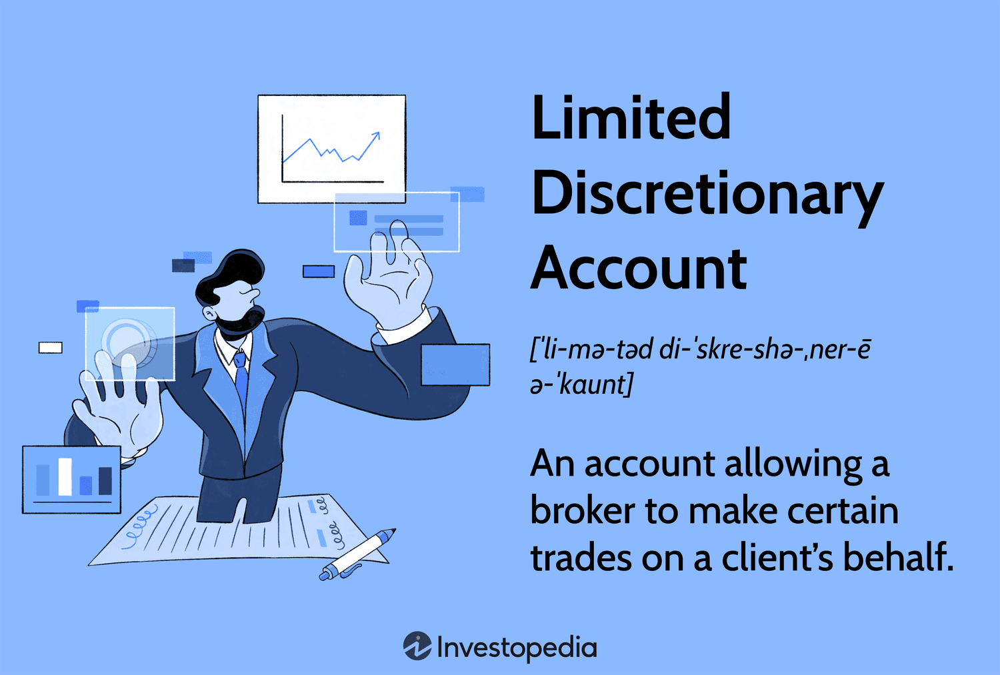

## Table of Contents

## What is a limited discretionary account?

A limited discretionary account is a type of investment account where the account holder gives some control to a financial advisor or broker. The advisor can make certain decisions about buying and selling investments, but they have to follow specific rules set by the account holder. This means the advisor has limited power and must stick to the guidelines given to them.

This type of account is useful for people who want professional help with their investments but still want to keep some control over their money. For example, the account holder might tell the advisor to only invest in certain types of stocks or to never invest in a particular industry. This way, the account holder can feel more secure knowing their investments align with their personal values and financial goals.

## How does a limited discretionary account differ from a non-discretionary account?

A limited discretionary account and a non-discretionary account are different in how much control the account holder gives to their financial advisor. In a limited discretionary account, the account holder lets the advisor make some investment decisions but sets specific rules they must follow. For example, the advisor might be allowed to buy and sell stocks but only within certain industries or price ranges that the account holder has chosen.

On the other hand, a non-discretionary account gives the advisor no control over investment decisions. The account holder must approve every single action the advisor wants to take. This means the advisor can only make suggestions, and the account holder has to give the go-ahead before anything happens. This type of account is good for people who want to keep full control over their investments but still want advice from a professional.

## What are the typical investment options available in a limited discretionary account?

In a limited discretionary account, the investment options can vary based on the rules set by the account holder. Common investments might include stocks, bonds, mutual funds, and exchange-traded funds (ETFs). The account holder might tell the advisor to focus on certain types of stocks, like tech companies or healthcare firms, or to avoid certain industries, like tobacco or oil. This lets the account holder tailor their investments to match their personal values or financial goals.

The advisor can also use these rules to decide when to buy or sell these investments. For example, the account holder might set a rule that the advisor can only buy stocks when they are priced below a certain amount or sell them when they reach a specific profit level. This helps manage risk and can help the account holder feel more in control of their investments, even though the advisor is making some of the decisions.

## Who can benefit from opening a limited discretionary account?

People who want some help with their investments but still want to keep some control can benefit from a limited discretionary account. This type of account is good for someone who might not have the time or knowledge to manage their investments every day but still wants to set some rules. For example, a busy parent might use this account to tell the advisor to only invest in safe, long-term options like bonds or blue-chip stocks.

Also, people who have specific values or goals for their money might find this account helpful. If someone wants to avoid investing in certain industries, like fossil fuels or tobacco, they can set rules for the advisor to follow. This way, they can feel good about where their money is going while still getting professional help to grow their investments.

## What are the risks associated with a limited discretionary account?

One risk with a limited discretionary account is that even though the account holder sets rules, they might not understand all the details of how the advisor makes decisions. This could lead to surprises if the advisor's choices don't match what the account holder expected. For example, if the rule is to invest in tech stocks, the account holder might not know which specific companies the advisor picks, and those choices could go up or down in value.

Another risk is that the account holder might set rules that are too strict or not clear enough. If the rules are too tight, the advisor might not be able to take advantage of good investment opportunities. If the rules are not clear, the advisor might make choices that the account holder doesn't like. It's important for the account holder to talk a lot with their advisor to make sure the rules are right and that they understand how the advisor will use them.

## How is the performance of a limited discretionary account monitored and evaluated?

The performance of a limited discretionary account is monitored and evaluated by looking at how well the investments are doing over time. The account holder and their advisor will usually check things like the total value of the account, how much money it has made or lost, and how the investments are doing compared to the market or other similar investments. They might use tools like performance reports and charts to see these details clearly. The account holder should talk with their advisor regularly to go over these reports and make sure the investments are following the rules they set.

Evaluating the performance also involves seeing if the account is meeting the account holder's goals. For example, if the goal was to grow the account slowly and safely, the account holder and advisor would look at whether the investments have been stable and if they are growing as expected. If the account isn't doing well, they might need to change the rules or the investments to try to do better. Regular check-ins and clear communication between the account holder and the advisor are important to make sure the account stays on track and meets the account holder's needs.

## What are the legal and regulatory considerations for managing a limited discretionary account?

When managing a limited discretionary account, there are important legal and regulatory rules that both the account holder and the advisor need to follow. In the United States, for example, the Financial Industry Regulatory Authority (FINRA) and the Securities and Exchange Commission (SEC) set rules about how advisors can handle these accounts. One key rule is that the advisor must always act in the best interest of the account holder, which is known as the fiduciary duty. This means the advisor needs to make investment choices that help the account holder, not themselves. The advisor also has to keep good records of all the decisions they make and be ready to explain them if asked.

Another important thing is that the account holder needs to clearly write down the rules they want the advisor to follow. This is called a Limited Power of Attorney, and it has to be signed by the account holder. The rules need to be clear so that the advisor knows exactly what they can and cannot do. If the advisor doesn't follow these rules, they could get in trouble with the regulators. The account holder should also check that their advisor is registered and licensed to manage these types of accounts, and they should feel free to ask questions or get help if they need it.

## Can you explain the role of a financial advisor in managing a limited discretionary account?

In a limited discretionary account, the financial advisor's job is to make some investment choices for the account holder but always follow the rules set by them. The advisor can buy and sell investments like stocks, bonds, and funds, but they have to stick to the guidelines the account holder gives. For example, if the account holder says only to invest in tech companies, the advisor has to do that. This means the advisor needs to know a lot about the market and be good at [picking](/wiki/asset-class-picking) the right investments within the rules.

The advisor also has to keep the account holder updated on how the investments are doing. They need to send reports and talk with the account holder regularly to make sure everything is going well. If something changes or if the investments aren't doing what they should, the advisor has to let the account holder know and maybe change the plan. It's really important that the advisor always acts in the best interest of the account holder and follows all the rules and laws about managing these accounts.

## How do fees and costs impact the returns of a limited discretionary account?

Fees and costs can lower the returns of a limited discretionary account. When you pay money for the advisor's services or for buying and selling investments, that money comes out of your account. So, if your investments make money, the fees take away some of that profit. For example, if your account grows by 10% in a year but you pay 1% in fees, your real return is only 9%. This might not seem like a lot, but over many years, it can make a big difference in how much money you end up with.

It's important to understand all the fees you might have to pay. There could be fees for the advisor's time, for managing the account, and for each time they buy or sell something. Sometimes, there are also fees for the investments themselves, like expense ratios for mutual funds or ETFs. Knowing about these fees and trying to keep them low can help you keep more of your investment returns. Talking with your advisor about the costs and seeing if there are ways to save on fees can make your limited discretionary account work better for you.

## What strategies can be employed to optimize the performance of a limited discretionary account?

To make a limited discretionary account work better, it's good to set clear rules that match your goals. If you want your money to grow slowly and safely, tell your advisor to pick safe investments like bonds or big, steady companies. If you want to grow your money faster, you might let them pick riskier investments, but still set limits on how much they can risk. Talking with your advisor a lot helps too. You can check how your investments are doing and change the rules if you need to. This way, you can keep your money working in the best way for you.

Another way to help your account do better is to keep an eye on the fees you're paying. Fees can take away some of your profits, so try to keep them as low as you can. Ask your advisor about different ways to save on costs, like picking investments with low fees or seeing if they can charge you less for their work. Also, think about how often you want your advisor to buy and sell things. Doing this too much can cost more money, so setting rules about when to make moves can help keep costs down and make your account grow more.

## How does tax planning integrate with the management of a limited discretionary account?

Tax planning is a big part of managing a limited discretionary account because it can help you keep more of your money. When your advisor picks investments, they should think about how taxes will affect your returns. For example, if you have to pay a lot in taxes on the money you make from an investment, it might not be as good of a choice as something that has lower taxes. Your advisor can use strategies like picking tax-friendly investments or selling things at the right time to lower your tax bill. This way, you get to keep more of the money your investments make.

It's important to talk with your advisor about your tax situation. They need to know things like how much you make each year and what kind of taxes you have to pay. This helps them make choices that fit with your overall tax plan. For example, if you're in a high tax bracket, your advisor might pick investments that grow without you having to pay taxes until you take the money out. By working together on tax planning, you and your advisor can make sure your limited discretionary account is working as well as it can for you.

## What advanced techniques can be used to hedge risks in a limited discretionary account?

One way to protect your money in a limited discretionary account is by using something called hedging. Hedging is like having a safety net for your investments. For example, your advisor might use options, which are contracts that give you the right to buy or sell an investment at a certain price. If the price of your investment goes down, the option can help you not lose as much money. Another way is to use inverse ETFs, which go up in value when the market goes down. This can help balance out losses in your account if the market takes a dip.

Another technique is called diversification, which means spreading your money across different types of investments. This way, if one investment doesn't do well, the others might still be okay. Your advisor can pick a mix of stocks, bonds, and other things to make sure your account isn't too risky. You can also set rules about how much to put into each type of investment to keep things balanced. By using these strategies, your advisor can help protect your money and make sure your limited discretionary account stays on track.

## References & Further Reading

[1]: ["Advances in Financial Machine Learning"](https://www.amazon.com/Advances-Financial-Machine-Learning-Marcos/dp/1119482089) by Marcos Lopez de Prado

[2]: ["Evidence-Based Technical Analysis: Applying the Scientific Method and Statistical Inference to Trading Signals"](https://www.amazon.com/Evidence-Based-Technical-Analysis-Scientific-Statistical/dp/0470008741) by David Aronson

[3]: ["Machine Learning for Algorithmic Trading"](https://github.com/stefan-jansen/machine-learning-for-trading) by Stefan Jansen

[4]: ["Quantitative Trading: How to Build Your Own Algorithmic Trading Business"](https://www.amazon.com/Quantitative-Trading-Build-Algorithmic-Business/dp/1119800064) by Ernest P. Chan

[5]: Bergstra, J., Bardenet, R., Bengio, Y., & Kégl, B. (2011). ["Algorithms for Hyper-Parameter Optimization."](https://proceedings.neurips.cc/paper/2011/file/86e8f7ab32cfd12577bc2619bc635690-Paper.pdf) Advances in Neural Information Processing Systems 24.