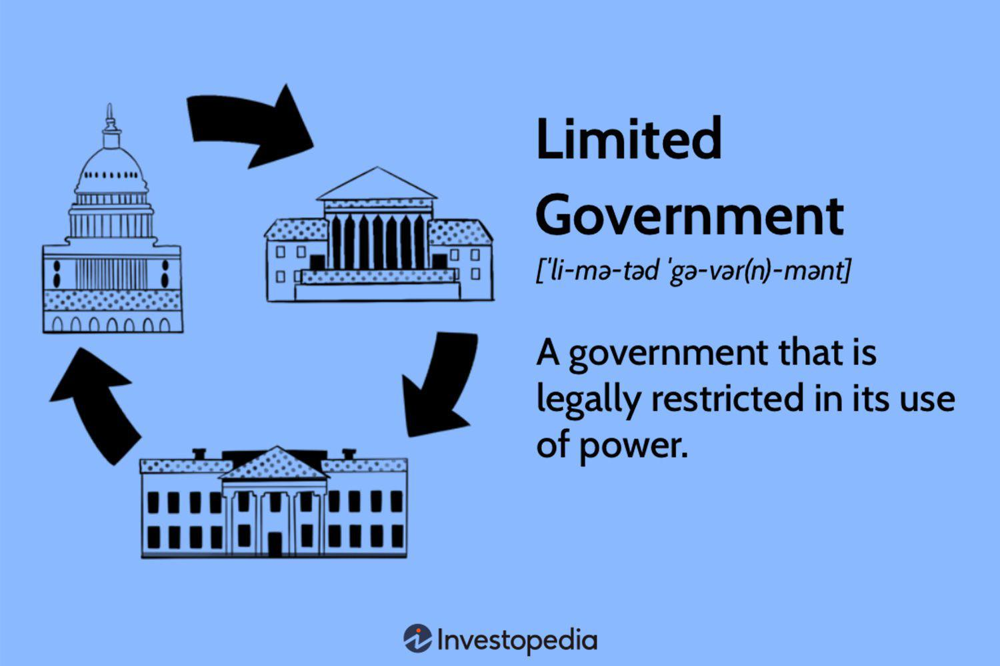

The article investigates the intersection of government structure, political theory, and algorithmic trading strategies, focusing on how principles of limited government can influence economic environments conducive to innovation. Limited government, characterized by its foundational principle of constraining governmental authority to preserve individual freedoms, plays a crucial role in shaping various sectors, including the rapidly evolving field of algorithmic trading. This concept is deeply rooted in historical frameworks and philosophical contributions from key periods such as the Enlightenment, which have emphasized the importance of minimizing state intervention. Through this lens, the piece analyzes how limited government frameworks can be linked to practical applications within financial markets.

Algorithmic trading, a method of executing orders using automated, pre-programmed trading instructions, is an area where limited government principles significantly impact economic activities. The evolution of limited government contributes to creating environments where innovation thrives, thus providing fertile ground for the development and proliferation of advanced trading technologies. As financial markets increasingly rely on algorithmic processes, the principles underpinning limited government ensure these markets operate with a high degree of autonomy, potentially enhancing efficiency and liquidity.

Moreover, this article highlights the historical evolution of limited government, emphasizing its influence through different epochs and its modern implications. As technological advancements, including algorithmic trading, continue to accelerate, appreciating how political and economic theories contribute to these developments becomes increasingly essential. Ultimately, this exploration provides readers with a comprehensive understanding of the ways in which government structures and political theories inform and shape contemporary technological trends and economic landscapes. Through this understanding, stakeholders can better navigate the complexities of modern financial systems, balancing innovation with the principles of limited governmental intervention.

## Table of Contents

## Understanding Limited Government

Limited government is a political philosophy advocating for minimal state intervention in the personal liberties and economic activities of individuals. Its foundational principles emphasize the need to restrain governmental power to prevent abuses and to protect individual freedoms. This concept is deeply rooted in historical documents and philosophical ideas that have shaped modern democratic states.

The origins of limited government can be traced back to the Magna Carta of 1215, a seminal document in English history that established the principle that everyone, including the king, is subject to the law. The Magna Carta laid the groundwork for concepts such as due process and the rule of law, crucial for limiting governmental powers and ensuring individual rights [1].

During the Enlightenment period, philosophers like John Locke and Montesquieu further developed the notion of limited government. Locke's political theories, particularly in "Two Treatises of Government," argued for natural rights and government's role as a protector of these rights, not as an absolute authority [2]. Montesquieu, in "The Spirit of the Laws," introduced the idea of separation of powers, advocating that governmental power should be divided among different branches to avoid tyranny and maintain checks and balances [3].

In practice, limited governments operate through a system of separation of powers, dividing responsibilities among different branches, typically the executive, legislative, and judicial branches. This structure prevents the concentration of power and enables checks and balances, where each branch can review and limit the powers of the others. Such a system is designed to safeguard individual freedoms by ensuring that no single entity or group can monopolize control [4].

These principles are evident in modern democratic constitutions. The United States Constitution, for instance, exemplifies limited government by explicitly outlining the powers of each branch and incorporating mechanisms such as judicial review, presidential veto, and legislative impeachment. The Bill of Rights further enshrines individual liberties that the government cannot infringe upon, reinforcing the protection of personal freedoms against governmental overreach [5].

In essence, limited government structures aim to strike a balance where the state functions effectively to maintain order and protect citizens' rights without excessively encroaching on personal liberties. This philosophy continues to influence constitutions and legal frameworks worldwide, promoting a system where governmental authority is both necessary and appropriately restrained.

### References

1. Carpenter, D.A., & Whittaker, R.L. (2007). *Magna Carta*. Harvard University Press.
2. Locke, J. (1690). *Two Treatises of Government*. Awnsham Churchill.
3. Montesquieu, C.L. (1748). *The Spirit of the Laws*. Cambridge University Press.
4. Vile, M.J.C. (1998). *Constitutionalism and the Separation of Powers*. Liberty Fund Inc.
5. Rakove, J.N. (2009). *The Annotated U.S. Constitution and Declaration of Independence*. Harvard University Press.

## The Role of Limited Government in the Economy

Limited government plays a significant role in shaping economic frameworks by promoting free-market principles. In classical economic theory, limited government is linked to laissez-faire economics, which advocates for minimal governmental intervention in economic activities. This approach is grounded in the belief that markets operate most efficiently when left to their own devices, allowing supply and demand to dictate production and pricing, thereby fostering innovation and competition. The laissez-faire philosophy suggests that economic actors should engage freely without the constraint of excessive governmental regulations, theorizing that such freedom leads to optimal resource allocation and economic prosperity.

The potential of limited government to drive economic growth lies largely in its capacity to reduce regulatory barriers. By minimizing constraints on businesses and entrepreneurs, limited government creates an environment conducive to innovation and enterprise. This can lead to increased efficiency and productivity as companies are incentivized to optimize operations and reduce costs. Moreover, the reduction of bureaucratic impediments can expedite business processes, thereby attracting investment and enhancing economic dynamism.

Economic schools of thought such as the Austrian school align closely with the principles of limited government. Austrian economists, including Ludwig von Mises and Friedrich Hayek, argue for minimal state intervention, emphasizing the ability of individuals to make decisions that lead to economic equilibrium when left unimpeded. They stress the importance of individual choice and market-driven outcomes, arguing that centralized planning cannot adequately account for individual preferences and informational complexities inherent in market systems. This perspective supports the notion that limited government is optimal for economic development.

However, critics of limited government highlight several concerns, particularly regarding the management of market failures. Market failures occur when unregulated markets lead to suboptimal outcomes, such as monopolies, negative externalities, or inadequate public goods provision. Critics argue that without sufficient regulation, markets can become unstable and socially inefficient, necessitating government intervention to curtail negative impacts and protect public interests. They contend that strategic intervention can mitigate adverse effects on the environment, reduce inequality, and ensure consumer protections.

Balancing these viewpoints requires an understanding of the contexts where limited government is beneficial and situations that demand intervention. While limited government can promote economic efficiency and innovation, it is crucial to recognize and address areas where its principles may falter, requiring a nuanced approach to regulatory policy that combines laissez-faire ideals with necessary government action to correct market imbalances.

## Algorithmic Trading: A Case Study in Limited Government Economies

Algorithmic trading, often abbreviated as algo trading, refers to the use of computer algorithms to automate trading decisions in financial markets. These algorithms execute pre-programmed instructions to buy or sell assets, enabling traders to process large volumes of data at speeds far beyond human capability. The significance of [algorithmic trading](/wiki/algorithmic-trading) in modern markets is profound; it enhances market efficiency, increases [liquidity](/wiki/liquidity-risk-premium), and reduces trading costs.

In economies characterized by limited government intervention, algorithmic trading has found an environment conducive to growth and innovation. Limited government philosophies, which advocate for minimal regulatory interference in economic activities, often provide fertile ground for the adoption of cutting-edge technologies like algotrading. By reducing bureaucratic hurdles and fostering free market principles, these governments enable financial markets to innovate and optimize rapidly.

Regions such as the United States and the United Kingdom serve as prime examples where algorithmic trading is prevalent. These countries have traditionally embraced limited government policies that favor deregulation and encourage competition, key factors that promote tech-driven advancements in their financial sectors. The result is a robust ecosystem where high-frequency trading firms and hedge funds flourish, contributing to dynamic and resilient markets.

Algorithmic trading contributes to market efficiencies by facilitating quick and precise asset transactions. For example, algorithms can [arbitrage](/wiki/arbitrage) pricing discrepancies across exchanges, ensuring asset prices reflect available information more accurately. This role enhances market liquidity, as the continuous and rapid execution of trades ensures a steady flow of capital in and out of financial markets. The technology's ability to handle large volumes of trade without substantial price impacts further underscores its importance in modern finance.

However, the rise of algorithmic trading is not without ethical and regulatory challenges. Issues such as market manipulation, flash crashes, and systemic risk present significant concerns. Limited governments face the task of striking a balance between fostering innovation and ensuring market stability. While they may avoid heavy regulation, these governments implement targeted measures, such as monitoring algorithms for abusive practices, to protect market integrity.

In conclusion, algorithmic trading represents a transformative force in financial markets, particularly within limited government economies. These economies, with their conducive policies for innovation and minimal barriers to market entry, have allowed algo trading to thrive, catalyzing increased efficiency and liquidity. As these technologies continue to evolve, the challenge remains to address their potential risks effectively, ensuring that the benefits of limited government extend to fair and stable market conditions.

## Challenges and Criticisms of Limited Government Approaches

Limited government, characterized by minimal intervention in economic and social affairs, often faces significant challenges in practice. While it aims to protect individual freedoms and promote economic growth, too little regulation can lead to adverse economic and social issues. One major criticism is the potential for financial instability. Without adequate regulatory measures, markets can become volatile, as seen in historical instances such as the 2008 financial crisis. Critics argue that insufficient oversight allowed financial institutions to take excessive risks, leading to widespread economic upheaval.

Debates continue over the adequacy of limited government frameworks in addressing modern economic complexities. Proponents of limited government often cite the Austrian school's emphasis on free markets and individual choice. However, opponents highlight the need for government intervention to prevent market failures and ensure equitable resource distribution. Issues such as income inequality, environmental degradation, and health care access challenge the notion that markets can self-regulate effectively.

Several case studies illustrate the adverse outcomes of limited government approaches. For instance, the deregulation of the financial sector in the late 20th century, particularly in the United States, is often cited as a contributing [factor](/wiki/factor-investing) to economic crises. The lack of stringent regulations facilitated risky financial practices, which eventually led to market collapses affecting global economies.

To address these challenges, some economists and policymakers advocate for a balanced approach that blends limited government ideals with necessary interventions. This involves implementing regulatory frameworks that ensure market stability and protect vulnerable populations without stifling innovation. Potential solutions include targeted regulations that address specific market failures, promoting transparency in financial transactions, and fostering public-private partnerships to address social needs efficiently.

By navigating these challenges and criticisms, limited governments can aim to optimize their structure, balancing freedom and innovation with the requisite oversight to mitigate risks and support sustainable development.

## Conclusion

The relationship between government structures, political theories, and algorithmic trading highlights a pivotal area in modern economic discourse. Limited government principles, rooted in historical frameworks like those established by Enlightenment thinkers and pivotal documents such as the Magna Carta, have long aimed to constrain governmental authority and protect individual freedoms. This approach has facilitated environments conducive to innovation, as evidenced in the rise of algorithmic trading within financial markets. The laissez-faire economic philosophies that accompany limited government have occasionally reduced regulatory barriers, thereby fostering rapid technological advancements and increased market efficiencies.

As algorithmic trading continues to evolve, offering enhanced market liquidity and efficiency, global economies face both opportunities and challenges. The technological advancements associated with algo trading underscore the necessity of balancing limited government principles with appropriate regulatory oversight to prevent potential market abuses and systemic risks. This duality emphasizes the significance of ongoing evaluations of public policy to ensure that the economic landscape remains beneficial to both innovation and stability.

Looking forward, the dynamic nature of financial markets and technologies necessitates further research and dialogue. This is essential for optimizing the balance between minimal government intervention and the need to address complex economic challenges. Stakeholders, including policymakers, economists, and technologists, are encouraged to engage in discussions that not only refine theoretical frameworks but also consider practical implementations of these paradigms in an ever-changing global economy. Such interdisciplinary efforts will be critical in harnessing the potential of algorithmic trading while safeguarding against its inherent risks, ensuring an economic milieu where innovation thrives alongside robust, adaptive regulation.

## References

1. Smith, A. (1776). *An Inquiry into the Nature and Causes of the Wealth of Nations*. This foundational text provides essential insights into laissez-faire economics, an ideology that supports limited government intervention in economic affairs and has significant implications for the development of free markets.

2. Hayek, F.A. (1944). *The Road to Serfdom*. University of Chicago Press. Hayek's work argues against government intervention in economies, advocating for the principles of limited government to foster freedom and innovation, including technological advancements like algorithmic trading.

3. Friedman, M. (1962). *Capitalism and Freedom*. University of Chicago Press. This book explores how limited government can facilitate economic growth by minimizing regulatory barriers, offering a theoretical basis for understanding the relationship between market freedom and technological progress.

4. Lewis, M. (2014). *Flash Boys: A Wall Street Revolt*. W. W. Norton & Company. Lewis's book provides a narrative on the dynamics of high-frequency and algorithmic trading, examining the impact of technological innovation in financial markets within a regulatory framework.

5. Lo, A.W., & MacKinlay, A.C. (1999). *A Non-Random Walk Down Wall Street*. Princeton University Press. This text investigates into various quantitative methods in finance, illustrating the significance of algorithmic trading strategies in modern markets.

6. Shiller, R.J. (2000). *Irrational Exuberance*. Princeton University Press. Shiller explores market volatility and the potential risks of limited regulation, offering a critical perspective on limited government frameworks in managing financial stability.

7. Rand, A. (1957). *Atlas Shrugged*. The novel, although fictional, underscores the philosophies of individualism and limited government, reflecting on how these ideas influence economic practices.

8. Kirzner, I.M. (1973). *Competition and Entrepreneurship*. University of Chicago Press. Kirzner's work on the entrepreneurial aspect of economics aligns with the principles of limited government, explaining how reduced intervention can stimulate innovation and market efficiencies.

9. Articles and Papers from the American Economic Review and Journal of Political Economy, which frequently discuss the implications of various government structures on economic policies and technological advancements, offering empirical data and theoretical discussions relevant to the topics of limited government and algorithmic trading.

10. Websites such as the Cato Institute and the Mercatus Center, which provide ongoing analysis and commentary on the interplay between government regulation and economic freedom, supporting research into limited government principles and their practical applications in modern contexts.

For further readings, interested readers might consider exploring works on the history of economic thought and the evolution of political theories that have shaped contemporary governance and market structures.

## References & Further Reading

[1]: Carpenter, D.A., & Whittaker, R.L. (2007). *Magna Carta*. Harvard University Press.

[2]: Locke, J. (1690). *Two Treatises of Government*. Awnsham Churchill.

[3]: Montesquieu, C.L. (1748). *The Spirit of the Laws*. Cambridge University Press.

[4]: Vile, M.J.C. (1998). *Constitutionalism and the Separation of Powers*. Liberty Fund Inc.

[5]: Rakove, J.N. (2009). *The Annotated U.S. Constitution and Declaration of Independence*. Harvard University Press.

[6]: Smith, A. (1776). *An Inquiry into the Nature and Causes of the Wealth of Nations*. 

[7]: Hayek, F.A. (1944). *The Road to Serfdom*. University of Chicago Press.

[8]: Friedman, M. (1962). *Capitalism and Freedom*. University of Chicago Press.

[9]: Lewis, M. (2014). *Flash Boys: A Wall Street Revolt*. W. W. Norton & Company.

[10]: Lo, A.W., & MacKinlay, A.C. (1999). *A Non-Random Walk Down Wall Street*. Princeton University Press.

[11]: Shiller, R.J. (2000). *Irrational Exuberance*. Princeton University Press.

[12]: Kirzner, I.M. (1973). *Competition and Entrepreneurship*. University of Chicago Press.