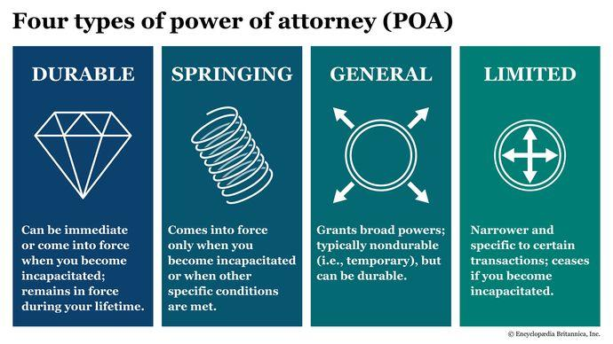

## Table of Contents

## What is a Limited Power of Attorney?

A Limited Power of Attorney is a legal document that lets you give someone else the power to handle specific tasks for you. It's different from a general power of attorney because it only covers certain things you choose. For example, you might use it to let someone pay your bills or sell your car while you're away on a trip.

This type of power of attorney ends once the task is done or at a time you set. It's good because it keeps your control over what the other person can do. You can feel safe knowing they can only do what you've allowed them to do and nothing more.

## How does a Limited Power of Attorney differ from a General Power of Attorney?

A Limited Power of Attorney and a General Power of Attorney are both ways to let someone else make decisions for you, but they are different in what they allow. A Limited Power of Attorney is for specific things only. You can say, "I want this person to sell my car," or "I need them to handle my bills while I'm away." It's like giving someone a key that only opens one door. Once the job is done, the power stops.

On the other hand, a General Power of Attorney gives someone much broader control. It's like handing over a master key to your life. They can make all sorts of decisions for you, like managing your money, handling your property, or even making health care choices. This power lasts until you take it back, you pass away, or something else legally ends it.

So, the main difference is about control and scope. A Limited Power of Attorney keeps things narrow and safe, letting you pick exactly what someone can do. A General Power of Attorney is much wider and can be riskier because it gives someone a lot more power over your life.

## What are the common uses of a Limited Power of Attorney?

A Limited Power of Attorney is often used when you need someone to handle a specific task for you. For example, if you're going on a long trip and can't pay your bills, you might give a Limited Power of Attorney to a trusted friend or family member. This way, they can pay your bills while you're away, but they can't do anything else with your money. Another common use is if you need to sell a property or a car but can't be there to do it yourself. You can give someone the power to sign the papers and handle the sale for you.

It's also used in business situations. If you're a business owner and you need someone to sign contracts or make decisions while you're unavailable, a Limited Power of Attorney can be very helpful. It lets you keep control over what they can do, making sure they only handle the things you've agreed to. This type of power of attorney is great because it's specific and safe, letting you trust someone with just one job without giving them too much power.

## Who can grant a Limited Power of Attorney?

Anyone who is at least 18 years old and mentally capable can grant a Limited Power of Attorney. This means they understand what they're doing and can make their own choices. You don't need to be rich or own a lot of things to do this. It's for anyone who needs someone else to handle a specific job for them.

When you decide to grant a Limited Power of Attorney, you choose who you trust to do the job. This person is called your agent or attorney-in-fact. They have to follow your instructions and can only do what you've told them to do. It's important to pick someone you really trust because they will be acting on your behalf.

## Who can be appointed as an agent in a Limited Power of Attorney?

Anyone who is at least 18 years old and mentally capable can be appointed as an agent in a Limited Power of Attorney. This means they need to be able to understand what they're doing and make their own choices. You can choose a family member, a friend, or even a professional like a lawyer or an accountant to be your agent. The most important thing is that you trust them to do the specific job you're asking them to do.

When you pick someone to be your agent, you're giving them the power to act for you in certain ways. They have to follow your instructions and can only do what you've told them to do. This is why it's so important to choose someone you really trust. They will be handling a part of your life, so you need to be sure they will do it right and not do anything else with the power you give them.

## What are the legal requirements for creating a Limited Power of Attorney?

To create a Limited Power of Attorney, you need to be at least 18 years old and mentally capable. This means you understand what you're doing and can make your own choices. You'll need to write down your wishes in a document that clearly states what specific tasks you want your agent to do. You also need to name the person you trust to be your agent. This person must also be at least 18 and mentally capable.

The document must be signed by you, and in most places, it needs to be notarized. This means you go to a notary public, who watches you sign the document and then signs it too, to make it official. Some states might also need witnesses to watch you sign. After it's signed and notarized, you give a copy to your agent so they know what to do. Keeping the original safe is a good idea, and you might want to tell your bank or other important places about the Limited Power of Attorney.

## How long does a Limited Power of Attorney last?

A Limited Power of Attorney lasts until the specific task you set is done. If you gave someone the power to sell your car, it ends once the car is sold. You can also set a time limit in the document, like saying it will end after six months, no matter if the task is done or not.

It's good to know that you can cancel a Limited Power of Attorney anytime you want, as long as you're still mentally capable. You just need to tell your agent and anyone else who might be involved, like a bank, that you're taking the power back. If you pass away or become unable to make decisions, the Limited Power of Attorney will also end.

## Can a Limited Power of Attorney be revoked, and if so, how?

Yes, you can revoke a Limited Power of Attorney anytime you want, as long as you're still able to make your own choices. To do this, you need to tell your agent that you're taking the power back. It's a good idea to do this in writing, like sending them a letter or an email, so there's proof that you've told them.

You should also let anyone else who might be involved know that you've revoked the Limited Power of Attorney. This could be a bank, a lawyer, or anyone else who knows about it. By telling everyone, you make sure no one keeps letting your agent do things on your behalf. Once you've done these steps, the Limited Power of Attorney is no longer valid.

## What are the potential risks associated with granting a Limited Power of Attorney?

Granting a Limited Power of Attorney means you're giving someone else the power to do something specific for you. Even though it's limited to just one job, there are still some risks. The biggest one is that the person you trust might not do what you want them to do. They could make a mistake or even do something wrong on purpose. If this happens, you might end up with problems like losing money or not getting the task done right.

Another risk is that someone else might not know about the Limited Power of Attorney. If you don't tell the right people, like a bank or a lawyer, they might not let your agent do the job. This can make things take longer or not get done at all. It's also important to remember that if you become unable to make choices or if you pass away, the Limited Power of Attorney will end. So, if the job isn't finished by then, it might not get done.

## How can one ensure the security and proper use of a Limited Power of Attorney?

To make sure a Limited Power of Attorney is used safely and correctly, it's important to pick someone you trust a lot to be your agent. This person should understand exactly what they need to do and agree to do only that. You should also make sure the document is clear and specific about what the agent can do. If you write down the task well, it helps keep things safe. It's also a good idea to talk to your agent about what you want and to keep in touch with them while they're doing the job.

Another way to keep things secure is to tell everyone who needs to know about the Limited Power of Attorney. This might include banks, lawyers, or anyone else involved in the task. If they know about it, they can help make sure your agent does things right. Also, keep the original document safe and think about setting a time limit or saying when the power ends. This way, you can control how long the agent has power. If you ever feel like something's not right, you can take the power back by telling your agent and others that you're revoking the Limited Power of Attorney.

## What are the different types of Limited Power of Attorney forms available?

There are different types of Limited Power of Attorney forms, and each one is made for a certain job. One common type is for financial things, like paying bills or handling a bank account. Another type is for real estate, where you might let someone sell your house or sign papers for you. There's also a type for business, where you can let someone make decisions or sign contracts while you're away. Each form is special because it only lets the agent do the one thing you choose.

These forms can be found in many places, like online or at a lawyer's office. Some are made to be very specific, so you can write exactly what you want the agent to do. Others are more general but still limited to certain areas, like money or property. No matter which type you choose, it's important to make sure the form fits what you need and that it's clear about what the agent can and can't do.

## How should one choose the appropriate type of Limited Power of Attorney form for their needs?

When choosing the right Limited Power of Attorney form, think about what specific job you need done. If you want someone to handle your bills while you're away, you'll need a financial Limited Power of Attorney. If it's about selling your house, a real estate form is what you need. Look at the task and pick a form that matches it. It's also good to see if the form lets you write down exactly what you want the agent to do. This way, you can make sure they only do what you've agreed to.

Once you know what job you need done, find a form that fits. You can look online or talk to a lawyer to get the right one. Make sure the form is clear and easy to understand. This helps everyone know what the agent can and can't do. If you're not sure, it's okay to ask for help from someone who knows about these things, like a lawyer or a notary. They can guide you to the best form for your needs.

## References & Further Reading

[1]: [U.S. Securities and Exchange Commission. (2005).](https://www.sec.gov/rules-regulations/2005/07/securities-offering-reform) "Form ADV: Uniform Application for Investment Adviser Registration."

[2]: "Financial Advisors Association of Canada (Advocis)." (2023). [Types of Powers of Attorney.](https://www.advocis.ca/) 

[3]: "American Bar Association." (2021). [Understanding the Role of a Power of Attorney.](https://www.americanbar.org/groups/law_practice/resources/law-practice-today/2021/the-power-of-empathy/)

[4]: "Modern Portfolio Theory and Investment Analysis" by Edwin J. Elton, Martin J. Gruber, Stephen J. Brown, and William N. Goetzmann.

[5]: ["Algorithmic and High-Frequency Trading"](https://www.amazon.com/Algorithmic-High-Frequency-Trading-Mathematics-Finance/dp/1107091144) by Álvaro Cartea, Sebastian Jaimungal, and José Penalva.