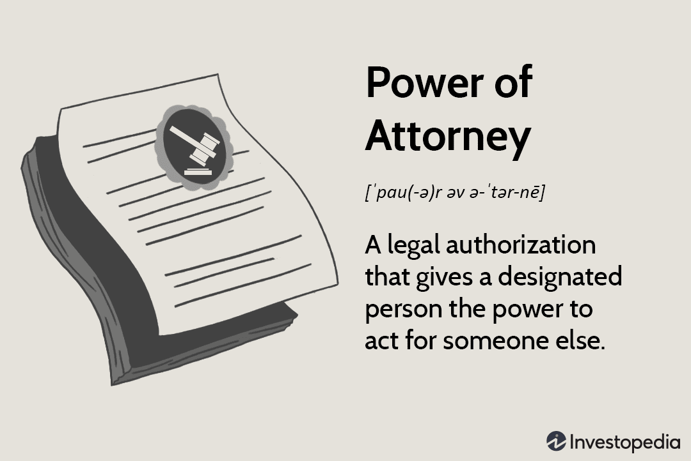

Limited Power of Attorney (LPOA) is a crucial legal document often employed to authorize specific actions by a designated representative, particularly in financial contexts. Unlike a general power of attorney that grants broader powers, an LPOA is tailored to cover distinct tasks or transactions, providing a principal with the flexibility to maintain certain controls while designating authority for specific needs. This selective empowerment can be vital for individuals or corporations seeking to manage parts of their financial or investment portfolios efficiently without relinquishing full control.

This article examines the complexities of LPOA, detailing its various forms and highlighting its significant influence in both investment and algorithmic trading domains. Understanding the different types of power of attorney, especially focusing on the strategic application of LPOA within trading scenarios, is key for individuals looking to make informed decisions about their financial delegation strategies. As markets become increasingly sophisticated and volatile, LPOAs serve as a pivotal tool to enable swift adaptive responses, ensuring principals can leverage expertise while retaining the autonomy to oversee their financial trajectory.

## Table of Contents

## Understanding Limited Power of Attorney

A Limited Power of Attorney (LPOA) is a legal document enabling a designated agent to perform specified functions on behalf of a principal, but only within clearly defined boundaries. This type of power of attorney differs from a general power of attorney by imposing restrictions on the agent's authority, thereby limiting it to particular tasks or decisions specified by the principal.

The primary application of an LPOA is in situations where principals want their agents to manage certain facets of their financial or investment portfolios without relinquishing full control. This selective delegation allows principals to maintain oversight while benefiting from the expertise or operational capacity of the agent.

An LPOA is highly customizable, tailored to enumerate only the specific actions the agent is authorized to undertake. These actions might range from executing trades to managing specific financial accounts, depending on the principal’s needs and confidence in the agent’s abilities. By explicitly detailing the agent’s powers, the principal mitigates risks associated with an overly broad delegation of authority.

In practice, creating a Limited Power of Attorney involves drafting a document that meticulously outlines the permissible actions. This ensures clarity and prevents misunderstandings between the principal and the agent. The specificity of the document is crucial, as it functions as a legal safeguard for the principal, ensuring that the agent's actions align with the principal’s intentions and the agreed-upon scope of authority.

## Types of Power of Attorney

A Power of Attorney (POA) is a legal instrument authorizing an individual, referred to as the agent or attorney-in-fact, to act on behalf of another person, known as the principal. Various types of POAs exist, each providing different levels of authority, flexibility, and applicability based on the principal's needs and circumstances.

### General Power of Attorney
A General Power of Attorney grants the agent broad authority to manage a wide range of financial and legal matters for the principal. This type of POA is typically employed in situations where the principal needs comprehensive management of their affairs, such as during extended travel or hospitalization. The agent can perform tasks like managing bank accounts, buying or selling property, handling tax matters, and conducting financial transactions. However, this authority ceases upon the principal's incapacitation or death.

### Durable Power of Attorney
The Durable Power of Attorney maintains its effectiveness even if the principal becomes incapacitated due to illness or injury. This characteristic distinguishes it from a general POA, which would otherwise terminate under such circumstances. By ensuring continuity, a durable POA is often used in long-term planning, providing peace of mind that the principal's affairs will be managed even if they are unable to make decisions independently. The durability clause must be explicitly stated within the document to be effective.

### Springing Power of Attorney
A Springing Power of Attorney activates only upon the occurrence of a specific event defined by the principal, such as incapacitation. This type of POA offers a layer of protection by ensuring that the agent's authority is contingent upon an express condition being met, providing reassurance that control remains with the principal until the predetermined event occurs. The document must clearly outline the conditions triggering the POA and may require verification, such as a medical certification of incapacitation.

### Limited Power of Attorney
In contrast to the general and durable types, a Limited Power of Attorney restricts the agent’s authority to specific tasks or decisions. This is particularly beneficial in financial management and trading, where the principal may want to delegate responsibilities like executing trades or managing certain assets without relinquishing overall control of their portfolio. A limited POA provides clear boundaries of authority, which can be advantageous for both transparency and legal protection.

In conclusion, each type of Power of Attorney serves distinct purposes and offers varying degrees of authority and protection. Choosing the appropriate POA requires careful consideration of the principal's needs, the scope of authority intended to be granted, and the conditions under which the POA will be active.

## Limited Power of Attorney Forms

Limited Power of Attorney (LPOA) forms are essential tools used to establish a formal agreement between a principal and an agent, commonly seen in financial settings where clients need to delegate specific responsibilities to experts such as financial advisors or portfolio managers. These forms serve as legally binding documents that delineate the scope and limitations of the authority granted to the agent. 

Typically, an LPOA form will specify whether the authorization is limited or full, a distinction that determines the breadth of actions the agent is permitted to undertake. A limited power of attorney restricts the agent to specific tasks or decisions explicitly stated in the form, whereas a full power of attorney might grant broader authority over financial or trading activities.

For the LPOA to be legally valid, it is imperative that both the principal (the person granting authority) and the attorney-in-fact (the agent receiving the authority) sign the document. This mutual agreement is fundamental to ensure that both parties are aware of and consent to the stipulated terms. The signatures signify the acknowledgment and acceptance of the defined responsibilities and limitations.

The process of filling out an LPOA form involves clear and precise detailing of the powers granted to avoid any ambiguities or misuse of authority. The stipulated duties should be consistent with the principal's objectives and aligned with their financial strategies or goals. Preparing these forms with transparency and specificity not only safeguards the interests of both parties but also ensures smooth operational execution in financial management or trading contexts. Legal advice is often sought during this process to guarantee that all terms comply with applicable laws and regulations.

## Applications of LPOA in Algorithmic Trading

Limited Power of Attorney (LPOA) holds significant importance in [algorithmic trading](/wiki/algorithmic-trading) by enabling brokers and investment professionals to execute trades based on predefined algorithms autonomously. This capability is particularly advantageous in trading environments that necessitate rapid decision-making, such as [day trading](/wiki/day-trading-spy) and high-frequency trading ([HFT](/wiki/high-frequency-trading-strategies)).

In algorithmic trading, speed and precision are paramount. Traders utilize complex algorithms to analyze various market indicators and execute trades at optimal times. The LPOA's structure facilitates this process by granting [agents](/wiki/agents) the authority to implement trades without the need for real-time consent from the principal (the client). This autonomy reduces latency, allowing trades to be executed milliseconds after the appropriate conditions are met, thereby capitalizing on fleeting market opportunities.

The use of LPOA in algorithmic scenarios is instrumental in ensuring operational efficiency. For instance, in high-frequency trading, where positions are held for seconds, even microseconds can determine the profitability of a trade. By employing LPOA, brokers can bypass the delays associated with seeking client approval, thus responding swiftly to market fluctuations.

Moreover, LPOA ensures agents operate within specified boundaries as outlined in the power of attorney document. These parameters are crucial for maintaining the principal's desired level of control and risk management. Consequently, this setup empowers agents to manage and optimize trade execution processes efficiently, while aligning with the principal's investment strategy and risk tolerance.

Overall, the integration of LPOA in algorithmic trading facilitates an agile and responsive trading framework. It allows for a seamless execution of strategy and adaptation to market dynamics, which is essential for achieving competitive advantages in today's fast-paced financial markets.

## Advantages and Considerations

A Limited Power of Attorney (LPOA) delivers notable operational benefits by allowing agents to undertake precise financial transactions without requiring persistent direct oversight from the principal. This arrangement facilitates smooth financial operations and minimizes potential delays that could arise from obtaining consent for each individual action, especially in dynamic financial markets or trading environments.

One of the primary advantages of an LPOA is the principal's right to delineate the extent of authority granted to the agent. By defining specific powers, the principal ensures that only the designated tasks can be executed by the agent, thus maintaining a degree of control over financial activities. This tailored delegation can also be adjusted or entirely revoked by the principal at any time should the circumstances change, thereby providing an extra layer of security and flexibility.

Key considerations when establishing an LPOA include comprehensively understanding the limitations and permissions involved. It is imperative for the principal to clearly outline what transactions and decisions the agent can make. Trust is crucial in this relationship. The agent must act in the best interest of the principal, and establishing a trusted relationship is paramount. Regular reviews and updates to the LPOA ensure it remains pertinent to the principal's current financial strategy and circumstances. Monitoring the agent's actions and the financial transactions made under the LPOA can further guarantee compliance with the principal’s intentions and comfort.

Ultimately, when well-drafted and wisely managed, an LPOA becomes an instrumental tool for efficiently managing financial affairs with swift decisiveness while retaining a degree of oversight and control.

## Conclusion

Limited Power of Attorney (LPOA) is an effective instrument for delegating specific financial responsibilities while maintaining a degree of oversight and control. In the fast-paced world of trading, particularly algorithmic trading, LPOA enables traders to swiftly respond to market fluctuations. By authorizing brokers to execute trades based on algorithms without requiring immediate client approval, LPOA ensures that trading strategies can adapt promptly to evolving market conditions, which is crucial for success in dynamic and competitive financial markets.

To harness the full potential of LPOA, it is imperative to implement it correctly. This involves meticulously defining the scope of authority granted to the designated agent and maintaining open lines of communication to ensure that all parties are aware of the terms and operations involved. Understanding the legal implications of LPOA is equally critical. Both the principal and the agent need to have a clear comprehension of the contractual obligations, the revocability of the arrangement, and the specific tasks authorized under the agreement.

This strategic delegation of authority via LPOA not only helps in achieving operational efficiency but also allows for a balanced approach where control is not entirely relinquished. By stipulating the extent of power through detailed documentation and regular reviews, the principal can safeguard their interests while benefiting from the expertise and agility of the agent. Through careful consideration of these factors, LPOA can be a vital component in a successful trading strategy, enhancing both functionality and security in financial management.

## References & Further Reading

[1]: [U.S. Securities and Exchange Commission. (2005).](https://www.sec.gov/rules-regulations/2005/07/securities-offering-reform) "Form ADV: Uniform Application for Investment Adviser Registration."

[2]: "Financial Advisors Association of Canada (Advocis)." (2023). [Types of Powers of Attorney.](https://www.advocis.ca/) 

[3]: "American Bar Association." (2021). [Understanding the Role of a Power of Attorney.](https://www.americanbar.org/groups/law_practice/resources/law-practice-today/2021/the-power-of-empathy/)

[4]: "Modern Portfolio Theory and Investment Analysis" by Edwin J. Elton, Martin J. Gruber, Stephen J. Brown, and William N. Goetzmann.

[5]: ["Algorithmic and High-Frequency Trading"](https://www.amazon.com/Algorithmic-High-Frequency-Trading-Mathematics-Finance/dp/1107091144) by Álvaro Cartea, Sebastian Jaimungal, and José Penalva.