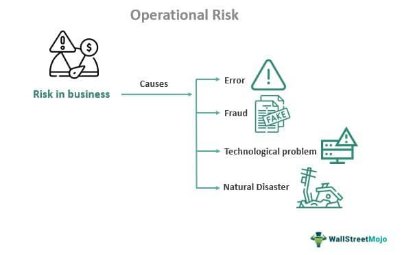

In the fast-paced world of algorithmic trading, the concept of risk management is crucial to protect investments. Algorithmic trading, which involves using computer programs to execute trades at speeds and frequencies beyond human capability, has transformed financial markets. While it offers numerous opportunities for profit, it also exposes traders to significant risks. Limited risk strategies are indispensable for enabling traders to seize opportunities without incurring substantial losses. 

In this context, limited risk strategies focus on capping potential financial losses, often achieved through structured approaches like hedging, diversification, and the use of derivatives. These strategies provide a framework for minimizing exposure to market volatility and unexpected downturns, ensuring that traders can maintain a stable portfolio despite fluctuations.



This article examines how limited risk strategies and risk management are interrelated within financial concepts in algo trading. It highlights the core principles of algorithmic trading, emphasizing the importance of risk management as a vital component of any successful trading strategy. Furthermore, it explores various methods to manage risks effectively, ensuring traders are prepared for the dynamic and often unpredictable nature of financial markets. For any algorithmic trader aiming for sustained success, comprehending market dynamics and preparing for its uncertainties is essential. By integrating robust risk management practices, traders not only protect their investments but also position themselves to maximize potential returns in an evolving trading environment.

## Table of Contents

## Understanding Limited Risk in Financial Concepts

Limited risk in financial concepts refers to investment strategies that cap potential losses usually to the initial outlay, protecting investors from substantial financial setbacks. This form of risk mitigation can often be compared to purchasing insurance for an investment portfolio. It involves certain tactics and instruments such as hedging, diversification, and the usage of options and futures.

Hedging is a strategy designed to offset potential losses in investments by taking an opposite position in a related asset. For example, if an investor holds stocks, they might use put options to hedge those stocks against possible declines. A put option gives the holder the right, but not the obligation, to sell an asset at a specified price before a certain date, effectively setting a floor on the minimum value the asset could hold. This ensures that losses are restricted to predetermined levels.

Diversification is another cornerstone of limited risk strategies, spreading investments across different asset classes to reduce overall exposure to any single economic or market event. By investing across a mix of asset classes, industries, or geographical regions, investors can protect themselves against significant downturns in any individual position. For instance, an investor might hold a portfolio that includes stocks, bonds, and real estate. The performance of these assets is not perfectly correlated; when one underperforms, another may outperform, stabilizing the overall portfolio yield.

Options and futures further contribute to controlled risk exposure. Options provide the flexibility to lock in prices for buying (call options) or selling (put options), which can be critical during volatile market periods. Futures contracts, agreements to buy or sell an asset at a future date at a set price, are used to hedge against price changes, further maintaining investment security. 

In summary, limited risk strategies are integral to minimizing exposure in volatile or adverse market conditions. Employing these strategies allows investors to cap potential losses, paralleling the protection afforded by insurance policies. By strategically utilizing hedging, diversification, and financial derivatives like options and futures, investors effectively shield their portfolios from sudden economic downturns.

## The Role of Risk Management in Algo Trading

In [algorithmic trading](/wiki/algorithmic-trading), risk management is integral to developing a robust and successful trading strategy. Unlike traditional trading, where manual interventions can provide risk mitigation to some extent, algorithmic trading relies on pre-programmed instructions to execute trades at speeds and frequencies unobtainable by a human trader.

Effective risk management in algorithmic trading involves several key components: setting precise stop-loss and take-profit levels, diversification across assets and strategies, and continuous monitoring of both market conditions and algorithm performance. 

*Setting Stop-Loss and Take-Profit Levels*: These are predefined price points where trades are automatically executed to minimize losses or lock in profits, respectively. By using stop-loss orders, traders can limit potential losses and avoid emotional decision-making, while take-profit orders ensure profits are secured when prices reach a desirable level.

*Diversification and Monitoring*: Diversification is a vital strategy that spreads investments across different asset classes, industries, or geographies to reduce exposure to any single asset's volatility. Constantly monitoring the market conditions allows for dynamic adjustments to the trading strategy, ensuring it aligns with the prevailing market environment and protects the portfolio against unforeseen events.

*Risk Categorization*: Understanding and categorizing risks that might affect trading strategies is paramount. These include:

- **Market Risk**: The possibility of losses due to unfavorable movements in market prices.
- **Technical Risk**: Failures or malfunctions in software and hardware systems.
- **Operational Risk**: Issues arising from failed internal processes, personnel, or systems.
- **Behavioral Risk**: Psychological factors affecting decision-making processes.

By integrating robust risk management protocols, algorithmic traders mitigate the impact of these risks. Such protocols may include the use of advanced algorithms that deploy inbuilt safeguards against technical failures or unexpected market fluctuations. For instance, employing redundancy and fail-safes in algorithmic structures can protect against operational disruptions.

Moreover, the ability to adapt these strategies in real time based on continuous feedback from the market is crucial. For example, implementing [machine learning](/wiki/machine-learning) techniques can help in assessing real-time risk levels and adjusting trading strategies dynamically.

In summary, by incorporating comprehensive risk management strategies, algorithmic traders can insulate their trading activities from adverse conditions, ensuring algorithmic trading systems remain robust against [volatility](/wiki/volatility-trading-strategies) and operational interruptions. This not only protects investments but also positions traders optimally to capitalize on market opportunities as they arise.

## Techniques for Limited Risk and Risk Management in Algo Trading

Stop-loss and take-profit orders are foundational tools in algorithmic trading for risk management. These mechanisms allow traders to set predefined [exit](/wiki/exit-strategy) points, limiting losses and securing profits in a disciplined manner, devoid of emotional bias. A stop-loss order automatically sells a security when its price falls to a certain level, while a take-profit order locks in profits once a set price target is achieved. 

Moreover, the strategic use of options can significantly aid in limiting risk, especially put contracts. Put options grant the holder the right, but not the obligation, to sell an asset at a specified price within a certain timeframe. This can provide valuable protection against substantial losses during bearish market conditions. By paying a premium, traders secure the right to sell at the strike price, thus capping potential losses to the premium paid, while allowing for potential gains if the underlying asset's price increases.

Portfolio diversification and dynamic position sizing are essential strategies for mitigating the impact of individual asset volatility. Diversification involves allocating investments across various asset classes or sectors, reducing the risk posed by any single investment. In contrast, dynamic position sizing adjusts the number of units held in a position based on market conditions and risk assessment, often guided by metrics like the volatility or beta of the asset.

Trailing stops, a more advanced form of stop-loss orders, automatically adjust to favorable market movements. As the asset's price increases, the trailing stop price rises proportionately, but if the asset's price decreases, the stop-loss does not adjust. This approach ensures that a portion of profits is protected by automatically closing the position at the trailing stop price if the market reverses direction.

Algorithmic frameworks can benefit from these strategies through the implementation of adaptive scripts in Python. For instance, a simple trailing stop mechanism could be coded as follows:

```python
def calculate_trailing_stop(current_price, trailing_percentage):
    return current_price * (1 - trailing_percentage/100)

def update_trailing_stop(current_price, trailing_stop, trailing_percentage):
    new_trailing_stop = calculate_trailing_stop(current_price, trailing_percentage)
    return max(trailing_stop, new_trailing_stop)

# Example usage:
current_price = 100
trailing_percentage = 5
trailing_stop = calculate_trailing_stop(current_price, trailing_percentage)

# Simulate price changes
price_changes = [102, 104, 103, 106, 105]
for price in price_changes:
    trailing_stop = update_trailing_stop(price, trailing_stop, trailing_percentage)
    print("Updated Trailing Stop:", trailing_stop)
```

Incorporating these risk management strategies ensures an adaptive response to market conditions, fortifying the trading strategy against unforeseen market movements and aligning portfolio management with broader risk management objectives.

## Case Studies: Limited Risk Strategies in Action

## Case Studies: Limited Risk Strategies in Action

Exploring real-world examples of limited risk strategies in algorithmic trading offers valuable insights into how traders protect their portfolios while capitalizing on market movements. These examples demonstrate the application of hedging techniques and disciplined risk management practices to achieve sustained trading success.

### Hedging through Options: A Case Study

A notable case involves a trading firm that implemented options as a hedging mechanism during a period of heightened market volatility. By purchasing put options, the firm limited its potential losses in a bearish market while maintaining the opportunity for gains. This strategy safeguarded the portfolio by providing insurance against steep declines in asset prices. The firm's approach exemplified how options could effectively mitigate downside risk, ensuring that even in adverse conditions, the potential losses were capped at a pre-defined level.

### Dynamic Portfolio Rebalancing: A Strategic Approach

Another example involves an algorithmic trader who employed a dynamic portfolio rebalancing strategy to maintain a balanced risk profile. Regularly assessing and adjusting the proportions of assets within the portfolio, the trader mitigated concentration risk and ensured diversification across various sectors and asset classes. This disciplined approach not only managed risks but also maximized returns by rebalancing in response to market dynamics. The process involved constant monitoring and realignment of the portfolio, demonstrating how systematic adjustments sustain positive trading outcomes over the long term.

### Quantitative Risk Assessment with Machine Learning

In an innovative approach, a trading firm utilized machine learning algorithms to enhance risk assessment and management. By analyzing historical data and current market conditions, the firm developed predictive models that could forecast potential risks and inform trading decisions. This quantitative strategy allowed for real-time adjustments to trading algorithms based on predicted volatility levels. Machine learning provided a robust tool for assessing risks more accurately, allowing the firm to implement appropriate hedges and align trading strategies with the evolving market landscape.

### Success through Comprehensive Risk Management

Success stories in algorithmic trading highlight how a comprehensive risk management framework is pivotal for long-term profitability. One trading firm emphasized the necessity of combining various risk mitigation strategies, including stop-loss orders, diversification, and regularly updated risk models. By leveraging these techniques, the firm consistently achieved favorable outcomes, even in volatile markets. This disciplined approach to risk management proved essential for sustaining profitability and protecting capital investments.

These case studies underscore the importance of integrating limited risk strategies into algorithmic trading processes. By utilizing hedging techniques, dynamic portfolio rebalancing, and advanced technology such as machine learning, traders can effectively manage risk and secure positive trading results. The success stories provided illustrate that disciplined and adaptive risk management is crucial in navigating complex financial markets and achieving enduring trading success.

## Future of Risk Management in Algorithmic Trading

As algorithmic trading continues to evolve, the adaptation of risk management strategies to new technologies and increasing market complexities becomes imperative. Modern technological advancements are reshaping the landscape, providing traders with innovative tools to enhance their strategies.

Emerging technologies such as machine learning and [artificial intelligence](/wiki/ai-artificial-intelligence) have significantly advanced predictive analytics and real-time risk assessment. Machine learning algorithms allow traders to process and analyze vast datasets to identify patterns and predict potential market movements. These tools facilitate the detection of subtle market signals that might be missed by traditional analytical methods, enabling more informed decision-making. For example, machine learning models can be trained to automatically adjust trading parameters in response to shifting market conditions, thereby optimizing risk management measures.

Furthermore, blockchain technology and cloud-based solutions are playing a crucial role in enhancing the transparency, security, and robustness of automated trading systems. Blockchain provides a decentralized ledger system, which ensures that all transactions are recorded immutably, fostering trust and accountability in trading operations. This transparency can help mitigate the risks of fraud and operational errors. Additionally, cloud technologies offer scalable and flexible solutions that support real-time data processing and storage, simplifying the deployment and management of complex trading algorithms across distributed systems.

Another critical aspect of future risk management involves preparing for 'black swan' events—rare and unpredictable occurrences with drastic consequences. Successfully navigating these events requires a strategic foresight approach, integrating scenario planning and stress testing into risk management frameworks. By simulating the potential impact of extreme market conditions, traders can develop contingency plans and predefined protocols to mitigate risk exposure.

In conclusion, the future of risk management in algorithmic trading is shaped by the integration of cutting-edge technologies and the foresight to anticipate and prepare for market anomalies. Embracing these innovations and strategies positions traders to not only protect their investments but also leverage opportunities presented by a dynamic financial market landscape.

## Conclusion

In algorithmic trading, effectively combining limited risk strategies with robust risk management practices forms the foundation of a resilient trading strategy. The primary aim is to protect investments from potential losses while maximizing potential returns. This balance is achieved by employing a variety of sophisticated techniques, such as stop-loss orders, portfolio diversification, and dynamic position sizing, which limit exposure to market volatility and adverse conditions.

Investment risk management is not merely a recommendation for traders but is essential for achieving sustained success in the dynamic and often unpredictable financial markets. A comprehensive risk management framework serves as a safeguard, ensuring that traders are prepared to respond promptly and effectively to unforeseen events. It allows traders to maintain a strategic focus, reducing the likelihood of emotional decision-making that can lead to increased losses.

Prioritizing risk management enables algorithmic traders to align themselves with long-term profitability and stability in their financial pursuits. As the trading landscape continues to evolve, the ability to anticipate and manage risks becomes crucial for ensuring the longevity and success of trading endeavors. By integrating these practices into their trading algorithms, traders can enhance their resilience, securing a competitive edge in an ever-changing market environment.

## References & Further Reading

[1]: Bergstra, J., Bardenet, R., Bengio, Y., & Kégl, B. (2011). ["Algorithms for Hyper-Parameter Optimization."](https://dl.acm.org/doi/10.5555/2986459.2986743) Advances in Neural Information Processing Systems 24.

[2]: ["Advances in Financial Machine Learning"](https://www.amazon.com/Advances-Financial-Machine-Learning-Marcos/dp/1119482089) by Marcos Lopez de Prado

[3]: ["Evidence-Based Technical Analysis: Applying the Scientific Method and Statistical Inference to Trading Signals"](https://www.amazon.com/Evidence-Based-Technical-Analysis-Scientific-Statistical/dp/0470008741) by David Aronson

[4]: ["Machine Learning for Algorithmic Trading"](https://github.com/stefan-jansen/machine-learning-for-trading) by Stefan Jansen

[5]: ["Quantitative Trading: How to Build Your Own Algorithmic Trading Business"](https://github.com/LucindaYa/quant-resources/blob/master/Quantitative%20Trading%20How%20to%20Build%20Your%20Own%20Algorithmic%20Trading%20Business.pdf) by Ernest P. Chan