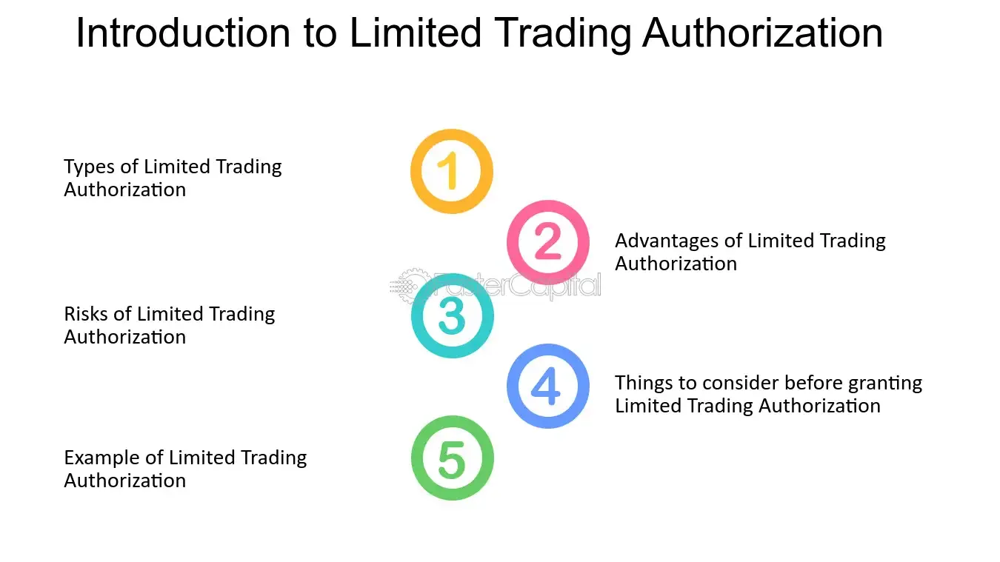

## Table of Contents

## What is Limited Trading Authorization?

Limited Trading Authorization is a type of permission that lets someone else trade in your investment account, but only in certain ways. This means you can choose what kinds of trades they can make, like buying or selling specific types of stocks or bonds, but they can't do everything. It's useful if you want help managing your investments but still want to keep some control over what happens.

For example, you might give your financial advisor limited trading authorization so they can buy and sell stocks for you, but they can't touch your bonds or mutual funds. This way, you can benefit from their expertise without worrying about them making decisions you don't agree with. It's a good middle ground between doing everything yourself and giving someone else full control over your money.

## How does Limited Trading Authorization differ from Full Trading Authorization?

Limited Trading Authorization and Full Trading Authorization are two ways you can let someone else handle your investment account. With Limited Trading Authorization, you give someone permission to make certain trades in your account, but you set limits on what they can do. For example, you might let them buy and sell stocks but not touch your bonds or mutual funds. This way, you still have control over what happens in your account, but you can get help with specific parts of it.

On the other hand, Full Trading Authorization gives someone complete control over your investment account. They can buy and sell anything they want, without any restrictions from you. This can be useful if you trust someone completely to manage your money, like a professional financial advisor. But it also means you have less control over your investments, so it's important to choose wisely who you give this power to.

## Who typically uses Limited Trading Authorization?

People who want some help with their investments but still want to keep control often use Limited Trading Authorization. This might be someone who knows a bit about investing but doesn't have the time to watch the market every day. They might let a financial advisor buy and sell stocks for them, but keep control over their bonds and other investments. It's like having a helper who can do some of the work, but you still get to make the big decisions.

Another group that might use Limited Trading Authorization is people who are just starting to invest and want to learn more. They might let a more experienced friend or family member make some trades for them, but only in certain areas. This way, they can learn from what their helper does, but still feel safe knowing they have limits on what can be done with their money. It's a good way to dip your toes into investing without jumping in all the way.

## What types of trades can be executed under Limited Trading Authorization?

Under Limited Trading Authorization, the types of trades that can be executed are set by the account owner. This means you can pick what your helper can do. For example, you might let them buy and sell stocks, but not touch your bonds or mutual funds. Or, you might let them trade only certain stocks, like tech companies, but not others. It's all about what you feel comfortable with and what you want help with.

This kind of authorization is great for people who want to keep some control over their money. You can let your helper do the things you don't have time for or don't know much about, but still make the big decisions yourself. It's like having a teammate who helps out, but you're still the captain of your investment ship.

## What are the benefits of using Limited Trading Authorization?

Limited Trading Authorization lets you get help with your investments while still keeping control. You can choose what your helper can do, like buying and selling stocks, but they can't touch other parts of your account. This is great if you want some help but don't want to give someone full control over your money. It's like having a teammate who does some of the work, but you're still the boss.

Another benefit is that it's a good way to learn about investing. If you're new to it, you can let a more experienced friend or advisor make some trades for you, but only in certain areas. This way, you can watch what they do and learn from it, without risking your whole account. It's a safe way to dip your toes into investing and get better at it over time.

## Are there any restrictions or limitations with Limited Trading Authorization?

With Limited Trading Authorization, the main restriction is that the person you give permission to can only do what you allow them to do. If you say they can buy and sell stocks but not touch your bonds, they have to follow that rule. This means you need to be clear about what you want them to do, and they can't make any trades outside of what you've agreed on.

Another limitation is that it might take more time and effort to manage. Since you're still in control of what happens, you'll need to keep an eye on things and make sure your helper is doing what you want. It's not as hands-off as giving someone full control, but it's a good middle ground if you want to keep some say in your investments.

## How can someone obtain Limited Trading Authorization?

To get Limited Trading Authorization, you first need to talk to your investment company or broker. Tell them you want to let someone else make some trades in your account, but you want to set limits on what they can do. They will give you forms to fill out where you can say exactly what trades your helper can make. You might want to let them buy and sell stocks but not touch your bonds, for example. Make sure to read the forms carefully and fill them out right so your helper knows what they can and can't do.

Once you've filled out the forms, you need to give them back to your investment company or broker. They will set up the Limited Trading Authorization in your account. After that, your helper can start making the trades you've allowed. It's a good idea to keep an eye on things to make sure they're doing what you want. If you need to change the limits later, you can always talk to your investment company again and update the forms.

## What are the legal and regulatory considerations for Limited Trading Authorization?

When you give someone Limited Trading Authorization, you need to follow the rules set by the investment company and the government. These rules are there to make sure your money is safe and that everyone knows what they can and can't do. You'll need to fill out forms that say exactly what trades your helper can make. This helps prevent any confusion or problems later on. Also, some places might have extra rules about who can be given this kind of permission, so it's good to check with your investment company to make sure everything is okay.

It's also important to know that if something goes wrong, like if your helper makes a trade they're not supposed to, you might be able to get help from the law. But, you need to keep good records of what you agreed on and what happened. If you ever need to change the limits on what your helper can do, you'll need to fill out new forms and get them approved by your investment company. This way, you can make sure your investments are always managed the way you want.

## Can Limited Trading Authorization be revoked or modified, and if so, how?

Yes, you can change or take away Limited Trading Authorization if you need to. If you want to change what your helper can do, you just need to talk to your investment company. They will give you new forms to fill out where you can say what the new rules are. For example, if you used to let your helper buy and sell stocks but now you want them to be able to trade bonds too, you would write that on the new form. Once you fill out the form and give it back to your investment company, they will update your account with the new rules.

If you want to take away the Limited Trading Authorization completely, you can do that too. You just need to tell your investment company that you want to stop letting your helper make trades. They will give you a form to fill out that says you're taking away the permission. After you fill out the form and give it back, your helper won't be able to make any more trades in your account. It's a good idea to keep an eye on things to make sure everything is done the way you want.

## What are the risks associated with Limited Trading Authorization?

When you give someone Limited Trading Authorization, there are some risks you need to think about. One risk is that your helper might not follow the rules you set. Even though you've said what they can and can't do, they might make a trade they're not supposed to. This can cause problems with your investments and might even cost you money. Another risk is that if something goes wrong, like if your helper loses money, you might be responsible for it. This is because it's your account, even if someone else is making the trades.

Another risk is that you might not keep a close enough eye on what's happening in your account. Even though you've set limits, you still need to check in and make sure everything is going the way you want. If you don't, you might miss something important, like a trade that goes against your rules. Also, if you want to change the limits or take away the authorization, you need to do it the right way by filling out forms and talking to your investment company. If you don't, you might run into legal problems or other issues.

## How does Limited Trading Authorization impact portfolio management?

Limited Trading Authorization can help with managing your investments by letting someone else do some of the work, but you still get to decide what they can do. For example, if you're busy and don't have time to watch the stock market every day, you can let a financial advisor buy and sell stocks for you. But you can tell them they're not allowed to touch your bonds or mutual funds. This way, you can get help with part of your portfolio while keeping control over the rest.

However, using Limited Trading Authorization means you need to be clear about what you want your helper to do. If they don't follow your rules, it can mess up your investments. You also need to keep an eye on things to make sure everything is going the way you want. If you want to change what your helper can do, you'll need to fill out new forms with your investment company. It's a good way to manage your portfolio if you want some help but still want to be in charge.

## What advanced strategies can be employed with Limited Trading Authorization?

With Limited Trading Authorization, you can use some smart ways to manage your investments better. One way is to let your helper focus on trading certain types of stocks, like tech companies, while you handle other parts of your portfolio. This can help you take advantage of their knowledge in that area without giving them control over your whole account. Another strategy is to use Limited Trading Authorization for short-term trading, like buying and selling stocks quickly to make a profit, while you focus on long-term investments like bonds or mutual funds. This way, you can benefit from quick trades without risking your long-term savings.

Another advanced strategy is to use Limited Trading Authorization to test new investment ideas. You can let your helper try out new stocks or trading methods with a small part of your portfolio, while you keep the rest safe. If the new ideas work well, you can then decide to use them more in your overall investment plan. This way, you can learn and grow your investments without putting everything at risk. It's like having a helper who can experiment for you, while you still make the big decisions.

## References & Further Reading

[1]: Bergstra, J., Bardenet, R., Bengio, Y., & Kégl, B. (2011). ["Algorithms for Hyper-Parameter Optimization."](https://dl.acm.org/doi/10.5555/2986459.2986743) Advances in Neural Information Processing Systems 24.

[2]: ["Advances in Financial Machine Learning"](https://www.amazon.com/Advances-Financial-Machine-Learning-Marcos/dp/1119482089) by Marcos Lopez de Prado

[3]: ["Evidence-Based Technical Analysis: Applying the Scientific Method and Statistical Inference to Trading Signals"](https://www.amazon.com/Evidence-Based-Technical-Analysis-Scientific-Statistical/dp/0470008741) by David Aronson

[4]: ["Machine Learning for Algorithmic Trading"](https://github.com/stefan-jansen/machine-learning-for-trading) by Stefan Jansen

[5]: ["Quantitative Trading: How to Build Your Own Algorithmic Trading Business"](https://www.amazon.com/Quantitative-Trading-Build-Algorithmic-Business/dp/1119800064) by Ernest P. Chan