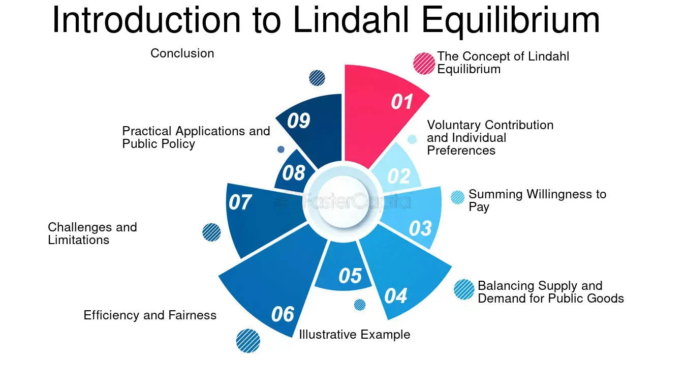

## Table of Contents

## What is the basic concept of Lindahl Equilibrium?

The Lindahl Equilibrium is a concept in economics that deals with how public goods can be provided and paid for in a way that makes everyone happy. Public goods are things like street lights or national defense, which everyone can use but no one can be easily stopped from using. In a Lindahl Equilibrium, each person pays a tax based on how much they personally benefit from the public good. This means that if you really like having clean parks, you might pay more for them than someone who doesn't care as much.

The idea is to find a balance where the total amount of the public good provided is just right, and everyone is willing to pay their share based on their personal benefit. This way, no one feels like they are paying too much or getting too little. It's like a personalized tax system for public goods. While it sounds good in theory, it's hard to put into practice because it's tough to figure out exactly how much each person values the public good.

## How does Lindahl Equilibrium differ from other economic equilibria?

Lindahl Equilibrium is different from other economic equilibria because it focuses on public goods, which are things everyone can use and no one can be easily stopped from using. In a Lindahl Equilibrium, each person pays a tax based on how much they personally benefit from the public good. This is different from other equilibria, like the general equilibrium in a market, where prices are set by supply and demand and everyone pays the same price for a good. In a Lindahl Equilibrium, the tax or price each person pays is personalized, which means it's based on their own value of the public good.

Another way Lindahl Equilibrium differs is that it tries to make sure everyone is happy with the amount of public good provided and the amount they have to pay for it. In other equilibria, like Nash Equilibrium in game theory, the focus is on individual strategies and outcomes where no one can do better by changing their strategy alone. But in Lindahl Equilibrium, the goal is to find a balance where the total amount of the public good is just right, and everyone agrees to pay their share based on their personal benefit. This makes it unique because it aims for a collective agreement on both the quantity of the public good and the way it's funded.

## What are the key assumptions required for Lindahl Equilibrium to exist?

For a Lindahl Equilibrium to exist, we need to assume that people can honestly tell us how much they value the public good. This means they can say how much they are willing to pay for things like clean air or public parks. It's also important that people don't lie about their value just to pay less. If everyone is honest, we can figure out the right amount of public good to provide and how much each person should pay.

Another key assumption is that there's a way to make everyone agree on the amount of the public good and their personal taxes. This means we need a system where everyone can come together and decide on these things. It's also assumed that the cost of providing the public good is less than the total value everyone places on it. If these assumptions hold true, we can reach a Lindahl Equilibrium where everyone is happy with what they get and what they pay.

## Can you explain the role of personalized prices in Lindahl Equilibrium?

Personalized prices are super important in Lindahl Equilibrium. They mean that each person pays a different amount for the public good based on how much they value it. If you really love having clean parks, you might be willing to pay more for them than someone who doesn't care as much. This way, the tax or price is tailored to each person's benefit, making sure everyone feels like they're paying a fair amount.

The idea behind personalized prices is to make everyone happy with both the amount of the public good provided and the amount they have to pay. If everyone pays according to their own value, then no one feels like they're paying too much or getting too little. It's like a custom-made tax system for public goods, where the goal is to find a balance that works for everyone.

## How is the optimal level of public goods determined in Lindahl Equilibrium?

In Lindahl Equilibrium, the optimal level of public goods is determined by finding a balance where everyone is happy with both the amount of the public good and the amount they have to pay for it. Each person tells how much they value the public good, and based on that, they pay a personalized tax. If you really like having clean air, you might be willing to pay more for it than someone who doesn't care as much. By adding up everyone's willingness to pay, we can figure out the total value placed on the public good.

Once we know the total value, we can decide on the right amount of the public good to provide. The goal is to make sure the cost of providing the public good is less than the total value everyone places on it. If we can do this, then we've found the optimal level where everyone agrees to pay their share based on their personal benefit, and no one feels like they're getting a bad deal. It's all about finding that sweet spot where the public good is just right for everyone.

## What are the conditions necessary for achieving Lindahl Equilibrium?

To achieve Lindahl Equilibrium, people need to be honest about how much they value the public good. They should be able to say how much they are willing to pay for things like clean air or public parks without lying to pay less. It's also important that there's a way for everyone to come together and agree on the amount of the public good and their personal taxes. This means having a system where everyone can discuss and decide on these things together.

Another condition is that the cost of providing the public good should be less than the total value everyone places on it. If the cost is too high, it won't work out. When all these conditions are met, we can reach a Lindahl Equilibrium. This is where the amount of the public good is just right, and everyone is happy with what they get and what they pay. It's like finding a balance where everyone feels they are getting a fair deal.

## How do individual preferences influence the Lindahl Equilibrium?

Individual preferences play a big role in Lindahl Equilibrium. In this system, each person tells how much they value the public good, like clean air or parks. If you really like having clean air, you might be willing to pay more for it than someone who doesn't care as much. This means the amount each person pays is based on their own personal value of the public good. So, if everyone values the public good differently, the taxes they pay will be different too.

Because of these different preferences, finding the right amount of the public good to provide can be tricky. The goal is to make sure the total amount of the public good matches what everyone is willing to pay for it. If everyone's preferences are taken into account, we can find a balance where the public good is just right for everyone. This way, no one feels like they're paying too much or getting too little, and everyone is happy with the outcome.

## What are the challenges in implementing Lindahl Equilibrium in real-world scenarios?

Implementing Lindahl Equilibrium in real-world scenarios is tough because it's hard to know how much each person values a public good. People might not tell the truth about how much they're willing to pay, just so they can pay less. This is called the free-rider problem, where people try to use the public good without paying their fair share. It's also difficult to set up a system where everyone can come together and agree on the amount of the public good and the taxes they should pay. People might have different opinions and it can be hard to get everyone to agree.

Another challenge is figuring out the cost of providing the public good. If the cost is too high, it might not be possible to reach a Lindahl Equilibrium. Also, public goods like clean air or national defense are hard to measure and divide up. You can't just give more clean air to one person and less to another. So, it's tough to match the amount of the public good to what everyone is willing to pay. These challenges make it really hard to use Lindahl Equilibrium in real life, even though it sounds good in theory.

## Can you describe a simple example illustrating Lindahl Equilibrium?

Imagine a small town where everyone wants a new park. The park is a public good because everyone can use it, and no one can be easily stopped from using it. In this town, there are three people: Alice, Bob, and Carol. Alice really loves parks and is willing to pay $100 for the new one. Bob likes parks but not as much as Alice, so he's willing to pay $50. Carol doesn't care much about parks but is willing to pay $25 because she thinks it might be nice to have one.

To find a Lindahl Equilibrium, the town needs to figure out how much park to build and how much each person should pay. They add up what everyone is willing to pay: $100 from Alice, $50 from Bob, and $25 from Carol, which totals $175. If it costs $175 or less to build the park, they can build it. Alice will pay $100, Bob will pay $50, and Carol will pay $25. Everyone is happy because they're paying based on how much they value the park, and the total amount they pay covers the cost of the park. This is a simple example of how Lindahl Equilibrium works.

## How does the concept of Lindahl Equilibrium relate to the theory of public finance?

The concept of Lindahl Equilibrium is closely tied to the theory of public finance, which is all about how governments pay for things like roads, schools, and parks. In public finance, one big question is how to fairly share the cost of these public goods among people. Lindahl Equilibrium offers an idea where each person pays for public goods based on how much they personally benefit from them. If you really like having clean parks, you might pay more than someone who doesn't care as much. This personalized tax system aims to make sure everyone feels they are paying a fair amount for the public goods they use.

In the theory of public finance, finding the right way to fund public goods is tricky because people might not be honest about how much they value them. They might want to pay less and still use the goods, which is known as the free-rider problem. Lindahl Equilibrium tries to solve this by asking everyone to say how much they're willing to pay and then using that information to set personalized taxes. If everyone is honest and the total amount they're willing to pay covers the cost of the public good, then a Lindahl Equilibrium can be reached. This makes it an interesting but challenging concept in public finance, aiming to balance fairness and efficiency in funding public goods.

## What are the criticisms and limitations of Lindahl Equilibrium from an economic perspective?

One big criticism of Lindahl Equilibrium is that it's really hard to use in real life. It's tough to know how much each person values a public good because people might not tell the truth. They might say they value it less so they can pay less, which is called the free-rider problem. Also, it's hard to get everyone to agree on how much of the public good to provide and how much each person should pay. People have different opinions and it can be tricky to make everyone happy.

Another limitation is that figuring out the cost of providing the public good can be a challenge. If the cost is too high, it might not be possible to reach a Lindahl Equilibrium. Public goods like clean air or national defense are also hard to measure and divide up. You can't just give more clean air to one person and less to another. So, it's tough to match the amount of the public good to what everyone is willing to pay. These problems make it hard to use Lindahl Equilibrium in real life, even though it sounds good in theory.

## How has Lindahl Equilibrium been applied or tested in economic research and models?

Lindahl Equilibrium has been used a lot in economic research to help understand how people might pay for public goods. Researchers use models to see how different people's values for things like clean air or parks can affect the amount of the public good provided and how much each person pays. These models help economists test ideas about fairness and efficiency in funding public goods. They can change things like how honest people are about their values or how much it costs to provide the public good to see what happens in different situations.

In some studies, economists have used games to see how well Lindahl Equilibrium works in real life. They ask people to play games where they have to say how much they value a public good and then see if they can reach an agreement on how much to provide and how much to pay. These games help show the problems with Lindahl Equilibrium, like the free-rider problem where people try to pay less than they should. Even though it's hard to use Lindahl Equilibrium in the real world, these studies help economists learn more about how people make decisions about public goods and what might make a better system for funding them.

## What is the Understanding of Lindahl Equilibrium in Public Goods?

Lindahl Equilibrium, named after the Swedish economist Erik Lindahl, offers a theoretical framework for the efficient provision and allocation of public goods. Public goods, characterized by their non-rivalrous and non-excludable nature, pose unique challenges in economic theory. These goods, such as education, infrastructure, and national defense, benefit multiple individuals simultaneously without depletion upon individual consumption.

### Theoretical Framework of Lindahl Equilibrium

Lindahl Equilibrium suggests a mechanism where each individual pays for a public good according to their marginal benefit, allowing for efficient and socially optimal provision. The core idea involves determining a pricing scheme, known as Lindahl prices, where each consumer pays their personalized price corresponding to their valuation of the public good. This personalized price represents the Lindahl tax, a pivotal component in achieving the theoretical efficient outcome in public good allocation.

Mathematically, Lindahl Equilibrium can be represented by setting the sum of individual payments equal to the cost of the public good, thereby ensuring that the sum of individual marginal rates of substitution (MRS) for the public good matches the marginal cost of providing it. The equilibrium condition can be expressed as:

$$
\sum_{i=1}^{n} MRS_i = MC
$$

where $MRS_i$ is the marginal rate of substitution for individual $i$ and $MC$ is the marginal cost.

### Role of Lindahl Taxes

Lindahl taxes ensure that each individual contributes to the provision of public goods proportionately to their benefit, thus resolving the free-rider problem common in public goods. By aligning individual contributions with their respective valuations, Lindahl taxes create an incentive for truthful revelation of preferences, facilitating optimal public goods provision.

### Examples of Public Goods

Public goods such as education, infrastructure, and national defense exemplify the application of Lindahl Equilibrium. Each of these goods offers widespread access and benefits without depreciating in utility with extensive usage. Education strengthens intellectual capital, infrastructure supports economic activity, and national defense ensures security, all benefiting society at large.

### Challenges in Implementing Lindahl Equilibrium

Despite its theoretical appeal, implementing Lindahl Equilibrium in real-world scenarios encounters significant challenges. One of the foremost issues is the difficulty in accurately measuring individual valuations and preferences for public goods. The mechanism relies on individuals truthfully revealing their preferences, which is often hindered by strategic misrepresentation and information asymmetry.

Moreover, the transaction and administrative costs of estimating and enforcing personalized taxes can outweigh the benefits of this theoretical model. Governments often face practical constraints, such as political considerations and the complexity of public finance systems, which impede the direct application of Lindahl Equilibrium.

In summary, while Lindahl Equilibrium provides an idealized solution for public goods allocation, technical, informational, and practical barriers present substantial hurdles to its application. These challenges necessitate continuous exploration of innovative strategies to harness the potential of economic theories in addressing public goods issues effectively.

## References & Further Reading

[1]: Musgrave, R.A. (1939). "The Voluntary Exchange Theory of Public Economy." The Quarterly Journal of Economics, 53(2), 213-237.

[2]: Lindahl, E. (1958). "Just Taxation—A Positive Solution." In R.A. Musgrave & A.T. Peacock (Eds.), Classics in the Theory of Public Finance (pp. 168-176). London: Palgrave Macmillan.

[3]: Lopez de Prado, M. (2018). ["Advances in Financial Machine Learning."](https://www.amazon.com/Advances-Financial-Machine-Learning-Marcos/dp/1119482089) Wiley.

[4]: Jansen, S. (2020). ["Machine Learning for Algorithmic Trading."](https://github.com/stefan-jansen/machine-learning-for-trading) Packt Publishing.

[5]: Aronson, D. R. (2006). ["Evidence-Based Technical Analysis: Applying the Scientific Method and Statistical Inference to Trading Signals."](https://www.amazon.com/Evidence-Based-Technical-Analysis-Scientific-Statistical/dp/0470008741) Wiley.