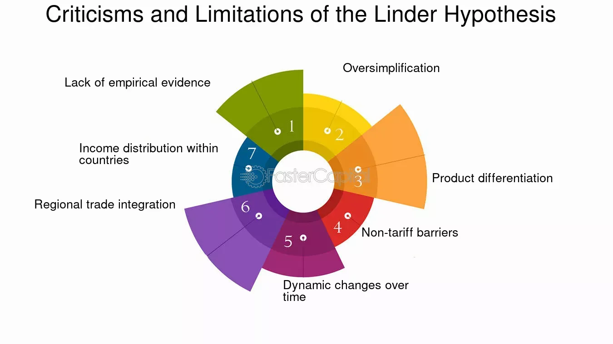

## Table of Contents

## What is the Linder Hypothesis?

The Linder Hypothesis, named after the Swedish economist Staffan Linder, is a theory about international trade. It suggests that countries with similar levels of income per person will trade more with each other. This is because people in these countries want to buy similar types of goods. For example, if two countries have a lot of middle-class people, they might both produce and trade things like cars and electronics.

Linder's idea challenges the traditional theory of comparative advantage, which says countries should trade based on what they can produce most efficiently. Instead, Linder thought that the demand for goods within a country shapes its trade patterns. So, countries with similar demands will find it easier to trade with each other. This theory helps explain why countries at similar stages of economic development often trade a lot with each other.

## Who developed the Linder Hypothesis and when?

The Linder Hypothesis was developed by a Swedish economist named Staffan Linder. He came up with this idea in the 1960s. Linder wanted to understand why countries trade with each other and thought that it had a lot to do with the kinds of things people in those countries want to buy.

Linder noticed that countries with similar income levels tend to want similar products. For example, if two countries have a lot of middle-class people, they might both want to buy cars and electronics. So, Linder thought these countries would trade more with each other because they have similar demands. This idea is different from older theories that focus more on what countries can produce well.

## What are the main assumptions of the Linder Hypothesis?

The Linder Hypothesis assumes that countries with similar income levels have similar tastes and demands for goods. This means that if people in two countries earn about the same amount of money, they will want to buy similar things. For example, if both countries have a lot of middle-class people, they might want cars, electronics, and other similar products. Because their demands are alike, these countries will find it easier to trade with each other.

Another key assumption is that the demand within a country shapes its trade patterns more than its ability to produce goods efficiently. This is different from older trade theories, which say countries should trade based on what they can make best. Linder thought that what people want to buy is more important. So, countries with similar demands will trade more with each other, even if they can produce different things well.

## How does the Linder Hypothesis differ from traditional trade theories like the Heckscher-Ohlin model?

The Linder Hypothesis and the Heckscher-Ohlin model are two different ways to think about why countries trade with each other. The Heckscher-Ohlin model says that countries should trade based on what they have a lot of. For example, if a country has a lot of workers, it should make things that need a lot of labor. If another country has a lot of machines, it should make things that need a lot of machines. They trade because they can make different things better than each other.

On the other hand, the Linder Hypothesis focuses on what people in different countries want to buy. It says that countries with similar income levels will want similar things. So, if two countries have a lot of middle-class people, they might both want cars and electronics. These countries will trade more with each other because their demands are alike. The Linder Hypothesis thinks that what people want is more important than what a country can make well.

## Can you explain the concept of 'overlapping demand' in the context of the Linder Hypothesis?

The concept of 'overlapping demand' is a key part of the Linder Hypothesis. It means that countries with similar income levels will want to buy similar types of goods. For example, if people in two countries earn about the same amount of money, they might both want cars, electronics, and other similar products. This is because their needs and wants are alike, so their demands 'overlap.'

This idea helps explain why countries at similar stages of development tend to trade more with each other. According to the Linder Hypothesis, if two countries have overlapping demands, they will find it easier to trade because they want the same things. This is different from other trade theories that focus more on what countries can produce well. Instead, the Linder Hypothesis says that what people want to buy is more important in deciding trade patterns.

## What are the implications of the Linder Hypothesis for international trade patterns?

The Linder Hypothesis suggests that countries with similar income levels will trade more with each other. This is because people in these countries want similar things. For example, if two countries have a lot of middle-class people, they might both want to buy cars and electronics. This means they will trade these kinds of goods with each other more often. So, trade happens not just because one country can make something better than another, but because they want the same things.

This idea can help explain why countries at similar stages of development often trade a lot with each other. For example, developed countries like the United States and Germany might trade more with each other than with poorer countries. This is because their people have similar incomes and want similar products. The Linder Hypothesis suggests that understanding what people want to buy is important for understanding trade patterns, more than just looking at what countries can produce well.

## How does income distribution affect trade according to the Linder Hypothesis?

The Linder Hypothesis says that countries with similar income levels will trade more with each other. This is because people in these countries want similar things. If two countries have a lot of people [earning](/wiki/earning-announcement) about the same amount of money, they will both want to buy cars, electronics, and other similar products. So, they will trade these kinds of goods with each other more often. This means that the way income is spread out in a country can affect how much it trades with other countries.

Income distribution matters because it shapes what people in a country want to buy. If a country has a lot of middle-class people, it will want middle-class products. If another country also has a lot of middle-class people, they will both want similar things. So, these two countries will trade more with each other. On the other hand, if one country has mostly rich people and another has mostly poor people, they might not want the same things. This could mean they don't trade as much with each other.

## What empirical evidence supports or challenges the Linder Hypothesis?

Some studies have found evidence that supports the Linder Hypothesis. For example, research has shown that countries with similar income levels do tend to trade more with each other. This is because they have similar demands for goods. A study by Hans Singer in the 1970s found that trade between developed countries was higher than expected by traditional trade theories. This supports the idea that countries with similar income levels and demands trade more because they want the same things.

However, other studies have found challenges to the Linder Hypothesis. Some research shows that factors like distance, transportation costs, and trade agreements can be more important than income levels in determining trade patterns. A study by Deardorff in the 1980s found that trade between countries with different income levels can still be high if they have good trade agreements or are close to each other. This suggests that while income levels and overlapping demands are important, they are not the only things that matter in international trade.

## How has the Linder Hypothesis been applied in modern economic analysis?

In modern economic analysis, the Linder Hypothesis is used to help explain why countries at similar levels of development often trade a lot with each other. Economists look at how income levels in different countries shape what people want to buy. If two countries have a lot of middle-class people, they might both want cars, electronics, and other similar products. This means they will trade these kinds of goods with each other more often. The Linder Hypothesis helps economists understand that trade is not just about what countries can produce well, but also about what people in those countries want to buy.

However, the Linder Hypothesis is not used alone in modern economic analysis. Economists also consider other factors like distance, transportation costs, and trade agreements when studying trade patterns. While the Linder Hypothesis suggests that countries with similar income levels should trade more, real-world data shows that other things can be just as important. For example, countries that are close to each other or have good trade deals might trade a lot even if their income levels are different. So, the Linder Hypothesis is one piece of a bigger puzzle in understanding international trade today.

## What are the criticisms of the Linder Hypothesis?

Some people say the Linder Hypothesis is not always right. They think it's too simple. The hypothesis says that countries with similar incomes will trade more because they want the same things. But critics say there are other things that matter more, like how far away countries are from each other, how much it costs to send things, and if they have good trade deals. For example, a country might trade a lot with a nearby country, even if their incomes are different.

Also, some critics think the Linder Hypothesis doesn't explain everything about trade. It focuses a lot on what people want to buy, but it doesn't look at what countries can make well. Some studies have found that countries still trade a lot even if their incomes are different, as long as they can make things well or have good trade agreements. So, while the Linder Hypothesis is helpful, it's not the whole story of why countries trade with each other.

## Can you provide examples of countries where the Linder Hypothesis has been observed to hold true?

The Linder Hypothesis says that countries with similar incomes will trade more because they want the same things. One example where this seems to be true is between the United States and Canada. Both countries have a lot of middle-class people who want to buy cars, electronics, and other similar products. So, they trade a lot of these kinds of goods with each other. Their similar income levels mean their demands overlap, which fits with what the Linder Hypothesis predicts.

Another example is trade between Germany and France. These countries are both developed and have a lot of people with similar incomes. They both want to buy things like cars, machinery, and luxury goods. Because their demands are alike, they trade a lot with each other. This supports the idea that countries with similar income levels will trade more because they want the same things, as the Linder Hypothesis suggests.

## How might global economic changes, like shifts in income levels and technology, impact the relevance of the Linder Hypothesis?

Global economic changes can change how well the Linder Hypothesis works. If income levels in different countries start to be more alike, then the Linder Hypothesis might become more important. For example, if more countries start to have a lot of middle-class people, they might all want to buy cars and electronics. This means they could trade more with each other because their demands are similar. On the other hand, if income levels become more different, the Linder Hypothesis might not explain trade as well. Countries with very different incomes might not want the same things, so they might not trade as much based on demand.

Technology can also affect the Linder Hypothesis. New technology can change what people want to buy and how they buy it. For example, with the internet, people can buy things from anywhere in the world, not just from nearby countries. This means that even if two countries have similar incomes, they might not trade as much with each other if people can buy things online from other places. Also, technology can make it easier to make things in one country and sell them in another, which might make other factors like trade agreements and transportation costs more important than just income levels.

## References & Further Reading

[1]: Linder, S. B. (1961). "An Essay on Trade and Transformation." Almqvist & Wiksell.

[2]: Feenstra, R. C., & Taylor, A. M. (2017). "International Economics." Worth Publishers.

[3]: Grossman, G. M., & Rogoff, K. (1995). ["Handbook of International Economics."](https://www.sciencedirect.com/handbook/handbook-of-international-economics/vol/3/suppl/C) North Holland.

[4]: Lopez de Prado, M. (2018). ["Advances in Financial Machine Learning."](https://www.amazon.com/Advances-Financial-Machine-Learning-Marcos/dp/1119482089) John Wiley & Sons.

[5]: Chan, E. P. (2009). ["Quantitative Trading: How to Build Your Own Algorithmic Trading Business."](https://github.com/ftvision/quant_trading_echan_book) Wiley Trading.

[6]: Jansen, S. (2020). ["Machine Learning for Algorithmic Trading."](https://github.com/stefan-jansen/machine-learning-for-trading) Packt Publishing.

[7]: Aronson, D. R. (2006). ["Evidence-Based Technical Analysis: Applying the Scientific Method and Statistical Inference to Trading Signals."](https://www.amazon.com/Evidence-Based-Technical-Analysis-Scientific-Statistical/dp/0470008741) John Wiley & Sons.

[8]: Krugman, P. R., & Obstfeld, M. (2003). "International Economics: Theory and Policy." Addison Wesley.