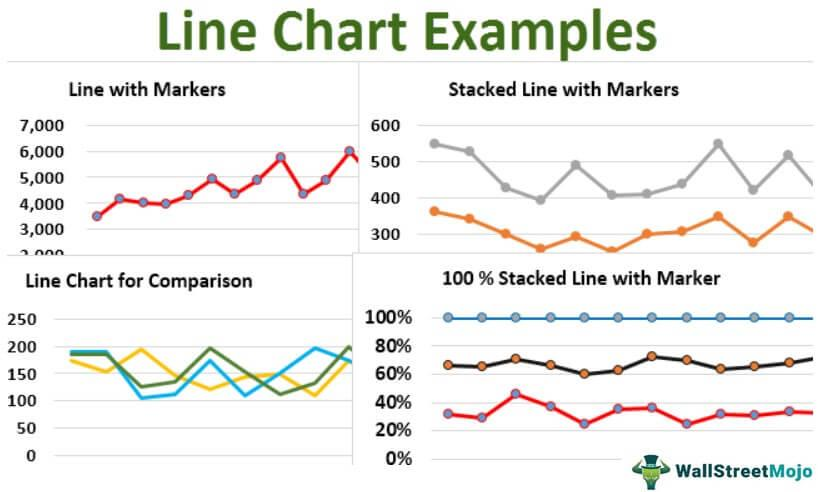

## Table of Contents

## What is a line chart?

A line chart is a type of graph that shows how data changes over time. It uses a line to connect points that represent different values at different times. This makes it easy to see trends and patterns in the data. For example, if you want to see how the temperature changes throughout a day, you can use a line chart to show the temperature at different hours.

Line charts are very useful because they can show changes clearly. They are often used in business to show sales over time, in weather reports to show temperature changes, and in many other areas. By looking at the line, you can quickly understand if the data is going up, going down, or staying the same. This helps people make decisions based on the information they see.

## What are the basic components of a line chart?

A line chart has a few important parts. First, there is the horizontal line at the bottom called the x-axis. This line shows time or categories. For example, it could show days, months, or years. Next, there is the vertical line on the left side called the y-axis. This line shows numbers or values. It helps you see how much something changed.

The main part of a line chart is the line itself. This line connects different points on the chart. Each point shows a value at a specific time. By connecting these points, the line shows how the values change over time. Sometimes, a line chart can have more than one line if it is showing different sets of data. For example, one line could show sales of apples, and another line could show sales of oranges.

Lastly, a line chart often has labels and a title. The title tells you what the chart is about. Labels on the x-axis and y-axis help you understand what the numbers and times mean. Sometimes, there are also legends if the chart has more than one line. A legend explains what each line represents.

## How do you read a line chart?

Reading a line chart is easy. Start by looking at the title to know what the chart is about. Then, look at the x-axis at the bottom. This shows time or categories like days or months. Next, look at the y-axis on the left side. This shows numbers or values. The numbers tell you how much something is.

Now, look at the line on the chart. Each point on the line shows a value at a specific time. The line connects these points to show how the value changes over time. If the line goes up, the value is increasing. If the line goes down, the value is decreasing. If the line is flat, the value stays the same. If there is more than one line, check the legend to see what each line means. This way, you can compare different sets of data.

By following these steps, you can understand what the line chart is telling you. It helps you see trends and patterns easily. For example, if you see a line going up over time, you know that the value, like sales or temperature, is getting higher.

## What are the different types of line charts?

Line charts can be simple or more detailed, depending on what they need to show. A basic line chart has one line that shows how one set of data changes over time. It's good for showing trends in things like temperature or sales. A multiple line chart has more than one line. This type is used when you want to compare different sets of data. For example, you could use it to compare sales of different products over time.

Another type is a stacked line chart. This chart shows how different parts add up to a whole over time. Each line in a stacked line chart represents a part, and the top line shows the total. It's useful for showing how different categories contribute to a total amount. For example, it could show how different sources of income add up to total income over time.

There are also 100% stacked line charts. These are similar to stacked line charts, but each part is shown as a percentage of the whole. This type of chart is good for showing how the proportions of different categories change over time. For example, it could show how the percentage of sales from different regions changes from month to month.

## What is a simple line chart and when is it used?

A simple line chart is a type of graph that shows how one thing changes over time. It has one line that goes up and down based on the numbers it is showing. The line connects points that represent different values at different times. This makes it easy to see if the numbers are getting bigger or smaller.

Simple line charts are used when you want to see how something changes over time in a clear way. For example, you might use a simple line chart to show how the temperature changes during a day, or how much money a store makes each month. They are good for showing trends and patterns because the line makes it easy to see if the numbers are going up, going down, or staying the same.

## What is a multiple line chart and what are its applications?

A multiple line chart is a type of graph that shows how more than one thing changes over time. It has more than one line on the same chart. Each line shows a different set of data. For example, one line might show sales of apples, and another line might show sales of oranges. This makes it easy to compare how different things are doing at the same time.

Multiple line charts are very useful in many situations. They are often used in business to compare sales of different products or to see how different parts of a business are doing. For example, a company might use a multiple line chart to see how sales in different regions are changing over time. They are also used in other areas like science to compare different sets of data, like temperatures in different cities. By looking at the lines, you can see which thing is doing better or worse and make decisions based on that information.

## How does a stacked line chart work and in what scenarios is it useful?

A stacked line chart shows how different parts add up to make a whole over time. It has several lines, with each line showing a part of the whole. The bottom line shows the first part, and each line above it adds another part. The top line shows the total of all the parts. This makes it easy to see how each part changes and how the whole changes too. For example, if you want to see how different sources of income add up to your total income each month, a stacked line chart can show this clearly.

Stacked line charts are useful in many situations. They are often used in business to show how different products contribute to total sales over time. For example, a store might use a stacked line chart to show how sales of apples, oranges, and bananas add up to total fruit sales each month. They are also useful in other areas like finance, where you might want to see how different types of expenses add up to total spending. By looking at a stacked line chart, you can see not just the total, but also how each part is doing over time.

## What is a compound line chart and how does it differ from a stacked line chart?

A compound line chart is a type of graph that shows how different parts add up to a whole over time, just like a stacked line chart. The main difference is how the data is shown. In a compound line chart, each part of the data is shown as a separate line, but these lines are not stacked on top of each other. Instead, each line starts from the same point on the y-axis and shows its own values over time. This makes it easier to see the trend of each part without the lines being on top of each other.

The key difference between a compound line chart and a stacked line chart is how they help you understand the data. A stacked line chart is good when you want to see how each part adds up to the total and how the total changes over time. It shows you the whole picture at once. On the other hand, a compound line chart is better when you want to compare the trends of each part separately. It makes it easier to see how each part is doing on its own, without the influence of the other parts. Both types of charts are useful, but they help you see the data in different ways.

## How can line charts be customized to enhance data visualization?

Line charts can be customized in many ways to make the data easier to understand. You can change the colors of the lines to make them stand out. For example, using bright colors for important lines can help them catch your eye. You can also add labels to the lines to show what they mean. This is helpful when there are many lines on the chart. Another way to customize a line chart is to change the style of the lines. You can make them thicker or use dashed lines to show different types of data. Adding markers at each point on the line can also help show the exact values at different times.

You can also change the scale of the axes to focus on the parts of the data that matter most. For example, if the data changes a lot, you might want to zoom in on a smaller range to see the changes better. Adding a grid to the chart can make it easier to read the values too. Sometimes, you might want to add a trend line to show the overall direction of the data. This can help you see the big picture. By customizing these things, you can make your line chart clearer and more useful for showing your data.

## What are some common mistakes to avoid when creating line charts?

When making line charts, one common mistake is using too many lines. If you have too many lines, it can be hard to see what each line means. The chart can look messy and confusing. It's better to use a few lines and make sure each one is easy to see and understand. Another mistake is not labeling the lines well. If you don't say what each line shows, people might not know what they are looking at. Always add clear labels and a legend to explain what each line means.

Another mistake is not choosing the right scale for the axes. If the scale is too big or too small, it can make the changes in the data hard to see. You should pick a scale that shows the important changes clearly. Also, not using colors or styles that are easy to tell apart can make the chart confusing. Make sure each line looks different enough so people can see which line is which. By avoiding these mistakes, your line chart will be clearer and easier for people to understand.

## How can advanced features like trend lines and confidence intervals be added to line charts?

Adding trend lines to line charts is a great way to show the overall direction of the data. A trend line is a straight line that goes through the data points and shows if the numbers are going up, going down, or staying the same over time. To add a trend line, you can use a tool like a spreadsheet program. You just need to pick the type of trend line you want, like a linear one, and the program will draw it for you. This helps people see the big picture of the data without getting lost in all the little ups and downs.

Confidence intervals can also be added to line charts to show how sure you are about the data. A confidence interval is like a range around the line that shows where the true value might be. It's like saying, "We're pretty sure the real number is somewhere in this range." To add confidence intervals, you need to do some math to figure out how wide the range should be. Then, you can show this range as a shaded area around the line. This helps people understand not just the trend, but also how reliable the data is.

## What are some best practices for presenting complex data using line charts to expert audiences?

When presenting complex data to expert audiences using line charts, it's important to keep the chart clear and focused. Use a few lines and make sure each line is easy to see and understand. Choose colors and styles that are different enough so people can tell the lines apart. Also, add clear labels and a legend to explain what each line means. This way, experts can quickly see what the chart is showing without getting confused. Make sure the scale of the axes is right for the data so the important changes are easy to see. Adding a grid can also help people read the values better.

Another good practice is to use advanced features like trend lines and confidence intervals. A trend line shows the overall direction of the data, which can help experts see the big picture. To add a trend line, use a tool like a spreadsheet program and pick the type of trend line that fits your data. Confidence intervals show how sure you are about the data. They are like a range around the line that shows where the true value might be. To add confidence intervals, do some math to figure out the range and show it as a shaded area around the line. This helps experts understand not just the trend, but also how reliable the data is.

## References & Further Reading

[1]: Bergstra, J., Bardenet, R., Bengio, Y., & Kégl, B. (2011). ["Algorithms for Hyper-Parameter Optimization."](https://dl.acm.org/doi/10.5555/2986459.2986743) Advances in Neural Information Processing Systems 24.

[2]: ["Advances in Financial Machine Learning"](https://www.amazon.com/Advances-Financial-Machine-Learning-Marcos/dp/1119482089) by Marcos Lopez de Prado

[3]: ["Evidence-Based Technical Analysis: Applying the Scientific Method and Statistical Inference to Trading Signals"](https://www.amazon.com/Evidence-Based-Technical-Analysis-Scientific-Statistical/dp/0470008741) by David Aronson

[4]: ["Machine Learning for Algorithmic Trading"](https://github.com/stefan-jansen/machine-learning-for-trading) by Stefan Jansen

[5]: ["Quantitative Trading: How to Build Your Own Algorithmic Trading Business"](https://www.amazon.com/Quantitative-Trading-Build-Algorithmic-Business/dp/1119800064) by Ernest P. Chan