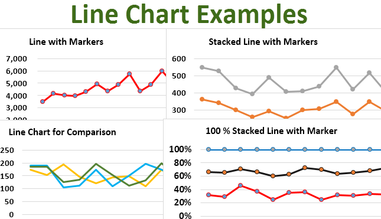

Data visualization plays a crucial role in algorithmic trading by providing clear insights into financial markets. Algorithmic trading involves the use of computer algorithms to execute trading strategies based on predetermined criteria. In this context, effective data visualization enables traders to interpret vast amounts of complex financial data rapidly and accurately, facilitating informed decision-making.

Among the variety of chart types available, the line chart is one of the most commonly utilized tools for visualizing trends over time. Line charts display information through a series of data points connected by straight lines, offering a clear depiction of how prices or other financial metrics change over a specific period. This simplicity makes line charts particularly valuable for identifying trends, a fundamental aspect of successful trading strategies.



This article will explore the significance of different chart types, including line charts, in algorithmic trading. Each type of chart offers unique features and caters to specific analysis needs, helping traders identify patterns and potential opportunities in fast-paced and volatile markets.

Understanding these tools is vital for traders seeking to enhance their decision-making processes and trading strategies. By leveraging appropriate chart types, traders can better predict market movements, manage risk, and optimize execution. Becoming adept at using these visualization tools is essential for maintaining a competitive edge in algorithmic trading environments.

## Table of Contents

## Understanding Line Charts

Line charts are a quintessential tool in data visualization, representing data as a sequence of points linked by straight line segments, effectively depicting changes over time. Their utility lies in their ability to simplify complex datasets, providing a clear, succinct view of temporal patterns. In the financial sector, line charts are indispensable for tracking changes in various market instruments such as stock prices, currency rates, and indexes. 

The fundamental structure of a line chart is straightforward: it comprises two axes—the horizontal axis (x-axis) typically represents time, while the vertical axis (y-axis) represents the variable being tracked, such as price. Each data point plotted on the chart signifies a value at a specific time, and connecting these points with a line helps visualize the trend or movement across the period under analysis. This method of visualization is particularly effective in highlighting overall trends rather than focusing on day-to-day fluctuations.

Investors and traders frequently employ line charts due to their simplicity and ability to effectively illustrate closing prices of assets. The closing price— the final trading price recorded at the end of a trading day—is particularly significant because it reflects the consensus value of the asset as determined by the market participants for that day, providing critical insight into the asset's performance and trend. 

The ability of line charts to consolidate complex data into an easily comprehensible format makes them a preferred choice for presenting historical data during market analysis. Traders can quickly assess whether a security is in an uptrend, downtrend, or ranging market. Additionally, for [algorithmic trading](/wiki/algorithmic-trading) systems where rapid decision-making is crucial, line charts offer a straightforward, efficient way to integrate visual trade signals into automated trading algorithms.

For these reasons, line charts continue to be a mainstay in financial analyses, supporting a wide array of strategic decisions made by both individual investors and institutional traders. They offer a clear, easily interpretable view of market dynamics essential for developing robust trading strategies.

## Types of Line Charts in Financial Analysis

Line charts are valuable tools in financial analysis, providing a visual representation of data that can effectively communicate trends and comparisons. Understanding the different types of line charts and their specific uses enhances their utility in financial analysis.

**Simple Line Charts** are the most basic form, depicting data points connected by a single line. These charts are particularly useful for tracking the price trend of a single asset over a specified period. The x-axis typically represents time intervals (e.g., days, weeks, months), while the y-axis indicates the price level or value of the asset. This straightforward visualization makes it easy to identify general trends, such as upward or downward movements in asset prices, allowing traders and analysts to quickly assess the overall trajectory.

**Multiple Line Charts** extend the functionality of simple line charts by plotting several lines within the same chart. This method is beneficial for comparing the performance of multiple securities or indices simultaneously. By using different colors or styles for each line, multiple line charts can display relationships and differences across various assets or time periods. This comparative approach helps traders identify relative strengths and weaknesses, supporting more informed decision-making. The Python code snippet below demonstrates how to create a multiple line chart using the Matplotlib library:

```python
import matplotlib.pyplot as plt

# Sample data for multiple line charts
dates = ['2023-01-01', '2023-02-01', '2023-03-01']
asset_1 = [100, 110, 105]
asset_2 = [95, 100, 102]

plt.plot(dates, asset_1, label='Asset 1')
plt.plot(dates, asset_2, label='Asset 2')

plt.xlabel('Date')
plt.ylabel('Price')
plt.title('Multiple Line Chart Example')
plt.legend()
plt.show()
```

**Compound Line Charts**, also known as stacked line charts, represent the cumulative effect of multiple data sets over time. Unlike multiple line charts, compound line charts illustrate how individual components contribute to a whole, showing changes in both the absolute value and the composition over time. In financial analysis, these charts can be used to display aggregated data from different sectors or revenue streams, providing insights into how different elements collectively influence the total performance. This method enhances the understanding of contributions from various sources, making it easier to perceive shifts in market dynamics or asset allocation.

In summary, line charts come in various forms, each serving distinct purposes in financial analysis. Simple line charts offer clarity for single asset trends, multiple line charts facilitate comparative analysis, and compound line charts display cumulative impacts. Utilizing these charts effectively can significantly enhance a trader's ability to interpret market data and develop informed trading strategies.

## Benefits of Using Line Charts in Algorithmic Trading

Line charts offer significant benefits for algorithmic trading, particularly in identifying and analyzing price trends over time. Their visual simplicity allows traders to distill complex datasets into coherent narratives, facilitating more intuitive strategic decision-making. By representing data as a series of points connected by lines, line charts deliver a clear depiction of historical price movements, enabling traders to identify patterns such as trends or cycles. This is vital for developing strategies that respond effectively to market dynamics.

One of the primary advantages of line charts in algorithmic trading is their ability to simplify complex datasets. By reducing noise and providing a straightforward visual representation, line charts help traders quickly grasp essential market trends without being overwhelmed by excessive data. This simplicity is particularly beneficial when traders need to make rapid decisions based on real-time market data. For instance, consider a dataset representing the closing prices of a stock over a period. The line chart will efficiently highlight the trend, showing whether the stock is generally moving upward or downward, aiding in predictive modeling and forecasting.

Furthermore, line charts are indispensable for historical analysis. They allow traders to look back at a broad data range, examining how prices have evolved. This historical perspective is crucial for recognizing recurring patterns or anomalies that might inform future trading decisions. Historical analysis through line charts also aids in the [backtesting](/wiki/backtesting) of algorithmic trading strategies. By visualizing how a strategy might have performed in the past, traders can refine their algorithms to enhance future performance.

In terms of communicating financial data, line charts excel due to their ability to provide a narrative over time. They offer a compelling way to summarize detailed financial information in presentations and reports, making the data accessible to audiences who might not have a deep understanding of technical analysis. For example, a line chart showing the annual performance of a stock index can effectively convey its growth trajectory or [volatility](/wiki/volatility-trading-strategies) to stakeholders.

Incorporating line charts into algorithmic trading involves leveraging programming languages such as Python, which provides libraries like Matplotlib and Plotly to create and customize these charts efficiently. A simple Python code snippet to generate a line chart illustrating stock prices might look like this:

```python
import matplotlib.pyplot as plt

# Sample data for stock prices
dates = ['2023-01-01', '2023-02-01', '2023-03-01', '2023-04-01']
prices = [150, 155, 145, 160]

# Create a line chart
plt.plot(dates, prices, marker='o')
plt.title('Stock Prices Over Time')
plt.xlabel('Date')
plt.ylabel('Price')
plt.grid(True)
plt.show()
```

This snippet demonstrates how quickly traders can visualize stock price trends, enabling immediate analysis and exploration of trading opportunities. Overall, the application of line charts in algorithmic trading is a testament to their essential role in transforming complex market data into actionable insights, thereby aiding traders in crafting informed and effective trading strategies.

## Limitations and Considerations of Line Charts

While line charts are a widely used tool in financial analysis and algorithmic trading, they do present some limitations and considerations that traders should be aware of for effective decision-making.

One primary limitation of line charts is their focus on closing prices, which can obscure important intraperiod price movements. For traders and analysts who require detailed information on price action throughout the trading period, such as the highs, lows, and opening prices, line charts may not provide the necessary granularity. This missing data can be crucial, particularly for strategies that depend on intra-day or short-term price fluctuations.

Furthermore, line charts do not adequately support comprehensive technical analysis. Technical analysis often relies on patterns, formations, and other complex signals that are better visualized through other chart types, such as candlestick or bar charts. For instance, identifying patterns like head and shoulders or triangles requires a richer dataset than what is typically represented in line charts. Thus, traders might need to augment their analysis with more sophisticated tools to capture these nuanced market conditions.

Recognizing the situations where line charts may fall short is crucial for accurate market analysis. When traders identify that line charts only provide a limited view, they can opt for alternative chart types. For example, candlestick charts offer detailed information about the price movements within a time period, displaying open, high, low, and close prices, which can be critical for executing technical trading strategies effectively.

In conclusion, while line charts serve as a fundamental tool due to their simplicity and effectiveness in depicting overall price trends, it's important for traders to understand their limitations. By determining when line charts do not suffice and transitioning to more complex chart types, traders can enhance the accuracy and depth of their analysis, leading to better-informed trading decisions.

## Comparing Line Charts with Other Chart Types

Line charts, bar charts, candlestick charts, and histograms each play distinctive roles in the visualization of financial data, and understanding their differences is essential for traders developing effective market analysis and strategy systems.

Line charts are renowned for their simplicity and effectiveness in showing trends over continuous periods. They connect successive closing prices of an asset with straight lines, providing a clear indication of general directional trends over time. They are particularly valuable in illustrating the movement of stock prices, currencies, or indices where the objective is to identify patterns or trends based on the closing values.

In contrast, bar charts provide a more comprehensive snapshot of price activity over a specified period by incorporating additional data points, such as the opening, high, low, and closing prices for each time interval. Each bar represents this summary, providing richer information on price volatility and helping traders assess market [momentum](/wiki/momentum). This makes bar charts more adept than simple line charts for technical analysis where price movement within a time frame is crucial.

Candlestick charts, like bar charts, capture opening, high, low, and closing prices but utilize a visually intuitive format with "candlesticks" to denote the difference between opening and closing prices. The body of the candlestick illustrates whether the closing price was higher or lower than the opening price, making them particularly popular for identifying market patterns and reversals. Candlestick patterns, such as dojis and hammers, are fundamental tools for traders conducting technical analysis.

Histograms differ as they are often employed in representing the frequency distribution of data points over defined intervals, providing insight into the distribution and [volume](/wiki/volume-trading-strategy) of trades. They can be particularly useful in volume analysis, helping traders identify periods of increased activity which might suggest significant market sentiment shifts.

Each chart type offers unique insights and is best suited for different contexts and elements of strategy development. Line charts excel in simplicity and trend analysis, bar and candlestick charts offer detailed intraday data essential for comprehensive technical exploration, while histograms provide frequency-based insights useful in volume and volatility analysis. Combining these chart types provides traders with a layered understanding of market dynamics, enabling more informed and strategic decision-making.

## Practical Applications and Real-World Examples

Line charts are a staple in algorithmic trading platforms, serving as a fundamental tool for tracking asset price trends and comprehending market behaviors over specified periods. The simplicity and clarity they offer make them invaluable for algorithmic traders who rely on visual cues to facilitate decision-making.

One of the primary advantages of using line charts in algorithmic trading is their ability to highlight support and resistance levels, which are critical in market analysis. Support levels indicate the price point at which an asset tends to stop falling and may bounce back up, whereas resistance levels represent the price at which an asset has difficulty rising further. By visually identifying these levels, traders can make informed decisions about entry and [exit](/wiki/exit-strategy) points in their strategies. For instance, a line chart might show repeated touches at a certain price level, identifying a robust support or resistance zone that can influence trading decisions.

Moreover, line charts support the development and implementation of automated trading systems. Algorithms can be programmed to recognize specific patterns, such as a line breaking a long-standing support level, triggering automated buy/sell orders. This process of pattern recognition within line charts is automated through code, often using Python due to its extensive library support for data analysis and visualization. For example, using the `Pandas` library, a trader can analyze how often an asset price touches a historical support level:

```python
import pandas as pd
import matplotlib.pyplot as plt

# Sample data representing asset prices over time
data = {'Date': pd.date_range(start='2023-01-01', periods=100),
        'Price': [100 + i * (0.5 if i % 10 < 5 else -0.3) for i in range(100)]}
df = pd.DataFrame(data)
df.set_index('Date', inplace=True)

# Plotting the line chart
plt.figure(figsize=(10, 6))
plt.plot(df.index, df['Price'], label='Asset Price')
plt.axhline(y=102, color='r', linestyle='--', label='Resistance Level')
plt.axhline(y=98, color='g', linestyle='--', label='Support Level')
plt.title('Asset Price Over Time')
plt.xlabel('Date')
plt.ylabel('Price')
plt.legend()
plt.show()
```

Real-world examples underscore the efficacy of line charts in algorithmic trading strategies. For instance, during volatile market conditions, traders can program their algorithms to react quickly to line chart indicators, optimizing the timing of trades to capitalize on market movements. A case study involving a [hedge fund](/wiki/hedge-fund-trading-strategies) revealed that the utilization of line charts for trend analysis allowed for a 5% increase in returns by enhancing the timing of trades based on historical price movements and trend reversals.

In conclusion, line charts are not merely a tool for historical data visualization but also a dynamic instrument in algorithmic trading, offering traders the ability to interpret market signals efficiently. Their integration into automated systems exemplifies how traditional charting methods have adapted to modern trading technologies, reinforcing their significance in contemporary financial analysis.

## Conclusion

Line charts are a fundamental tool for data visualization in algorithmic trading, recognized for their simplicity and effectiveness in depicting market trends. These charts transform extensive financial data into manageable formats, allowing traders to identify trends efficiently. The straightforward nature of line charts makes them ideal for illustrating changes in asset prices, thus providing strategic insights vital to algorithmic trading practices.

Understanding both the limitations and appropriate applications of line charts is critical for maximizing their use in trading strategies. While line charts are excellent for showing trends, they may not always capture detailed market nuances such as intraperiod price volatility. Hence, traders must be adept at selecting the right chart type to obtain comprehensive analyses and make informed decisions.

As technology rapidly evolves, traders must continually update their skills to remain competitive. Mastering line charts is indispensable in this context. By combining line charts with advanced computational tools and analytics, traders can enhance their ability to predict market movements and optimize their trading strategies. 

The integration of these charts into algorithmic trading systems underscores their enduring relevance. As such, line charts will continue to be a crucial component of any serious algorithmic trader's toolkit, supporting the adaptation to technological advancements and the complex dynamics of the financial markets.

## References & Further Reading

[1]: Bergstra, J., Bardenet, R., Bengio, Y., & Kégl, B. (2011). ["Algorithms for Hyper-Parameter Optimization."](https://dl.acm.org/doi/10.5555/2986459.2986743) Advances in Neural Information Processing Systems 24.

[2]: ["Advances in Financial Machine Learning"](https://www.amazon.com/Advances-Financial-Machine-Learning-Marcos/dp/1119482089) by Marcos Lopez de Prado

[3]: ["Evidence-Based Technical Analysis: Applying the Scientific Method and Statistical Inference to Trading Signals"](https://www.amazon.com/Evidence-Based-Technical-Analysis-Scientific-Statistical/dp/0470008741) by David Aronson

[4]: ["Machine Learning for Algorithmic Trading"](https://github.com/stefan-jansen/machine-learning-for-trading) by Stefan Jansen

[5]: ["Quantitative Trading: How to Build Your Own Algorithmic Trading Business"](https://www.amazon.com/Quantitative-Trading-Build-Algorithmic-Business/dp/1119800064) by Ernest P. Chan