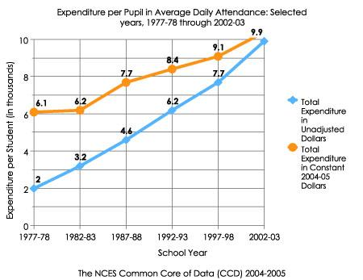

## Table of Contents

## What is a line graph?

A line graph is a type of chart that shows how data changes over time. It uses points connected by lines to show how something increases or decreases. For example, you can use a line graph to show the temperature changes throughout a day or the growth of a plant over several weeks.

Line graphs are helpful because they make it easy to see trends and patterns. By looking at the slope of the line, you can tell if the data is going up, going down, or staying the same. This makes it simple to understand how things change over time, which can be useful in many different situations, like tracking sales or monitoring a patient's health.

## What are the basic types of line graphs?

There are a few basic types of line graphs that people use often. The first type is a simple line graph. This graph has just one line that shows how one thing changes over time. For example, you might use a simple line graph to show how the temperature changes during a day.

Another type is a multiple line graph. This graph has more than one line, and each line shows a different thing. This is useful when you want to compare how different things change over the same time. For example, you could use a multiple line graph to compare the sales of different products over a year.

The last type is a stacked line graph. In this graph, the lines are stacked on top of each other. This type of graph is good for showing how different parts add up to a whole. For example, you might use a stacked line graph to show how different sources of income add up to your total income over time.

## What are the main parts of a line graph?

A line graph has a few main parts that help you understand the information it shows. The first part is the axes. There are two axes: the horizontal axis, which usually shows time, and the vertical axis, which shows the numbers or values you are measuring. These axes help you see how the data changes over time. The second part is the data points. These are the dots on the graph that show the exact values at different times. 

The third part is the line that connects the data points. This line helps you see the trend or pattern in the data. If the line goes up, it means the values are increasing. If it goes down, the values are decreasing. The last part is the title and labels. The title tells you what the graph is about, and the labels on the axes tell you what each axis represents. Together, these parts make it easy to understand the information the line graph is showing.

## How do you read a line graph?

Reading a line graph is easy once you know what to look for. First, look at the title of the graph. The title tells you what the graph is about. Then, check the labels on the axes. The horizontal axis usually shows time, like days or years. The vertical axis shows the numbers or values you are measuring, like temperature or sales. These labels help you understand what the graph is showing.

Next, look at the data points on the graph. These are the dots that show the exact values at different times. The line that connects these dots helps you see the trend or pattern. If the line goes up, it means the values are increasing. If it goes down, the values are decreasing. By following the line, you can see how the data changes over time. This makes it simple to understand trends and patterns in the information the graph is showing.

## What are some common uses of line graphs?

Line graphs are often used to show how something changes over time. For example, people use line graphs to show how the temperature changes during a day or how a plant grows over several weeks. They are helpful because they make it easy to see if something is going up, going down, or staying the same. This makes line graphs useful for tracking things like sales or monitoring a patient's health over time.

Another common use of line graphs is to compare different things over the same period. For example, a business might use a line graph to compare the sales of different products over a year. By looking at the lines on the graph, it's easy to see which product is selling better or worse. This can help businesses make decisions about what to sell more of or what to improve.

Line graphs can also show how different parts add up to a whole. For example, a stacked line graph can show how different sources of income add up to a person's total income over time. This helps people see how each part contributes to the total and how it changes over time.

## Can you provide examples of line graphs in real-world scenarios?

A line graph can be used to show how the temperature changes during a day. Imagine you are planning a picnic and want to know the best time to go. You look at a line graph that shows the temperature every hour. The graph has a line that starts low in the morning, goes up as the day gets warmer, and then goes down again in the evening. By looking at the line, you can see that the temperature is highest around 2 PM, so you decide to have your picnic earlier in the day when it's cooler.

Another example is a business using a line graph to compare the sales of different products over a year. Let's say a store sells three types of candy: chocolate, gummy bears, and lollipops. They make a line graph with three lines, one for each type of candy. The chocolate line goes up and down but stays high all year. The gummy bears line starts low but goes up a lot during the summer. The lollipops line stays pretty flat. By looking at the graph, the store can see that chocolate sells well all year, gummy bears sell better in the summer, and lollipops don't sell as well. This helps them decide what to stock more of and when.

A third example is using a line graph to track a patient's blood pressure over time. A doctor might use a line graph to see how a patient's blood pressure changes over several months. The graph has a line that shows the blood pressure readings at different times. If the line goes up, it means the blood pressure is getting higher, which could be a sign that the patient needs to change their diet or take medicine. If the line goes down, it means the blood pressure is getting better. This helps the doctor and patient make decisions about treatment and lifestyle changes.

## How do you create a basic line graph?

To create a basic line graph, start by gathering your data. You need to know what you want to show on the graph, like temperature over time or sales of a product. Once you have your data, draw two lines on a piece of paper or use a computer program. The line that goes across the bottom is called the horizontal axis, and it usually shows time, like days or months. The line that goes up and down the side is called the vertical axis, and it shows the numbers or values you are measuring, like temperature or sales. Label both axes so people know what they mean.

Next, plot your data points on the graph. These are the dots that show the exact values at different times. For example, if you are showing temperature, you might put a dot at the right spot for each hour of the day. After you have all your data points, connect them with a line. This line helps people see the trend or pattern in your data. If the line goes up, it means the values are increasing. If it goes down, the values are decreasing. Finally, add a title to your graph that tells people what it is about. Now you have a basic line graph that shows how something changes over time.

## What are the advantages of using line graphs over other types of graphs?

Line graphs are great because they show how things change over time in a clear way. They use a line to connect dots on the graph, which makes it easy to see if something is going up, going down, or staying the same. For example, if you want to show how the temperature changes during a day, a line graph can help you see the pattern easily. Other types of graphs, like bar graphs or pie charts, don't show changes over time as well as line graphs do. This makes line graphs very useful for tracking things like sales, stock prices, or a patient's health over time.

Another advantage of line graphs is that they can show more than one thing at the same time. For example, if you want to compare the sales of different products over a year, you can use different lines on the same graph. Each line can show a different product, so you can see how they all change over time and compare them easily. This is harder to do with other types of graphs. Line graphs also help you see small changes in the data, which can be important for making decisions. So, line graphs are a powerful tool for showing how things change and comparing different things over time.

## What are the limitations or potential misuses of line graphs?

Line graphs are great for showing how things change over time, but they have some limitations. One problem is that they can make small changes look bigger than they really are. If the scale on the vertical axis is too big or too small, the line can look very steep or very flat, which can be misleading. Also, line graphs can be hard to read if there are too many lines on one graph. When there are lots of lines, it can be hard to tell them apart and see the patterns clearly.

Another issue with line graphs is that they can be misused to show only part of the story. For example, someone might start the graph at a high point and show only the part where things are going down, making it look like things are getting worse when they might not be. Or they might use a break in the axis to make changes look bigger. It's important to look at the whole graph and the scale to make sure you are seeing the real picture.

## How can line graphs be customized for more advanced data visualization?

Line graphs can be customized in many ways to show more detailed information. One way is to add more lines to the graph to compare different things at the same time. For example, you can use different colors for each line so it's easy to tell them apart. You can also add markers or symbols to the data points to highlight important moments, like when something big happens. Another way to customize line graphs is to change the scale on the axes. You can zoom in on a small part of the data or show a bigger range to see long-term trends. Adding a second vertical axis can help you show two different things that have different scales, like temperature and rainfall, on the same graph.

Another way to make line graphs more useful is to add extra features like trend lines or moving averages. A trend line can show the overall direction of the data, helping you see if things are going up or down over time. A moving average smooths out the ups and downs in the data, making it easier to see the general pattern. You can also add labels or annotations to the graph to explain what's happening at certain points. This can help people understand the data better. By customizing line graphs in these ways, you can show more complex information and make it easier for people to understand what the data is telling them.

## What software tools are commonly used to create line graphs?

Many different software tools can help you make line graphs easily. One popular tool is Microsoft Excel. It's great because it's easy to use and many people already have it on their computers. In Excel, you can enter your data into a table and then choose to make a line graph. The program will do the work for you, making a graph that you can change to look just how you want it. Another tool people often use is Google Sheets, which works a lot like Excel but is free and online. This means you can work on your graph from anywhere and share it with others easily.

Other tools that are good for making line graphs include specialized software like Tableau and Plotly. These programs are more advanced and let you make very detailed and interactive graphs. For example, in Tableau, you can add lots of different lines and colors to show many things at once. Plotly is great because it lets you make graphs that people can click on and explore, which is useful for showing complex data. If you want something simple and free, you can also use online tools like Canva or ChartGo. These websites let you make line graphs quickly without needing to download any software.

## How can statistical analysis be integrated with line graphs for deeper insights?

Statistical analysis can be added to line graphs to give you more information about the data. For example, you can use something called a trend line to show the overall direction of the data. This line helps you see if things are generally going up or down over time, even if there are ups and downs along the way. Another way to use [statistics](/wiki/bayesian-statistics) is by adding a moving average to the graph. A moving average smooths out the ups and downs, making it easier to see the general pattern in the data. This can be helpful if you want to know the overall trend without being distracted by small changes.

You can also use statistical measures like the standard deviation to show how much the data points vary from the average. By adding error bars to your line graph, you can show this variation. Error bars help you see how reliable the data is. If the error bars are small, it means the data is more consistent. If they are big, it means the data can vary a lot. By combining these statistical tools with line graphs, you can get a better understanding of what the data is telling you. This can help you make better decisions based on the information you have.

## References & Further Reading

[1]: Bergstra, J., Bardenet, R., Bengio, Y., & Kégl, B. (2011). ["Algorithms for Hyper-Parameter Optimization."](https://papers.nips.cc/paper/4443-algorithms-for-hyper-parameter-optimization) Advances in Neural Information Processing Systems 24.

[2]: ["Advances in Financial Machine Learning"](https://www.amazon.com/Advances-Financial-Machine-Learning-Marcos/dp/1119482089) by Marcos Lopez de Prado

[3]: ["Evidence-Based Technical Analysis: Applying the Scientific Method and Statistical Inference to Trading Signals"](https://www.amazon.com/Evidence-Based-Technical-Analysis-Scientific-Statistical/dp/0470008741) by David Aronson

[4]: ["Machine Learning for Algorithmic Trading"](https://github.com/stefan-jansen/machine-learning-for-trading) by Stefan Jansen

[5]: ["Quantitative Trading: How to Build Your Own Algorithmic Trading Business"](https://www.amazon.com/Quantitative-Trading-Build-Algorithmic-Business/dp/1119800064) by Ernest P. Chan