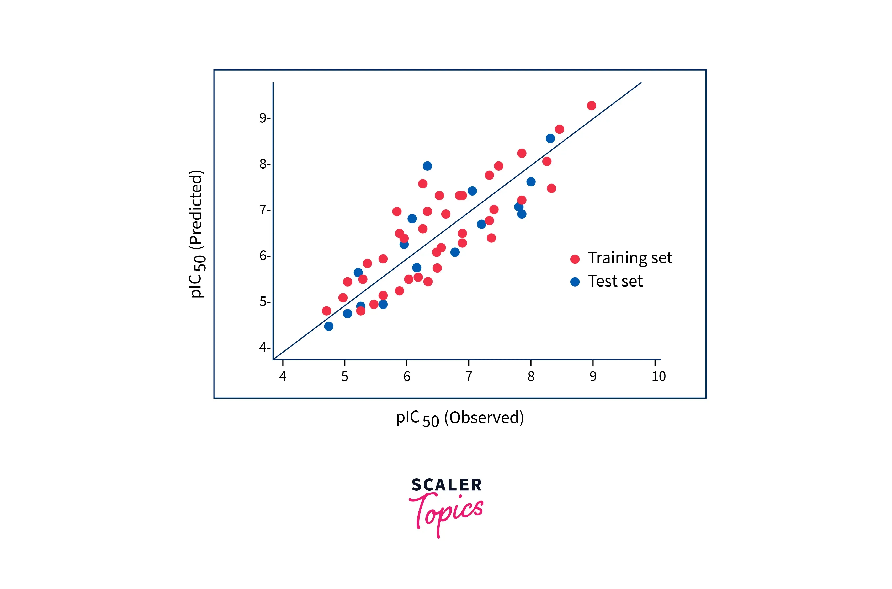

## Table of Contents

## What is a linear model in machine learning?

A linear model in machine learning is a type of model that uses a straight line to make predictions. Imagine you have some data points on a graph, and you draw a line that best fits these points. This line helps you guess where new points might fall. In simple terms, linear models assume that the relationship between the input (like the size of a house) and the output (like its price) is a straight line. The equation for this line is usually written as $$y = mx + b$$, where $$y$$ is the output, $$x$$ is the input, $$m$$ is the slope of the line, and $$b$$ is where the line crosses the y-axis.

Linear models are popular because they are easy to understand and quick to compute. They are often used in regression problems, where you want to predict a number, like house prices or temperatures. But they can also be used in classification problems, where you want to put things into categories, like deciding if an email is spam or not. Even though linear models are simple, they can be very powerful, especially when you have a lot of data or when you combine many linear models together.

## How does a linear model work?

A linear model works by finding the best straight line that fits your data. Imagine you have a bunch of dots on a graph, and you want to draw a line that comes as close as possible to all of them. This line helps you predict where new dots might go. The equation for this line is $$y = mx + b$$. Here, $$y$$ is what you're trying to predict, $$x$$ is your input, $$m$$ is how steep the line is, and $$b$$ is where the line touches the y-axis. The goal is to find the best values for $$m$$ and $$b$$ so the line fits the data well.

To find these best values, a linear model uses a method called "least squares." This means it tries to make the total distance from all the dots to the line as small as possible. The computer does a lot of math to figure out the best line. Once it has the line, you can use it to make predictions. If you have a new $$x$$ value, you plug it into the equation $$y = mx + b$$ and get a prediction for $$y$$. Linear models are simple but powerful because they can handle a lot of data and are easy to understand and use.

## What are the key assumptions of linear models?

Linear models make some important guesses about your data. One big guess is that the relationship between your input (like the size of a house) and your output (like its price) is a straight line. This means if you double the size of the house, the price should go up by a fixed amount, not by some changing amount. Another guess is that the errors, or the differences between the actual data points and the line, are spread out evenly. This is called homoscedasticity. If the errors are all over the place, with some really big and some really small, the model might not work well.

Another important guess is that the errors are normally distributed. This means if you drew a bell curve of all the errors, it would look like a normal bell shape. This helps the model make better predictions. Linear models also assume that the errors are independent, meaning one error doesn't affect another. For example, if you're predicting house prices, the error for one house shouldn't affect the error for another house. If these guesses are wrong, the model might not be very good at predicting new data.

## What are the different types of linear models used in machine learning?

Linear models come in different flavors, each suited for different kinds of problems. The simplest type is the linear regression model, which you use when you want to predict a number. Imagine you're trying to guess house prices based on their size. The model uses a straight line, described by the equation $$y = mx + b$$, to make these predictions. Another type is logistic regression, which is used for classification problems. Instead of predicting a number, logistic regression predicts whether something belongs to one category or another, like deciding if an email is spam or not. It uses a special curve called the sigmoid function to turn the straight line into probabilities.

There are also more advanced linear models like ridge regression and lasso regression. These models are used when you have a lot of input variables, and you want to prevent the model from getting too complicated. Ridge regression adds a penalty to the coefficients of the equation to keep them small, while lasso regression can actually set some coefficients to zero, effectively removing some variables from the model. Both of these methods help to make the model simpler and less likely to overfit, which means it won't just memorize the data but will be better at predicting new data.

## How do you train a linear model?

Training a linear model means finding the best line that fits your data. Imagine you have a bunch of dots on a graph, and you want to draw a line that comes as close as possible to all of them. The equation for this line is $$y = mx + b$$. Here, $$y$$ is what you're trying to predict, $$x$$ is your input, $$m$$ is how steep the line is, and $$b$$ is where the line touches the y-axis. To find the best values for $$m$$ and $$b$$, the model uses a method called "least squares." This means it tries to make the total distance from all the dots to the line as small as possible. The computer does a lot of math to figure out the best line, and once it has it, you can use it to make predictions.

To actually train the model, you usually use a programming language like Python. You start by preparing your data, making sure it's in the right format. Then, you use a library like scikit-learn to create and train your model. For example, you might write code like this:

```python
from sklearn.linear_model import LinearRegression
import numpy as np

# Your data
X = np.array([[1], [2], [3], [4], [5]])
y = np.array([2, 4, 5, 4, 5])

# Create and train the model
model = LinearRegression()
model.fit(X, y)

# Now you can use the model to make predictions
new_X = np.array([[6]])
prediction = model.predict(new_X)
print(prediction)
```

This code creates a linear regression model, trains it on your data, and then uses it to make a prediction. Once the model is trained, you can use it to predict new values by plugging them into the equation $$y = mx + b$$ that the model has figured out.

## What are the common performance metrics for evaluating linear models?

When you train a linear model, you want to know how well it's doing. One common way to check this is by looking at the Mean Squared Error (MSE). MSE is the average of the squares of the errors, which are the differences between what the model predicts and what actually happened. If the MSE is small, it means your model's predictions are usually close to the real values. Another way to evaluate your model is by using the R-squared value. R-squared tells you how much of the variation in your data the model can explain. It's a number between 0 and 1, and a higher number means your model fits the data better. For example, an R-squared of 0.8 means your model explains 80% of the variation in your data.

There are other metrics you can use too. For example, the Mean Absolute Error (MAE) is similar to MSE but it's just the average of the absolute errors, which means it doesn't square the differences. MAE can be easier to understand because it's in the same units as your data. If you're using a linear model for classification, like logistic regression, you might look at the accuracy, which is the percentage of correct predictions. You can also use the confusion matrix to see how your model is doing with different categories. All these metrics help you understand how well your linear model is working and where it might need improvement.

## How can you handle overfitting in linear models?

Overfitting happens when your linear model is too good at fitting the data you used to train it, but it doesn't do well with new data. Imagine you have a bunch of dots on a graph, and you draw a line that goes through every single dot perfectly. That line might not work well if you get new dots because it's too twisty and complicated. To stop overfitting, you can use something called regularization. Regularization adds a penalty to the model to keep it simple. There are two common types of regularization: ridge regression and lasso regression. Ridge regression adds a penalty to all the coefficients in the equation $$y = mx + b$$ to make them smaller, while lasso regression can actually set some coefficients to zero, which means it can remove some variables from the model.

Another way to handle overfitting is by using cross-validation. Cross-validation is like testing your model many times with different parts of your data. You split your data into several pieces, use some pieces to train the model, and then use the other pieces to test it. This helps you see how well your model works with data it hasn't seen before. If your model does well in cross-validation, it's less likely to be overfitting. You can also try to use more data for training. The more data you have, the less likely your model is to overfit because it has more examples to learn from. By using these methods, you can make your linear model more reliable and better at predicting new data.

## What is the role of regularization in linear models?

Regularization helps to stop a linear model from getting too complicated. Imagine you have a bunch of dots on a graph, and you want to draw a line that fits them well. If the line is too twisty and tries to go through every single dot, it might not work well with new dots. Regularization adds a little penalty to the model to keep it simple. This penalty makes the line smoother and less likely to overfit, which means the model won't just memorize the data but will be better at predicting new data. There are two common types of regularization: ridge regression and lasso regression. Ridge regression adds a penalty to all the coefficients in the equation $$y = mx + b$$ to make them smaller, while lasso regression can actually set some coefficients to zero, which means it can remove some variables from the model.

Using regularization can make your linear model more reliable. For example, if you're trying to predict house prices based on their size and other features, regularization helps to balance the importance of each feature. Without regularization, the model might put too much weight on one feature and ignore others, leading to poor predictions. By adding this penalty, the model focuses on the most important features and ignores the less important ones. This makes the model simpler and more likely to work well with new data. In Python, you can use libraries like scikit-learn to apply regularization to your linear models easily.

## How do linear models handle categorical variables?

Linear models usually can't use categorical variables directly because they need numbers to work with. Imagine you want to predict house prices, and one of your variables is the color of the house. You can't just put "red" or "blue" into a linear model because it needs numbers. To fix this, you can use something called one-hot encoding. One-hot encoding turns each category into a new column with a 1 or a 0. For example, if you have three colors - red, blue, and green - you would make three new columns. If a house is red, the "red" column gets a 1, and the other two columns get a 0. This way, the linear model can use these numbers to make predictions.

Another way to handle categorical variables is by using dummy variables. Dummy variables are similar to one-hot encoding but they use a different approach. Instead of making a new column for each category, you make one less column than the number of categories. For example, if you have three colors - red, blue, and green - you would make two columns, say "red" and "blue". If a house is red, the "red" column gets a 1 and the "blue" column gets a 0. If it's blue, the "red" column gets a 0 and the "blue" column gets a 1. If it's green, both columns get a 0. This method helps to avoid something called the "dummy variable trap," where the model can't tell the difference between the categories. In Python, you can use libraries like pandas or scikit-learn to do one-hot encoding or create dummy variables easily.

## What are the advantages and disadvantages of using linear models?

Linear models are easy to understand and use. They work by finding the best straight line to fit your data, using the equation $$y = mx + b$$. This simplicity makes them quick to train and good at handling a lot of data. They are also great at explaining why they make certain predictions because you can see how each input affects the output. For example, if you're predicting house prices, you can see how much the size of the house changes the price. Linear models are also less likely to overfit, especially when you use regularization techniques like ridge or lasso regression. This means they work well with new data.

However, linear models have some downsides. They assume the relationship between your input and output is a straight line, which isn't always true. If the real relationship is more complicated, like a curve, linear models might not work well. They also struggle with categorical variables, like colors or types of houses, unless you turn them into numbers using techniques like one-hot encoding. Another problem is that linear models can be too simple for some problems. If your data has a lot of details and patterns, a more complex model might do a better job at making predictions.

## How do linear models compare to non-linear models in terms of performance and interpretability?

Linear models are simpler and easier to understand than non-linear models. They use a straight line to make predictions, described by the equation $$y = mx + b$$. This simplicity makes them quick to train and good at explaining why they make certain predictions. For example, if you're predicting house prices, you can see how much the size of the house changes the price. Linear models are also less likely to overfit, especially when you use regularization techniques like ridge or lasso regression. This means they work well with new data. However, their simplicity can be a disadvantage if the real relationship between your input and output is more complicated, like a curve.

Non-linear models, on the other hand, can handle more complex relationships between inputs and outputs. They can fit curves and other shapes to the data, which can lead to better predictions when the relationship isn't a straight line. For example, if house prices go up faster as the size increases, a non-linear model can capture this better than a linear model. However, non-linear models are harder to understand and explain. They often have many more parameters, which can make them slower to train and more likely to overfit. This means they might memorize the training data instead of learning general patterns, which can lead to poor performance with new data.

## What advanced techniques can be applied to enhance the performance of linear models?

One way to boost the performance of linear models is by using regularization techniques like ridge regression and lasso regression. Regularization adds a small penalty to the model to keep it simple and prevent overfitting. Ridge regression adds this penalty to all the coefficients in the equation $$y = mx + b$$ to make them smaller, which helps the model focus on the most important features. Lasso regression can actually set some coefficients to zero, effectively removing less important variables from the model. By using these techniques, you can make your linear model more reliable and better at predicting new data.

Another advanced technique is to use ensemble methods, which combine multiple linear models to make better predictions. One popular ensemble method is called bagging, where you train many linear models on different parts of your data and then average their predictions. Another method is boosting, where you train linear models one after the other, with each new model trying to fix the mistakes of the previous ones. These ensemble methods can make your linear model more accurate and less likely to overfit. In Python, you can use libraries like scikit-learn to apply these techniques easily.