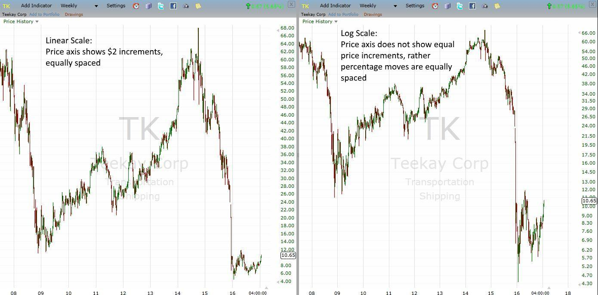

Understanding different pricing methods and chart scales is crucial in financial analysis and trading. This article explores the intricacies of these topics, emphasizing their relevance in algorithmic trading. Financial analysts and traders rely on accurate interpretations of market data to make informed decisions, and a key component of this process involves selecting appropriate pricing and scaling methods.

Financial analysis serves as the backbone for evaluating the viability, stability, and profitability of investment opportunities. Integral to this analysis are various pricing methods, which aid in valuing assets accurately. Methods such as the cost-based, market-based, and income-based approaches each provide unique insights into asset valuation and strategy selection, especially when aligned with algorithmic trading systems.



Furthermore, understanding the application of linear and logarithmic price scales is essential. A linear price scale represents equal value changes uniformly on the vertical axis, offering a straightforward view of price movements, particularly favorable for short-term trading scenarios. In contrast, logarithmic scales plot price changes based on percentage variations, which benefits long-term analysis and managing volatile assets. The choice between these scales significantly impacts trading decisions and strategy development, particularly in algorithmic contexts where precise data interpretation is paramount.

By examining these subjects, traders and analysts can optimize their strategies and improve performance in dynamic markets. This article will discuss the differences between linear and logarithmic scales, their impact on algorithmic trading, and practical applications in various trading scenarios, equipping professionals with the knowledge to enhance their decision-making processes.

## Table of Contents

## Financial Analysis and Pricing Methods

Financial analysis is a cornerstone for assessing the viability, stability, and profitability of investment opportunities. It provides investors and stakeholders with a comprehensive understanding of financial health, guiding informed decision-making. Central to financial analysis are various pricing methods which facilitate the accurate valuation of assets. These methods are essential not only for traditional valuation but also for enhancing the effectiveness of algorithmic trading strategies.

Pricing methods are categorized primarily into three approaches: cost-based, market-based, and income-based. Each approach offers a different perspective on asset valuation, contributing distinct insights pertinent to trading and investment strategies.

1. **Cost-Based Approach**: This method focuses on calculating the cost of replacing or reproducing an asset. It includes tangible factors such as materials, labor, and overheads involved in asset production. The formula typically follows the basic cost equation:
$$
   \text{Asset Cost} = \text{Direct Costs} + \text{Indirect Costs}

$$

   While cost-based valuation provides a tangible measure, it may not capture market dynamics and future profit potential, making it less effective for trading volatile assets.

2. **Market-Based Approach**: Known as the comparative or relative valuation method, it involves assessing an asset based on the price of similar assets in the market. This approach can be particularly useful for assets with abundant market data. It requires analysis of market trends and indexes, often using tools like price-to-earnings (P/E) ratios, price-to-book (P/B) ratios, and other customizable metrics in trading algorithms:

   ```python
   def market_valuation(price, earnings):
       return price / earnings # Price-to-Earnings Ratio
   ```

   The market-based approach is beneficial in reflecting current market conditions and investor sentiment, thus aiding in making timely trading decisions.

3. **Income-Based Approach**: This method projects the present value of expected future cash flows generated by an asset. Calculations often involve discounting future incomes using a pre-determined discount rate. The Discounted Cash Flow (DCF) model is central to this approach:
$$
   \text{DCF} = \sum \frac{CF_t}{(1+r)^t}

$$

   where $CF_t$ is the cash flow at time $t$, and $r$ is the discount rate. This approach is vital for assets expected to produce regular income streams, enabling traders to incorporate expected returns into their algorithms.

Understanding these pricing methods equips traders and analysts with the capability to select suitable strategies, optimizing the potential of [algorithmic trading](/wiki/algorithmic-trading). Each method can be selectively applied depending on the asset class and market situation, providing a tailored approach to maximizing returns and minimizing risks in diverse trading environments.

 to Linear Price Scale

A linear (arithmetic) price scale is a fundamental tool in financial charting where each unit change in price is represented by an equal distance on the chart's vertical axis. This feature makes it a straightforward method to visualize price changes, as each unit of price is depicted proportionally, making it easy to see the actual dollar amount changes over time. This kind of scale is particularly useful for traders who are interested in focusing on the absolute price changes of a security, rather than its percentage movements.

One of the primary benefits of using a linear price scale is its simplicity and ease of interpretation. Since each increment on the y-axis corresponds to an equal dollar value, traders can quickly assess how much a stock's price has moved over a given time period without additional calculations. For example, on a linear scale chart, a move from $50 to $60 would be visualized as the same distance as a move from $100 to $110.

Linear scales are predominantly preferred by day traders who often engage in short-term trading. These traders typically focus on minute-to-minute price movements where percentage changes are less significant compared to raw price changes. For such traders, the ability to quickly gauge absolute price movements can be more advantageous for their trading strategy, which often relies on capturing small price differentials.

In contrast, a linear scale might not be as suitable in scenarios where long-term trends or highly volatile securities are analyzed, as it does not adequately represent the proportional importance of price changes at different levels. For instance, a move from $5 to $10 is a 100% increase that carries a different weight compared to a $5 move from $100 to $105, which is only a 5% increase. Therefore, while a linear scale provides a straightforward view of price movements, it is essential for traders to recognize its limitations in representing relative changes.

To fully utilize a linear price scale, traders can develop algorithms and automated trading strategies that leverage this scale's straightforward nature. By programming trading systems to react to specific absolute price changes, traders can execute strategies that take advantage of the detailed visibility that linear scales offer. This balance of simplicity and precision makes the linear price scale a valuable tool for day traders in particular.

```python
def adjust_linear_scale(data, increment):
    """
    Adjusts the provided price data according to a linear scale.

    Parameters:
    data (list of float): The price data to adjust.
    increment (float): The scale increment representing an equal distance on the chart.

    Returns:
    list of float: Adjusted data reflecting a linear scaling.
    """
    return [price + increment for price in data]
```

This simple Python function demonstrates how linear adjustments can be made to price data, ensuring that each change is consistently represented. Such computational techniques are vital for algorithmic traders who rely on precise data interpretations to inform their trading decisions.

## Linear vs. Logarithmic Price Scale

In financial trading and analysis, selecting the appropriate price scale is crucial for accurate chart interpretation. Two commonly used scales are linear and logarithmic, each with distinct characteristics that influence their application in various trading scenarios.

A **linear price scale**, also known as an arithmetic scale, displays equal vertical distance between identical value changes. For example, an increase from $10 to $20 is represented by the same vertical distance as an increase from $80 to $90. This characteristic makes linear scales straightforward, particularly useful for day traders focusing on short-term price movements where absolute price changes are paramount.

In contrast, a **logarithmic (or log) price scale** measures price changes in terms of percentage increase or decrease. On this scale, equal vertical distances represent equal percentage changes. For instance, a price move from $10 to $20 (a 100% increase) is portrayed with the same vertical distance as a move from $20 to $40. This relative measure is advantageous for analyzing long-term trends or assets with significant [volatility](/wiki/volatility-trading-strategies), as the scale provides a more consolidated view of proportional changes across a broader price range.

Logarithmic scales are particularly beneficial in algorithmic trading where historical data analysis and trend identification are crucial. Algorithms that account for percentage changes rather than absolute ones can better anticipate market movements over extensive periods or interpret large datasets with varying magnitudes. For example, in Python, implementing a logarithmic scale can be achieved easily with libraries such as Matplotlib:

```python
import matplotlib.pyplot as plt

# Example data
prices = [10, 20, 40, 80, 160]
time = range(len(prices))

plt.figure(figsize=(10, 6))
plt.plot(time, prices, label="Linear Scale")
plt.yscale('log')
plt.plot(time, prices, label="Logarithmic Scale")
plt.legend()
plt.title("Price Movement: Linear vs. Logarithmic Scale")
plt.xlabel("Time")
plt.ylabel("Price")
plt.show()
```

Understanding the differences between these two scales is essential as they can heavily influence trading strategies and decisions. Traders using logarithmic scales might focus more on percentage returns, whereas those employing linear scales may concentrate on absolute price movements. While both scales are valuable, selecting one over the other depends on the specific market conditions, trading goals, and the time horizon of interest.

## Algorithmic Trading and Price Scales

Algorithmic trading, which involves using computer algorithms to execute trades at optimal prices, depends significantly on the accurate interpretation of chart data. The price scale selected for these charts, whether linear or logarithmic, can have profound implications on the performance and outcomes of trading algorithms. The choice of scale is integral to how price movements are interpreted and can subsequently influence trading decisions.

Linear price scales are structured such that equal vertical distances represent equal price changes. This characteristic makes them particularly suitable for short-term trading strategies where absolute price changes hold greater significance. For example, if a stock's price moves from $10 to $20, this $10 increase is depicted with the same vertical rise as a movement from $20 to $30. In algorithmic strategies that focus on small, absolute changes, such as intraday trading, a linear scale provides a straightforward view of price moves.

Conversely, logarithmic (or log) scales depict price movements based on percentage changes, rather than absolute changes. This scale is particularly beneficial when analyzing longer-term trends or assets with significant volatility. For instance, a movement from $10 to $20 is a 100% increase and will have the same distance on the y-axis as a movement from $20 to $40 (another 100% increase). Hence, for algorithms concerned with proportional price changes or when analyzing growth patterns over time, the logarithmic scale becomes invaluable.

The impact of selecting between these scales in algorithmic trading can be illustrated through technical indicators. Indicators such as moving averages or relative strength index (RSI) can produce varying signals depending on the scale used. In a Python-based trading algorithm, incorporating both scales could look like this:

```python
import numpy as np

def calculate_moving_average(prices, scale='linear'):
    if scale == 'logarithmic':
        prices = np.log(prices)
    return np.mean(prices)

linear_prices = [10, 15, 20, 25]
log_prices = [10, 20, 40, 80]

linear_ma = calculate_moving_average(linear_prices, 'linear')
logarithmic_ma = calculate_moving_average(log_prices, 'logarithmic')

print("Linear MA:", linear_ma)
print("Logarithmic MA:", logarithmic_ma)
```

In this example, the choice of scale alters the input data, which in turn may affect the trading signals derived from these moving averages. By integrating both linear and logarithmic price scales, traders can develop more nuanced algorithms that account for different market conditions and strategic objectives. This dual-scale approach facilitates a comprehensive analysis of market data, allowing for dynamic adjustments in trading strategies to optimize performance.

## Practical Applications and Examples

Understanding the practical applications of linear and logarithmic price scales can significantly enhance traders' ability to analyze market data effectively and make informed trading decisions. Their application is particularly pertinent when dealing with stock markets, [cryptocurrency](/wiki/cryptocurrency), and other volatile assets where price movements can vary dramatically.

### Case Study 1: Stock Market Analysis

In stock market analysis, selecting the appropriate price scale is crucial for interpreting long-term trends or short-term price movements. Linear price scales are commonly employed for more stable stocks exhibiting steady increases or decreases over time. For instance, a stock that has increased from $10 to $15 represents a $5 gain, and this change is represented equally on a linear scale as from $50 to $55.

Conversely, in the analysis of a volatile asset such as a rapidly growing tech stock, a logarithmic price scale might be more informative. This scale takes into account percentage changes, offering a clearer picture of growth dynamics. For example, increases from $10 to $20 (100% increase) and from $50 to $100 (also a 100% increase) would both be represented as the same vertical distance on a logarithmic chart, providing better insights into growth patterns.

### Case Study 2: Cryptocurrency Market

The cryptocurrency market is notorious for its volatility, often displaying dramatic percentage swings within short periods. Given this high volatility, logarithmic scales are frequently more effective in this context. For instance, a move in Bitcoin’s price from $10,000 to $20,000 (100% increase) is equivalent to a move from $20,000 to $40,000 (also 100% increase) on a logarithmic scale. Such a representation helps traders focus on percentage change rather than absolute price movements, which is significant for evaluating trends and potential investment returns.

Using linear scales for cryptocurrencies can be misleading due to the large absolute changes often seen in these markets. However, when hyper-focus is required on short-term price levels or [day trading](/wiki/day-trading-spy), a linear scale may provide the needed resolution to capture minute fluctuations.

### Case Study 3: Futures and Commodities Markets

Futures and commodities markets also benefit from careful consideration of price scales. For assets such as oil, where price changes can be both substantial and frequent, traders might alternate between linear and logarithmic scales based on their specific trading objectives and the timeframes under consideration. A linear scale might be applied during stable market conditions or for short-term trades where precision in absolute price is crucial. However, when assessing long-term trends where percentage change is more meaningful, a logarithmic scale can reveal underlying growth trends and potential [breakout](/wiki/breakout-trading) points that might be less visible on a linear scale.

The decision-making framework behind choosing the appropriate scale involves understanding the nature of the asset, the trading horizon, and the specific analysis goal. Algorithmic trading, in particular, benefits from such informed choices of scale, wherein algorithms can be tailored to recognize and respond to percentage-based trends using logarithmic scales or precise price levels using linear scales.

In Python, tools like Matplotlib enable traders to visualize price data on both linear and logarithmic scales, aiding in data-driven decision-making processes:

```python
import matplotlib.pyplot as plt
import numpy as np

# Simulated price data
days = np.arange(0, 100, 1)
prices = np.exp(0.05 * days)  # Simulating exponential growth

# Plotting linear scale
plt.figure(figsize=(14, 6))
plt.subplot(1, 2, 1)
plt.plot(days, prices)
plt.title('Linear Price Scale')
plt.xlabel('Days')
plt.ylabel('Price')

# Plotting logarithmic scale
plt.subplot(1, 2, 2)
plt.plot(days, prices)
plt.yscale('log')
plt.title('Logarithmic Price Scale')
plt.xlabel('Days')
plt.ylabel('Price (log scale)')

plt.tight_layout()
plt.show()
```

This Python script illustrates how both scales depict the same exponential growth differently, highlighting their unique advantages for analyzing trading scenarios. By mastering these tools and concepts, traders can better align their strategies with market realities, improving their performance across diverse trading environments.

## Conclusion

Choosing the right price scale is essential for accurate financial analysis and crafting effective algorithmic trading strategies. Both linear and logarithmic scales serve distinct purposes, each offering unique advantages depending on the specific scenarios they are applied to. Linear scales provide a direct representation of price movements by maintaining equal spacing for equal changes in value, making them particularly useful for short-term trading or when the focus is on absolute price changes. In contrast, logarithmic scales represent data points based on percentage changes, which can be invaluable for analyzing long-term trends or trading assets with high volatility, as they offer a more normalized view of price fluctuations over time.

Understanding these intricacies can lead to more sound trading decisions. For instance, algorithmic models designed to exploit short-term market inefficiencies might benefit from a linear scale where sudden, small price shifts are more easily identifiable. Conversely, algorithms aimed at capitalizing on growth trends across extended periods or in volatile markets might be better served by a logarithmic scale, which offers clarity on proportional changes, reducing skewness in data visualization caused by large price differences.

By leveraging both scales appropriately, traders and analysts can optimize their performance in dynamic market conditions. Integrating these insights allows for enhanced analytical capabilities and strategic flexibility, enabling the development of robust trading algorithms that can adapt to varying market environments. Ultimately, the informed and judicious use of price scales can significantly enhance decision-making processes and improve trading outcomes.

## FAQs

### What is the main difference between a linear and logarithmic price scale?

The primary distinction between a linear and a logarithmic price scale lies in how price changes are represented on a chart. In a linear (or arithmetic) price scale, equal distances on the vertical axis correspond to equal price changes. For example, a move from $10 to $20 takes up the same vertical distance as a move from $50 to $60. This makes it suitable for analyzing short-term trends where price changes consistently.

In contrast, a logarithmic price scale represents equal percentage changes equally spaced on the chart. This means that a move from $10 to $20 (a 100% increase) is equivalent to a move from $20 to $40, despite the absolute differences being different. This makes the logarithmic scale better suited for analyzing long-term trends where price changes span multiple orders of magnitude, and small percentage changes matter more.

### How do price scales impact algorithmic trading?

Price scales play a critical role in algorithmic trading by influencing how data is interpreted and processed. Algorithms are often designed to detect patterns, trends, and signals based on historical price movements. The choice between a linear or logarithmic scale affects these detections.

Linear scales are typically used for short-term trading strategies since they emphasize absolute changes; this can help identify entry and [exit](/wiki/exit-strategy) points more clearly. On the other hand, logarithmic scales can be more informative in long-term algorithmic trading strategies, especially in markets with high volatility or during periods of exponential growth, such as technology stocks or cryptocurrencies. 

For example, when programming an algorithm, you might implement a logarithmic transformation of price data to enhance signal detection for percentage-based movements:

```python
import numpy as np

def apply_log_scale(prices):
    return np.log(prices)

prices = [10, 15, 20, 40, 80]
log_prices = apply_log_scale(prices)
print(log_prices)
```

This transformation can optimize the trading algorithm by allowing it to more effectively respond to relative changes.

### When should traders prefer one scale over the other?

Traders should choose between linear and logarithmic scales based on their specific needs and the market context. A linear price scale is preferable when focusing on short-term price movements where the absolute change is more relevant, such as day trading or swing trading scenarios.

Conversely, a logarithmic price scale should be used for long-term investment decisions or when analyzing assets with significant price volatility. This includes scenarios like multi-year stock price evaluations, commodities with significant historic price changes, or situations where exponential growth is anticipated.

Understanding when to employ each scale allows traders to align their analytical approach with their strategic objectives effectively.

## References & Further Reading

[1]: Bergstra, J., Bardenet, R., Bengio, Y., & Kégl, B. (2011). ["Algorithms for Hyper-Parameter Optimization."](https://dl.acm.org/doi/10.5555/2986459.2986743) Advances in Neural Information Processing Systems 24.

[2]: ["Advances in Financial Machine Learning"](https://www.amazon.com/Advances-Financial-Machine-Learning-Marcos/dp/1119482089) by Marcos Lopez de Prado

[3]: ["Evidence-Based Technical Analysis: Applying the Scientific Method and Statistical Inference to Trading Signals"](https://www.amazon.com/Evidence-Based-Technical-Analysis-Scientific-Statistical/dp/0470008741) by David Aronson

[4]: ["Machine Learning for Algorithmic Trading"](https://github.com/stefan-jansen/machine-learning-for-trading) by Stefan Jansen

[5]: ["Quantitative Trading: How to Build Your Own Algorithmic Trading Business"](https://www.amazon.com/Quantitative-Trading-Build-Algorithmic-Business/dp/1119800064) by Ernest P. Chan