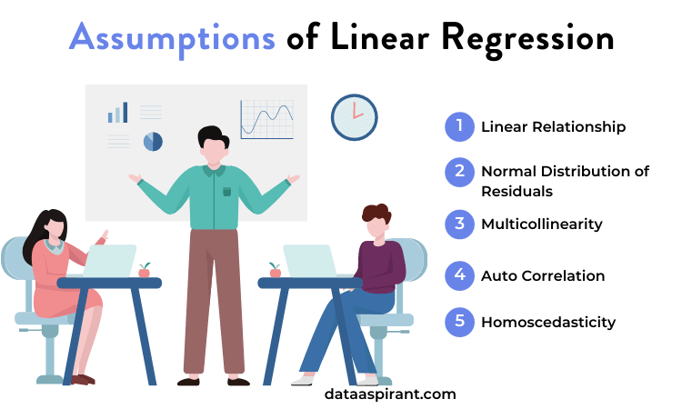

Algorithmic trading involves the use of advanced mathematical models and computational techniques to execute trades at speeds and frequencies that are impossible for human traders. This form of trading relies heavily on quantitative models to analyze vast sets of financial data, identify patterns or trends, and make accurate predictions about future market movements. One of the fundamental tools employed in algorithmic trading is linear regression, which is popular due to its simplicity, efficiency, and strong theoretical foundation.

Linear regression helps traders identify the linear relationship between dependent and independent variables, such as stock prices and economic indicators. By minimizing the sum of the squares of the differences between the observed and predicted values, often through the Ordinary Least Squares (OLS) method, linear regression models can be quickly constructed and interpreted. This accessibility makes it an attractive option for traders looking to incorporate statistical analysis into their trading strategies.



However, the use of linear regression in algorithmic trading is not without its limitations. The purpose of this article is to explore these limitations and to provide insights into why and when traders should be cautious using linear regression models. Factors such as the assumptions underlying linear regression, its simplicity, sensitivity to outliers, and the risk of overfitting and underfitting will be examined. Additionally, alternative strategies and models that can complement or replace linear regression will be discussed. This analysis aims to encourage traders to critically evaluate linear regression to ensure the development of robust trading strategies.

## Table of Contents

## What is Linear Regression?

Linear regression is a fundamental statistical method employed to model the relationship between a dependent variable and one or more independent variables. This relationship is expressed in a linear form, meaning it assumes that changes in the independent variables result in proportional changes in the dependent variable. The basic equation of a simple linear regression can be represented as:

$$

Y = \beta_0 + \beta_1X + \epsilon 
$$

where $Y$ is the dependent variable, $X$ represents the independent variable, $\beta_0$ is the y-intercept, $\beta_1$ is the slope of the line, and $\epsilon$ is the error term signifying the difference between the observed and predicted values.

Linear regression extends to multiple independent variables through multiple linear regression, represented as:

$$

Y = \beta_0 + \beta_1X_1 + \beta_2X_2 + \ldots + \beta_nX_n + \epsilon 
$$

where each $X_i$ represents different independent variables affecting $Y$.

A crucial aspect of linear regression is the method used to estimate the coefficients or parameters ($\beta$ values). Ordinary Least Squares (OLS) is the most commonly used technique for this purpose. The principle of OLS is to minimize the sum of the squared differences between the observed values and those predicted by the linear model. This sum can be expressed as:

$$

\text{minimize} \quad \sum_{i=1}^{n} (Y_i - \hat{Y_i})^2 
$$

By minimizing this function, the OLS method provides the "best fit" line through the data points in the dataset.

The simplicity and interpretability of linear regression make it an attractive choice for modeling in various fields, including finance. However, its assumptions and limitations must be carefully considered to ensure model validity. Linear relationships are not always the best representation of complex real-world data, particularly in financial markets, which often exhibit non-linear patterns due to a multitude of factors.

## Assumptions of Linear Regression

Linear regression is a fundamental statistical tool used to predict the value of a dependent variable based on the values of one or more independent variables. However, for linear regression to provide reliable results, several key assumptions must be met.

1. **Linearity**: This assumption dictates that there is a linear relationship between the dependent variable and the independent variables. Mathematically, this is expressed as $Y = \beta_0 + \beta_1X_1 + \beta_2X_2 + \ldots + \beta_nX_n + \epsilon$, where $\beta_0, \beta_1, \ldots, \beta_n$ are the coefficients and $\epsilon$ is the error term. If the relationship is not linear, the model's predictions may be biased, leading to inaccurate results.

2. **No Multicollinearity**: Multicollinearity occurs when two or more independent variables in the regression model are highly correlated. This can make it difficult to isolate the individual effect of each independent variable on the dependent variable. High multicollinearity can lead to unstable estimates of regression coefficients, making the interpretation and significance testing problematic.

3. **Homoskedasticity**: This assumption implies that the variance of the error terms is constant across all levels of the independent variables. When the error terms exhibit constant variance (homoskedasticity), it ensures that the model provides equally reliable predictions across all observations. In contrast, heteroskedasticity, where the variance changes, can lead to inefficient estimates and affect the statistical tests' validity.

4. **No Autocorrelation**: Autocorrelation refers to the correlation of error terms across observations, which is especially prevalent in time series data. The presence of autocorrelation violates the independence assumption of error terms, leading to underestimated standard errors and overstated statistical significance of variables.

5. **Zero Conditional Mean**: This assumption states that the expected value of the error term, $\epsilon$, given any independent variable $X$, is zero, $E(\epsilon|X) = 0$. This ensures that the independent variables contain all the information needed to predict the dependent variable. Any violation of this assumption implies that there are other variables, not included in the model, affecting the dependent variable.

Meeting these assumptions is essential for the accuracy and reliability of a linear regression model. However, in real-world financial data, these assumptions can be challenging to satisfy. For instance, financial data often exhibit multicollinearity since economic indicators can be interrelated. Moreover, financial time series data frequently suffer from autocorrelation and heteroskedasticity due to market [volatility](/wiki/volatility-trading-strategies) and other irregularities. Recognizing and addressing these potential issues, such as using techniques like variable transformation, adding interaction terms, or employing robust statistical methods, is crucial for developing effective linear regression models in [algorithmic trading](/wiki/algorithmic-trading).

## Simplistic Nature of Linear Regression

Linear regression is one of the most straightforward statistical methods available for modeling relationships between variables, making it a popular choice in many fields, including algorithmic trading. Its simplicity is derived from its basic principle: modeling the relationship between a dependent variable and one or more independent variables as a linear function. This feature allows for easy interpretation and quick implementation, which can be quite advantageous when swift decision-making is necessary.

The primary strength of linear regression is its transparency. Users can easily understand how predictions are derived due to the linear relationship $y = \beta_0 + \beta_1x_1 + \beta_2x_2 + \ldots + \beta_nx_n + \epsilon$, where $y$ is the dependent variable, $x_i$ are independent variables, $\beta_i$ are coefficients, and $\epsilon$ is the error term. This simplicity allows for straightforward assessment of how changes in input variables impact predictions, aiding both interpretability and communication.

However, this strength is also a limitation. Linear regression assumes that the relationship between variables is linear, simplifying the model to the point where it may fail to accurately capture the complexities inherent in real-world financial markets. Financial markets are influenced by myriad factors, including investor sentiment, macroeconomic indicators, geopolitical events, and technological changes, all interacting in non-linear ways that a simple linear model might not be able to encapsulate effectively.

For instance, in volatile markets or during economic crises, relationships between market variables can become highly non-linear. Events such as financial crashes or sudden regulatory changes can introduce complex dynamics that aren't captured by a linear approach. In such scenarios, the rigidity of linear regression can lead to poor predictive performance, as it might overlook significant but non-linear relationships.

Consider a scenario where a stock's price is influenced by multiple factors, such as the overall market index, interest rates, and corporate earnings reports. The relationship between these predictors and the stock price might be non-linear, especially if, for example, [earning](/wiki/earning-announcement) surprises cause disproportionate reactions in stock prices. Here, the assumption of linearity in linear regression may inadequately reflect the true underlying dynamics, resulting in potentially misleading conclusions.

Moreover, linear regression struggles in the presence of interactions between predictors that are not purely additive or when the impact of a predictor varies across its range, circumstances common in financial data. It typically does not account for threshold effects, where financial actions only take place when certain variables surpass specific levels, nor does it adeptly handle conditional relationships that may invert or change under different market conditions.

Therefore, while linear regression's simplicity serves as a useful quality for model transparency and ease of implementation, it is often too simplistic to account for the intricate behaviors present in financial markets. For complex market dynamics, more sophisticated approaches—such as non-linear modeling or [machine learning](/wiki/machine-learning) techniques—might be necessary to deliver the nuanced insights required for robust algorithmic trading strategies.

## Sensitivity to Outliers

Linear regression, while a powerful statistical tool, is notably sensitive to outliers, which are data points that deviate significantly from other observations in the dataset. Outliers can disproportionately affect the model’s predictions by skewing the slope of the regression line, leading to unreliable results. This sensitivity arises because linear regression minimizes the sum of the squared residuals (the differences between observed and predicted values), which gives larger errors disproportionate influence.

In financial data, outliers are common due to market anomalies, unexpected economic events, and irregular market behaviors such as flash crashes or sudden economic announcements. These outliers can lead to significant predictive inaccuracies when utilizing linear regression for algorithmic trading. For example, a sudden spike in the stock market due to geopolitical news can create an outlier that the model incorrectly interprets as a trend, thereby distorting predictions and potentially resulting in suboptimal trading decisions.

To mitigate the impact of outliers on trading models, several strategies can be employed:

1. **Robust Regression Techniques**: Techniques such as Least Absolute Deviations (LAD) or Huber regression can be used instead of Ordinary Least Squares (OLS). These techniques are less sensitive to outliers by reducing the influence of large residuals on the regression line.

   ```python
   from sklearn.linear_model import HuberRegressor

   # Sample data
   X = [[1], [2], [3], [4], [5]]
   y = [1, 2, 3, 4, 100]  # The last point is an outlier

   # Fit Huber Regressor
   huber = HuberRegressor().fit(X, y)
   ```

2. **Data Transformation**: Transformations like logarithmic, square root, or Box-Cox can reduce the skewness and make data more symmetrical, decreasing the effect of outliers.

3. **Outlier Detection and Removal**: Implementing methods to detect and potentially exclude outliers can enhance the model’s robustness. Common techniques include z-score, IQR (Interquartile Range), or clustering methods to identify and remove outliers before modeling.

4. **Regularization**: Methods like Lasso (L1 regularization) or Ridge (L2 regularization) add a penalty for larger coefficients in the model, which can help reduce overreliance on potentially influential outliers.

By integrating these strategies, traders can create more reliable models that are less susceptible to the distorting effects of outliers, thereby improving the robustness of algorithmic trading strategies.

## Overfitting and Underfitting Concerns

Overfitting and underfitting are critical considerations when employing linear regression in algorithmic trading. These issues reflect the balance between a model's complexity and its performance on unseen data, which directly impacts the profitability of trading strategies.

Overfitting occurs when a linear regression model is excessively complex, capturing noise in the data rather than the underlying trend. This results in a model that performs well on training data but poorly on new data. In the context of trading, an overfitted model might generate numerous false signals due to its sensitivity to fluctuations in historical data that do not predict future market movements. For example, incorporating too many variables without proper validation could lead to overfitting, where the model tailors itself to idiosyncrasies rather than general patterns. The mathematical risk is that the estimated regression coefficients become unstable, leading to drastic changes in predictions with minor variations in input data.

Conversely, underfitting occurs when a model is too simplistic to capture the data's underlying structure, often due to insufficient predictors or an overly rigid assumption of linearity. In trading scenarios, underfitted models fail to recognize essential market patterns, resulting in missed trading opportunities. An underfitted linear regression might be evident if the model's predictions show significant bias, unable to adjust adequately to historical fluctuations that drive market dynamics.

Addressing these concerns requires careful model selection and validation techniques. Cross-validation is a potent strategy to detect overfitting and underfitting by dividing the data into subsets, training the model on one subset, and validating it on another. This process ensures the model's robustness across different data segments. Regularization techniques such as Lasso (Least Absolute Shrinkage and Selection Operator) and Ridge regression can also help mitigate overfitting. These methods introduce penalties for larger coefficients, encouraging simpler models that are more generalizable:

```python
from sklearn.linear_model import Lasso, Ridge
import numpy as np

# Sample data
X = np.random.rand(100, 10)
y = np.dot(X, np.random.rand(10)) + np.random.rand(100)

# Lasso model
lasso_model = Lasso(alpha=0.1)
lasso_model.fit(X, y)

# Ridge model
ridge_model = Ridge(alpha=0.1)
ridge_model.fit(X, y)
```

Additionally, dimensionality reduction techniques, such as Principal Component Analysis (PCA), can refine the input variables, thus reducing the noise and improving model simplicity without losing significant predictive power.

Ultimately, the selection of a trading model should focus on balancing complexity and simplicity to capture essential market behaviors while maintaining generalizability to new, unseen data. Utilizing these methods can enhance the performance and effectiveness of [quantitative trading](/wiki/quantitative-trading) strategies implemented through linear regression.

## Alternatives to Linear Regression

Linear regression is a longstanding technique in statistical modeling, but its limitations often necessitate the consideration of alternative approaches, especially in the complex and dynamic field of algorithmic trading. By exploring various non-linear models and machine learning techniques, traders can potentially achieve improved predictive accuracy and robustness in their trading strategies.

**Non-Linear Models**

Non-linear models provide a useful alternative to linear regression, particularly when the relationship between variables is more complex. One common non-linear model is polynomial regression, where the relationship between the independent and dependent variable is modeled as an nth degree polynomial. This model can accommodate curves in the data that a simple linear approach cannot.

Another non-linear technique is the Generalized Additive Model (GAM), which allows for the incorporation of non-linearity through smooth functions. These functions provide the model flexibility to capture more intricate patterns in data without strictly adhering to a parametric form.

**Machine Learning Techniques**

Machine learning methods have become increasingly popular due to their ability to handle complex, high-dimensional data. Decision Trees and their extensions, such as Random Forests and Gradient Boosting Machines, split the data into subsets based on feature values, capturing non-linearity and interaction effects.

Support Vector Machines (SVM) offer another machine learning avenue, focusing on finding a hyperplane that best separates data into classes. While initially devised for classification, SVMs can be adapted for regression tasks (SVR) and handle non-linear relationships through kernel functions.

Neural Networks and Deep Learning models have transformed the landscape of predictive modeling. These models can inherently capture non-linear relationships through more complex architectures composed of multiple layers and nodes. Although computationally intensive, their adaptability and precision make them suitable for large datasets prevalent in financial markets.

**Hybrid Models: Combining Techniques**

To enhance prediction accuracy, combining different models, known as ensemble methods, is a practical strategy. For example, blending linear and non-linear approaches can leverage the simplicity of linear regression with the flexibility of non-linear techniques. Bagging, boosting, and stacking are popular ensemble techniques that improve model performance by aggregating multiple learners.

Incorporating these alternative methodologies can address the constraints of linear regression. By moving beyond linear assumptions, traders can develop models that are better suited to capturing the complexities of financial markets, thus enhancing the effectiveness of algorithmic trading systems.

## Conclusion

Linear regression is a fundamental tool in the landscape of algorithmic trading due to its simplicity and ease of implementation. However, its intrinsic limitations must be carefully considered by traders aiming to harness its full potential while mitigating risks. One primary limitation is its reliance on assumptions such as linearity, homoskedasticity, and no multicollinearity, which are often not satisfied by real-world financial data. These assumptions can result in skewed predictions, leading to suboptimal trading decisions.

Furthermore, linear regression's simplistic nature often fails to capture the complex and dynamic behaviors observed in financial markets. This can lead to scenarios of overfitting, where the model is too tailored to past data and lacks generalization to future unseen scenarios, or underfitting, where the model is too simplistic and misses underlying data complexities. Both situations can detrimentally affect the performance of trading strategies.

Another critical challenge is the sensitivity of linear regression to outliers, a common occurrence within financial datasets. Outliers can disproportionately influence the regression line, leading to inaccurate predictions. Although strategies such as robust regression techniques or data transformation can be employed to mitigate these impacts, they require additional expertise and resources.

In conclusion, while linear regression serves as a valuable starting point in building algorithmic trading models, its limitations necessitate a cautious approach. Traders are encouraged to critically evaluate the suitability of linear regression for their specific trading environments and consider leveraging more sophisticated techniques. Incorporating non-linear models and machine learning methodologies can enhance predictive accuracy and adaptability, resulting in more robust and effective trading strategies. Ultimately, careful model selection and validation are paramount to the successful implementation of any trading strategy.

## References

## References

1. Damodar Gujarati, *Econometrics by Example*. This book provides practical applications of econometric theory, crucial for understanding various models in quantitative finance, including the limitations of linear regression.

2. Frank J. Fabozzi, Sergio M. Focardi, and Svetlozar T. Rachev, *The Basics of Financial Econometrics*. This work offers foundational knowledge on financial data analysis with econometric techniques, helping to grasp the complexities and limitations of linear models in market predictions.

3. Francis X. Diebold, *Econometric Data Science*. This text integrates econometric methods with data science approaches, emphasizing robustness and adaptability in model selection, necessary for addressing the shortcomings of linear regression in ever-changing financial markets.

## References & Further Reading

[1]: Bergstra, J., Bardenet, R., Bengio, Y., & Kégl, B. (2011). ["Algorithms for Hyper-Parameter Optimization."](https://papers.nips.cc/paper/4443-algorithms-for-hyper-parameter-optimization) Advances in Neural Information Processing Systems 24.

[2]: ["Advances in Financial Machine Learning"](https://www.amazon.com/Advances-Financial-Machine-Learning-Marcos/dp/1119482089) by Marcos Lopez de Prado

[3]: ["Evidence-Based Technical Analysis: Applying the Scientific Method and Statistical Inference to Trading Signals"](https://www.amazon.com/Evidence-Based-Technical-Analysis-Scientific-Statistical/dp/0470008741) by David Aronson

[4]: ["Machine Learning for Algorithmic Trading"](https://github.com/stefan-jansen/machine-learning-for-trading) by Stefan Jansen

[5]: ["Quantitative Trading: How to Build Your Own Algorithmic Trading Business"](https://books.google.com/books/about/Quantitative_Trading.html?id=j70yEAAAQBAJ) by Ernest P. Chan