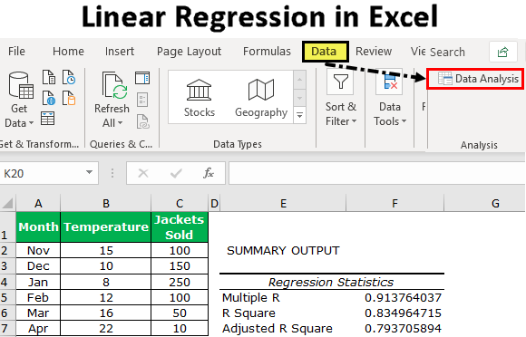

In today's data-driven world, the ability to analyze data and derive meaningful insights is crucial. Organizations and individuals alike rely on data analytics to inform decisions and drive strategic initiatives. Excel, a powerful tool for data analysis, offers numerous functionalities that cater to diverse analytical needs. Its capabilities extend to statistical analysis, where users can compute descriptive statistics like mean, median, and standard deviation, as well as inferential statistics needed to make predictions and decisions based on data. Moreover, Excel's support for linear regression provides users a straightforward means to model relationships between variables, a fundamental aspect of predictive analytics.

These analytical skills have become increasingly important in fields such as finance. In particular, they are vital for developing algorithmic trading strategies. Algorithmic trading involves using pre-defined instructions, executed by software, to trade financial assets. By analyzing historical data and utilizing statistical models, traders can create algorithms that aim to exploit market inefficiencies and enhance trading performance.

This article provides an informative tutorial on using Excel for statistical analysis and linear regression, specifically targeting applications in algorithmic trading. It demonstrates how to harness these capabilities to create effective trading models, interpret results, and optimize decision-making efficiencies. The integration of data analytics within Excel profoundly impacts trading performance, allowing traders to backtest strategies and refine trading algorithms based on empirical evidence.

Join us as we explore the practical application of data analytics in Excel, highlighting its role in informing trading decisions and strategies. By mastering these techniques, traders can equip themselves with the analytical rigor needed to navigate financial markets with greater confidence.

## Table of Contents

## Understanding Statistical Analysis in Excel

Statistical analysis is essential for interpreting data trends and patterns, allowing for informed decision-making. Excel serves as a robust platform for conducting such analyses, equipped with a variety of functions that streamline the statistical process. One of the key resources within Excel for conducting statistical analyses is the Data Analysis Toolpak, an add-in that enhances Excel's capabilities by providing advanced data analysis tools.

To leverage the Data Analysis Toolpak, users must first ensure it is activated. This can be done by navigating to 'File' > 'Options' > 'Add-Ins', then selecting 'Excel Add-ins' and checking 'Analysis Toolpak' before clicking 'OK'. Once activated, the Toolpak provides access to various statistical functions, including descriptive statistics, ANOVA, t-tests, regression analysis, and more.

### Key Statistical Functions in Excel

1. **Mean**: The mean, or average, is calculated using the `AVERAGE` function in Excel. This gives the central value of a dataset. For a dataset $x_1, x_2, \ldots, x_n$, the mean is calculated as:
$$
   \text{Mean} = \frac{1}{n} \sum_{i=1}^{n} x_i

$$

   In Excel, this can be done using the formula `=AVERAGE(range)`.

2. **Median**: The median represents the middle value of a dataset when arranged in order. This can be found using the `MEDIAN` function, which helps to identify the central tendency, particularly when data is skewed.

3. **Standard Deviation**: Standard deviation measures the dispersion or spread of data points around the mean. It is expressed as:
$$
   \text{Standard Deviation} = \sqrt{\frac{1}{n-1} \sum_{i=1}^{n} (x_i - \bar{x})^2}

$$

   In Excel, the function `=STDEV.P(range)` is used for the population standard deviation, while `=STDEV.S(range)` caters to the sample standard deviation.

4. **Variance**: Closely related to standard deviation, variance indicates how much a data set varies. Excel calculates variance using `=VAR.P(range)` for a complete set and `=VAR.S(range)` for a sample.

5. **Correlation**: The correlation coefficient provides insights into the linear relationship between two variables. It is computed using the `CORREL` function and can indicate how variables move in relation to each other.

### Performing Statistical Analysis

Using the Data Analysis Toolpak, users can perform a comprehensive analysis by selecting 'Data Analysis' under the 'Data' tab and choosing the appropriate tool for their dataset. For example, to obtain descriptive [statistics](/wiki/bayesian-statistics), users can select 'Descriptive Statistics' and define the input range, ensuring they check 'Summary statistics' for a detailed breakdown that includes mean, median, mode, standard deviation, and more.

This foundational understanding of statistical analysis in Excel not only prepares users for more advanced analyses but also enhances their ability to interpret and manipulate data effectively. Excel's tools make it possible to convert raw data into actionable insights, crucial for various applications such as financial forecasting, operational efficiency, and beyond.

 to Linear Regression

Linear regression is a statistical method employed to model and examine the relationship between a dependent variable and one or more independent variables. It aims to establish a linear equation, represented as $y = a + bx + \epsilon$, where $y$ is the dependent variable, $x$ is the independent variable, $a$ is the y-intercept, $b$ is the slope of the line indicating how much $y$ changes for a unit change in $x$, and $\epsilon$ is the error term.

In the context of trading, linear regression is valuable for its ability to forecast future price movements based on historical data. By applying linear regression, traders attempt to determine a trend line that best fits the historical prices of an asset, thereby estimating future prices. The strength of this prediction depends largely on the assumption that past patterns will continue, which is a foundational principle in technical analysis.

The significance of linear regression in financial markets is derived from its simplicity and efficiency in analyzing data. As a time-tested tool, it offers insights into how different factors influence asset prices, which is crucial for developing robust trading strategies. It is particularly useful for identifying trends and constructing forecasting models.

Interpreting regression output in Excel involves examining a variety of statistical metrics provided after performing the regression analysis. Among these, the coefficients $a$ and $b$ are crucial, as they define the estimated regression line. The coefficient of determination, $R^2$, indicates the proportion of variance in the dependent variable predictable from the independent variable(s). A high $R^2$ value suggests that the model fits the data well, although it's important to be cautious of overfitting, which occurs when a model captures noise rather than the underlying relationship.

Moreover, Excel provides values for the p-value and t-statistics for the coefficients, which are used to test the hypothesis about the relevance of predictors. A small p-value generally indicates that a change in the predictor's value is significantly associated with changes in the response variable, assuming the influence of other variables is held constant.

Comprehending these concepts elevates your capability to construct effective trading models. By applying linear regression techniques, you can devise strategies that utilize historical price data to forecast future movements, enhancing your decision-making process in trading operations. As a fundamental tool in statistics, mastery of linear regression supports the development of quantitative skills essential for [algorithmic trading](/wiki/algorithmic-trading).

## Implementing Linear Regression in Excel

Excel simplifies the process of performing linear regression with its user-friendly interface and built-in functionalities. To run a linear regression analysis, follow these steps to ensure you achieve accurate and reliable results:

1. **Inputting Data:**
   Begin by organizing your data in a structured format within Excel. Typically, the independent variable (predictor) is placed in one column, while the dependent variable (response) is placed in an adjacent column. Ensure that your data is clean and free from errors, as inaccuracies can distort the regression analysis.

2. **Enabling the Data Analysis Toolpak:**
   Excel's Data Analysis Toolpak is an add-in that provides a suite of data analysis tools, including regression analysis. To activate this tool, navigate to `File` > `Options` > `Add-Ins`. Locate the Analysis Toolpak and click `Go...`, then check the box to enable it. Once activated, you'll find it under the `Data` tab in the Ribbon as `Data Analysis`.

3. **Running Linear Regression:**
   With your data and the Toolpak ready, you can now perform linear regression. Click `Data Analysis` in the Ribbon, then select `Regression` from the list of tools available. Configure the regression dialogue box as follows:
   - **Input Y Range:** Select the dependent variable data range.
   - **Input X Range:** Select the independent variable data range.
   - **Labels:** Check this box if your data range includes labels in the first row.
   - **Output Range:** Choose a location on your worksheet where the results will be displayed.

   Excel will generate an output table that includes key statistical figures, such as coefficients, R-squared, and more.

4. **Interpreting Regression Coefficients:**
   The output table will provide regression coefficients, which quantify the relationship between the independent and dependent variables. The regression equation can be represented as:
$$
   Y = b_0 + b_1X

$$

   where $b_0$ is the intercept and $b_1$ is the slope of the regression line. These coefficients indicate how changes in the predictor variable affect the response variable.

5. **Assessing Goodness-of-Fit:**
   The R-squared value, also located in the output, measures the proportion of variance in the dependent variable that is predictable from the independent variable. A higher R-squared value indicates a better fit of the model to the data.

By mastering linear regression analysis using Excel, you can extract meaningful insights and make data-driven decisions. This technique is invaluable in numerous applications, particularly when forecasting and analyzing trends based on historical data.

## Using Excel for Algo Trading

Algorithmic trading leverages advanced technologies and predefined strategies to execute trades at optimal speeds and efficiency. Excel, while often seen as a basic software tool, can be harnessed effectively for developing and [backtesting](/wiki/backtesting) trading algorithms. At its core, algorithmic trading involves setting up conditions and criteria under which trades are executed. These can be codified into Excel through logical functions and basic programming constructs.

Excel's capabilities extend to powerful data manipulation and analysis, enabling traders to set up simple algorithmic models. By using Excel's built-in functions like `IF`, `AND`, `OR`, and statistical functions such as `AVERAGE`, `STDEV`, traders can model conditions for entering or exiting trades. Moreover, Excel's Visual Basic for Applications (VBA) allows for more complex algorithmic development, enabling traders to automate their strategies beyond the limits of standard spreadsheet functions.

Common trading indicators such as Moving Averages, Relative Strength Index (RSI), and Bollinger Bands can be easily calculated in Excel. For instance, a simple moving average (SMA) can be computed using Excel formulas by averaging a fixed number of historical closing prices. This is done by using formula `=AVERAGE(range)` for the selected period. For implementing other technical indicators like RSI or Bollinger Bands, combining Excel functions with conditional logic can produce dynamic trading signals that respond to live data feeds if available.

Backtesting is a crucial component in validating algorithmic strategies. Excel can access historical data through data import features, allowing traders to apply their models on past price movements. By comparing the outcomes of the strategy against historical market data, traders can identify patterns and refine their approach. This involves analyzing key performance metrics such as total returns, maximum drawdown, and the Sharpe ratio, which measures risk-adjusted returns.

For example, using historical data of a stock, a trader could simulate buy and sell actions based on the crossover of short-term and long-term moving averages. If a short-term moving average crosses above a long-term one, a buy signal is traditionally generated, and conversely, a sell signal when it crosses below. In Excel, such a strategy can be calculated row-by-row using formulas that reference adjacent cells to model these crossovers.

To fully exploit Excel's capacities, traders may integrate VBA macros to automate repetitive tasks, thus enhancing the speed and accuracy of backtests. VBA scripts can loop through datasets, apply formulas, and record results without manual intervention, providing a more robust backtesting framework.

While Excel is a powerful tool for model conceptualization and initial testing, traders should be aware of its limitations with handling very large datasets and real-time data feeds. As trading strategies become more sophisticated, migrating to dedicated trading platforms or programming environments might be necessary to optimize performance and scalability.

In summary, Excel offers a foundational platform for aspiring algorithmic traders to develop and backtest strategies. Through leveraging its vast array of functions and VBA automation, it serves as an accessible entry-point to understanding and executing algorithmic trading models in a controlled environment.

## Case Study: Building a Simple Trading Model

Applying theoretical concepts to real-world scenarios solidifies understanding. In this case study, we explore the development of a basic trading model in Excel by integrating statistical analysis and linear regression. The use of existing data is crucial for demonstrating the process of model building and validation.

### Data Preparation

To begin, we need historical market data, particularly focusing on a single asset, such as a stock or an index. For this case study, let's consider daily closing prices, which can be easily sourced from financial data websites or platforms like Yahoo Finance or Google Finance. Once you have the data, organize it in Excel with columns for date and closing prices. Ensure that the data is clean and free of any inconsistencies.

### Statistical Analysis

The first step in developing a trading model is performing a statistical analysis to identify the underlying data trends and variances. Calculate the mean (average) and standard deviation of the closing prices. 

- **Mean ($\mu$)**: $\mu = \frac{\sum X_i}{n}$

- **Standard Deviation ($\sigma$)**: $\sigma = \sqrt{\frac{\sum (X_i - \mu)^2}{n-1}}$

These calculations give insights into the typical price levels and the extent of price fluctuations.

### Implementing Linear Regression

Linear regression models the relationship between dependent and independent variables. Here, the independent variable could be time (days), while the dependent variable is the closing price.

1. **Define Variables**: 
   - Let $Y$ be the closing prices.
   - Let $X$ represent time or any other indicator like moving averages.

2. **Regression Equation**: 
   - $Y = b_0 + b_1X$, where $b_0$ is the intercept, and $b_1$ is the slope.

3. **Calculate Coefficients**:
   Use Excel’s Data Analysis Toolpak to perform regression, providing detailed outputs such as coefficients, R-squared values, and p-values.

### Building the Trading Model

With the regression analysis complete, develop a basic trading model using Excel formulas. A simple model could involve:

- **Buy Signal**: When the closing price is below the linear regression line, indicating a potential upward movement.
- **Sell Signal**: When the closing price is above the linear regression line, suggesting a potential downward movement.

Excel functions such as `IF`, `AND`, or `OR` can be vital here to define these trading signals in a systematic manner.

### Validation and Backtesting

Backtesting involves applying the model to historical data to evaluate its performance. Calculate key metrics such as returns, maximum drawdown, and Sharpe ratio.

1. **Calculate Returns**: $(Price_{t+1} - Price_{t}) / Price_{t}$
2. **Assess Performance**: Use Excel to chart the results, allowing for quick visual validation of the model's efficacy.

### Insights and Extensions

By the end of this case study, the trading model allows for practical understanding of statistical and regression analysis in trading strategy development. Consider extending the model with more complex algorithms, incorporating additional indicators like RSI (Relative Strength Index) or MACD (Moving Average Convergence Divergence), or employing more complex [machine learning](/wiki/machine-learning) models for enhanced predictions.

By adopting and iterating this methodology, more sophisticated trading systems can be constructed, providing greater insights and potentially more robust trading performance.

## Conclusion

Excel is a versatile tool for analyzing data and building trading strategies. Its functionalities, including statistical analysis and linear regression, offer traders the ability to derive meaningful insights from vast amounts of data. By mastering these skills in Excel, you can significantly enhance your trading decision-making process. Linear regression, for instance, allows traders to model relationships between variables and predict future price movements based on historical data. This capability is vital for those seeking to develop robust trading models.

While Excel does have its limitations, such as processing large datasets less efficiently compared to specialized software or programming languages like Python, it provides a solid foundation for learning and implementing trading algorithms. Excel's user-friendly interface and built-in data analysis tools make it a practical starting point for traders new to algorithmic trading.

We encourage you to continue exploring and refining your skills in statistical analysis and algo trading using Excel. Advancing beyond Excel by incorporating programming languages like Python or R can further enhance analytical capabilities, allowing for more complex models and automation of trading strategies. As you progress, the insights gained from statistical analysis and linear regression will empower you to make more informed trading decisions, ultimately improving trading performance and strategy robustness.

## References & Further Reading

[1]: ["Quantitative Trading: How to Build Your Own Algorithmic Trading Business"](https://books.google.com/books/about/Quantitative_Trading.html?id=j70yEAAAQBAJ) by Ernest P. Chan

[2]: Grinold, Richard C., and Kahn, Ronald N. (2000). ["Active Portfolio Management: A Quantitative Approach for Producing Superior Returns and Controlling Risk"](https://www.amazon.com/Active-Portfolio-Management-Quantitative-Controlling/dp/0070248826). McGraw-Hill.

[3]: ["Financial Modeling using Excel and VBA"](https://www.wiley.com/en-us/Financial+Modeling+Using+Excel+and+VBA-p-9780471651093) by Chandan Sengupta

[4]: ["Advances in Financial Machine Learning"](https://www.wiley.com/en-us/Advances+in+Financial+Machine+Learning-p-9781119482086) by Marcos Lopez de Prado

[5]: ["Evidence-Based Technical Analysis: Applying the Scientific Method and Statistical Inference to Trading Signals"](https://www.amazon.com/Evidence-Based-Technical-Analysis-Scientific-Statistical/dp/0470008741) by David Aronson