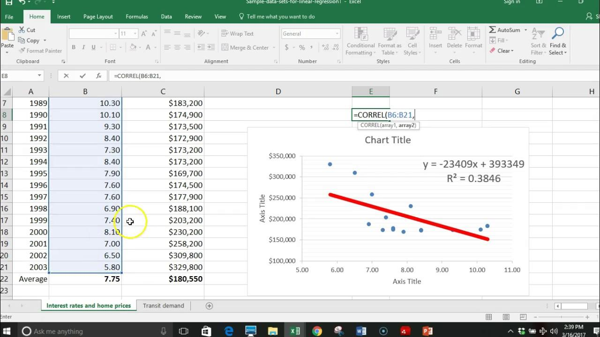

## Table of Contents

## What is linear regression and why is it useful?

Linear regression is a way to find out how one thing can predict another thing. Imagine you want to know if the amount of time you study can predict your test scores. Linear regression helps you draw a straight line through your data points to see this relationship. The line shows the best way to predict the test scores based on the hours studied. This line is called the "line of best fit."

Linear regression is useful because it helps us make predictions and understand relationships between things. For example, businesses can use it to predict sales based on advertising spending. Doctors might use it to see how different factors affect health. By understanding these relationships, we can make better decisions and plans. It's a simple but powerful tool that helps us see patterns in data and use them to our advantage.

## How can I use Excel to perform linear regression?

To use Excel for linear regression, you first need to have your data ready. Imagine you have two columns: one for the hours you studied and another for your test scores. Put these numbers into an Excel sheet. Make sure the hours are in one column and the scores in another. Next, click on the 'Data' tab at the top of Excel. Look for 'Data Analysis' and click on it. If you don't see 'Data Analysis', you need to add it from the 'Add-ins' section. In the 'Data Analysis' window, choose 'Regression' and click 'OK'.

Once you're in the Regression window, you need to tell Excel where your data is. Click on the little box next to 'Input Y Range' and select the column with your test scores. Then, click the box next to 'Input X Range' and select the column with your study hours. Make sure to check the box that says 'Labels' if your columns have titles. After setting this up, click 'OK'. Excel will then show you a bunch of numbers and a chart. The chart will have a line going through your data points, showing the relationship between study hours and test scores. The numbers tell you how strong this relationship is and help you predict future test scores based on study hours.

## What are the basic steps to set up data for linear regression in Excel?

To set up your data for linear regression in Excel, start by organizing your data into two columns. One column should have the thing you want to predict, like test scores, and the other column should have the thing you think affects it, like study hours. Make sure each row has a pair of numbers, one from each column. It's helpful to give each column a clear title at the top, so you remember what each column means.

Once your data is in two columns with titles, you're ready to use Excel's regression tool. Go to the 'Data' tab at the top of Excel and click on 'Data Analysis'. If you don't see 'Data Analysis', you'll need to add it from the 'Add-ins' section. In the 'Data Analysis' window, choose 'Regression' and click 'OK'. Then, select your test scores column as the 'Input Y Range' and your study hours column as the 'Input X Range'. Make sure to check the 'Labels' box if your columns have titles. After setting this up, click 'OK' and Excel will do the rest.

## How do I create a scatter plot in Excel for linear regression analysis?

To create a scatter plot in Excel for linear regression analysis, start by organizing your data into two columns. One column should have the thing you want to predict, like test scores, and the other column should have the thing you think affects it, like study hours. Make sure each row has a pair of numbers, one from each column. It's helpful to give each column a clear title at the top, so you remember what each column means. Once your data is ready, select the two columns by clicking and dragging over them.

After selecting your data, go to the 'Insert' tab at the top of Excel. Click on the 'Scatter' button, and choose the first option, which is a simple scatter plot without lines. This will create a chart showing your data points. To add a trendline, which shows the line of best fit for linear regression, right-click on any of the data points in the chart. Choose 'Add Trendline' from the menu that appears. In the 'Format Trendline' window, make sure to select 'Linear' and check the box that says 'Display Equation on chart' if you want to see the equation of the line. Now you have a scatter plot with a line showing the relationship between your two variables.

## What is the least squares method and how does Excel use it for linear regression?

The least squares method is a way to find the best line that fits through a set of data points. Imagine you have a bunch of dots on a graph, and you want to draw a straight line that comes as close as possible to all of them. The least squares method calculates the line by making the total distance from the line to all the dots as small as possible. It does this by figuring out how far each dot is from the line, squaring those distances, and then adding them up. The line that gives the smallest total of these squared distances is the best fit.

Excel uses the least squares method when you do linear regression. When you select your data and tell Excel to do a regression analysis, it uses this method behind the scenes to find the line of best fit. In the 'Regression' tool under 'Data Analysis', Excel calculates the line that minimizes the squared distances from your data points. This gives you the equation of the line, which you can use to predict future values or understand how one thing affects another. So, when you see the line on your scatter plot or the numbers in the regression output, it's all thanks to the least squares method working to make the line as accurate as possible.

## How do I interpret the slope and intercept in the linear regression equation in Excel?

In a linear regression equation, the slope tells you how much the thing you're trying to predict changes when the thing you're using to predict it changes by one unit. For example, if you're looking at how study hours affect test scores, the slope would tell you how many points your test score is expected to go up for each extra hour you study. If the slope is positive, it means that as the number of study hours goes up, so do the test scores. If it's negative, it means that more study hours lead to lower test scores, which is less common but can happen. The slope is important because it shows the strength and direction of the relationship between the two things you're looking at.

The intercept, also called the y-intercept, is the point where the line of best fit touches the y-axis on your graph. It's the value of the thing you're trying to predict when the thing you're using to predict it is zero. Using the study hours and test scores example again, the intercept would be your expected test score if you studied zero hours. It's like the starting point of your prediction. Even if the intercept doesn't always make practical sense (like getting a score without studying), it's a key part of the equation that helps set the line's position on the graph. Together, the slope and intercept give you a complete picture of how one thing affects another in your data.

## Can Excel calculate the R-squared value, and what does it tell me about my regression model?

Yes, Excel can calculate the R-squared value when you do linear regression. When you use the 'Regression' tool in the 'Data Analysis' section, it gives you a lot of numbers, and one of them is the R-squared value. This number is important because it tells you how well your line of best fit matches your data points.

The R-squared value is a number between 0 and 1. It shows what percentage of the changes in your thing you're trying to predict can be explained by the thing you're using to predict it. For example, if your R-squared is 0.80, it means 80% of the changes in your test scores can be explained by the number of hours you studied. The closer the R-squared is to 1, the better your line fits your data, and the more confident you can be in using it to make predictions. If it's close to 0, it means your line doesn't fit your data very well, and you might need to look for other things that could be affecting your test scores.

## How can I use Excel's Analysis ToolPak for more advanced linear regression?

Excel's Analysis ToolPak is a powerful tool that lets you do more advanced linear regression. It helps you look at how several things at once might affect what you're trying to predict. For example, if you want to see how both study hours and sleep affect test scores, the ToolPak can handle that. You can add more columns of data, like sleep hours, and tell the ToolPak to include them in your regression. It will then show you how each thing affects your test scores and how they work together.

The ToolPak gives you a lot of details, like the R-squared value, which tells you how well your model fits the data. It also shows you p-values, which help you see if the things you're looking at really do affect what you're trying to predict. If a p-value is small, it means that thing probably does make a difference. You can also see the coefficients for each thing, which are like the slopes for each variable in your equation. This helps you understand exactly how each thing changes your test scores. By using the ToolPak, you can get a deeper understanding of your data and make better predictions.

## What are residuals, and how can I check them in Excel to validate my linear regression model?

Residuals are the differences between the actual numbers in your data and the numbers your line of best fit predicts. Imagine you guessed how many points you'd get on a test based on how many hours you studied. The residual is how far off your guess was from your actual score. Checking residuals helps you see if your line of best fit is good or if there's a pattern you missed.

To check residuals in Excel, you first need to do your linear regression using the 'Data Analysis' tool. After you get your results, you can add a new column next to your data where you calculate the residuals. Just subtract the predicted values from the actual values. Then, you can make a scatter plot of these residuals to see if they're spread out evenly above and below zero. If they are, your model is probably good. If you see a pattern, like the residuals getting bigger or smaller as your data goes up, you might need to try a different kind of model.

## How can I perform multiple linear regression in Excel, and what are its advantages?

To do multiple linear regression in Excel, you need the Analysis ToolPak. First, make sure your data is in columns, with each column representing a different thing that might affect what you're trying to predict. For example, you might have columns for study hours, sleep hours, and test scores. Go to the 'Data' tab, click on 'Data Analysis', and choose 'Regression'. In the 'Input Y Range', pick the column with what you're trying to predict, like test scores. In the 'Input X Range', select all the columns that might affect it, like study hours and sleep hours. Click 'OK', and Excel will show you how each thing affects your test scores.

Multiple linear regression is helpful because it lets you see how several things together affect what you're trying to predict. Instead of just looking at how study hours affect test scores, you can also see how sleep hours matter. This can give you a fuller picture of what's going on. It's also good because it can show you if things work together in ways you didn't expect. For example, maybe studying more helps a lot, but only if you also get enough sleep. By using multiple linear regression, you can make better guesses about the future and understand your data better.

## What are some common pitfalls to avoid when using Excel for linear regression?

One common pitfall when using Excel for linear regression is not checking your data for errors. If your data has mistakes, like missing numbers or typos, it can mess up your results. Always take a moment to look over your data and make sure it's correct before you start. Another thing to watch out for is assuming that just because you see a pattern, it means one thing causes another. Sometimes things can look related but aren't really connected. Be careful and think about other reasons why your data might look the way it does.

Another issue is not understanding what the numbers mean. When Excel gives you results like the R-squared value or p-values, it's important to know what they tell you. If you don't, you might think your model is better or worse than it really is. Also, make sure you're using the right kind of regression for your data. If your data doesn't fit a straight line well, trying to use linear regression might lead you to wrong conclusions. Always check if your model makes sense and if there are other ways to look at your data that might work better.

## How can I automate linear regression analysis in Excel using VBA?

To automate linear regression analysis in Excel using VBA, you first need to open the VBA editor by pressing Alt + F11. Then, insert a new module and write a VBA script that tells Excel to do the regression. You'll need to tell the script where your data is, just like when you use the 'Data Analysis' tool. For example, you might tell it that the test scores are in column A and the study hours are in column B. The script can then run the regression automatically and put the results in a new sheet or even make a chart for you. This way, you don't have to do the same steps over and over again.

Using VBA to automate linear regression can save you a lot of time, especially if you need to run the same analysis often. You can set up the script to do everything from calculating the R-squared value to adding a trendline on a chart. Once you have the script, you can run it with just a click of a button. This makes it easy to update your analysis whenever you get new data. Just remember to check your results to make sure everything looks right, because even with automation, mistakes can happen if your data isn't clean or if the script isn't set up correctly.

## What is the process for understanding statistical analysis in Excel?

Statistical analysis is essential for interpreting data trends and patterns, allowing for informed decision-making. Excel serves as a robust platform for conducting such analyses, equipped with a variety of functions that streamline the statistical process. One of the key resources within Excel for conducting statistical analyses is the Data Analysis Toolpak, an add-in that enhances Excel's capabilities by providing advanced data analysis tools.

To leverage the Data Analysis Toolpak, users must first ensure it is activated. This can be done by navigating to 'File' > 'Options' > 'Add-Ins', then selecting 'Excel Add-ins' and checking 'Analysis Toolpak' before clicking 'OK'. Once activated, the Toolpak provides access to various statistical functions, including descriptive statistics, ANOVA, t-tests, regression analysis, and more.

### Key Statistical Functions in Excel

1. **Mean**: The mean, or average, is calculated using the `AVERAGE` function in Excel. This gives the central value of a dataset. For a dataset $x_1, x_2, \ldots, x_n$, the mean is calculated as:
$$
   \text{Mean} = \frac{1}{n} \sum_{i=1}^{n} x_i

$$

   In Excel, this can be done using the formula `=AVERAGE(range)`.

2. **Median**: The median represents the middle value of a dataset when arranged in order. This can be found using the `MEDIAN` function, which helps to identify the central tendency, particularly when data is skewed.

3. **Standard Deviation**: Standard deviation measures the dispersion or spread of data points around the mean. It is expressed as:
$$
   \text{Standard Deviation} = \sqrt{\frac{1}{n-1} \sum_{i=1}^{n} (x_i - \bar{x})^2}

$$

   In Excel, the function `=STDEV.P(range)` is used for the population standard deviation, while `=STDEV.S(range)` caters to the sample standard deviation.

4. **Variance**: Closely related to standard deviation, variance indicates how much a data set varies. Excel calculates variance using `=VAR.P(range)` for a complete set and `=VAR.S(range)` for a sample.

5. **Correlation**: The correlation coefficient provides insights into the linear relationship between two variables. It is computed using the `CORREL` function and can indicate how variables move in relation to each other.

### Performing Statistical Analysis

Using the Data Analysis Toolpak, users can perform a comprehensive analysis by selecting 'Data Analysis' under the 'Data' tab and choosing the appropriate tool for their dataset. For example, to obtain descriptive [statistics](/wiki/bayesian-statistics), users can select 'Descriptive Statistics' and define the input range, ensuring they check 'Summary statistics' for a detailed breakdown that includes mean, median, mode, standard deviation, and more.

This foundational understanding of statistical analysis in Excel not only prepares users for more advanced analyses but also enhances their ability to interpret and manipulate data effectively. Excel's tools make it possible to convert raw data into actionable insights, crucial for various applications such as financial forecasting, operational efficiency, and beyond.

 to Linear Regression

Linear regression is a statistical method employed to model and examine the relationship between a dependent variable and one or more independent variables. It aims to establish a linear equation, represented as $y = a + bx + \epsilon$, where $y$ is the dependent variable, $x$ is the independent variable, $a$ is the y-intercept, $b$ is the slope of the line indicating how much $y$ changes for a unit change in $x$, and $\epsilon$ is the error term.

In the context of trading, linear regression is valuable for its ability to forecast future price movements based on historical data. By applying linear regression, traders attempt to determine a trend line that best fits the historical prices of an asset, thereby estimating future prices. The strength of this prediction depends largely on the assumption that past patterns will continue, which is a foundational principle in technical analysis.

The significance of linear regression in financial markets is derived from its simplicity and efficiency in analyzing data. As a time-tested tool, it offers insights into how different factors influence asset prices, which is crucial for developing robust trading strategies. It is particularly useful for identifying trends and constructing forecasting models.

Interpreting regression output in Excel involves examining a variety of statistical metrics provided after performing the regression analysis. Among these, the coefficients $a$ and $b$ are crucial, as they define the estimated regression line. The coefficient of determination, $R^2$, indicates the proportion of variance in the dependent variable predictable from the independent variable(s). A high $R^2$ value suggests that the model fits the data well, although it's important to be cautious of overfitting, which occurs when a model captures noise rather than the underlying relationship.

Moreover, Excel provides values for the p-value and t-statistics for the coefficients, which are used to test the hypothesis about the relevance of predictors. A small p-value generally indicates that a change in the predictor's value is significantly associated with changes in the response variable, assuming the influence of other variables is held constant.

Comprehending these concepts elevates your capability to construct effective trading models. By applying linear regression techniques, you can devise strategies that utilize historical price data to forecast future movements, enhancing your decision-making process in trading operations. As a fundamental tool in statistics, mastery of linear regression supports the development of quantitative skills essential for [algorithmic trading](/wiki/algorithmic-trading).

## How do you implement linear regression in Excel?

Excel simplifies the process of performing linear regression with its user-friendly interface and built-in functionalities. To run a linear regression analysis, follow these steps to ensure you achieve accurate and reliable results:

1. **Inputting Data:**
   Begin by organizing your data in a structured format within Excel. Typically, the independent variable (predictor) is placed in one column, while the dependent variable (response) is placed in an adjacent column. Ensure that your data is clean and free from errors, as inaccuracies can distort the regression analysis.

2. **Enabling the Data Analysis Toolpak:**
   Excel's Data Analysis Toolpak is an add-in that provides a suite of data analysis tools, including regression analysis. To activate this tool, navigate to `File` > `Options` > `Add-Ins`. Locate the Analysis Toolpak and click `Go...`, then check the box to enable it. Once activated, you'll find it under the `Data` tab in the Ribbon as `Data Analysis`.

3. **Running Linear Regression:**
   With your data and the Toolpak ready, you can now perform linear regression. Click `Data Analysis` in the Ribbon, then select `Regression` from the list of tools available. Configure the regression dialogue box as follows:
   - **Input Y Range:** Select the dependent variable data range.
   - **Input X Range:** Select the independent variable data range.
   - **Labels:** Check this box if your data range includes labels in the first row.
   - **Output Range:** Choose a location on your worksheet where the results will be displayed.

   Excel will generate an output table that includes key statistical figures, such as coefficients, R-squared, and more.

4. **Interpreting Regression Coefficients:**
   The output table will provide regression coefficients, which quantify the relationship between the independent and dependent variables. The regression equation can be represented as:
$$
   Y = b_0 + b_1X

$$

   where $b_0$ is the intercept and $b_1$ is the slope of the regression line. These coefficients indicate how changes in the predictor variable affect the response variable.

5. **Assessing Goodness-of-Fit:**
   The R-squared value, also located in the output, measures the proportion of variance in the dependent variable that is predictable from the independent variable. A higher R-squared value indicates a better fit of the model to the data.

By mastering linear regression analysis using Excel, you can extract meaningful insights and make data-driven decisions. This technique is invaluable in numerous applications, particularly when forecasting and analyzing trends based on historical data.

## References & Further Reading

[1]: ["Quantitative Trading: How to Build Your Own Algorithmic Trading Business"](https://books.google.com/books/about/Quantitative_Trading.html?id=j70yEAAAQBAJ) by Ernest P. Chan

[2]: Grinold, Richard C., and Kahn, Ronald N. (2000). ["Active Portfolio Management: A Quantitative Approach for Producing Superior Returns and Controlling Risk"](https://www.amazon.com/Active-Portfolio-Management-Quantitative-Controlling/dp/0070248826). McGraw-Hill.

[3]: ["Financial Modeling using Excel and VBA"](https://www.wiley.com/en-us/Financial+Modeling+Using+Excel+and+VBA-p-9780471651093) by Chandan Sengupta

[4]: ["Advances in Financial Machine Learning"](https://www.wiley.com/en-us/Advances+in+Financial+Machine+Learning-p-9781119482086) by Marcos Lopez de Prado

[5]: ["Evidence-Based Technical Analysis: Applying the Scientific Method and Statistical Inference to Trading Signals"](https://www.amazon.com/Evidence-Based-Technical-Analysis-Scientific-Statistical/dp/0470008741) by David Aronson