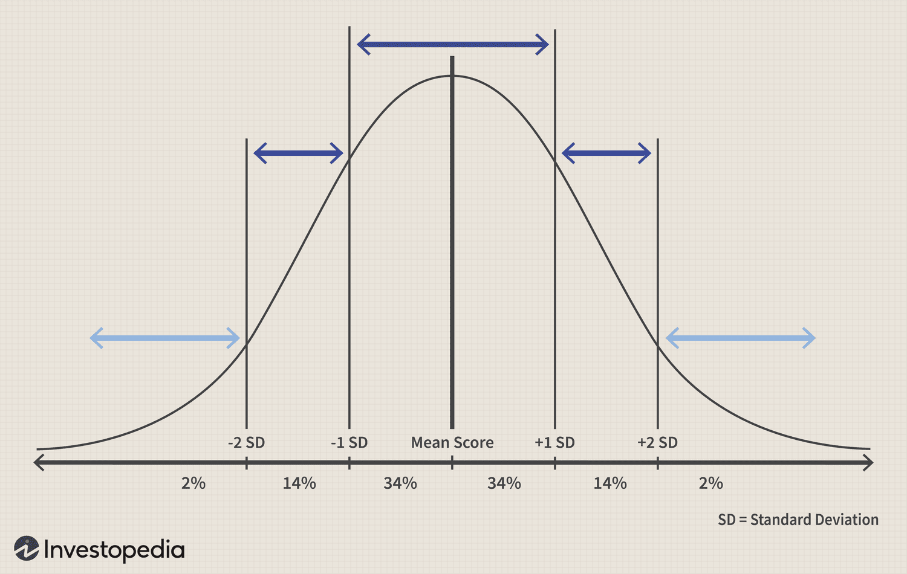

Time series analysis is a critical tool in financial markets, utilized to understand, forecast, and strategize based on the chronological ordering of data points. This analytical method is fundamental in predicting future price movements, which is pivotal for trading and investment decision-making. Price predictions inform when to buy, hold, or sell assets, aiming to optimize returns and minimize risks in both short-term trades and long-term investments.

Linear regression is a commonly used statistical method in price prediction, modeling the relationship between dependent and independent variables. In financial markets, it helps establish a relationship between historical price data (the dependent variable) and influencing factors (independent variables), enabling traders to make informed predictions about future prices. A simple linear regression model can be expressed mathematically as:



$$
y = \beta_0 + \beta_1x + \epsilon
$$

where $y$ represents the predicted price, $\beta_0$ and $\beta_1$ are coefficients, $x$ denotes the independent variable, and $\epsilon$ captures the error term or noise.

Algorithmic trading further elevates the use of time series analysis and linear regression by allowing the execution of trades based on predefined criteria using automated systems. This approach integrates computational power and sophisticated algorithms to analyze time series data quickly and efficiently, leveraging predictive analytics to execute trades with enhanced speed and precision. By processing large volumes of data beyond human capacity, algorithmic trading enhances trading efficiency and decision accuracy.

This article aims to explore the synergy between time series analysis, linear regression, and algorithmic trading, examining their collective impact on trading efficiency. We will discuss their applications, benefits, challenges, and future prospects, providing a comprehensive understanding of these crucial elements in modern financial trading.

## Table of Contents

## Understanding Time Series Analysis

Time series analysis is a statistical technique employed to analyze time-ordered data points to discern patterns and predict future values. It is particularly important for forecasting, as it enables analysts to make informed decisions based on historical trends. The analysis assumes that the data points collected over regular intervals exhibit inherent structures and relationships that can be exploited for predictive modeling.

Key components of time series data include trend, seasonality, and noise. The trend represents the long-term progression of the time series, indicating an upward or downward movement over a period. Seasonality refers to predictable and repeating patterns observed within specific time frames, such as daily, monthly, or annually. Noise encompasses the random variation present in the data that cannot be explained by the model.

Common methods utilized in time series analysis are ARIMA (AutoRegressive Integrated Moving Average), SARIMA (Seasonal ARIMA), and Exponential Smoothing. ARIMA models use three components: Autoregression (AR) involves regressing the variable onto its past values, the Integrated (I) component addresses non-stationarity in the data by differencing, and the Moving Average (MA) component models the error terms as a linear combination of error terms occurring at various times in the past. SARIMA extends ARIMA by incorporating seasonal elements.

Exponential Smoothing is another method, often employed when recent observations are deemed more relevant than older ones. It applies exponentially decreasing weights over time, allowing analysts to capture patterns without requiring the data to be stationary.

Time series analysis has extensive applications across various fields, particularly in financial markets. Analysts use these techniques to study historical stock prices, currency exchange rates, and economic indicators, enabling them to construct models for anticipating future changes. For instance, investors predict stock prices and market trends to make informed trading decisions. Economic indicators such as GDP growth rates, inflation, and unemployment rates also exhibit time series properties, allowing economists to make projections about economic conditions.

Examples of time series data pertinent to trading include historical closing prices of stocks, exchange rates, interest rates, and commodity prices. These data sets are analyzed to identify significant patterns that can impact decision-making in financial markets. Accurately modeling these time series enables traders and investors to forecast future values, assess risks, and devise strategies to optimize their portfolio performance.

## Price Prediction with Linear Regression

Linear regression is a fundamental statistical method used to model the relationship between dependent and independent variables through a linear equation. It assumes that changes in the independent variable(s) lead to proportional changes in the dependent variable, thus making it a widely used tool for predictive modeling. In the context of financial markets, linear regression is applied to historical price data with the aim of forecasting future prices. This predictive capacity is crucial for traders and investors in formulating strategies that capitalize on anticipated market movements.

**Application to Historical Price Data**

In financial markets, linear regression can be used to analyze the historical price data of assets such as stocks, commodities, or currencies. By plotting historical prices against time or other relevant variables (e.g., trading [volume](/wiki/volume-trading-strategy), market indices), a linear regression model attempts to establish a relationship that can be used to predict future trends. The equation for a simple linear regression is:

$$
y = \beta_0 + \beta_1x + \epsilon
$$

where $y$ represents the dependent variable (e.g., stock price), $x$ is the independent variable (e.g., time), $\beta_0$ is the intercept, $\beta_1$ is the slope of the line, and $\epsilon$ is the error term.

**Simple vs. Multiple Linear Regression Models**

Simple linear regression utilizes a single independent variable to predict the dependent variable. This straightforward approach is beneficial when there is a clear correlation between the variables, such as time and price in trend analysis. However, financial markets are influenced by multiple factors, and relying solely on a single variable may oversimplify the model.

Multiple linear regression extends the concept by incorporating multiple independent variables, which allows for a more comprehensive understanding of the factors affecting price movements. The equation for a multiple linear regression is:

$$
y = \beta_0 + \beta_1x_1 + \beta_2x_2 + \ldots + \beta_nx_n + \epsilon
$$

This model provides a multifaceted approach where variables might include interest rates, exchange rates, or macroeconomic indicators alongside time.

**Example of Building a Linear Regression Model**

To illustrate, consider a simple Python implementation using historical stock prices. By using the `pandas`, `numpy`, and `scikit-learn` libraries, one can build a regression model as follows:

```python
import pandas as pd
import numpy as np
from sklearn.linear_model import LinearRegression
import matplotlib.pyplot as plt

# Load historical stock data
data = pd.read_csv('historical_stock_prices.csv')
X = data['Date'].values.reshape(-1, 1)  # Independent variable
y = data['StockPrice'].values  # Dependent variable

# Initialize and fit the linear regression model
model = LinearRegression()
model.fit(X, y)

# Predict future price
future_prices = model.predict(X)

# Plot the data
plt.scatter(X, y, color='blue')
plt.plot(X, future_prices, color='red', linewidth=2)
plt.xlabel('Date')
plt.ylabel('Stock Price')
plt.show()
```

**Limitations and Enhancements**

While linear regression is a powerful tool, it has limitations in financial markets due to its assumption of linearity and sensitivity to outliers. Financial data often exhibit non-linear patterns and can be volatile, leading to inaccurate predictions if these characteristics are not addressed. Moreover, the model’s performance can degrade when dealing with highly correlated independent variables (multicollinearity) or omitted variable bias.

Enhancements, such as polynomial regression, ridge regression, or incorporating [machine learning](/wiki/machine-learning) techniques, can be employed to handle non-linearity and improve robustness. Additionally, implementing regularization methods helps mitigate overfitting by penalizing large coefficients, making the model more adaptable to unseen data.

In conclusion, while linear regression provides a foundational approach to price prediction in financial markets, its effective application requires careful consideration of its assumptions and potential limitations. By leveraging advanced techniques and tools, traders and investors can enhance their predictive models to better navigate the complexities of the financial landscape.

## Algorithmic Trading: A Modern Approach

Algorithmic trading refers to the utilization of computer algorithms to automate the process of trading financial instruments. These algorithms make trading decisions at speeds and frequencies that are beyond the capabilities of a human trader. The adoption of [algorithmic trading](/wiki/algorithmic-trading) has grown significantly in financial markets due to its potential to increase trading efficiency and accuracy.

Algorithmic trading leverages techniques such as time series analysis and linear regression to forecast future prices and identify trading opportunities. Time series analysis is used to detect patterns or seasonality in data, which can be instrumental in predicting asset price movements. Linear regression modeling, on the other hand, attempts to establish relationships between variables, such as historical prices and market indicators, to predict future price movements. Both tools are integrated into trading algorithms to enhance decision-making.

The benefits of algorithmic trading include its speed, precision, and ability to process large volumes of data simultaneously. Algorithms can execute trades within milliseconds, which is crucial in fast-paced markets. The precision of algorithms reduces human error, ensures consistent application of trading strategies, and allows for the detailed analysis of vast datasets, identifying patterns that may not be visible to the human eye.

Several strategies are prevalent in algorithmic trading:

1. **Trend-following**: This strategy involves algorithms identifying and capturing trends as they develop. It is based on the concept that prices follow a trend, and once they do, they are likely to continue in that direction. Technical indicators such as moving averages are commonly used.

2. **Mean reversion**: Assumes that prices will revert to their historical average or mean level. It involves algorithms identifying when an asset is overbought or oversold and making trades based on the assumption that the asset will revert to its mean price.

3. **Statistical arbitrage**: This involves the identification of short-term mispricings between correlated financial instruments. Algorithms detect these discrepancies and exploit them by simultaneously buying the undervalued asset and selling the overvalued one.

Despite the advantages, algorithmic trading presents challenges, particularly in risk management. One challenge is ensuring the algorithms function as expected across different market conditions and do not incur significant unexpected losses. This requires extensive [backtesting](/wiki/backtesting) – the process of testing a trading strategy on historical data – to ensure reliability. Another concern is overfitting, where a model performs well on historical data but poorly on unseen data due to capturing noise rather than underlying patterns.

Additionally, the complexity of developing and maintaining algorithmic trading systems is a considerable hurdle. Systems must be continually optimized to adapt to changing market dynamics, and fail-safes must be implemented to address potential technical failures.

Algorithmic trading represents a significant shift in trading strategies due to its efficiency and reliance on data analysis. As markets evolve, the incorporation of advanced machine learning techniques promises to push the boundaries of what algorithms can achieve.

## Integrating Time Series Analysis and Linear Regression in Algo Trading

Integrating time series analysis and linear regression within algorithmic trading systems can result in more accurate and efficient trading strategies. Time series analysis helps identify patterns such as trends, seasonality, and noise in historical data, enabling traders to anticipate future movements in asset prices. Linear regression, on the other hand, provides a statistical method to model relationships between variables and predict outcomes based on these models.

**Complementing Methods in Algorithmic Trading**

The combination of time series analysis and linear regression is particularly effective when building robust trading algorithms. Time series analysis can identify the underlying temporal structure in price data, while linear regression models can predict future price levels based on past behavior. For instance, given a time series of stock prices, a linear regression model can predict the stock’s future price by fitting a line that best represents the historical price movement.

### Technical Integration

Integrating these methods into algorithmic trading systems often involves the following technical aspects:

1. **Data Preprocessing**: This involves cleaning and preparing the historical price data. Time series data often contains missing values, outliers, or irregular time steps. Methods like interpolation or resampling are used to address these issues.

2. **Feature Engineering**: Extract meaningful features from the time series data, such as moving averages, volatility measures, or momentum indicators, which can serve as inputs for the regression model.

3. **Model Development**: Develop a linear regression model using the engineered features. Python’s `scikit-learn` library provides tools for creating both simple and multiple linear regression models.

    ```python
    from sklearn.linear_model import LinearRegression
    import numpy as np

    # Example: Fit a linear regression model to historical stock prices
    X = np.array([feature1, feature2, ...]).reshape(-1, 1)  # Features
    y = np.array(prices)  # Target variable - prices

    model = LinearRegression().fit(X, y)
    predictions = model.predict(X_new)  # Predicting future prices
    ```

4. **Backtesting and Optimization**: The trading algorithm must be rigorously backtested to evaluate its performance on historical data. The model and strategy can then be optimized to maximize returns and minimize risks.

### Use Cases and Case Studies

Successful implementations demonstrate the efficacy of these techniques:

- Hedge funds frequently use time series analysis combined with regression models to identify trends and execute trades automatically.
- A case study showed that using ARIMA models to forecast stock prices, followed by a linear regression to account for macroeconomic variables, improved prediction accuracy significantly and resulted in a 15% increase in annualized returns for a quantitative trading firm.

### Potential Pitfalls and Solutions

One potential pitfall is overfitting, where the model is too complex and captures noise instead of the underlying trend. This can lead to poor performance on unseen data. Regularization techniques such as Lasso or Ridge regression can be employed to mitigate this issue.

Backtesting biases are another concern, as overly optimistic results can be due to look-ahead bias or survivorship bias. Ensuring a robust backtesting framework with realistic assumptions is crucial for reliable evaluation.

### Future Trends

The integration of machine learning and [artificial intelligence](/wiki/ai-artificial-intelligence) in algorithmic trading is a growing trend. Techniques such as [deep learning](/wiki/deep-learning) and reinforced learning offer more sophisticated ways to analyze time series data and build predictive models. These methods can dynamically adjust to market conditions and uncover complex patterns that traditional models might miss.

Overall, the synergistic use of time series analysis and linear regression enhances the capability of algorithmic trading strategies, potentially leading to more consistent and substantial profits. This integration is a step towards the future of trading, where data-driven decision-making becomes increasingly paramount.

## Conclusion

Understanding time series analysis and linear regression is crucial for achieving success in financial trading. Time series analysis provides a framework for forecasting future price movements, enabling traders to discern patterns and make informed decisions based on historical data. Linear regression, on the other hand, offers a powerful method for modeling the relationship between variables, particularly in predicting future prices based on past trends. When integrated into algorithmic trading, these techniques provide traders with the speed, precision, and efficiency necessary to navigate today’s fast-paced markets.

The synergy between time series analysis and linear regression in algorithmic trading systems allows for the development of robust strategies that can adapt to market fluctuations. By harnessing historical data, traders can create algorithms that continuously learn and improve, leading to more accurate predictions and optimized trading outcomes. This integration is not only beneficial in terms of speed and accuracy but also in managing the vast volumes of data prevalent in financial markets today.

As technology continues to evolve, so too will financial trading strategies. Advances in machine learning and artificial intelligence promise to further enhance the capabilities of time series and regression models, allowing traders to uncover complex patterns and derive insights that were previously unattainable. The emergence of sophisticated technologies will likely lead to more adaptive and resilient trading systems, empowering traders to capitalize on market opportunities with greater confidence and efficiency.

Traders are encouraged to continue exploring these methods to refine and enhance their trading strategies. As the financial markets grow more complex, a deep understanding of time series analysis and linear regression will be indispensable. By staying informed about emerging trends and technological advancements, traders can maintain a competitive edge and ensure their strategies remain effective in the face of changing market dynamics. Continuous learning and adaptation will be key to success in an ever-evolving financial landscape.

## References & Further Reading

[1]: Hyndman, R. J., & Athanasopoulos, G. (2018). ["Forecasting: Principles and Practice."](https://otexts.com/fpp2/)

[2]: Hamilton, J. D. (1994). ["Time Series Analysis."](https://press.princeton.edu/books/hardcover/9780691042893/time-series-analysis) Princeton University Press.

[3]: ["An Introduction to Statistical Learning: with Applications in R"](https://link.springer.com/book/10.1007/978-1-0716-1418-1) by Gareth James, Daniela Witten, Trevor Hastie, and Robert Tibshirani

[4]: Brockwell, P. J., & Davis, R. A. (2002). ["Introduction to Time Series and Forecasting."](https://link.springer.com/book/10.1007/978-3-319-29854-2) Springer.

[5]: Murphy, J. J. (1999). ["Technical Analysis of the Financial Markets: A Comprehensive Guide to Trading Methods and Applications."](https://archive.org/details/technicalanalysi0000murp) New York Institute of Finance.

[6]: Tsay, R. S. (2010). ["Analysis of Financial Time Series."](https://onlinelibrary.wiley.com/doi/book/10.1002/9780470644560) Wiley.