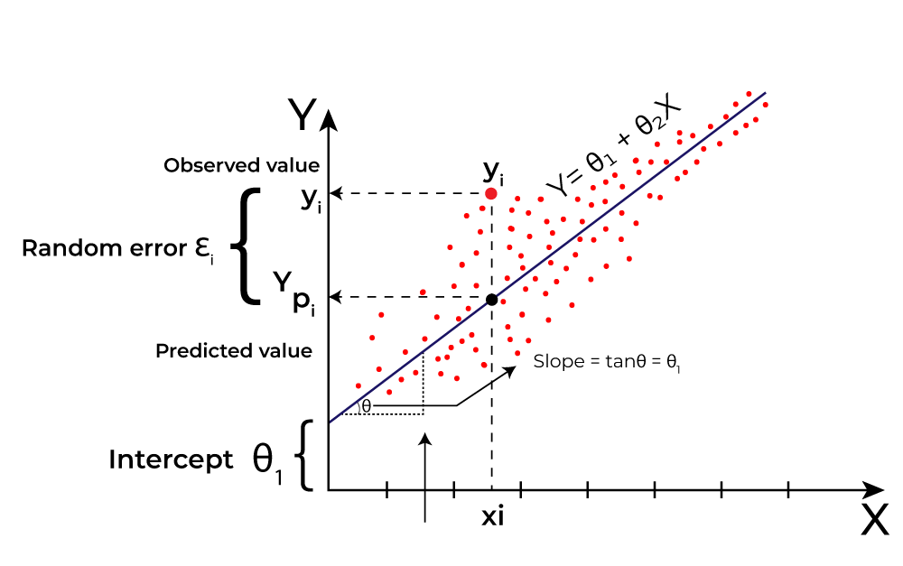

## Table of Contents

## What is linear regression in the context of machine learning?

Linear regression is a simple but powerful tool in machine learning used to predict a number based on other numbers. Imagine you want to guess how much a house will cost based on its size. Linear regression helps you find a straight line that best fits the data points you have, so you can make these predictions. This line is described by the equation $$y = mx + b$$, where $y$ is the predicted value, $x$ is the input value, $m$ is the slope of the line, and $b$ is where the line crosses the y-axis.

To find the best line, linear regression calculates the slope $m$ and the y-intercept $b$ that minimize the difference between the predicted values and the actual values. This difference is called the error, and the goal is to make it as small as possible. Once you have the line, you can use it to predict new values. For example, if you know the size of a new house, you can plug it into the equation and get an estimate of its price. Linear regression is widely used because it's easy to understand and implement, making it a great starting point for many prediction tasks.

## How does linear regression differ from other regression techniques?

Linear regression is different from other regression techniques mainly because it assumes a straight-line relationship between the input and output variables. In linear regression, we try to find the best straight line that fits our data, described by the equation $$y = mx + b$$. This simplicity makes it easy to understand and apply, but it also limits its ability to capture more complex patterns in the data. For example, if the relationship between the input and output is not a straight line, linear regression might not give accurate predictions.

Other regression techniques, like polynomial regression or logistic regression, can handle more complex relationships. Polynomial regression, for instance, uses a curve instead of a straight line, allowing it to fit data that follows a non-linear pattern. The equation for polynomial regression could be something like $$y = ax^2 + bx + c$$. Logistic regression is used when the output is a category rather than a number, like predicting whether an email is spam or not. These methods can provide more accurate predictions for data with non-linear or categorical outcomes, but they are also more complex to set up and interpret.

## What are the basic assumptions of linear regression?

Linear regression makes some guesses about the data to work well. One guess is that the relationship between the input and output is a straight line. This means if you plot the data, you should see a pattern that can be described by the equation $$y = mx + b$$. Another guess is that the data points are spread out evenly around the line. This is called homoscedasticity. If the spread of points gets bigger or smaller as you move along the line, linear regression might not work as well.

Another important guess is that the errors, or the differences between the predicted and actual values, are normally distributed. This means if you make a bell-shaped curve with the errors, it should look balanced. Also, linear regression assumes that the errors are independent of each other. This means knowing one error doesn't help you guess another error. If these guesses are not true, the predictions from linear regression might not be very accurate.

## Can you explain the difference between simple and multiple linear regression?

Simple linear regression is like trying to predict something using just one piece of information. Imagine you want to guess how much a house will cost based on its size. Simple linear regression finds a straight line that best fits the data points you have, so you can make these predictions. This line is described by the equation $$y = mx + b$$, where $y$ is the predicted value, $x$ is the input value, $m$ is the slope of the line, and $b$ is where the line crosses the y-axis. It's simple because it only uses one input to make a prediction.

Multiple linear regression, on the other hand, uses more than one piece of information to make a prediction. For example, instead of just using the size of a house to guess its price, you could also use the number of bedrooms and the age of the house. Multiple linear regression finds the best way to combine all these inputs to predict the output. The equation for multiple linear regression looks like $$y = b_0 + b_1x_1 + b_2x_2 + ... + b_nx_n$$, where $y$ is the predicted value, $x_1, x_2, ..., x_n$ are the different inputs, and $b_0, b_1, b_2, ..., b_n$ are the coefficients that the model figures out. This makes multiple linear regression more powerful because it can consider many factors at once.

## How do you interpret the coefficients in a linear regression model?

In a linear regression model, the coefficients tell you how each input affects the output. For example, if you're trying to predict the price of a house based on its size, the coefficient for size tells you how much the price changes for each additional unit of size. If the coefficient for size is positive, it means that a bigger house will cost more. If it's negative, it means a bigger house will cost less, which is less common but can happen. The size of the coefficient shows how strong the effect is. A bigger number means a bigger change in the output for each change in the input.

The intercept, or the constant term, is like the starting point of your prediction. It's the value of the output when all the inputs are zero. In the equation $$y = mx + b$$, the intercept is $b$. This can be tricky to interpret because it's rare for all inputs to be zero in real life. But it's still an important part of the model because it helps set the baseline for your predictions. Together, the coefficients and the intercept give you a complete picture of how the inputs work together to predict the output.

## What is the significance of the R-squared value in linear regression?

The R-squared value, often written as $$R^2$$, tells you how well your linear regression model fits the data. It's a number between 0 and 1, where a higher number means your model is better at explaining what's going on with your data. Imagine you're trying to predict the price of a house based on its size. If your R-squared value is close to 1, it means your model does a good job of explaining how size affects price. If it's close to 0, it means your model doesn't explain much, and there might be other factors at play that you're not considering.

While R-squared is helpful, it's not perfect. A high R-squared value doesn't always mean your model is great for making predictions. Sometimes, you might add a lot of inputs to your model just to make the R-squared go up, but this can make your model too complicated and less useful for new data. It's important to use R-squared along with other tools to check how good your model really is. This way, you can make sure your model is both accurate and simple enough to be useful.

## How can multicollinearity affect linear regression models, and how can it be detected and addressed?

Multicollinearity happens when two or more input variables in a linear regression model are closely related to each other. This can make it hard for the model to figure out which input is really affecting the output. Imagine you're trying to predict a house's price using both its size and the number of rooms. If these two inputs are very similar, the model might get confused about which one is more important, leading to less accurate predictions. It can also make the coefficients of the inputs less reliable because small changes in the data can cause big changes in the coefficients.

To detect multicollinearity, you can look at the correlation between the inputs. If two inputs have a correlation close to 1 or -1, they might be causing problems. Another way is to use something called the Variance Inflation Factor (VIF). If the VIF for an input is much higher than 1, it's a sign of multicollinearity. To address it, you can remove one of the related inputs from your model, or combine them into a new input that captures their effect. For example, instead of using both size and number of rooms, you could use just size or create a new input that's a mix of both. By doing this, you can make your model simpler and more reliable.

## What are some common methods for validating a linear regression model?

To check if a linear regression model is good, one common method is to split your data into two parts: a training set and a test set. You use the training set to build your model, and then you use the test set to see how well the model predicts new data. If the model does well on the test set, it's a sign that it might work well on new data too. Another way to validate the model is to use cross-validation. This means you split your data into several smaller parts, build the model on all but one part, and then test it on the left-out part. You do this several times, each time leaving out a different part, and then you average the results to get a better idea of how good your model is.

Another important way to validate a linear regression model is to look at the residuals, which are the differences between the actual values and the values predicted by your model. You can plot these residuals to see if they are randomly scattered around zero. If they are, it's a good sign that your model fits the data well. If you see patterns in the residuals, it might mean your model is missing something important. You can also use statistical tests like the F-test to see if the overall model is significant, and t-tests to see if each coefficient in the model is significant. These tests help you understand if the inputs you're using really help predict the output.

In addition to these methods, you can use metrics like the Mean Squared Error (MSE) or the Root Mean Squared Error (RMSE) to measure how far off your predictions are on average. The formula for MSE is $$MSE = \frac{1}{n} \sum_{i=1}^{n} (y_i - \hat{y}_i)^2$$, where $y_i$ is the actual value, $\hat{y}_i$ is the predicted value, and $n$ is the number of observations. A smaller MSE or RMSE means your model is doing a better job at predicting. By using a combination of these validation methods, you can get a good sense of how well your linear regression model works and whether you can trust its predictions.

## How do you handle non-linear relationships in linear regression?

When the relationship between your input and output isn't a straight line, linear regression might not work well. But there are ways to handle this. One way is to transform your data. For example, if the relationship looks like a curve, you can use the logarithm or square root of your input to make it more linear. This is called a transformation. Another way is to add new inputs that are combinations of your original inputs. For example, if you have an input $x$, you can add $x^2$ or $x^3$ as new inputs. This is called polynomial regression, and it can help your model fit curved data better.

Another approach is to use piecewise linear regression. This means you split your data into different sections and fit a different straight line to each section. This can help if the relationship changes at different points. For example, if the effect of house size on price changes after a certain size, you can fit one line for smaller houses and another for larger ones. By using these methods, you can make linear regression work better with data that has non-linear relationships.

## What are regularization techniques like Lasso and Ridge regression, and when should they be used in linear regression?

Regularization techniques like Lasso and Ridge regression are used to make linear regression models better by adding a penalty to the model's complexity. Lasso regression, or Least Absolute Shrinkage and Selection Operator, adds a penalty equal to the sum of the absolute values of the coefficients. This penalty can shrink some coefficients all the way to zero, effectively removing those inputs from the model. The formula for Lasso is $$ \text{Lasso} = \text{MSE} + \alpha \sum_{i=1}^{n} |b_i| $$, where MSE is the mean squared error, $\alpha$ is a tuning parameter, and $b_i$ are the coefficients. Ridge regression, on the other hand, adds a penalty equal to the sum of the squares of the coefficients. This penalty shrinks all coefficients towards zero but doesn't usually make them zero. The formula for Ridge is $$ \text{Ridge} = \text{MSE} + \alpha \sum_{i=1}^{n} b_i^2 $$. Both methods help prevent overfitting, where the model fits the training data too well but doesn't predict new data accurately.

You should use Lasso and Ridge regression when you think your linear regression model might be overfitting. Overfitting happens when your model is too complex and fits the training data too closely, including the noise. This can make your predictions less accurate for new data. Lasso is especially useful when you have a lot of inputs and you think some of them might not be important. It can help you figure out which inputs to keep and which to ignore. Ridge is good when all your inputs are important, but you want to keep the model simple. Both techniques can help you find a balance between fitting your data well and keeping your model simple enough to work well on new data.

## How can you use linear regression for feature selection?

Linear regression can help you pick the most important pieces of information, or features, to use in your model. One way to do this is by using Lasso regression. Lasso adds a penalty to the model that can make some of the coefficients zero. When a coefficient becomes zero, it means that the feature it's connected to doesn't help predict the output, so you can leave it out. The formula for Lasso is $$ \text{Lasso} = \text{MSE} + \alpha \sum_{i=1}^{n} |b_i| $$. Here, MSE is how far off your predictions are on average, $\alpha$ is a number you choose, and $b_i$ are the coefficients. By trying different values of $\alpha$, you can find the right balance between making your model simple and keeping it accurate.

Another way to use linear regression for feature selection is by looking at the p-values of the coefficients. The p-value tells you if a feature is important or if it might just be a coincidence. If the p-value for a coefficient is small, it means the feature is likely important for predicting the output. You can remove features with high p-values because they probably don't help much. By using these methods, you can make your model simpler and better at predicting new data.

## What advanced techniques can be applied to improve the performance of linear regression models?

One advanced technique to improve the performance of linear regression models is to use ensemble methods like bagging and boosting. Bagging, or Bootstrap Aggregating, involves creating multiple versions of your model by training them on different samples of your data. You then combine the predictions from all these models to get a more accurate final prediction. Boosting, on the other hand, builds models one after the other, where each new model tries to fix the mistakes of the previous ones. By using these methods, you can make your linear regression model more robust and less likely to overfit, which means it will work better on new data.

Another technique is to use dimensionality reduction methods like Principal Component Analysis (PCA) before fitting your linear regression model. PCA helps you find new inputs that are combinations of your original inputs but capture the most important information. This can make your model simpler and more accurate. The formula for PCA involves finding the eigenvectors and eigenvalues of the covariance matrix of your data, but the main idea is to reduce the number of inputs without losing much information. By applying PCA, you can improve the performance of your linear regression model by focusing on the most important features.

## References & Further Reading

[1]: Seber, G. A. F., & Lee, A. J. (2012). ["Linear Regression Analysis, Second Edition."](https://onlinelibrary.wiley.com/doi/book/10.1002/9780471722199) Wiley Series in Probability and Statistics.

[2]: Hastie, T., Tibshirani, R., & Friedman, J. (2009). ["The Elements of Statistical Learning: Data Mining, Inference, and Prediction, Second Edition."](https://link.springer.com/book/10.1007/978-0-387-84858-7) Springer Series in Statistics.

[3]: James, G., Witten, D., Hastie, T., & Tibshirani, R. (2013). ["An Introduction to Statistical Learning: with Applications in R."](https://link.springer.com/book/10.1007/978-1-0716-1418-1) Springer Texts in Statistics.

[4]: Montgomery, D. C., Peck, E. A., & Vining, G. G. (2012). ["Introduction to Linear Regression Analysis, Fifth Edition."](https://archive.org/download/econometrics_books/Intro.%20to%20Linear%20Regression%20Analysis%20-%20D.%20C.%20Montgomery%2C%20E.%20A.%20Peck.pdf) Wiley Series in Probability and Statistics.

[5]: Tibshirani, R. (1996). ["Regression Shrinkage and Selection via the Lasso."](https://webdoc.agsci.colostate.edu/koontz/arec-econ535/papers/Tibshirani%20(JRSS-B%201996).pdf) Journal of the Royal Statistical Society: Series B (Methodological).

[6]: Hoerl, A. E., & Kennard, R. W. (1970). ["Ridge Regression: Biased Estimation for Nonorthogonal Problems."](https://www.jstor.org/stable/1267351) Technometrics, 12(1), 55-67.

[7]: ["Hands-On Machine Learning with Scikit-Learn, Keras, and TensorFlow, 2nd Edition."](https://www.amazon.com/Hands-Machine-Learning-Scikit-Learn-TensorFlow/dp/1098125975) by Aurélien Géron.