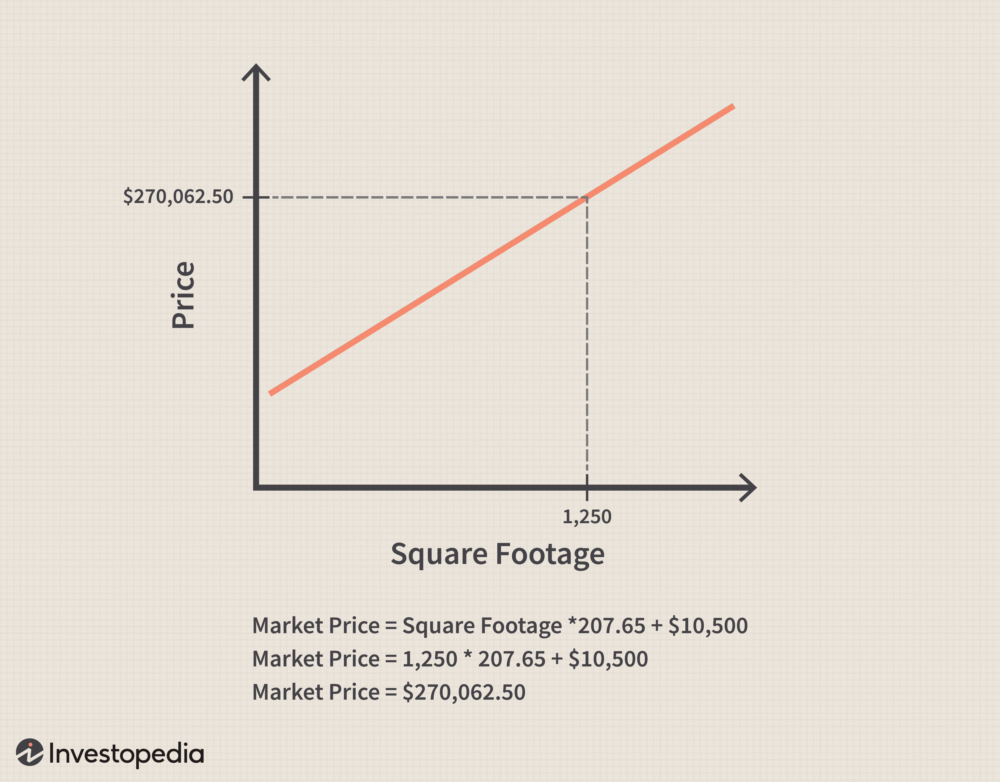

In today's fast-paced financial markets, a firm grasp of linear relationships is essential for both academic study and practical applications such as algorithmic trading. Linear equations serve as a backbone in this understanding, offering insights into how various financial variables interact. At its core, a linear relationship illustrates a direct proportional relationship between variables, often represented by the equation $y = mx + b$, where $m$ denotes the slope and $b$ the y-intercept.

By exploring mathematical concepts and real-world scenarios, this article sheds light on the importance of linear equations in finance, highlighting their role in simplifying complex data and aiding effective decision-making in trading strategies. Linear relationships are vital for quantitative analysis, enabling traders to model and predict market behavior accurately. Understanding these concepts allows financial professionals to develop algorithms that automate trades, optimize strategies, and enhance profitability.



Algorithmic trading, which combines quantitative models and computational efficiency, extensively uses linear relationships to discern patterns and predict market trends. This process demands a thorough understanding of how changes in one financial metric can influence another, underscoring the importance of linear equations. By the end of this article, readers will comprehend how mastering linear relationships not only elevates mathematical proficiency but also provides lucrative opportunities in the financial markets.

## Table of Contents

## Understanding Linear Relationships

A linear relationship is characterized by a consistent, proportional change between two variables. This means that if one variable changes, the other will change by a fixed proportion, without deviation. This fundamental concept is frequently visualized as a straight line on a graph, described mathematically by the equation $y = mx + b$. Here, $m$ represents the slope, showing the rate of change, while $b$ indicates the y-intercept, the value of $y$ when $x$ is zero.

Linear relationships are valuable in various domains such as statistics, economics, and finance. They provide critical insights into how variables interact and influence each other in these fields. For instance, in statistics, linear regression is used to establish a connection between independent and dependent variables, allowing predictions and trend analysis. In economics, linear relationships can explain how a change in a consumer's income might proportionally affect their spending on certain goods. Similarly, in finance, understanding linear relationships helps in assessing risk and return, particularly when analyzing how market factors like interest rates might impact asset prices.

The ability to quantify and model these relationships numerically is crucial. It enables professionals to make informed decisions based on the predictive power of these models. Whether through straightforward analytical methods or more advanced computational techniques, linear relationships serve as the foundation for developing strategies and solutions across numerous disciplines.

## The Mathematical Foundation: Linear Equations

Linear equations are fundamental mathematical constructs that describe linear relationships. These relationships involve changes in one variable resulting in proportional changes in another. The most common form of a linear equation is expressed as $y = mx + b$, where $y$ and $x$ are variables, $m$ represents the slope or the rate of change, and $b$ is the y-intercept, indicating where the line intersects the y-axis.

The slope $m$ quantifies how much $y$ changes for a unit change in $x$. If $m$ is positive, the relationship is directly proportional, meaning $y$ increases as $x$ increases. Conversely, a negative $m$ indicates an inverse or inverse relationship where $y$ decreases as $x$ increases. The y-intercept $b$ represents the value of $y$ when $x$ is zero, setting the starting point of the line on the graph.

Linear equations can be derived from datasets by employing statistical methods such as linear regression, which fits a line to data points in a way that minimizes the difference between the observed data and the values predicted by the line. Python's libraries such as NumPy and SciPy, or even [machine learning](/wiki/machine-learning) platforms like scikit-learn, facilitate this process. Here is a basic example using Python's scikit-learn to perform a linear regression:

```python
from sklearn.linear_model import LinearRegression
import numpy as np

# Sample data
x = np.array([[1], [2], [3], [4], [5]])
y = np.array([2, 4, 6, 8, 10])

# Create and fit the model
model = LinearRegression().fit(x, y)

# Retrieve the slope (m) and intercept (b)
m = model.coef_[0]
b = model.intercept_

print(f"Slope (m): {m}")
print(f"Intercept (b): {b}")
```

In trading, understanding and applying linear equations can assist in analyzing historical price data to forecast future trends. By determining the relationship between factors such as time and price or [volume](/wiki/volume-trading-strategy) and price, traders can develop more effective strategies and make informed decisions. Models based on linear equations simplify otherwise complex datasets into understandable metrics, making them indispensable tools in quantitative finance. Additionally, understanding the limitations of linear models is important, as financial markets often exhibit non-linear behavior due to external influences and market psychology.

## Examples of Linear Relationships in Everyday Life

Linear relationships are commonly encountered in everyday scenarios, reflecting the proportional association between two variables. An apt example is the relationship between speed and time during a journey at constant speed. When traveling at a uniform velocity, the distance covered (d) is directly proportional to the time spent traveling (t), expressed mathematically by the equation $d = vt$, where $v$ represents the speed. 

Another widespread example of a linear relationship is found in income calculations based on hourly wage rates. If an individual earns a fixed hourly wage (w), their total income (I) can be represented as $I = wt$, where $t$ is the number of hours worked. This straightforward relationship helps in budgeting and financial planning, as it establishes direct proportionality between hours worked and income earned.

Managing personal finances also often involves linear relationships, particularly through calculations involving simple interest. The formula for simple interest is $I = P \times r \times t$, where $I$ is the interest earned, $P$ is the principal amount, $r$ is the rate of interest per period, and $t$ is the time the money is invested or borrowed. Simple interest assumes a linear relationship between the principal amount and the interest accrued over time, offering a clear illustration of how financial decisions are influenced by linear calculations.

These examples underscore the ubiquity of linear relationships across various aspects of daily life, highlighting their practical utility in real-world situations through clear and predictable outcomes.

## Linear Relationships in Algorithmic Trading

Algorithmic trading uses advanced mathematical models and computational tools to automatically execute trades at optimal moments. One of the critical elements in this context is the implementation of linear relationships to assess and predict the movements of stocks and other financial instruments. Linear regression models, in particular, are integral to these systems as they help quantify and model the relationships between different market variables, thereby enabling informed trading decisions.

At the core of [algorithmic trading](/wiki/algorithmic-trading)'s utilization of linear relationships is the linear regression model, which is used to comprehend the association between a dependent variable, such as a stock's price, and one or more independent variables, which could include factors like trade volume, market sentiment, or macroeconomic indicators. This relationship is expressed through the linear equation:

$$
y = \beta_0 + \beta_1 x_1 + \beta_2 x_2 + ... + \beta_n x_n + \epsilon
$$

where:
- $y$ denotes the dependent variable (stock price),
- $x_1, x_2, ..., x_n$ represent independent variables,
- $\beta_0$ is the y-intercept,
- $\beta_1, \beta_2, ..., \beta_n$ are the coefficients of the independent variables,
- $\epsilon$ is the error term accounting for the variability not explained by the model.

Linear regression enables traders to forecast stock prices by analyzing historical data to understand existing patterns. For instance, a trader might develop a model where stock price changes are regressed on variables such as historical returns and trade volumes. By fitting the model to historical data, they can identify the coefficients that best predict future price movements.

Python, with its robust libraries like `pandas`, `numpy`, and `scikit-learn`, is a favored language for implementing linear regression models in algorithmic trading. A basic implementation might look like this:

```python
import pandas as pd
from sklearn.linear_model import LinearRegression

# Load historical market data
data = pd.read_csv('historical_stock_data.csv')
X = data[['Volume', 'Previous_Close']]
y = data['Close']

# Create and train the linear regression model
model = LinearRegression()
model.fit(X, y)

# Predict future prices
predictions = model.predict(X)

# Output the predictions
print(predictions)
```

In this script, `Volume` and `Previous_Close` are used as independent variables to predict the `Close` price. This example highlights the simplicity with which linear regression can be applied to trading strategies using easily accessible tools.

Leveraging these models, algorithmic trading systems can execute trades when the predicted price, based on the linear regression model, crosses a specific threshold, thus allowing traders to anticipate and react to market movements accurately. However, to ensure robustness, models need regular updates and validations against current market data to remain relevant, considering the ever-evolving dynamics of financial markets.

## Applications in Algorithmic Trading Strategies

Linear relationships play a crucial role in the development of various algorithmic trading strategies, notably in mean reversion and [momentum](/wiki/momentum) trading. These strategies rely on quantitative models that utilize linear equations to identify and exploit potential market inefficiencies, enabling traders to execute trades that are both timely and efficient.

**Mean Reversion Strategy**

The mean reversion strategy is based on the principle that asset prices and historical returns eventually revert to their long-term mean or average level. This assumption allows traders to predict that if the current price of an asset deviates significantly from its historical average, it is likely to move back towards it. Linear regression models are employed to estimate the mean and quantify deviations from it. The equation often used here is:

$$
\text{Price\_Deviation} = \alpha + \beta \times \text{Historical\_Price} + \epsilon
$$

Where:
- $\alpha$ represents the intercept,
- $\beta$ is the coefficient indicating the strength of the mean reversion,
- $\epsilon$ accounts for the error term.

Python can be utilized to implement a basic mean reversion strategy. Here's a simplistic approach employing a rolling window to calculate the mean and standard deviation:

```python
import numpy as np
import pandas as pd

# Example data
data = pd.Series([some_time_series_data])

# Calculate rolling statistics
window_size = 20  # rolling window size
rolling_mean = data.rolling(window=window_size).mean()
rolling_std = data.rolling(window=window_size).std()

# Strategy: buy when price is below (mean - 1*std), sell when above (mean + 1*std)
buy_signal = data < (rolling_mean - rolling_std)
sell_signal = data > (rolling_mean + rolling_std)
```

**Momentum Trading Strategy**

Momentum trading leverages the concept that stocks that have performed well in the past will continue to perform well in the future, and vice versa for stocks that have performed poorly. Linear relationships are crucial in momentum trading as they help model and quantify the trend strength of asset prices over a specific time frame. The linear regression model is often applied to predict the future price movement, which can be expressed as:

$$
P(t+1) = \gamma + \delta \times P(t) + \eta
$$

Where:
- $P(t+1)$ is the predicted price,
- $\gamma$ is the intercept,
- $\delta$ is the momentum coefficient,
- $\eta$ is the random error term.

Utilizing linear regression to fit a line to historical price data helps determine if an asset's price is trending upwards or downwards, thus informing trading decisions.

By understanding and employing linear relationships, traders can develop robust algorithms that follow predefined rules to execute trades. These algorithms optimize trading efficiency by leveraging the simplicity and predictive power of linear models, ultimately enhancing profitability. As traders become more adept at incorporating complex models into their strategies, they ensure that these models are continually calibrated to reflect changing market conditions. This ongoing process of refinement is crucial for managing risk and maximizing returns in algorithmic trading.

## Challenges and Considerations

Linear models, despite their effectiveness in many domains, have limitations that can significantly impact their reliability in financial trading. A notable challenge associated with using linear models such as linear regression in algorithmic trading is the potential oversimplification of market dynamics. Financial markets are influenced by numerous variables, some of which may change unpredictably and exhibit complex, non-linear relationships. The simplification to linearity may omit significant influences, leading to inaccurate predictions and suboptimal trading decisions.

One primary consideration for traders using linear models is the inherent [volatility](/wiki/volatility-trading-strategies) of markets. Financial markets are characterized by fluctuations that can be abrupt and non-linear in nature, attributed to various factors like geopolitical events, economic announcements, or sudden shifts in investor sentiment. These elements can create data patterns that linear models are not equipped to fully capture or predict. Therefore, while a linear model might accurately predict market trends under stable conditions, its performance can drastically decrease during periods of high volatility.

External economic forces pose another challenge, as they introduce variables beyond historical price patterns and trading volumes. Key economic indicators, policy changes, and global economic trends can influence market behavior in ways that transcend linear assumptions. Linear models generally do not account for the interplay of these complex factors, thereby limiting their effectiveness in dynamic market environments.

Additionally, traders must be wary of the non-linear relationships that pervade market interactions. Many financial instruments and their underlying assets are subject to forces that cause their relationships to deviate from linear assumptions. For example, options pricing models like Black-Scholes involve non-linear elements, and [interest rate](/wiki/interest-rate-trading-strategies) changes can have varied impacts across different durations of bonds.

To address these challenges, traders frequently complement linear models with more sophisticated techniques. Non-linear models, such as machine learning algorithms like random forests or neural networks, can capture the complexity of market data more effectively. These models can identify patterns in large and varied datasets, representing non-linear relationships that linear models might miss. Additionally, incorporating measures such as volatility indices or macroeconomic indicators can enhance the robustness of trading strategies built on linear models, helping to hedge against unexpected market shifts.

In conclusion, while linear models offer a foundational tool for developing [quantitative trading](/wiki/quantitative-trading) strategies, traders must remain vigilant about their limitations. By acknowledging the role of market volatility, external economic forces, and non-linear relationships, traders can better navigate the inherent complexities of the financial markets, potentially leading to more robust and adaptable trading approaches.

## Conclusion

Mastering concepts of linear equations and relationships enhances mathematical acumen and unlocks numerous applications in finance, particularly in algorithmic trading. Linear equations simplify complex data patterns, allowing traders to predict price movements and make informed decisions. These mathematical tools provide the backbone for quantitative analysis, where linear regression models play a pivotal role in identifying and exploiting trends in financial markets.

In algorithmic trading, understanding linear relationships aids in the development of sophisticated trading strategies. By applying linear models, traders can design algorithms that automatically execute trades based on predefined rules, optimizing both efficiency and profitability. For example, using simple linear regression, traders can model relationships between stock prices and other market indicators, implementing strategies like mean reversion or momentum trading.

As financial markets continue to evolve and data becomes increasingly complex, the importance of understanding linear equations persists. While linear models are powerful, caution is advised due to potential oversimplification of market dynamics. Traders must consider external variables and potential non-linear influences that could impact their models. By remaining adaptable and informed, they can navigate the complexities of financial markets with greater efficacy.

In conclusion, linear relationships and equations form a critical component of the toolkit for algorithmic trading. They empower traders with the ability to analyze, predict, and act on financial data efficiently, making them indispensable in the ever-changing landscape of modern finance. As technology and markets advance, a firm grasp of these mathematical concepts remains essential for success.

## References & Further Reading

[1]: Bergstra, J., Bardenet, R., Bengio, Y., & Kégl, B. (2011). ["Algorithms for Hyper-Parameter Optimization."](https://papers.nips.cc/paper/4443-algorithms-for-hyper-parameter-optimization) Advances in Neural Information Processing Systems 24.

[2]: ["Advances in Financial Machine Learning"](https://www.amazon.com/Advances-Financial-Machine-Learning-Marcos/dp/1119482089) by Marcos Lopez de Prado

[3]: ["Evidence-Based Technical Analysis: Applying the Scientific Method and Statistical Inference to Trading Signals"](https://www.amazon.com/Evidence-Based-Technical-Analysis-Scientific-Statistical/dp/0470008741) by David Aronson

[4]: ["Machine Learning for Algorithmic Trading"](https://github.com/stefan-jansen/machine-learning-for-trading) by Stefan Jansen

[5]: ["Quantitative Trading: How to Build Your Own Algorithmic Trading Business"](https://www.amazon.com/Quantitative-Trading-Build-Algorithmic-Business/dp/1119800064) by Ernest P. Chan