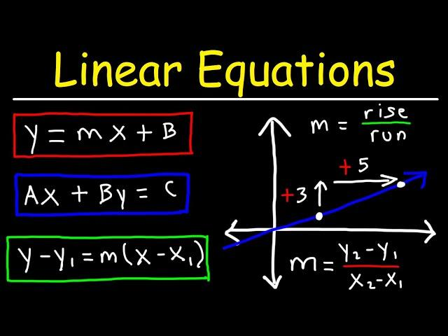

## Table of Contents

## What is a linear relationship?

A linear relationship is when two things change together in a straight line. Imagine you have a graph where one thing is on the bottom (like time) and another thing is on the side (like distance). If you draw a line and it goes straight without bending, that shows a linear relationship. It means if one thing goes up or down, the other thing does the same in a predictable way.

For example, if you are driving a car at a steady speed, the distance you travel increases in a straight line as time goes by. If you drive for 1 hour and go 60 miles, then in 2 hours you will go 120 miles. The relationship between time and distance is linear because the line on the graph connecting these points is straight. This kind of relationship is easy to understand and predict because it follows a simple pattern.

## How is a linear relationship represented graphically?

A linear relationship is shown on a graph as a straight line. Imagine you have a piece of graph paper with numbers along the bottom and up the side. If you plot points that show how two things change together and connect them with a line, a linear relationship will make that line straight, not curved or bent. The line can go up from left to right if both things are increasing together, or it can go down if one thing increases while the other decreases.

The straight line on the graph is like a path that shows how the two things are connected. If you know where to start on the line (that's called the y-intercept), and you know how steep the line is (that's called the slope), you can figure out where the line will go. The slope tells you how much one thing changes when the other thing changes by one unit. So, if you see a straight line on a graph, you know the two things have a linear relationship.

## What is the general formula for a linear equation?

The general formula for a linear equation is written as y = mx + b. In this formula, 'y' and 'x' are the two things you are looking at, like time and distance. The letter 'm' stands for the slope of the line, which tells you how steep the line is. The slope shows how much 'y' changes when 'x' changes by one. The letter 'b' is called the y-intercept, and it's where the line touches the y-axis. That's the starting point of the line when 'x' is zero.

For example, if you have a line where the slope 'm' is 2 and the y-intercept 'b' is 3, the equation would be y = 2x + 3. This means that for every increase of 1 in 'x', 'y' will increase by 2. And when 'x' is 0, 'y' starts at 3. This formula helps you predict what 'y' will be for any value of 'x' as long as the relationship stays linear.

## What do the slope and y-intercept represent in a linear equation?

The slope in a linear equation, which is represented by 'm' in the formula y = mx + b, tells you how steep the line is on a graph. It shows how much the y-value changes when the x-value changes by one. If the slope is a big number, the line will be very steep. If it's a small number, the line will be more flat. A positive slope means the line goes up as you move from left to right on the graph, and a negative slope means the line goes down. The slope helps you understand how the two things you are looking at are connected.

The y-intercept, which is represented by 'b' in the formula y = mx + b, is where the line touches the y-axis on the graph. It's the starting point of the line when the x-value is zero. If you know the y-intercept, you can find out what the y-value is when you start, before any changes in x happen. For example, if the y-intercept is 5, the line will start at the point where y equals 5 on the y-axis. The y-intercept helps you know where the line begins, which is important for understanding the whole relationship between x and y.

## How can you identify a linear relationship from a set of data points?

To find out if a set of data points shows a linear relationship, you can plot the points on a graph and see if they make a straight line. If you can draw a straight line through the points and most of them are close to the line, then the relationship is probably linear. It's okay if the points don't line up perfectly, as long as they follow a general straight path.

Another way to check for a linear relationship is by looking at the numbers. You can calculate the slope between different pairs of points. If the slopes are about the same for all the pairs, it suggests a linear relationship. For example, if the change in y divided by the change in x is always around the same number, then the data points are likely to form a straight line.

## Can you explain the concept of slope and how to calculate it?

The slope is a number that tells you how steep a line is on a graph. It shows how much one thing changes when another thing changes by one. Imagine you are walking up a hill. If the hill is very steep, the slope is a big number. If the hill is not very steep, the slope is a small number. The slope can be positive, which means the line goes up from left to right, or negative, which means the line goes down from left to right.

To calculate the slope, you need two points on the line. Let's call these points (x1, y1) and (x2, y2). The formula to find the slope is: slope = (y2 - y1) / (x2 - x1). This means you take the difference in the y-values and divide it by the difference in the x-values. For example, if you have two points (2, 3) and (4, 7), the slope would be (7 - 3) / (4 - 2) = 4 / 2 = 2. So, the slope of the line between those two points is 2, which means for every increase of 1 in x, y increases by 2.

## What are some real-world examples of linear relationships?

One common example of a linear relationship is the relationship between time and distance when you are driving at a steady speed. If you drive at 60 miles per hour, the distance you travel increases in a straight line as time goes by. For every hour you drive, you go 60 more miles. So, if you drive for 2 hours, you will have traveled 120 miles. This is a linear relationship because the line on a graph showing time and distance would be straight.

Another example is the cost of buying items at a fixed price per item. If you buy apples at $1 each, the total cost of the apples you buy increases linearly with the number of apples. If you buy 5 apples, it costs $5. If you buy 10 apples, it costs $10. The relationship between the number of apples and the total cost is linear because the line on a graph showing the number of apples and the total cost would be straight.

## How do you determine the equation of a line given two points?

To find the equation of a line using two points, you first need to calculate the slope. The slope tells you how steep the line is. Imagine you have two points, let's call them (x1, y1) and (x2, y2). To find the slope, you subtract the y-values and divide by the difference in the x-values. The formula for the slope is (y2 - y1) / (x2 - x1). Once you have the slope, you can use it to write part of the equation of the line.

Next, you need to find the y-intercept, which is where the line touches the y-axis. You can use the slope and one of your points to find the y-intercept. Let's say you have the slope 'm' and you choose to use point (x1, y1). You plug these into the formula y = mx + b and solve for 'b'. For example, if your slope is 2 and you use the point (3, 7), you plug in 7 = 2 * 3 + b, which simplifies to 7 = 6 + b. So, b = 1. Now you have all the pieces to write the equation of the line, which is y = 2x + 1.

## What is the difference between a positive and a negative linear relationship?

A positive linear relationship means that when one thing goes up, the other thing goes up too. Imagine you are filling a bucket with water. The more time you spend filling it, the higher the water level gets. If you draw a graph with time on the bottom and water level on the side, the line would go up from left to right. This shows a positive linear relationship because both things, time and water level, are increasing together.

A negative linear relationship is different. It means that when one thing goes up, the other thing goes down. Think about a car using up gas as it drives. The more time you spend driving, the less gas you have left in the tank. If you draw a graph with driving time on the bottom and gas left on the side, the line would go down from left to right. This shows a negative linear relationship because as driving time increases, the amount of gas decreases.

## How does correlation coefficient relate to linear relationships?

The correlation coefficient is a number that tells you how strong the linear relationship is between two things. It's like a score that shows if the two things move together in a straight line. The correlation coefficient can be between -1 and 1. If it's close to 1, it means there's a strong positive linear relationship, where both things go up together. If it's close to -1, it means there's a strong negative linear relationship, where one thing goes up and the other goes down. If the correlation coefficient is close to 0, it means there's not much of a straight-line relationship between the two things.

You can use the correlation coefficient to understand how well a straight line fits the data points on a graph. If the points on the graph make a clear straight line, the correlation coefficient will be close to -1 or 1, showing a strong linear relationship. If the points are all over the place and don't make a straight line, the correlation coefficient will be close to 0, showing a weak or no linear relationship. This helps you know if you can use a straight line to predict how one thing will change when the other thing changes.

## What are the limitations of using linear models to represent data?

Linear models are great for showing how things change together in a straight line, but they have some limits. One big limit is that they can't show more complex relationships where the change isn't straight. For example, if the relationship between two things starts to curve or bend, a straight line won't fit well. This can happen in real life, like when you keep adding sugar to your coffee; at first, it gets sweeter, but then it might not taste as good if you add too much. A linear model wouldn't be able to show this kind of change.

Another limit is that linear models assume the relationship between the two things stays the same all the time. But in real life, things can change. For example, the relationship between how much you study and your test scores might be different if you start studying a lot more than usual. A linear model would keep the same slope, but in real life, the slope might change. So, using a linear model can sometimes give you the wrong idea about how things will change in the future if the relationship isn't always the same.

## How can linear regression be used to predict future values in a linear relationship?

Linear regression is a way to use a straight line to guess what might happen next in a linear relationship. Imagine you have a bunch of data points on a graph, like how much time you spend studying and your test scores. You can draw a straight line that goes through these points as best as it can. This line helps you see the pattern between the two things. Once you have the line, you can use it to predict what your test score might be if you study for a certain amount of time. The line gives you a way to make a good guess about the future based on what you know now.

For example, if you find that every hour you study, your test score goes up by 5 points, you can use this to predict your score. If you study for 10 hours, the line would tell you that your score should go up by 50 points from where you started. This is helpful because it lets you plan ahead. But remember, this is just a guess. Real life can be more complicated, and sometimes things don't follow the straight line exactly. Still, linear regression gives you a simple and useful way to make predictions when the relationship between two things is pretty straight.

## What are Linear Relationships in Algorithmic Trading?

Algorithmic trading uses advanced mathematical models and computational tools to automatically execute trades at optimal moments. One of the critical elements in this context is the implementation of linear relationships to assess and predict the movements of stocks and other financial instruments. Linear regression models, in particular, are integral to these systems as they help quantify and model the relationships between different market variables, thereby enabling informed trading decisions.

At the core of [algorithmic trading](/wiki/algorithmic-trading)'s utilization of linear relationships is the linear regression model, which is used to comprehend the association between a dependent variable, such as a stock's price, and one or more independent variables, which could include factors like trade [volume](/wiki/volume-trading-strategy), market sentiment, or macroeconomic indicators. This relationship is expressed through the linear equation:

$$
y = \beta_0 + \beta_1 x_1 + \beta_2 x_2 + ... + \beta_n x_n + \epsilon
$$

where:
- $y$ denotes the dependent variable (stock price),
- $x_1, x_2, ..., x_n$ represent independent variables,
- $\beta_0$ is the y-intercept,
- $\beta_1, \beta_2, ..., \beta_n$ are the coefficients of the independent variables,
- $\epsilon$ is the error term accounting for the variability not explained by the model.

Linear regression enables traders to forecast stock prices by analyzing historical data to understand existing patterns. For instance, a trader might develop a model where stock price changes are regressed on variables such as historical returns and trade volumes. By fitting the model to historical data, they can identify the coefficients that best predict future price movements.

Python, with its robust libraries like `pandas`, `numpy`, and `scikit-learn`, is a favored language for implementing linear regression models in algorithmic trading. A basic implementation might look like this:

```python
import pandas as pd
from sklearn.linear_model import LinearRegression

# Load historical market data
data = pd.read_csv('historical_stock_data.csv')
X = data[['Volume', 'Previous_Close']]
y = data['Close']

# Create and train the linear regression model
model = LinearRegression()
model.fit(X, y)

# Predict future prices
predictions = model.predict(X)

# Output the predictions
print(predictions)
```

In this script, `Volume` and `Previous_Close` are used as independent variables to predict the `Close` price. This example highlights the simplicity with which linear regression can be applied to trading strategies using easily accessible tools.

Leveraging these models, algorithmic trading systems can execute trades when the predicted price, based on the linear regression model, crosses a specific threshold, thus allowing traders to anticipate and react to market movements accurately. However, to ensure robustness, models need regular updates and validations against current market data to remain relevant, considering the ever-evolving dynamics of financial markets.

## What are the applications in algorithmic trading strategies?

Linear relationships play a crucial role in the development of various algorithmic trading strategies, notably in mean reversion and [momentum](/wiki/momentum) trading. These strategies rely on quantitative models that utilize linear equations to identify and exploit potential market inefficiencies, enabling traders to execute trades that are both timely and efficient.

**Mean Reversion Strategy**

The mean reversion strategy is based on the principle that asset prices and historical returns eventually revert to their long-term mean or average level. This assumption allows traders to predict that if the current price of an asset deviates significantly from its historical average, it is likely to move back towards it. Linear regression models are employed to estimate the mean and quantify deviations from it. The equation often used here is:

$$
\text{Price\_Deviation} = \alpha + \beta \times \text{Historical\_Price} + \epsilon
$$

Where:
- $\alpha$ represents the intercept,
- $\beta$ is the coefficient indicating the strength of the mean reversion,
- $\epsilon$ accounts for the error term.

Python can be utilized to implement a basic mean reversion strategy. Here's a simplistic approach employing a rolling window to calculate the mean and standard deviation:

```python
import numpy as np
import pandas as pd

# Example data
data = pd.Series([some_time_series_data])

# Calculate rolling statistics
window_size = 20  # rolling window size
rolling_mean = data.rolling(window=window_size).mean()
rolling_std = data.rolling(window=window_size).std()

# Strategy: buy when price is below (mean - 1*std), sell when above (mean + 1*std)
buy_signal = data < (rolling_mean - rolling_std)
sell_signal = data > (rolling_mean + rolling_std)
```

**Momentum Trading Strategy**

Momentum trading leverages the concept that stocks that have performed well in the past will continue to perform well in the future, and vice versa for stocks that have performed poorly. Linear relationships are crucial in momentum trading as they help model and quantify the trend strength of asset prices over a specific time frame. The linear regression model is often applied to predict the future price movement, which can be expressed as:

$$
P(t+1) = \gamma + \delta \times P(t) + \eta
$$

Where:
- $P(t+1)$ is the predicted price,
- $\gamma$ is the intercept,
- $\delta$ is the momentum coefficient,
- $\eta$ is the random error term.

Utilizing linear regression to fit a line to historical price data helps determine if an asset's price is trending upwards or downwards, thus informing trading decisions.

By understanding and employing linear relationships, traders can develop robust algorithms that follow predefined rules to execute trades. These algorithms optimize trading efficiency by leveraging the simplicity and predictive power of linear models, ultimately enhancing profitability. As traders become more adept at incorporating complex models into their strategies, they ensure that these models are continually calibrated to reflect changing market conditions. This ongoing process of refinement is crucial for managing risk and maximizing returns in algorithmic trading.

## References & Further Reading

[1]: Bergstra, J., Bardenet, R., Bengio, Y., & Kégl, B. (2011). ["Algorithms for Hyper-Parameter Optimization."](https://papers.nips.cc/paper/4443-algorithms-for-hyper-parameter-optimization) Advances in Neural Information Processing Systems 24.

[2]: ["Advances in Financial Machine Learning"](https://www.amazon.com/Advances-Financial-Machine-Learning-Marcos/dp/1119482089) by Marcos Lopez de Prado

[3]: ["Evidence-Based Technical Analysis: Applying the Scientific Method and Statistical Inference to Trading Signals"](https://www.amazon.com/Evidence-Based-Technical-Analysis-Scientific-Statistical/dp/0470008741) by David Aronson

[4]: ["Machine Learning for Algorithmic Trading"](https://github.com/stefan-jansen/machine-learning-for-trading) by Stefan Jansen

[5]: ["Quantitative Trading: How to Build Your Own Algorithmic Trading Business"](https://www.amazon.com/Quantitative-Trading-Build-Algorithmic-Business/dp/1119800064) by Ernest P. Chan