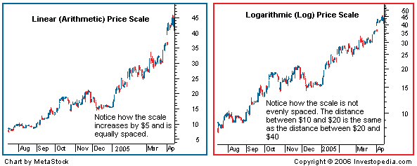

Algorithmic trading is an investment practice that employs computer algorithms to execute a significant number of trades at very high speeds. At the core of this process is data analysis, where the representation of data plays a critical role. The ability to effectively interpret market data hinges upon the type of charts used to visualize price movements over time. Among the most commonly used chart types in financial analysis are linear and logarithmic charts.

A thorough understanding of the differences between linear and logarithmic charts is essential for traders aiming to make informed decisions based on market trends. Linear charts and logarithmic charts each offer distinct advantages depending on the trader's goals and the nature of the asset being analyzed. Linear charts are typically used for their straightforward representation of absolute changes in price, while logarithmic charts provide a view that emphasizes percentage changes. This distinction is particularly pertinent in algo trading, where data-driven decisions are paramount and the choice of chart type can influence strategy development and execution.



This article will explore the fundamental differences between linear and logarithmic charts, emphasizing their relevance in algorithmic trading. It will discuss the impact of each chart type on the perception of market trends and the implications for trading strategies. By understanding these differences, traders can better select the appropriate chart type that aligns with their trading objectives, ultimately enhancing their analytical precision and decision-making capabilities.

## Table of Contents

## What is a Linear Chart?

In a linear chart, the y-axis represents data values at equal intervals, meaning that every unit change is depicted as the same vertical distance on the chart, regardless of the value level at which this change occurs. For instance, a rise in price from $50 to $51 is shown with an identical increment on the y-axis as a rise from $100 to $101, highlighting that this chart type visualizes absolute value changes. 

Linear charts are particularly beneficial when analyzing data over short periods or when dealing with relatively stable price movements. They provide a clear and straightforward representation, making it easier for traders to quickly assess short-term trends and price dynamics. This simplicity is one [factor](/wiki/factor-investing) contributing to their popularity among traders focusing on brief, intraday trading sessions where precise, absolute price changes are of primary interest.

Because of their even spacing of value increments, linear charts can sometimes obscure the significance of larger proportional changes, especially when dealing with data spanning vast value ranges or long durations. For example, with considerable price movements typically found in volatile markets or over extended periods, such as stock indices or commodities like oil, interpreting the scale of these movements using linear charts can be less intuitive. Nonetheless, for short-term traders, the linear chart's ability to reflect quick, specific price progression remains a pivotal tool.

## What is a Logarithmic Chart?

A logarithmic chart represents percentage changes instead of absolute amounts. Unlike linear charts, where equal spacing is used for equal increments in value on the y-axis, logarithmic charts use a scale where each equal spacing represents an equal percentage change. This can be mathematically expressed as spacing corresponding to the logarithms of the actual values. 

For example, on a logarithmic scale, the distance between values such as $10 and $20 will be the same as between $20 and $40 because both represent a 100% increase. This scaling is achieved through the use of the formula:

$$
y = \log_{b}(x)
$$

where $y$ is the position on the y-axis, $x$ is the actual value, and $b$ is the base of the logarithm, commonly 10.

Logarithmic charts are especially useful for analyzing data over large ranges to preserve proportional relationships. As a result, they are advantageous for observing long-term financial market trends. The chart ensures that the same vertical distance corresponds to equivalent percentage changes across the spectrum, allowing for a balanced view of growth or decline over time. By emphasizing percentage shifts, rather than absolute, this approach offers a clearer insight into the performance of an asset or index, particularly where prices span multiple orders of magnitude. 

Traders and analysts often rely on logarithmic charts to track the performance of volatile assets—like cryptocurrencies or stocks—over extended periods, enabling them to make informed predictions and strategic decisions.

## Key Differences Between Linear and Logarithmic Charts

Linear and logarithmic charts serve different purposes in data visualization, particularly in trading. Linear charts depict absolute price changes, offering a straightforward approach to viewing data. For example, a move from $50 to $51 appears identical to a change from $100 to $101. This clarity is beneficial for traders focused on short-term trades or minor price fluctuations, as the visual representation maintains consistent spacing between price levels, regardless of the scale.

Contrastingly, logarithmic charts emphasize relative percentage changes rather than absolute values. The y-axis in a logarithmic chart is structured based on a logarithmic scale, meaning that equidistant intervals on the chart represent equal percentage changes. For instance, a price change from $50 to $100 (a 100% increase) will occupy the same vertical distance as a move from $100 to $200, even though the absolute change in the latter scenario is $100 compared to $50 in the former.

This methodological difference in data representation significantly influences how traders perceive market trends. Linear charts might distort the apparent significance of price changes over time, especially when large price gaps are involved or observed over extended durations. For traders analyzing long-term trends, logarithmic charts provide a more accurate representation, as they balance the visualization of data across varying price ranges and time frames.

In terms of practical applications, choosing between linear and logarithmic scales hinges on trading objectives. Linear scales are typically advantageous for short-term trading where precision in absolute price levels is crucial. On the other hand, logarithmic scales are more suitable for long-term market analysis. They allow traders to visualize significant price movements and growth trajectories in a balanced manner, accommodating broader price ranges and enabling the identification of true long-term trends. This nuanced understanding of data representation can greatly influence trading strategy development and decision-making processes.

In summary, the fundamental distinction between linear and logarithmic charts—whether they depict absolute or relative changes—can substantially affect data interpretation, highlighting the importance of selecting the appropriate chart type for specific trading objectives.

## Benefits of Using Logarithmic Charts

Logarithmic charts offer crucial advantages for traders and analysts by providing an accurate representation of market trends, especially when dealing with substantial price fluctuations. Unlike linear charts, which display absolute price changes, logarithmic charts focus on percentage changes, making them particularly beneficial for tracking the relative performance of financial instruments over time.

One of the primary benefits of using logarithmic charts is their ability to present a balanced view of growth. In a linear scale, significant price changes can dominate the chart, potentially obscuring important details about smaller movements. A logarithmic scale mitigates this issue by compressing the scale in a manner that equalizes percentage changes. This means a 10% increase from $10 to $11 will be represented with the same vertical distance as a 10% rise from $100 to $110, providing a consistent visual representation of relative growth.

This feature is essential when analyzing assets with large price changes, such as cryptocurrencies or stocks over a long period. For instance, Bitcoin's price escalation from a few dollars to thousands would appear distorted on a linear chart, with early price changes nearly invisible compared to recent ones. A logarithmic chart, however, accurately depicts these movements, helping analysts identify underlying trends and patterns that may inform future trading strategies.

Consider the mathematical aspect: in a logarithmic chart, the scale is arranged such that the y-axis reflects the formula $y = \log(\text{price})$. This design ensures that equal distances on the chart represent identical percentage changes, offering clarity in evaluating price movements. Here's a simple Python code snippet illustrating how to convert prices into their logarithmic values for visualization:

```python
import numpy as np
import matplotlib.pyplot as plt

# Sample price data
prices = [10, 20, 50, 100, 200, 500, 1000]

# Convert prices to logarithmic values
log_prices = np.log(prices)

# Plot the data
plt.plot(prices, label='Linear')
plt.plot(log_prices, label='Logarithmic', linestyle='--')
plt.xlabel('Time')
plt.ylabel('Price')
plt.title('Linear vs Logarithmic Scale')
plt.legend()
plt.show()
```

Overall, logarithmic charts play a significant role in providing a clear and scalable visualization of market data, enabling traders to make informed decisions based on accurate trend analysis. Their application becomes increasingly important as the complexity and [volatility](/wiki/volatility-trading-strategies) of financial markets grow, underscoring their value in both traditional and [algorithmic trading](/wiki/algorithmic-trading) environments.

## Applications in Algorithmic Trading

In algorithmic trading, the selection of the appropriate chart type can significantly influence the accuracy and effectiveness of trading strategies. Logarithmic charts, in particular, provide valuable benefits for traders aiming to develop strategies that are effective across various market conditions. By representing price changes in terms of percentages rather than absolute values, logarithmic charts allow traders to maintain a consistent perspective on market movements, regardless of the underlying asset's price level.

When conducting backtests over extended periods, such as several decades, the utility of logarithmic scales becomes evident. A key advantage is their ability to prevent distortions in data visualization that may arise from using linear scales. In a linear chart, large moves in higher-priced stocks can disproportionately dominate the data, skewing the perception of overall performance and potentially resulting in misguided trading decisions. Conversely, logarithmic charts normalize these changes by ensuring that equal percentage changes appear equally spaced on the chart. This characteristic is critical for accurately assessing long-term trends and relative performance, especially for strategies that involve multiple decades or assets with significant historical price shifts.

Consider the following Python snippet that demonstrates how to convert price data to a logarithmic scale for analysis in algorithmic trading:

```python
import numpy as np
import matplotlib.pyplot as plt

# Sample price data
prices = [50, 55, 60, 100, 200]

# Convert price data to logarithmic scale
log_prices = np.log10(prices)

# Plotting the original and logarithmic prices
plt.figure(figsize=(10, 5))
plt.subplot(1, 2, 1)
plt.plot(prices, marker='o')
plt.title("Linear Price Chart")
plt.xlabel("Time")
plt.ylabel("Price")

plt.subplot(1, 2, 2)
plt.plot(log_prices, marker='o', color='orange')
plt.title("Logarithmic Price Chart")
plt.xlabel("Time")
plt.ylabel("Logarithmic Price")

plt.tight_layout()
plt.show()
```

This code provides a visual representation of how price data appears differently when plotted on linear versus logarithmic scales. In algorithmic trading, such visualizations are instrumental for validating the robustness of trading algorithms by ensuring that the strategies developed capture genuine market trends, free from the biases introduced by scale distortions. By selecting the appropriate chart type, traders can enhance their understanding of historical data, leading to more informed trading decisions and potentially superior performance outcomes.

## Conclusion: Which is Better?

The choice between linear and logarithmic charts is dictated by the specific objectives and characteristics of a trader's strategy. Linear charts are most beneficial for short-term traders focusing on absolute price changes. These charts provide a clear and straightforward view where a $1 change appears uniform, which is particularly useful for those managing trades over shorter time frames.

On the other hand, logarithmic charts are typically more advantageous for traders interested in long-term market trends and percentage-based returns. Since these charts depict equal percentage shifts as similar vertical distances, they offer a balanced perspective on growth and are ideal for analyzing assets with significant price variations over time, such as stocks and cryptocurrencies.

Considering trading objectives, if the goal encompasses understanding market dynamics over extended periods and evaluating investment performance in terms of percentage growth, logarithmic charts are superior. However, for traders who prioritize clarity in short-term price movements, linear charts might be more suitable. Ultimately, the selection of chart type should align with the specific needs dictated by the trading timeframe and the nature of the asset in question.

## FAQ

What is the difference between linear and logarithmic charts?

Linear and logarithmic charts primarily differ in how they represent changes on the y-axis. In a linear chart, each unit of change is consistent, regardless of the value level. For example, the change from $50 to $51 appears the same as a change from $100 to $101. This type of representation emphasizes absolute changes and is more intuitive for short-term analysis where small price fluctuations occur.

In contrast, logarithmic charts represent data based on percentage changes. This means that equal vertical distances on the chart correspond to equal percentage variations, irrespective of the actual price differences. For example, a 10% increase from $50 to $55 would be represented similarly to a 10% increase from $100 to $110. This characteristic of logarithmic scales highlights relative moves and is useful for examining long-term data where price ranges widen significantly.

Why are logarithmic charts preferred for certain trading strategies?

Logarithmic charts are often favored in strategies that require an accurate understanding of long-term market trends, especially for assets experiencing large price fluctuations over extended periods. They allow traders to better assess compound growth and the relative performance of assets. By focusing on percentage changes, logarithmic charts offer a more realistic interpretation of growth trajectories, which is crucial for identifying sustainable trends and reversals in financial markets.

For example, in a scenario where an asset's price increases from $10 to $100 over several years, a linear chart may exaggerate recent movements and understate the initial growth phase. In contrast, a logarithmic view will depict both phases with appropriate emphasis on their percentage increase, making it easier to evaluate the asset's performance over time without distortion.

How can chart selection impact algorithmic trading results?

The choice between linear and logarithmic charts can significantly influence algorithmic trading outcomes. Trading algorithms often rely on historical data to backtest strategies, and the representation of this data can affect the perceived effectiveness of trading rules. Logarithmic charts are beneficial when developing strategies meant to endure various market conditions, as they prevent misinterpretation of price data by maintaining consistent scaling across different price levels.

In algorithmic [backtesting](/wiki/backtesting), using a linear scale over an extended time frame might lead to overemphasizing short-term volatility and missing long-term growth patterns. This could result in strategies that react too sensitively to minor price movements, leading to excessive trading and potential losses. Conversely, a logarithmic approach helps in maintaining focus on percentage changes, promoting strategies that adapt effectively to market growth and contractions without being skewed by nominal price changes.

## References & Further Reading

[1]: Aggarwal, R. (1990). ["Money Flow Measures and Logarithmic Stock Returns."](https://www.sciencedirect.com/science/article/pii/S1044028398900060) The Review of Financial Studies, 3(4), 743-771.

[2]: Elder, A. (1993). ["Trading for a Living: Psychology, Trading Tactics, Money Management."](https://www.amazon.com/Trading-Living-Psychology-Tactics-Management/dp/0471592242) Wiley.

[3]: Murphy, J. J. (1999). ["Technical Analysis of the Financial Markets: A Comprehensive Guide to Trading Methods and Applications."](https://www.amazon.com/Technical-Analysis-Financial-Markets-Comprehensive/dp/0735200661) New York Institute of Finance.

[4]: Nison, S. (1991). ["Japanese Candlestick Charting Techniques: A Contemporary Guide to the Ancient Investment Techniques of the Far East."](https://www.amazon.com/Japanese-Candlestick-Charting-Techniques-Contemporary/dp/0139316507) Prentice Hall Press.

[5]: Silverman, A. P. (2012). ["Understanding the Mathematics of Personal Finance: An Introduction to Financial Literacy."](https://onlinelibrary.wiley.com/doi/book/10.1002/9780470538395) Cambridge University Press.