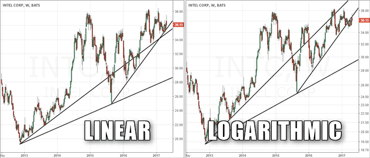

## Table of Contents

## What is a linear chart and how is it used in trading?

A linear chart, also known as a line chart, is a type of graph that shows how a stock or other financial asset's price changes over time. It is made by connecting a series of data points with straight lines. Each data point represents the price of the asset at a specific time. Linear charts are simple and easy to read, making them a popular choice for traders who want a quick overview of price movements.

In trading, linear charts are used to help traders see trends and patterns in the price of an asset. By looking at the chart, traders can see if the price is going up, going down, or staying the same over time. This information can help them decide when to buy or sell the asset. For example, if a trader sees that the price of a stock has been steadily increasing on the linear chart, they might decide to buy the stock, hoping that the price will continue to rise.

## What is a logarithmic chart and how does it differ from a linear chart?

A logarithmic chart, also called a log chart, is another way to show how the price of a stock or other financial asset changes over time. Instead of using equal distances for price changes like a linear chart, a logarithmic chart uses equal percentages. This means that if the price of an asset goes from $10 to $20, and then from $20 to $40, these two changes will look the same on a log chart because they both represent a 100% increase.

The main difference between a logarithmic chart and a linear chart is how they handle big price changes. On a linear chart, a big jump in price will look much larger than a small jump, even if the percentage change is the same. This can make it hard to see the true trend of the price over time, especially if the price changes a lot. On a logarithmic chart, the scale adjusts to show percentage changes, so it's easier to see the rate of change and compare different time periods. This makes log charts very useful for looking at long-term trends or assets with large price swings.

## Why might a trader choose to use a linear chart over a logarithmic chart?

A trader might choose to use a linear chart because it is simpler and easier to understand. Linear charts show price changes with equal distances on the chart, which can make it easy to see how much the price has moved up or down. For people who are new to trading or who prefer a straightforward view of the data, linear charts can be more helpful. They are good for short-term trading where small price changes matter a lot, and they can help traders focus on the exact dollar amount changes in the price of an asset.

Another reason a trader might pick a linear chart over a logarithmic chart is when the price of the asset doesn't change by a lot. If the price stays within a small range, a linear chart will show these changes clearly without making them look too big or too small. This can be important for traders who need to see small price movements to make quick decisions. Linear charts are also more common and widely used, so traders might be more used to reading them and feel more comfortable with them.

## In what scenarios would a logarithmic chart be more beneficial for analyzing price movements?

A logarithmic chart is more helpful when you want to look at big changes in price over a long time. If a stock's price goes from $1 to $100, a linear chart would make the jump from $1 to $10 look small compared to the jump from $10 to $100. But on a log chart, these jumps look the same because they both went up by 10 times. This makes it easier to see how fast the price is changing and compare different time periods. So, if you're looking at a stock that has grown a lot over many years, a log chart will show you the true trend better.

Log charts are also good when you want to see how an asset is doing compared to another one that has a very different price. For example, if you're comparing a stock that costs $50 to one that costs $5000, a linear chart might make the cheaper stock's changes look tiny. But a log chart will show you the percentage changes for both stocks, so you can see how they're doing relative to each other. This is useful for investors who want to understand how different investments are performing over time, especially if they have assets with big price differences.

## How do linear and logarithmic scales affect the visual representation of price changes?

Linear scales show price changes using equal distances on the chart. If a stock goes up from $10 to $20, and then from $20 to $30, these changes will look the same on a linear chart because they both went up by $10. This makes linear charts easy to read and good for seeing small price changes. But, if the price changes a lot, like going from $10 to $100, the big jump can make it hard to see the true trend. The chart might look like the price is shooting up, even if it's just growing steadily.

Logarithmic scales show price changes using equal percentages. If a stock goes from $10 to $20, and then from $20 to $40, these changes will look the same on a log chart because they both went up by 100%. This makes log charts good for seeing the rate of change and comparing different time periods. They are especially helpful when looking at big price changes over a long time. For example, if a stock goes from $1 to $100, a log chart will show this growth more clearly than a linear chart, making it easier to see the true trend.

## Can you explain the mathematical difference between linear and logarithmic scales?

Linear scales use a straight-line approach to show changes. If you have numbers like 1, 2, 3, 4, and 5, on a linear scale, the distance between each number is the same. For example, the space between 1 and 2 is the same as the space between 4 and 5. This means that if a price goes up by $10, it will always take up the same amount of space on the chart, no matter where it starts. So, if a stock goes from $10 to $20, and then from $50 to $60, these changes look the same on a linear chart because they both went up by $10.

Logarithmic scales, on the other hand, use a different way to show changes. They use a system based on percentages, not fixed amounts. If you have numbers like 1, 10, 100, and 1000, on a log scale, the distance between each number shows how many times bigger one number is than another. For example, the space between 1 and 10 is the same as the space between 10 and 100 because both are 10 times bigger. So, if a stock goes from $10 to $20, and then from $20 to $40, these changes look the same on a log chart because they both went up by 100%. This makes log scales better for showing big changes and comparing different time periods.

## What impact do linear and logarithmic charts have on trend analysis in trading?

Linear charts make trend analysis easy to understand because they show price changes in a simple way. If a stock's price goes up by $10, it always looks the same on a linear chart, no matter if the price starts at $10 or $100. This makes linear charts good for seeing small price changes and short-term trends. Traders who want to see the exact dollar amount of price changes often use linear charts. But, if the price changes a lot, like going from $10 to $100, a linear chart can make the trend look too big and hard to read.

Logarithmic charts are better for looking at big changes and long-term trends. They show price changes based on percentages, so if a stock goes from $10 to $20, and then from $20 to $40, these changes look the same on a log chart because they both went up by 100%. This makes it easier to see how fast the price is changing and compare different time periods. Logarithmic charts are helpful for traders who want to understand the true growth rate of a stock over many years, especially if the price has big swings.

## How do these chart types influence the perception of volatility in trading data?

Linear charts can make small price changes look very clear, which might make a stock seem more volatile than it really is. If the price goes up and down by a few dollars, these changes will look big on a linear chart. This can make traders think the stock is moving a lot, even if the percentage change is small. So, if a stock goes from $10 to $12 and back to $10, it might look like a big swing on a linear chart, but it's only a 20% change.

Logarithmic charts show price changes based on percentages, so they give a different view of [volatility](/wiki/volatility-trading-strategies). If a stock goes from $10 to $12 and back to $10, this will look like a smaller change on a log chart because it's only a 20% move. Log charts are better for seeing how much the price is really changing over time, especially if the price goes up or down a lot. This can help traders understand if a stock is truly volatile or if it's just the chart making it look that way.

## What are the common pitfalls traders might encounter when using linear charts?

One common pitfall traders might face when using linear charts is that they can make big price changes look even bigger. If a stock goes from $10 to $100, a linear chart will show this jump as a huge spike. This can make traders think the stock is growing faster than it really is, which might lead them to make bad decisions. They might buy the stock thinking it will keep going up quickly, but the chart just makes the growth look bigger because it uses equal distances for price changes.

Another problem with linear charts is that they can hide important trends when the price changes a lot. If a stock goes from $1 to $100 over many years, a linear chart might make it hard to see the true growth rate. The early part of the chart, where the price goes from $1 to $10, will look small compared to the later part, where it goes from $10 to $100. This can make traders miss out on seeing how the stock has been growing steadily over time, which is important for long-term investing.

## What are the potential misinterpretations that can occur with logarithmic charts?

One potential misinterpretation with logarithmic charts is that they can make small price changes look less important. If a stock goes up by a few dollars, it might not look like a big deal on a log chart because it's showing the percentage change. This can make traders think the stock isn't moving much, even if the dollar amount change is big. For example, if a stock goes from $100 to $105, it's only a 5% change, so it will look small on a log chart. But $5 can be a lot of money for some traders, and they might miss this if they're only looking at the log chart.

Another issue is that logarithmic charts can be confusing for people who are used to linear charts. Log charts use a different way to show changes, based on percentages instead of fixed amounts. This can make it hard for some traders to understand what they're seeing. They might think the stock is growing slower or faster than it really is because they're not used to reading log charts. This can lead to bad trading decisions if they don't take the time to learn how to read log charts correctly.

## How can advanced traders use both linear and logarithmic charts to enhance their trading strategy?

Advanced traders can use both linear and logarithmic charts to get a full picture of how a stock is moving. They might start by looking at a linear chart to see the exact dollar amount changes in the stock's price. This is good for short-term trading where small price moves matter a lot. If they see the stock going up by $5 or down by $2, they can make quick decisions based on these changes. But, they also know that linear charts can make big price moves look too big, so they don't rely on them alone.

To understand the bigger picture, advanced traders will switch to a logarithmic chart. This chart shows how the stock's price is changing in percentages, which is better for seeing long-term trends and big price swings. If the stock goes from $10 to $20, and then from $20 to $40, a log chart will show these changes as equal because they both went up by 100%. This helps traders see if the stock is really growing fast or if it's just the chart making it look that way. By using both types of charts, advanced traders can make smarter decisions based on both short-term and long-term trends.

## What software tools support both linear and logarithmic chart views, and how can they be effectively used for trading analysis?

Many popular trading platforms and software tools support both linear and logarithmic chart views, including MetaTrader, TradingView, and Thinkorswim. These tools allow traders to switch between the two chart types easily, helping them analyze price movements from different angles. For example, in TradingView, you can click on the settings icon on the chart and choose between linear and logarithmic scales. This flexibility is key for traders who want to understand both short-term and long-term trends in the market.

To use these tools effectively for trading analysis, start by looking at the linear chart to see the exact dollar amount changes in the stock's price. This can help you make quick decisions based on small price moves, which is important for short-term trading. If you see a stock going up by $5 or down by $2, you can decide to buy or sell based on these changes. Then, switch to the logarithmic chart to get a better view of the stock's growth rate over time. This can help you see if the stock is really growing fast or if it's just the chart making it look that way. By using both types of charts, you can make smarter trading decisions based on a complete picture of the market.

## What is a Logarithmic Chart?

A logarithmic chart represents percentage changes instead of absolute amounts. Unlike linear charts, where equal spacing is used for equal increments in value on the y-axis, logarithmic charts use a scale where each equal spacing represents an equal percentage change. This can be mathematically expressed as spacing corresponding to the logarithms of the actual values. 

For example, on a logarithmic scale, the distance between values such as $10 and $20 will be the same as between $20 and $40 because both represent a 100% increase. This scaling is achieved through the use of the formula:

$$
y = \log_{b}(x)
$$

where $y$ is the position on the y-axis, $x$ is the actual value, and $b$ is the base of the logarithm, commonly 10.

Logarithmic charts are especially useful for analyzing data over large ranges to preserve proportional relationships. As a result, they are advantageous for observing long-term financial market trends. The chart ensures that the same vertical distance corresponds to equivalent percentage changes across the spectrum, allowing for a balanced view of growth or decline over time. By emphasizing percentage shifts, rather than absolute, this approach offers a clearer insight into the performance of an asset or index, particularly where prices span multiple orders of magnitude. 

Traders and analysts often rely on logarithmic charts to track the performance of volatile assets—like cryptocurrencies or stocks—over extended periods, enabling them to make informed predictions and strategic decisions.

## References & Further Reading

[1]: Aggarwal, R. (1990). ["Money Flow Measures and Logarithmic Stock Returns."](https://www.sciencedirect.com/science/article/pii/S1044028398900060) The Review of Financial Studies, 3(4), 743-771.

[2]: Elder, A. (1993). ["Trading for a Living: Psychology, Trading Tactics, Money Management."](https://www.amazon.com/Trading-Living-Psychology-Tactics-Management/dp/0471592242) Wiley.

[3]: Murphy, J. J. (1999). ["Technical Analysis of the Financial Markets: A Comprehensive Guide to Trading Methods and Applications."](https://www.amazon.com/Technical-Analysis-Financial-Markets-Comprehensive/dp/0735200661) New York Institute of Finance.

[4]: Nison, S. (1991). ["Japanese Candlestick Charting Techniques: A Contemporary Guide to the Ancient Investment Techniques of the Far East."](https://www.amazon.com/Japanese-Candlestick-Charting-Techniques-Contemporary/dp/0139316507) Prentice Hall Press.

[5]: Silverman, A. P. (2012). ["Understanding the Mathematics of Personal Finance: An Introduction to Financial Literacy."](https://onlinelibrary.wiley.com/doi/book/10.1002/9780470538395) Cambridge University Press.