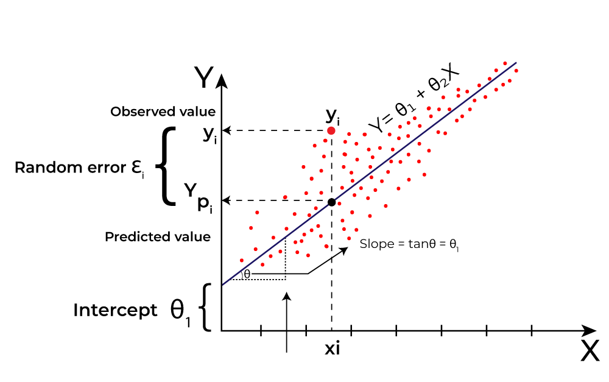

## Table of Contents

## What is linear machine learning?

Linear machine learning involves using linear models to make predictions or classify data. A common example of this is linear regression, where we try to find a straight line that best fits our data. This line helps us predict future outcomes based on past data. The equation for a simple linear regression is $$y = mx + b$$, where $$y$$ is the predicted value, $$x$$ is the input feature, $$m$$ is the slope of the line, and $$b$$ is the y-intercept. In machine learning, we use algorithms to find the best values for $$m$$ and $$b$$ that minimize the error between our predictions and the actual data.

Another type of linear machine learning is logistic regression, which is used for classification tasks. Instead of predicting a continuous value like in linear regression, logistic regression predicts the probability that an input belongs to a certain class. The output is passed through a sigmoid function to ensure it falls between 0 and 1. The equation for logistic regression is $$P(y=1) = \frac{1}{1 + e^{-(mx + b)}}$$, where $$P(y=1)$$ is the probability of the positive class. Like linear regression, the goal is to find the best values for $$m$$ and $$b$$ to fit the data well. Both linear regression and logistic regression are fundamental techniques in machine learning because they are simple yet effective for many problems.

## How does linear regression work in machine learning?

Linear regression in machine learning is a way to find a straight line that best fits a set of data points. Imagine you have a bunch of dots on a graph, and you want to draw a line that comes as close as possible to all of them. This line helps you predict new values based on what you already know. The equation for this line is $$y = mx + b$$, where $$y$$ is what you're trying to predict, $$x$$ is your input, $$m$$ is the slope of the line (how steep it is), and $$b$$ is where the line crosses the y-axis. In machine learning, we use special math to find the best $$m$$ and $$b$$ that make the line fit the data well.

To find the best line, we use something called the "least squares method." This method tries to make the total distance between the line and all the data points as small as possible. The distance is measured by how far each point is from the line, squared. By minimizing these squared distances, we get the best possible line. In practice, we use algorithms like gradient descent to adjust $$m$$ and $$b$$ little by little until we find the best fit. This process is done automatically by computers, making linear regression a powerful and widely used tool in [machine learning](/wiki/machine-learning) for making predictions.

## What are the key assumptions of linear regression?

Linear regression makes a few important guesses about the data it's working with. One big guess is that the relationship between the input and the output is straight and not curvy. This means that if you draw a line through your data, the line should fit well without needing to bend. Another guess is that the data points should be spread out evenly around the line. This is called homoscedasticity, and it means the errors (the distances between the points and the line) should be about the same size all along the line, not getting bigger or smaller in some places.

Another important assumption is that the errors, or residuals, should be independent of each other. This means that knowing the error for one data point shouldn't help you guess the error for another data point. Also, linear regression assumes that the errors follow a normal distribution, which looks like a bell curve. This helps us make good guesses about how far off our predictions might be. Lastly, there should be no big patterns or trends in the errors. If you see a pattern, it might mean that a straight line isn't the best way to describe your data, and you might need a different kind of model.

These assumptions are important because if they're not true, the line you draw might not be very good at predicting new data. It's a good idea to check these assumptions before you trust your linear regression model too much. If the assumptions don't hold, you might need to try a different kind of model or change your data in some way to make the assumptions more true.

## Can you explain the difference between simple and multiple linear regression?

Simple linear regression is when you use just one input to predict an outcome. Imagine you're trying to guess how much a house will cost based only on its size. You'd use the formula $$y = mx + b$$ where $$y$$ is the house price, $$x$$ is the size of the house, $$m$$ is how much the price changes for each square foot, and $$b$$ is the starting price. In this case, you're drawing a straight line to fit the data points on a graph, and this line helps you predict new house prices based on their size.

Multiple linear regression is a bit more complex because it uses more than one input to predict an outcome. For example, if you want to predict a house's price, you might consider not just its size but also its age and the number of bedrooms. The formula for multiple linear regression looks like $$y = m_1x_1 + m_2x_2 + m_3x_3 + b$$, where $$y$$ is still the house price, but now you have $$x_1$$ for size, $$x_2$$ for age, and $$x_3$$ for the number of bedrooms. Each $$m$$ tells you how much the price changes with each input, and $$b$$ is still the starting price. This method helps you draw a plane (or hyperplane in higher dimensions) that fits the data points better because it considers more factors.

## What is the role of the cost function in linear machine learning?

The cost function in linear machine learning helps us figure out how good our predictions are. It's like a score that tells us how far off our guesses are from the real answers. In linear regression, we often use the mean squared error as the cost function. This means we take the difference between our predicted values and the actual values, square those differences, and then find the average. The formula for this is $$J(m, b) = \frac{1}{n} \sum_{i=1}^{n} (y_i - (mx_i + b))^2$$, where $$J(m, b)$$ is the cost, $$n$$ is the number of data points, $$y_i$$ is the actual value, and $$mx_i + b$$ is our prediction. The goal is to make this cost as small as possible by adjusting the slope $$m$$ and the y-intercept $$b$$.

Once we have a cost function, we use it to guide our learning process. We try different values for $$m$$ and $$b$$ and see how the cost changes. If the cost goes down, we're moving in the right direction. If it goes up, we need to try something different. This process is often done using algorithms like gradient descent, which helps us find the best $$m$$ and $$b$$ by slowly moving towards lower costs. By minimizing the cost function, we make our linear model better at predicting new data, which is the whole point of machine learning.

## How do you evaluate the performance of a linear model?

To evaluate the performance of a linear model, we look at how well it predicts new data. One common way to do this is by using something called the "mean squared error" (MSE). The MSE measures the average of the squares of the errors between what the model predicts and the actual values. The formula for MSE is $$ \text{MSE} = \frac{1}{n} \sum_{i=1}^{n} (y_i - \hat{y}_i)^2 $$, where $$ n $$ is the number of data points, $$ y_i $$ is the actual value, and $$ \hat{y}_i $$ is the predicted value. A smaller MSE means the model's predictions are closer to the real values, which is good. Another way to evaluate a model is by using the "R-squared" value, which tells us how much of the variation in the data our model explains. A higher R-squared, closer to 1, means our model fits the data well.

Another important way to check a linear model's performance is by splitting the data into two parts: a training set and a test set. We use the training set to build the model and find the best values for the slope and y-intercept. Then, we use the test set to see how well the model predicts data it hasn't seen before. If the model does well on the test set, it's a good sign that it will work well on new data in the future. This method helps us avoid "overfitting," where a model works great on the data it was trained on but not on new data. By looking at how the model performs on both the training and test sets, we can get a better idea of how reliable it is.

## What are some common metrics used to assess linear regression models?

Some common metrics used to assess linear regression models include Mean Squared Error (MSE), Root Mean Squared Error (RMSE), Mean Absolute Error (MAE), and R-squared (R²). MSE is a way to measure how far off your predictions are from the actual values. You calculate it by taking the difference between your predicted and actual values, squaring those differences, and then finding the average. The formula for MSE is $$ \text{MSE} = \frac{1}{n} \sum_{i=1}^{n} (y_i - \hat{y}_i)^2 $$. RMSE is just the square root of MSE, which makes it easier to understand because it's in the same units as your data. MAE is similar but instead of squaring the differences, you just take the absolute value, so it's less sensitive to big errors. The formula for MAE is $$ \text{MAE} = \frac{1}{n} \sum_{i=1}^{n} |y_i - \hat{y}_i| $$.

R-squared, or the coefficient of determination, tells you how well your model explains the variation in the data. It's a number between 0 and 1, where 1 means your model explains all the variation perfectly, and 0 means it doesn't explain any of it. The formula for R-squared is $$ R^2 = 1 - \frac{\sum_{i=1}^{n} (y_i - \hat{y}_i)^2}{\sum_{i=1}^{n} (y_i - \bar{y})^2} $$, where $$ \bar{y} $$ is the mean of the actual values. A higher R-squared value means your model fits the data better. These metrics help you see how well your linear regression model is doing and whether you need to make any changes to improve it.

## How can overfitting be prevented in linear models?

Overfitting in linear models can be prevented by using a technique called regularization. Regularization adds a penalty to the cost function to keep the model's parameters from getting too big. This helps the model focus on the most important patterns in the data instead of fitting every little detail, which can lead to overfitting. One common type of regularization is called "L2 regularization," also known as "ridge regression." In L2 regularization, we add a term to the cost function that is the sum of the squares of the model's parameters. The formula for the L2-regularized cost function is $$ J(m, b) = \frac{1}{n} \sum_{i=1}^{n} (y_i - (mx_i + b))^2 + \lambda \sum_{j=1}^{p} m_j^2 $$, where $$ \lambda $$ is a tuning parameter that controls how much we want to penalize large parameters, and $$ p $$ is the number of parameters. By tuning $$ \lambda $$, we can find a good balance between fitting the data well and keeping the model simple.

Another way to prevent overfitting is by using cross-validation. Cross-validation involves splitting the data into several parts, using some parts to train the model and the rest to test it. This helps us see how well the model works on data it hasn't seen before. One common method is "k-fold cross-validation," where we split the data into k equal parts, or "folds." We train the model k times, each time using a different fold as the test set and the remaining folds as the training set. Then, we average the performance across all k runs to get a better idea of how well the model will work on new data. By using cross-validation, we can make sure our model isn't just memorizing the training data but is actually learning useful patterns that will help it make good predictions on new data.

## What are regularization techniques like Lasso and Ridge regression?

Lasso and Ridge regression are two types of regularization techniques used to prevent overfitting in linear models. Overfitting happens when a model learns the training data too well, including its noise and errors, and then performs poorly on new data. Regularization helps by adding a penalty to the model's cost function. This penalty discourages the model from making its parameters too big, which can help it focus on the most important patterns in the data. Lasso regression, also known as L1 regularization, adds a penalty equal to the sum of the absolute values of the parameters. The formula for the Lasso cost function is $$ J(m, b) = \frac{1}{n} \sum_{i=1}^{n} (y_i - (mx_i + b))^2 + \lambda \sum_{j=1}^{p} |m_j| $$. Here, $$ \lambda $$ is a tuning parameter that controls the strength of the penalty, and $$ p $$ is the number of parameters. Lasso can even make some parameters exactly zero, which is useful for feature selection.

Ridge regression, also known as L2 regularization, works a bit differently. Instead of using the absolute values of the parameters, Ridge regression adds a penalty equal to the sum of the squares of the parameters. The formula for the Ridge cost function is $$ J(m, b) = \frac{1}{n} \sum_{i=1}^{n} (y_i - (mx_i + b))^2 + \lambda \sum_{j=1}^{p} m_j^2 $$. Like in Lasso, $$ \lambda $$ controls how strong the penalty is. Ridge regression tends to shrink all the parameters towards zero but doesn't usually make them exactly zero. This means it's good for keeping the model simple and reducing overfitting, but it won't help you pick out the most important features like Lasso can. Both techniques can be very helpful in making linear models work better on new data.

## How do you handle multicollinearity in linear regression?

Multicollinearity happens when two or more of your input features in a linear regression model are closely related to each other. This can make it hard for the model to figure out which feature is really affecting the outcome because the features are doing similar things. When this happens, the model might give you strange or unreliable results. For example, small changes in the data can lead to big changes in the model's predictions. To spot multicollinearity, you can look at something called the "variance inflation [factor](/wiki/factor-investing)" (VIF) for each feature. If the VIF is high, it means that feature is closely related to others, and you might need to do something about it.

One way to deal with multicollinearity is to remove some of the related features from your model. If two features are very similar, you might not need both of them. Another way is to combine the related features into a new feature. This is called "feature engineering." For example, if you have features for a person's height in feet and inches, you could combine them into one feature for total height in inches. A third way is to use regularization techniques like Ridge or Lasso regression. These methods add a penalty to the model's cost function that helps control the impact of the features. For example, Lasso regression can make some of the less important features' coefficients exactly zero, which can help reduce multicollinearity. The formula for Lasso regression's cost function is $$ J(m, b) = \frac{1}{n} \sum_{i=1}^{n} (y_i - (mx_i + b))^2 + \lambda \sum_{j=1}^{p} |m_j| $$, where $$ \lambda $$ is the tuning parameter and $$ p $$ is the number of parameters.

## Can you discuss the impact of outliers on linear regression models?

Outliers are data points that are very different from the rest of the data. They can have a big impact on linear regression models because these models try to find a line that fits all the data points as closely as possible. When there are outliers, the line might be pulled towards them, making the fit worse for the other points. This can lead to a model that doesn't predict well because it's trying too hard to include the outliers. For example, if you're trying to predict house prices based on size, and one house is much bigger and more expensive than the others, the line might be drawn to fit that one house, making the predictions for normal-sized houses less accurate.

To deal with outliers, you can try a few things. One way is to remove the outliers from your data before you build the model. This can make the line fit better for the rest of the data. Another way is to use a different kind of model that is less affected by outliers, like a robust regression model. These models are designed to handle unusual data points without letting them mess up the predictions too much. You can also use a technique called "winsorizing," where you change the values of the outliers to be closer to the rest of the data, without removing them completely. By handling outliers carefully, you can make your linear regression model work better and give you more reliable predictions.

## What advanced techniques can be applied to improve linear models in complex datasets?

When dealing with complex datasets, one advanced technique to improve linear models is to use polynomial regression. This method extends linear regression by fitting a curve instead of a straight line. Imagine you're trying to predict how fast a car goes based on how much gas it uses. A straight line might not fit well if the relationship is more complex. With polynomial regression, you can use a formula like $$y = m_1x + m_2x^2 + b$$ to fit a curve that captures the ups and downs in your data better. This can help your model make more accurate predictions, especially when the relationship between your inputs and outputs isn't a simple straight line.

Another powerful technique is to use feature engineering. This means creating new input features from the ones you already have to help your model understand the data better. For example, if you're predicting house prices, you might combine the number of bedrooms and the size of the house into a new feature like "bedroom density." You can also use techniques like one-hot encoding to turn categorical data, like types of houses, into numbers that the model can work with. By making these new features, you give your linear model more information to work with, which can lead to better predictions. Feature engineering can be a bit tricky, but it's a great way to make your model smarter without changing the basic linear regression approach.

## References & Further Reading

[1]: Hastie, T., Tibshirani, R., & Friedman, J. (2009). ["The Elements of Statistical Learning: Data Mining, Inference, and Prediction."](https://link.springer.com/book/10.1007/978-0-387-84858-7) Springer.

[2]: Montgomery, D. C., Peck, E. A., & Vining, G. G. (2012). ["Introduction to Linear Regression Analysis."](https://archive.org/download/econometrics_books/Intro.%20to%20Linear%20Regression%20Analysis%20-%20D.%20C.%20Montgomery%2C%20E.%20A.%20Peck.pdf) Wiley.

[3]: James, G., Witten, D., Hastie, T., & Tibshirani, R. (2013). ["An Introduction to Statistical Learning with Applications in R."](https://link.springer.com/book/10.1007/978-1-0716-1418-1) Springer.

[4]: Zou, H., & Hastie, T. (2005). ["Regularization and Variable Selection via the Elastic Net."](https://academic.oup.com/jrsssb/article-abstract/67/2/301/7109482) Journal of the Royal Statistical Society: Series B (Statistical Methodology).

[5]: Wooldridge, J. M. (2012). ["Introductory Econometrics: A Modern Approach."](https://faculty.cengage.com/titles/9781337558860) Cengage Learning.

[6]: Seber, G. A. F., & Lee, A. J. (2003). ["Linear Regression Analysis."](https://onlinelibrary.wiley.com/doi/book/10.1002/9780471722199) Wiley.