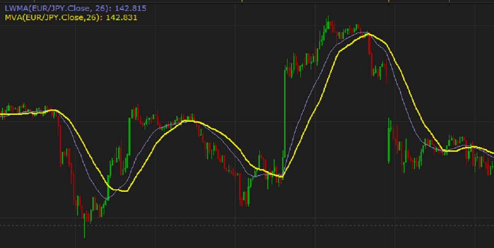

Moving averages are a cornerstone in the technical analysis toolkit of financial trading. They serve to smooth out price data, creating a single flowing line that traders can use to identify trends and gauge the market's direction. Among the family of moving averages, the Linearly Weighted Moving Average (LWMA) stands out for its sensitivity to recent price changes. Unlike the Simple Moving Average (SMA), which assigns equal weight to all data points, or the Exponential Moving Average (EMA), which gives more gradual weight to recent prices, the LWMA provides a linear weighting to data points, making the most recent prices the most influential.

The LWMA is particularly vital in algorithmic trading, where precision and speed are paramount. It allows traders to capture market trends more accurately by responding swiftly to recent price changes. This precision reduces the likelihood of lag that is often experienced with other types of moving averages, thus providing an edge in fast-moving or highly volatile markets. For traders employing algorithmic strategies, the LWMA can be a critical component in decision-making processes, as it helps in identifying trend reversals or continuations more rapidly than its counterparts.



What sets the LWMA apart is its methodology of weighting data. The emphasis on newer data points makes it ideal for traders looking to react quickly to recent market developments. The calculation of LWMA can be described mathematically as follows:

$$
LWMA = \sum (Price_t \times Weight_t) / \sum Weight_t
$$

where $Price_t$ is the price at time $t$ and $Weight_t$ is the linear weighting coefficient. This formula enables the LWMA to balance responsiveness with smoothing, which is crucial for strategy development in trading systems.

This article aims to provide a comprehensive understanding of LWMA, beginning with its fundamentals and extending to its practical applications in trading strategies. Readers can expect to gain insights into how the LWMA can improve trading accuracy, the process of implementing it in algorithmic trading environments, and strategies to manage inherent drawbacks.

## Table of Contents

## Understanding Moving Averages

Moving averages are essential statistical tools employed in financial trading to smooth out price data by creating a constantly updated average. They are pivotal in identifying trends over specific periods, thus aiding traders in making informed decisions. By filtering out the noise from random short-term price fluctuations, moving averages provide a clearer view of the market direction.

### Types of Moving Averages

There are several types of moving averages commonly used in trading:

1. **Simple Moving Average (SMA)**:
   The SMA is the most basic form of a moving average. It calculates the average of a set number of data points. For example, a 10-day SMA takes the average of the closing prices of the last ten days. The formula for SMA is:
$$
   \text{SMA} = \frac{\sum_{i=1}^{n} P_i}{n}

$$

   where $P_i$ is the price at day $i$, and $n$ is the number of periods.

2. **Exponential Moving Average (EMA)**:
   The EMA gives more weight to recent prices, making it more responsive to new information than the SMA. This is particularly useful in volatile markets. The EMA is calculated using the formula:
$$
   \text{EMA}_t = (P_t \times k) + (\text{EMA}_{t-1} \times (1 - k))

$$

   where $P_t$ is the current price, and $k$ is the smoothing factor, calculated as $\frac{2}{n+1}$, with $n$ being the number of periods.

3. **Weighted Moving Average (WMA)**:
   The WMA assigns different weights to each data point, with more significance placed on recent data. The WMA is calculated by multiplying each data point by a predetermined weighting [factor](/wiki/factor-investing).
$$
   \text{WMA} = \frac{\sum_{i=1}^{n} (w_i \times P_i)}{\sum_{i=1}^{n} w_i}

$$

   where $w_i$ is the weight assigned to each price $P_i$.

### Comparison and Applications

Each type of moving average has its applications and is chosen based on the trader's strategy and the market context. The SMA provides a simple and broad assessment of the market trend, suitable for identifying long-term trends. However, it can be slow to react to rapid price changes.

The EMA, with its focus on recent data, is preferable for short-term trading and volatile markets where capturing timely trends is crucial. It reduces lag seen with SMA, allowing for quicker response times to market changes.

The WMA is customized for specific needs, as traders can decide the weights, emphasizing more recent data more efficiently than the SMA but not as sharply as the EMA.

### Basic Calculation Methods

Understanding calculations for these averages is vital for traders looking to apply them:

- **Python Example for SMA**:
  ```python
  def calculate_sma(prices, n):
      return sum(prices[-n:]) / n

  prices = [100, 102, 101, 104, 105, 106, 107, 110, 108, 109]
  sma_10 = calculate_sma(prices, 10)
  ```

- **Python Example for EMA**:
  ```python
  def calculate_ema(prices, n):
      ema = [sum(prices[:n]) / n]  # start with the first SMA
      k = 2 / (n + 1)
      for price in prices[n:]:
          ema.append((price - ema[-1]) * k + ema[-1])
      return ema

  prices = [100, 102, 101, 104, 105, 106, 107, 110, 108, 109]
  ema_10 = calculate_ema(prices, 10)
  ```

- **Python Example for WMA**:
  ```python
  def calculate_wma(prices, weights):
      weighted_prices = [w * p for w, p in zip(weights, prices[-len(weights):])]
      return sum(weighted_prices) / sum(weights)

  prices = [100, 102, 101, 104, 105, 106, 107, 110, 108, 109]
  weights = [1, 2, 3, 4, 5, 6, 7, 8, 9, 10]  # for a 10-day WMA
  wma_10 = calculate_wma(prices, weights)
  ```

Overall, moving averages are indispensable tools in financial trading, providing traders with insights into potential market movements by refining price data into understandable trends.

## What is the Linearly Weighted Moving Average (LWMA)?

The Linearly Weighted Moving Average (LWMA) is a type of technical indicator used in financial trading to smooth out price data and provide a clearer view of market trends. Unlike the Simple Moving Average (SMA), which assigns equal weight to all data points in the given period, the LWMA assigns more significance to recent prices, making it more responsive to price changes.

The LWMA provides a more responsive measure compared to simple moving averages by applying linear weighting. This means that the most recent data points exert a greater influence on the average, which allows the LWMA to react more quickly to price movements. This characteristic can be particularly advantageous in fast-moving or highly volatile markets where traders need to identify trends at their inception.

Linear weighting in the LWMA is accomplished by multiplying each data point in the time series by a predefined weighting factor that decreases linearly over time. The most recent data points receive the highest weights, while older data points receive progressively lower weights. This weighting system emphasizes the significance of the newest data and provides traders with a more current representation of market trends.

The calculation formula for the LWMA is as follows:

$$

LWMA = \frac{\sum_{i=1}^{n} (P_i \times W_i)}{\sum_{i=1}^{n} W_i} 
$$

Where:
- $P_i$ is the price at time $i$.
- $W_i$ is the weight for each respective time $i$, calculated as the number of the time period minus $i$ plus one ($n - i + 1$).
- $n$ is the total number of periods.

Here's a step-by-step example with Python code to calculate LWMA for a given set of prices:

```python
def calculate_lwma(prices, period):
    weights = list(range(1, period + 1))
    lwma_values = []

    for i in range(period - 1, len(prices)):
        sub_prices = prices[i - period + 1:i + 1]
        weighted_sum = sum(p * w for p, w in zip(sub_prices, weights))
        lwma_value = weighted_sum / sum(weights)
        lwma_values.append(lwma_value)

    return lwma_values

# Example usage:
prices = [10, 11, 12, 13, 14, 15, 16]
period = 3
lwma = calculate_lwma(prices, period)
print(lwma)  # Output: [11.0, 12.0, 13.0, 14.0, 15.0, 16.0]
```

In this example, for a given period of 3, each LWMA value is computed by taking the latest three prices, multiplying them by weights of 1, 2, and 3 respectively, summing the weighted products, and then dividing by the total of the weights. This approach provides a smoothed line that better follows recent price movements, helping traders make more informed decisions.

## Benefits of Using LWMA in Trading

Linearly Weighted Moving Average (LWMA) plays a crucial role in trading by offering better precision, especially in markets characterized by rapid price fluctuations. This method prioritizes recent data points, which helps traders react promptly to new market developments. The LWMA assigns greater weights to more recent prices, making it more responsive compared to other moving averages, such as the Simple Moving Average (SMA) or Exponential Moving Average (EMA).

### Enhanced Accuracy in Fast-Moving Markets

In fast-moving markets, where prices can change quickly, LWMA provides better accuracy by emphasizing the most relevant data points—the most recent ones. This approach minimizes the lag experienced with other moving averages, allowing traders to obtain a timely reflection of price movements. The emphasis on recent price changes makes it easier for traders to identify turning points in the market, thus enabling swifter decision-making.

### Early Trend Detection

One of the primary benefits of using LWMA is its ability to detect trends early. By giving precedence to recent data, LWMA smoothens out noise less dramatically and aligns closely with market sentiment shifts. This feature is valuable in recognizing emerging trends before they gain full [momentum](/wiki/momentum), giving traders an edge in capturing potential profits.

### Reduced Lag in Volatile Markets

Volatile markets present unique challenges due to rapid price swings and unexpected shifts. The LWMA helps mitigate these challenges by reducing the lag inherent in moving averages. By focusing on the most recent data, the LWMA updates more swiftly, thereby aiding traders in navigating [volatility](/wiki/volatility-trading-strategies) with greater ease. This enhancement ensures that trading strategies remain aligned with the latest market movements and reduces the risks associated with delayed reactions.

### Ideal Market Conditions for LWMA

LWMA is particularly useful in markets characterized by:

1. **High Volatility**: In such environments, the LWMA's reduced lag and heightened sensitivity to recent data provide a more accurate depiction of price trends, enabling traders to adjust their positions with greater confidence.

2. **Trending Markets**: When markets are trending, capturing the start and end of trends is crucial. LWMA's ability to react quickly to changes makes it an ideal tool for monitoring and executing trades in these conditions.

3. **Short-Term Trading**: For traders involved in short-term trading strategies like scalping or day trading, LWMA's responsiveness offers a significant advantage by providing real-time insights into price movements.

Incorporating LWMA into trading strategies can significantly enhance a trader's ability to analyze and react to market changes quickly. Its ability to accurately reflect recent price trends makes it an invaluable tool for identifying opportunities and managing risks in dynamic market environments.

## Implementing LWMA in Algorithmic Trading

Implementing the Linearly Weighted Moving Average (LWMA) in [algorithmic trading](/wiki/algorithmic-trading) involves a series of methodical steps to enhance trading strategies by accounting for recent data more effectively than other moving averages. Here, we detail the necessary steps, tools, software, example algorithms, and best practices for success in this implementation.

### Steps to Integrate LWMA into an Algorithmic Trading Strategy

1. **Data Collection and Preparation**: Begin by gathering historical price data for the asset you intend to trade. This data is crucial for calculating the LWMA and subsequently forming the basis of trading signals.

2. **LWMA Calculation**: Calculate the Linearly Weighted Moving Average using the formula:
$$
   LWMA = \frac{\sum_{i=1}^n (Price_i \times Weight_i)}{\sum_{i=1}^n Weight_i}

$$

   where $Weight_i = i$ and $n$ is the number of periods. This linear weighting ensures more emphasis is placed on the most recent prices.

3. **Signal Generation**: Develop rules to generate trading signals based on the LWMA. For instance, a simple rule might be to go long when the asset price is above the LWMA and short when it is below.

4. **Risk Management**: Integrate risk management techniques to limit potential losses. This might include setting stop-loss and take-profit levels, using position sizing algorithms, and applying diversification rules.

5. **Backtesting**: Evaluate the performance of your LWMA-based strategy against historical data to ensure its effectiveness and refine parameters as necessary.

### Tools and Software Supporting LWMA Calculations

Numerous tools and platforms can facilitate the implementation of LWMA in algorithmic trading:

- **Python Libraries**: Pandas and NumPy are essential for data handling and calculations. `talib` offers built-in functions for moving averages, including LWMA.

  ```python
  import pandas as pd
  import numpy as np

  def calculate_lwma(prices, n):
      weights = np.arange(1, n + 1)
      return prices.rolling(window=n).apply(lambda prices: np.dot(prices, weights) / weights.sum(), raw=True)

  prices = pd.Series([data])  # Your historical price data here
  lwma = calculate_lwma(prices, 14)  # 14-period LWMA calculation
  ```

- **Trading Platforms**: Platforms like MetaTrader 5 and TradingView allow you to apply custom indicators or scripts, including LWMs, to aid in discretionary or automated trading.

- **Algorithm Development Environments**: Platforms like QuantConnect or AlgoTrader provide environments to develop, backtest, and deploy strategies incorporating LWMA.

### Example Algorithms or Trading Systems Utilizing LWMA

One common approach is a crossover strategy, where a shorter-period LWMA crosses above or below a longer-period LWMA, signaling a potential buy or sell:

- **Bullish Signal**: Buy when the short-term LWMA crosses above the long-term LWMA.
- **Bearish Signal**: Sell when the short-term LWMA crosses below the long-term LWMA.

This strategy is particularly effective in trending markets.

### Best Practices for Backtesting and Optimizing LWMA-Based Strategies

- **Robust Backtesting**: Utilize extensive historical data to conduct thorough backtests. Ensure your data set includes various market conditions to gauge strategy robustness.

- **Walk-Forward Analysis**: Regularly adjust strategy parameters through out-of-sample testing to maintain adaptability to current market conditions.

- **Parameter Optimization**: Seek to optimize the period lengths for LWMA calculation without overfitting, ensuring the strategy can adapt to different market environments.

- **Performance Metrics**: Use comprehensive metrics like the Sharpe Ratio, maximum drawdown, and win-loss ratios to evaluate strategy performance.

Incorporating LWMA into an algorithmic trading approach requires disciplined execution and regular evaluation. By leveraging the latest software tools and adhering to best practices in strategy development and testing, traders can harness the unique benefits of LWMA in dynamic financial markets.

## Challenges and Considerations

Linearly Weighted Moving Average (LWMA) is a valuable tool in trading, offering certain advantages over other types of moving averages. However, it has limitations and challenges that traders must consider.

**Potential Drawbacks of Relying Solely on LWMA**

Relying exclusively on LWMA can lead to potential pitfalls. While it responds more quickly to price changes than a simple moving average (SMA), the emphasis on recent data can sometimes create excessive sensitivity to short-term volatility. This heightened sensitivity might result in reacting to minor, insignificant price fluctuations, potentially leading to false trading signals and poor decision-making. Furthermore, LWMA does not inherently account for fundamental market conditions or external factors, which can lead to misinterpretations if used in isolation.

**Considerations When Combining LWMA with Other Indicators**

Combining LWMA with other technical indicators can enhance trading signals and reduce the likelihood of false interpretations. For example, using LWMA in conjunction with indicators like the Relative Strength Index (RSI) or the Moving Average Convergence Divergence (MACD) can provide a more comprehensive view of market conditions. However, traders should ensure that these combinations do not over-complicate their strategy, which could lead to analysis paralysis. It is crucial to backtest these combinations to determine their effectiveness in different market scenarios.

**Scenarios Where LWMA May Give False Signals**

LWMA may generate false signals in sideways or choppy markets, where price movements are erratic and lack clear direction. In such conditions, the weighting mechanism of LWMA can exaggerate minor fluctuations, suggesting non-existent trends. To mitigate this, traders should confirm trends with [volume](/wiki/volume-trading-strategy) data or other confirmatory indicators before making decisions based on LWMA signals. It's also advisable to analyze multiple timeframes to gauge the broader market context to identify potential false signals better.

**Managing Risk When Using LWMA in Trading Strategies**

Risk management is critical when incorporating LWMA into trading strategies. Traders should set appropriate stop-loss and take-profit levels to protect against adverse market moves triggered by false LWMA signals. Additionally, position sizing should be aligned with the trader's risk tolerance, ensuring that potential losses remain within acceptable limits. Dynamic adjustments to LWMA parameters, such as the period length, may also be necessary to adapt to different market conditions, but changes should be made thoughtfully and based on thorough analysis or testing.

Overall, while LWMA can be a powerful component in a trader's toolkit, it should be used judiciously and in conjunction with a well-rounded trading plan that includes multiple confirmations and sound risk management practices.

## Conclusion

In summary, this article has explored the concept and advantages of the Linearly Weighted Moving Average (LWMA) in trading. The LWMA is recognized for its enhanced responsiveness to recent price data thanks to its linear weighting system. This characteristic allows traders to identify trends earlier and minimize lag, providing a significant edge in fast-moving and volatile markets. Its integration into algorithmic trading strategies can boost accuracy and decision-making effectiveness.

Furthermore, despite its benefits, LWMA is not without potential drawbacks. Sole reliance on this indicator may lead to false signals, necessitating a judicious combination with other indicators for optimal results. The article emphasizes the importance of [backtesting](/wiki/backtesting) and optimizing LWMA-based strategies to manage risks effectively.

Traders are encouraged to experiment with LWMA to harness its full potential, adapting it to their individual needs and trading environments. By doing so, traders can gain a deeper understanding of market dynamics and possibly improve their trading outcomes.

We invite readers to engage with this content by sharing their experiences, questions, or comments regarding the use of LWMA in trading. This engagement not only enriches the community but also fosters a collaborative approach to mastering trading strategies.

## References & Further Reading

[1]: ["Technical Analysis of the Financial Markets: A Comprehensive Guide to Trading Methods and Applications"](https://www.amazon.com/Technical-Analysis-Financial-Markets-Comprehensive/dp/0735200661) by John J. Murphy

[2]: Hull, J. C. (2015). ["Options, Futures, and Other Derivatives"](https://www.semanticscholar.org/paper/Options%2C-Futures%2C-and-Other-Derivatives-Hull/89bdee500c8623864fc9eb7a471546aa713acc44), 9th Edition. Pearson.

[3]: Pardo, R. (2008). ["The Evaluation and Optimization of Trading Strategies"](https://onlinelibrary.wiley.com/doi/book/10.1002/9781119196969) 2nd Edition. Wiley Finance.

[4]: Kaufman, P. J. (2013). ["Trading Systems and Methods"](https://onlinelibrary.wiley.com/doi/book/10.1002/9781119202561), 5th Edition. Wiley.

[5]: Chan, E. (2013). ["Algorithmic Trading: Winning Strategies and Their Rationale"](https://github.com/ftvision/quant_trading_echan_book). Wiley Trading.