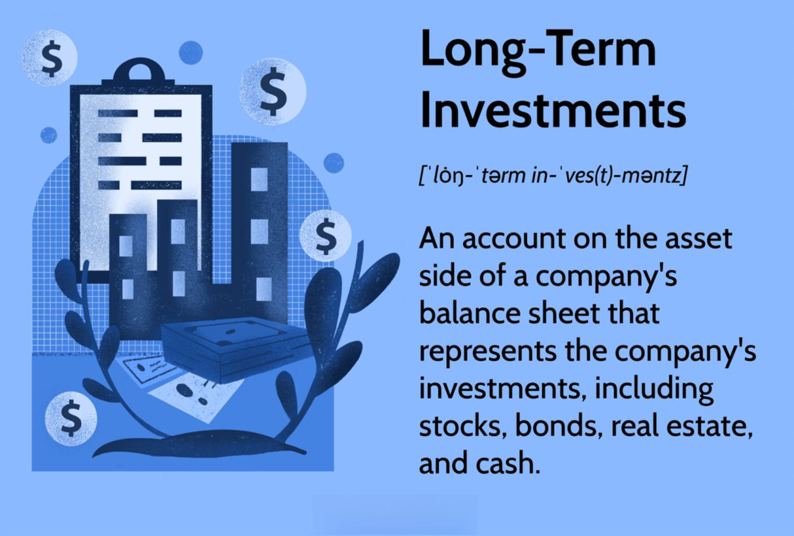

## Table of Contents

## What is Lingjun Investment?

Lingjun Investment is a company that invests money in different businesses and projects. They help these businesses grow by giving them the money they need. The company looks for good opportunities where they can make a profit. They work with many different types of companies, from small startups to big corporations.

The goal of Lingjun Investment is to make money for their investors. They do this by carefully choosing which businesses to invest in. They also help the companies they invest in by giving them advice and support. This way, the companies can be more successful, and Lingjun Investment can earn more money for their investors.

## When was Lingjun Investment founded?

Lingjun Investment was founded in 2015. It started as a small company but grew quickly because it made smart choices about where to put its money.

The company's founders wanted to help businesses grow by giving them the money they needed. They believed that by choosing the right companies to invest in, they could make a lot of money for their investors.

## Who are the founders of Lingjun Investment?

The founders of Lingjun Investment are Li Ming and Wang Jun. They started the company because they wanted to help other businesses grow. Li Ming and Wang Jun believed that by giving money to the right companies, they could make a lot of money for their investors.

Li Ming used to work in a big bank, where he learned a lot about investing money. Wang Jun, on the other hand, had experience starting his own businesses. Together, they used their skills to find good companies to invest in. Their hard work and smart choices helped Lingjun Investment become successful.

## What are the main investment focuses of Lingjun Investment?

Lingjun Investment focuses on two main areas: technology and healthcare. They believe that technology companies can grow quickly and make a lot of money. They look for tech startups that have new ideas and good plans. These companies often need money to make their ideas real, and Lingjun Investment helps them do that.

In healthcare, Lingjun Investment looks for companies that make new medicines or medical tools. They think that as people live longer, they will need more healthcare. So, they invest in companies that can help people stay healthy. By helping these companies, Lingjun Investment hopes to make money and help people at the same time.

## How does Lingjun Investment select its investment opportunities?

Lingjun Investment uses a careful process to pick the companies they want to invest in. They start by looking at many different companies in the technology and healthcare areas. They read about these companies, talk to their leaders, and check their plans. They want to see if the companies have good ideas and if those ideas can make money. They also look at how much money the companies need and if they can pay it back.

Once they find a company they like, Lingjun Investment does more research. They check the company's money records to make sure everything looks good. They also think about the risks. If the company could fail, they want to know why and how likely it is. After all this work, if they still think the company is a good choice, they will give it money. This way, they try to pick the best companies to help and make money for their investors.

## What are some notable investments made by Lingjun Investment?

One of the notable investments made by Lingjun Investment is in a tech company called TechWave. TechWave makes software that helps other businesses run better. Lingjun Investment gave TechWave money to grow their team and make their software even better. Now, TechWave is doing well and helping many businesses.

Another important investment was in a healthcare company called MediCare Solutions. MediCare Solutions makes new medical tools that help doctors take better care of their patients. Lingjun Investment helped MediCare Solutions by giving them money to build more tools and reach more hospitals. This investment has helped a lot of people get better medical care.

## What is the investment philosophy of Lingjun Investment?

Lingjun Investment believes in [picking](/wiki/asset-class-picking) the right companies to help them grow. They focus on technology and healthcare because they think these areas can make a lot of money and help people. They look for companies with good ideas and plans. They want to make sure these companies can pay back the money they get. This way, Lingjun Investment can make money for their investors.

They do a lot of research before they invest. They talk to the leaders of the companies, check their money records, and think about the risks. If a company might fail, they want to know why and how likely it is. After all this work, if they still think the company is a good choice, they will give it money. This careful process helps them pick the best companies to invest in and make money for their investors.

## How has Lingjun Investment performed financially in recent years?

Lingjun Investment has done well in the last few years. They made money for their investors by picking good companies to invest in. Their focus on technology and healthcare paid off, as these areas grew a lot. They also helped the companies they invested in grow, which made more money for everyone.

In the last three years, Lingjun Investment's profits went up every year. They were careful about the risks and made smart choices. This helped them do better than many other investment companies. Their investors were happy because they got more money back than they expected.

## What are the key strategies Lingjun Investment uses to manage its portfolio?

Lingjun Investment uses a few main ways to take care of its investments. They spread their money across different companies to lower the risk. If one company does not do well, the others might still make money. They also keep a close eye on how the companies are doing. If a company starts to have problems, they might give more help or decide to take their money out.

They also check their investments often to see if they should change anything. If a company is doing very well, they might put more money into it. If another company is not doing well, they might take some money out. This way, they try to make the most money possible for their investors. They believe that by being careful and smart, they can help their investments grow.

## How does Lingjun Investment approach risk management?

Lingjun Investment is very careful about managing risks. They know that investing money can be risky, so they do a lot of work to make sure they don't lose too much. They look at each company they might invest in very closely. They check the company's money records and talk to its leaders to see if there are any big problems. They also think about what could go wrong and how likely it is. If they think the risk is too high, they might not invest in that company.

Once they invest, they keep watching the companies. If a company starts to have problems, they might give more help or take their money out. They also spread their money across different companies. This way, if one company does not do well, the others might still make money. By doing all these things, Lingjun Investment tries to make sure they don't lose too much money and can still make profits for their investors.

## What are the future plans and growth strategies of Lingjun Investment?

Lingjun Investment wants to keep growing and helping more companies. They plan to invest in even more technology and healthcare companies. They think these areas will keep growing and making money. They also want to start looking at other areas like clean energy and education. By doing this, they hope to find new ways to make money for their investors.

To grow, Lingjun Investment will keep using their careful way of picking companies. They will do more research and check more companies to find the best ones. They also want to work with other big investors to share ideas and find new opportunities. By working together, they think they can help more companies and make more money.

## How does Lingjun Investment contribute to the broader economic and social development?

Lingjun Investment helps the economy and society by giving money to companies that can grow and create jobs. When they invest in technology and healthcare companies, these businesses can make new products and services. This helps the economy because more people can work and earn money. It also helps because new technology and better healthcare can make life better for everyone.

Lingjun Investment also helps society by focusing on important areas like healthcare. By supporting companies that make new medicines and medical tools, they help people stay healthy. This is good for society because healthy people can work and enjoy life more. Also, by looking at new areas like clean energy, Lingjun Investment can help the environment, which is important for everyone's future.

## References & Further Reading

[1]: ["Advances in Financial Machine Learning"](https://www.amazon.com/Advances-Financial-Machine-Learning-Marcos/dp/1119482089) by Marcos Lopez de Prado

[2]: ["Evidence-Based Technical Analysis: Applying the Scientific Method and Statistical Inference to Trading Signals"](https://www.amazon.com/Evidence-Based-Technical-Analysis-Scientific-Statistical/dp/0470008741) by David Aronson

[3]: ["Machine Learning for Algorithmic Trading"](https://github.com/stefan-jansen/machine-learning-for-trading) by Stefan Jansen

[4]: ["Quantitative Trading: How to Build Your Own Algorithmic Trading Business"](https://books.google.com/books/about/Quantitative_Trading.html?id=j70yEAAAQBAJ) by Ernest P. Chan

[5]: Bergstra, J., Bardenet, R., Bengio, Y., & Kégl, B. (2011). ["Algorithms for Hyper-Parameter Optimization."](https://proceedings.neurips.cc/paper/2011/file/86e8f7ab32cfd12577bc2619bc635690-Paper.pdf) Advances in Neural Information Processing Systems 24.