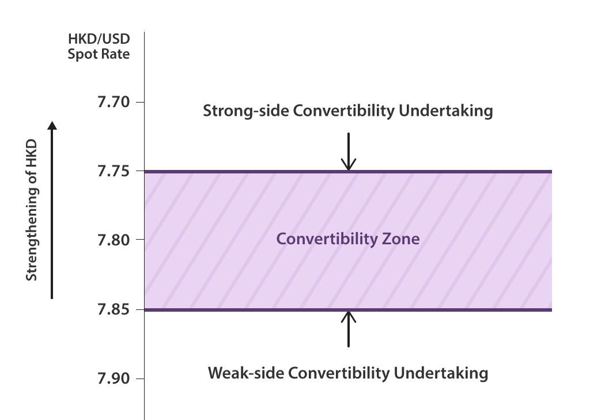

In today’s global financial ecosystem, the exchange rate currency system, linked rate mechanisms, and algorithmic trading are integral components. Understanding how these elements interact is crucial for traders, investors, and policymakers aiming to navigate the complexities of international finance effectively. Exchange rate systems determine the relative value of currencies, influencing the cost of goods and services across borders and affecting global trade balances. A stable exchange rate is essential for economic planning as it impacts inflation rates, interest rates, and economic growth.

Linked rate mechanisms, such as currency pegging, aim to stabilize exchange rates by tying a country's currency value to another, usually stronger, currency like the U.S. dollar. This stabilization reduces exchange rate volatility, which is beneficial for countries with less economic stability, fostering a predictable economic environment. However, it can also limit a country's monetary policy flexibility and requires maintaining adequate reserves of the pegged currency.



Algorithmic trading has transformed currency markets by executing trades at high speed and accuracy, relying on computational algorithms. This has improved efficiency and market liquidity, though it also introduces challenges such as increased market volatility. Algorithmic strategies often incorporate complex mathematical models and data analytics, which help traders exploit arbitrage opportunities or perform high-frequency trades.

The interaction of these systems is reshaping the financial landscape, offering both challenges and opportunities. As algorithmic trading expands and technology continues to evolve, its influence on exchange rate dynamics is likely to increase, underscoring the importance for market participants to remain informed and agile in their strategies. The following sections explore the fundamentals of these key financial components, dissect their interactions, and examine their impact on the global economy.

## Table of Contents

## What is an Exchange Rate Currency System?

An exchange rate currency system is a framework that determines the value of one currency in terms of another. It plays a pivotal role in global trade as it directly influences the cost of imports and exports between countries. A consistent and stable exchange rate is vital for economic planning, as it impacts inflation rates, interest rates, and the broader economic stability required for international investments.

There are several types of exchange rate regimes adopted by different countries, which include floating, fixed, and pegged systems. In a floating exchange rate system, the value of the currency is determined by the market forces of supply and demand relative to other currencies. This system is characterized by variability, as exchange rates fluctuate freely without direct governmental control. Countries like the United States, Canada, and Japan use a floating exchange rate system.

Conversely, a fixed exchange rate system, also known as a pegged exchange rate, involves a country's monetary authority setting a specific value for its currency in relation to a foreign currency, usually the U.S. dollar or a basket of currencies. This system aims to provide greater stability and predictability in exchange rates, which can be beneficial for countries with smaller economies that are vulnerable to market fluctuations. However, maintaining a pegged rate requires significant foreign exchange reserves to manage the currency value against market forces.

Understanding these systems is crucial for investors and traders as it helps in making informed decisions regarding foreign investments and trade strategy. For instance, a floating exchange rate might present opportunities for currency speculation, while a fixed rate can lead to predictable investment returns. Each system has its advantages and disadvantages, impacting economic stability, autonomy of national monetary policy, and susceptibility to external economic pressures.

In summary, the exchange rate currency system is a fundamental element of international economics, influencing trade dynamics, investment flows, and economic policy decisions. Proficiency in these systems enables stakeholders to navigate the complexities of global markets effectively.

## Understanding the Linked Rate System

A linked exchange rate system stabilizes a country's currency by pegging it to another, usually the U.S. dollar. This approach aims to minimize fluctuations and establish predictable economic conditions. Such stability is particularly beneficial for economies heavily reliant on trade and finance. Hong Kong is a prime example where the Hong Kong dollar is pegged to the U.S. dollar, fostering financial stability and investor confidence. This system, however, imposes certain limitations. Most notably, it restricts a country's ability to implement independent monetary policies, as the pegged currency's value must be maintained within a specified range. This requires the central bank to hold significant reserves of the foreign currency to intervene in the foreign exchange market effectively. Central bank interventions ensure the pegged rate is upheld, intervening by buying or selling currencies as necessary. Consequently, a linked exchange rate system achieves stability at the potential cost of reduced monetary autonomy.

## Algorithmic Trading in Currency Markets

Algorithmic trading uses computer algorithms to execute trades at high speed and with precision. This trading method has transformed currency markets by enhancing efficiency and reducing human error. Through the utilization of mathematical models and data analysis, [algorithmic trading](/wiki/algorithmic-trading) systems make real-time decisions, optimizing trade execution and strategy implementation.

A core feature of algorithmic trading is its reliance on quantitative models. These models analyze historical data and trends to predict future price movements. By doing so, they can quickly capitalize on favorable market conditions and execute trades at the most opportune moments. Algorithms are typically programmed to identify [arbitrage](/wiki/arbitrage) opportunities, where price discrepancies between different markets or securities can be exploited for profit. Arbitrage is a strategy wherein traders buy and sell the same asset across different markets to profit from price differences. Algorithmic traders employ high-frequency trading ([HFT](/wiki/high-frequency-trading-strategies)) to execute thousands, or even millions of trades per day, focusing on extremely small price changes, which can accumulate substantial profits.

High-frequency trading represents a significant component of algorithmic trading in currency markets. It leverages ultra-fast execution speeds and advanced algorithms to execute trades in fractions of a second. HFT firms often invest heavily in technology to reduce latency, such as deploying servers closer to trading exchanges or using advanced data transmission techniques. As a result, HFT can enhance market efficiency by narrowing bid-ask spreads and providing [liquidity](/wiki/liquidity-risk-premium).

Despite its benefits, algorithmic trading also introduces challenges. One major concern is the potential for increased market [volatility](/wiki/volatility-trading-strategies), as algorithms may react to market signals in a very short period. Rapid trading can exacerbate price movements, especially during periods of market stress. Additionally, the complexity of algorithmic systems means there is a risk of technical failures or errors, which can lead to significant financial losses.

To illustrate a simple algorithmic trading strategy, consider the following Python code that executes a basic moving average crossover strategy—a common approach used in algorithmic trading:

```python
import pandas as pd

# Sample exchange rate data
data = {'Price': [1.10, 1.11, 1.12, 1.09, 1.08, 1.10, 1.11, 1.09, 1.08, 1.07]}
exchange_rates = pd.DataFrame(data)

# Calculate moving averages
short_window = 3
long_window = 5
exchange_rates['Short_MA'] = exchange_rates['Price'].rolling(window=short_window).mean()
exchange_rates['Long_MA'] = exchange_rates['Price'].rolling(window=long_window).mean()

# Generate signals
exchange_rates['Signal'] = 0
exchange_rates['Signal'][short_window:] = np.where(
    exchange_rates['Short_MA'][short_window:] > exchange_rates['Long_MA'][short_window:], 1, -1
)

# Print signals
print(exchange_rates[['Price', 'Short_MA', 'Long_MA', 'Signal']])
```

In this example, we compute two moving averages—a short-term and a long-term. The algorithm generates buy signals when the short-term average crosses above the long-term average, and sell signals when the reverse occurs. This type of strategy exemplifies how algorithms can systematically execute trades based on predefined criteria.

Overall, algorithmic trading in currency markets has revolutionized the way trades are executed, offering significant advantages in terms of speed and precision. As technology continues to advance, the influence of algorithmic trading on global financial markets is poised to grow, providing both opportunities and challenges for traders and market participants.

## The Interaction Between Currency Pegging and Algorithmic Trading

Currency pegging is a monetary policy mechanism where a country fixes its currency value to another stable currency, usually the U.S. dollar or the euro. This stability benefits algorithmic trading by reducing exchange rate volatility, enabling the implementation of more reliable and consistent trading strategies. For example, a stable exchange rate environment is conducive to [statistical arbitrage](/wiki/statistical-arbitrage) strategies, which rely on predictable currency pair movements.

Algorithmic trading involves using computer algorithms to execute trades with speed and precision. When operating in a currency market where pegging is in place, algorithmic strategies can be fine-tuned to exploit minimal fluctuations, often focusing on other aspects like trading volumes or market sentiments rather than currency value changes.

However, shifts in policies governing pegged currencies can significantly alter market dynamics. For instance, if a central bank decides to alter the pegging ratio or abandons the peg altogether, the sudden shift can result in substantial market volatility. In such scenarios, algorithmic trading systems must possess the agility to quickly adapt to new market conditions. This often requires up-to-date data feeds, rapid recalibration of trading algorithms, and strategies that can quickly respond to changes in market sentiment.

Algorithmic trading systems developed for environments with currency pegging should be designed to monitor potential policy shifts. This could involve tracking indicators such as foreign exchange reserves or political stability, which are known to influence monetary policies. These systems should implement certain safeguards, like stop-loss orders, to mitigate risks associated with abrupt policy changes.

Overall, the intersection of currency pegging and algorithmic trading necessitates sophisticated trading strategies. These strategies should leverage the predictability offered by pegged systems while remaining versatile enough to adapt to any alterations in the currency's pegged status. This balance is crucial for sustaining profitability and minimizing risk in the dynamic landscape of global financial markets.

## Conclusion

The connections among exchange rate systems, currency pegging, and algorithmic trading are essential for understanding the global financial landscape. Recognizing these interactions equips traders, investors, and policymakers with the knowledge needed to make informed decisions and seize opportunities within the international markets. As technological advancements continue, the influence of algorithmic trading on exchange rate dynamics is expected to grow. These technologies enable quicker decision-making and improved trading efficiency, allowing market participants to respond more swiftly to economic shifts.

To maintain a competitive advantage, stakeholders must remain vigilant about changes in economic policies and technological progress that shape the financial environment. Keeping abreast of these developments is necessary to adapt strategies effectively, ensuring they align with current and projected market conditions. Additionally, the evolving nature of financial markets necessitates continuous learning and adaptation as new tools and practices emerge.

Future developments will inevitably reshape these financial structures, presenting new challenges and opportunities. As the financial landscape becomes more interconnected and complex, understanding the interplay between exchange rate systems, currency pegging, and algorithmic trading will be increasingly crucial. Stakeholders who anticipate these changes and adjust accordingly will likely find greater success in navigating the challenges and capturing the opportunities that arise.

## FAQs

What is a linked exchange rate system and how does it function?
A linked exchange rate system, often referred to as a currency peg, entails fixing a country's currency value to that of another currency, typically the U.S. dollar or the euro. This system aims to stabilize a country's exchange rate by mitigating foreign exchange rate volatility, which can be beneficial for economic planning and foreign trade. To maintain the peg, the country's central bank must hold large reserves of the currency to which it is pegged, intervening in the foreign exchange market to prevent the domestic currency from fluctuating beyond allowable limits. Although this can lead to economic stability, it often limits the country's ability to enact autonomous monetary policies.

What are the advantages and disadvantages of currency pegging?
Advantages of currency pegging include stability in foreign trade and investment, predictability for international business transactions, and reduced exchange rate risk. It creates a stable financial environment by anchoring monetary policy to that of the pegged currency. On the downside, it limits monetary policy flexibility, as the central bank must align its policies with those of the anchor currency. During periods of economic distress, maintaining the peg can deplete foreign currency reserves and lead to speculative attacks if the market perceives the peg as unsustainable.

How does algorithmic trading influence currency markets?
Algorithmic trading in currency markets utilizes computer programs to execute trades based on pre-set conditions, capitalizing on speed and precision. These algorithms analyze vast datasets to identify arbitrage opportunities, execute high-frequency trades, and implement complex strategies, significantly enhancing market liquidity. By reducing human biases and errors, algorithmic trading can improve efficiency. However, it also poses challenges, such as potential exacerbation of market volatility and the risk of "flash crashes," where rapid automated selling leads to sharp market declines.

What impact do central bank policies have on pegged currencies?
Central bank policies play a critical role in maintaining the stability of pegged currencies. Monetary policies, including [interest rate](/wiki/interest-rate-trading-strategies) adjustments and reserve requirements, influence the currency's perceived stability. Policy shifts or unexpected changes in interest rates can affect investor confidence and challenge the sustainability of the peg. For example, if a central bank supporting a pegged currency raises interest rates to curb inflation, it may inadvertently attract speculative capital flows, challenging the peg. Conversely, insufficient intervention can lead to a peg breaking if market forces overpower central bank efforts.

How do economic indicators affect exchange rate systems?
Economic indicators, such as inflation rates, GDP growth, and trade balances, significantly impact exchange rate systems. For floating exchange rate systems, these indicators directly affect currency valuation, as foreign exchange markets react to data reflecting economic health. Strong economic performance typically leads to currency appreciation due to increased investor confidence and demand. In fixed or pegged systems, central banks must carefully monitor these indicators to ensure that the pegged exchange rate remains credible. A poor economic outlook might necessitate adjustments in currency reserves or monetary policy to uphold the peg.

## References & Further Reading

[1]: ["Advances in Financial Machine Learning"](https://www.amazon.com/Advances-Financial-Machine-Learning-Marcos/dp/1119482089) by Marcos Lopez de Prado

[2]: ["Evidence-Based Technical Analysis: Applying the Scientific Method and Statistical Inference to Trading Signals"](https://www.amazon.com/Evidence-Based-Technical-Analysis-Scientific-Statistical/dp/0470008741) by David Aronson

[3]: ["Machine Learning for Algorithmic Trading"](https://github.com/stefan-jansen/machine-learning-for-trading) by Stefan Jansen

[4]: ["Quantitative Trading: How to Build Your Own Algorithmic Trading Business"](https://www.amazon.com/Quantitative-Trading-Build-Algorithmic-Business/dp/1119800064) by Ernest P. Chan

[5]: Krugman, P. (1991). ["Target Zones and Exchange Rate Dynamics."](https://academic.oup.com/qje/article-abstract/106/3/669/1920432) NBER Working Paper No. 3678, National Bureau of Economic Research.

[6]: Hull, J. (2015). ["Risk Management and Financial Institutions."](https://www.amazon.com/Management-Financial-Institutions-Wiley-Finance/dp/1119932483) John Wiley & Sons.

[7]: McAleer, M. (2019). ["Modeling Risk and Volatility, Volume 1: Finance, Econometrics, and Controls."](https://scholar.google.com/citations?user=pK01jfoAAAAJ&hl=en) Springer International Publishing.