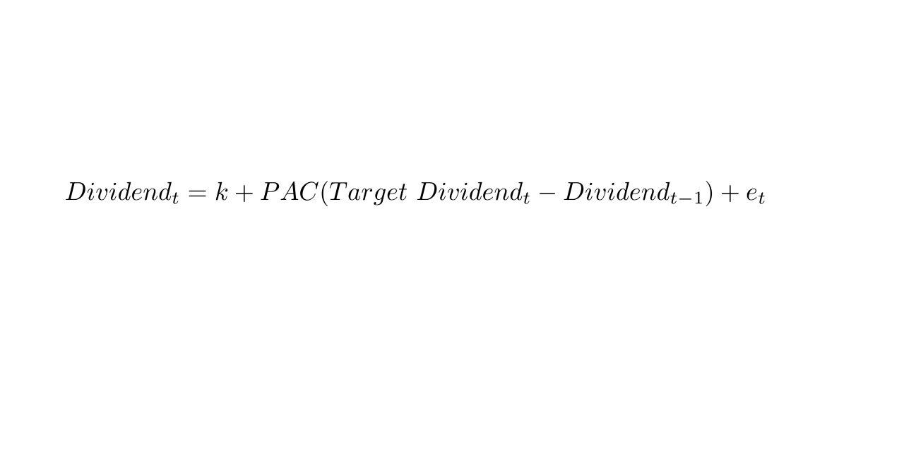

The financial industry is in a perpetual state of transformation, driven by the continuous development of models and theories that mold corporate strategies and inform the approaches of traders. As the landscape of finance evolves, professionals must possess a deep understanding of foundational models that continue to exert influence. Among these, the Lintner Model stands out for its impactful approach to corporate dividend policies. Proposed by John Lintner in 1956, this model has provided substantial insight into how firms determine and adjust their dividend payouts.

Understanding the Lintner Model and its implications is particularly important for finance professionals, as it offers a critical lens through which to assess and predict corporate behaviors with respect to dividends. The model's emphasis on the target payout ratio and the speed at which firms adjust their dividends towards this target offers a benchmark for evaluating corporate strategy in maintaining dividend consistency.



Moreover, the connection between the Lintner Model and algorithmic trading highlights its continued relevance in modern finance. As algorithmic trading increasingly relies on predictive models and historical data, the stability concepts emphasized by the Lintner Model inform the development of algorithms used to trade based on dividend announcements or changes. In this context, models like Lintner's, which offer predictability in corporate behavior, become invaluable tools for traders seeking to capitalize on dividend trends.

The following article will explore the Lintner Model in detail, examining its mechanisms, practical implications, interaction with algorithmic trading, and the criticisms it faces. Understanding these elements is crucial for finance professionals as they navigate a financial environment that is both technologically advanced and inherently unpredictable. Through this understanding, they can better harness the insights offered by Lintner's seminal work to inform strategy and trading decisions.

## Table of Contents

## What is the Lintner Model?

The Lintner Model, introduced in 1956 by the economist John Lintner, offers a conceptual framework for corporate dividend policies, focusing on two primary aspects: the target payout ratio and the speed at which companies adjust their dividends to align with this target. This model emerged from Lintner's empirical research on the behavior of large American corporations in the post-World War II era, and it has since become instrumental in understanding and predicting corporate dividend strategies.

At the core of the Lintner Model is the assertion that companies prefer to smooth their dividends, thereby maintaining consistent payout levels over time. Lintner suggested that firms generally set a target payout ratio, which is the portion of earnings they aim to distribute to shareholders as dividends. Rather than making abrupt changes based on annual earnings fluctuations, companies gradually adjust their dividends, thereby providing predictability and stability to investors.

The mathematical formulation of the Lintner Model can be expressed as:

$$
D_{t} = D_{t-1} + c \times (T_{t} - D_{t-1})
$$

Where:
- $D_{t}$ is the dividend in the current period.
- $D_{t-1}$ is the dividend in the previous period.
- $c$ is the partial adjustment coefficient, indicating the speed of adjustment.
- $T_{t}$ is the target dividend level for the current period.

The parameter $c$ (0 < $c$ ≤ 1) represents the rate of adjustment toward the target payout ratio. A higher $c$ implies a faster adjustment rate, allowing dividends to align more quickly with changes in earnings.

Lintner's empirical findings indicated that most companies adopt a cautious approach, with $c$ typically ranging between 0.3 and 0.6. This reflects a preference for incremental changes that reduce the risk of investor dissatisfaction from volatile dividend policies. Importantly, the model reveals that management decisions on payout ratios are heavily influenced by current earnings and existing dividend levels, fostering an environment of stability and predictability. 

The ongoing relevance of the Lintner Model is evident in its continued use as a benchmark for assessing corporate dividend strategies. It informs both theoretical and practical aspects of financial decision-making, providing foundational insights into how companies balance reinvesting profits with returning value to shareholders.

## Mechanics of the Lintner Model

The Lintner Model is central to understanding how corporations establish their dividend distribution policies. The model provides a systematic approach to the incremental adjustment of dividends towards a predetermined target payout ratio. At its core, the model employs a simple mathematical formula:

$$
D_t = D_{t-1} + c(T \times E_t - D_{t-1})
$$

where:
- $D_t$ is the dividend in the current period.
- $D_{t-1}$ is the dividend in the previous period.
- $c$ is the partial adjustment coefficient, a key factor that signifies the speed at which adjustments toward the target payout are made.
- $T$ is the target payout ratio.
- $E_t$ is the earnings in the current period.

The partial adjustment coefficient, $c$, is instrumental in dictating how quickly a company alters its dividends. A higher $c$ value indicates a faster adjustment, whereas a lower $c$ signifies a more gradual modification process. This coefficient reflects a firm's commitment to gradually align the dividends with long-term targets, balancing current earnings fluctuations with their payout goals.

By employing the Lintner Model, companies aim to provide a stable dividend stream, minimizing abrupt changes that might provoke adverse market reactions or investor uncertainty. Consistent dividend payouts align shareholder expectations with management's financial strategies, enhancing market confidence. This model allows firms to meticulously plan their dividend distributions, factoring in short-term earnings [volatility](/wiki/volatility-trading-strategies) while remaining on [course](/wiki/best-algorithmic-trading-courses) to meet long-term payout objectives.

## Practical Implications

The Lintner Model underscores the preference of firms for stable and predictable dividend payouts. This preference aligns with the long-term earnings projections of the company, offering a consistent message to investors about the financial health and prospects of the firm. By maintaining a regular dividend policy, companies can communicate their earnings stability and growth prospects without the need for abrupt changes, which might unsettle investors and create uncertainty in the market.

A significant impact of the Lintner Model is its influence on how businesses handle investor expectations concerning dividend consistency. By adopting a stable dividend policy, companies create a reliable framework for investors to gauge the financial wellbeing of the company. This consistency is particularly appealing to income-focused investors who rely on dividend payments as a source of income, thereby enhancing investor satisfaction and potentially reducing the cost of capital for the firm.

Corporate boards utilize the Lintner Model as a strategic tool to balance the competing interests of reinvesting profits for future growth and returning capital to shareholders in the form of dividends. The model proposes a partial adjustment strategy where dividends are gradually adjusted toward a target payout ratio, represented by the equation:

$$
D_t = D_{t-1} + c(E_t - D_{t-1})
$$

where $D_t$ is the dividend in period $t$, $D_{t-1}$ is the dividend in the previous period, $c$ is the partial adjustment coefficient, and $E_t$ represents the earnings in period $t$. This formula ensures that changes in dividends are gradual and measured, avoiding the volatility that can be unsettling for investors.

By employing such a measured approach, boards can efficiently manage the allocation of earnings between reinvestment in the business and distributions to shareholders. This balancing act is crucial as it directly impacts the company’s growth potential and the satisfaction of its shareholders. Thus, the Lintner Model not only provides a framework for practical dividend policy management but also plays a critical role in aligning corporate financial strategies with shareholder interests.

## Integration with Algorithmic Trading

Algorithmic trading leverages computational power and advanced algorithms to execute trades at speeds and frequencies impractical for human traders. One foundational aspect of these algorithms is the reliance on historical data and predictive models to inform trading strategies. The Lintner Model, with its emphasis on stable and predictable dividend policies, aligns well with the needs of [algorithmic trading](/wiki/algorithmic-trading) systems. 

The model suggests that companies aim for stable dividend payouts, adjusting gradually towards a target payout ratio. This stability and predictability in corporate behavior are crucial for algorithmic trading strategies focused on dividend announcements or changes. Algorithms can be engineered to anticipate potential market reactions to these events based on historical patterns identified by the Lintner Model. The predictable nature of dividend adjustments provides a reliable parameter for trading algorithms to evaluate potential buy or sell signals.

For example, an algorithm might scan for companies that have recently announced dividends slightly above or below the anticipated target, as predicted by the Lintner Model. Given the model’s focus on predictable adjustment speeds—often quantified via the partial adjustment coefficient—algorithms can be programmed to recognize when a company’s announcement aligns with or deviates from expected patterns. 

Python, a widely used language in algorithmic trading, can implement these concepts efficiently:

```python
# Example Python function to evaluate dividend stability based on Lintner's Model
def evaluate_dividend_stability(company_data, target_payout, adjustment_speed):
    """
    Evaluates the stability of a company's dividend policy.

    :param company_data: List of historical dividend data
    :param target_payout: The target payout ratio as per the Lintner Model.
    :param adjustment_speed: The partial adjustment coefficient.
    :return: Boolean indicating if dividend policy aligns with Lintner's model.
    """
    stable = True
    for year, dividend in enumerate(company_data[1:], start=1):
        expected_dividend = company_data[year - 1] + adjustment_speed * (target_payout - company_data[year - 1])
        if abs(expected_dividend - dividend) > 0.05 * company_data[year - 1]:  # 5% allowance for deviation
            stable = False
            break
    return stable

# Sample data for illustration
company_dividends = [1.00, 1.05, 1.08, 1.15]
target_payout_ratio = 1.10
partial_adjustment = 0.3

is_stable = evaluate_dividend_stability(company_dividends, target_payout_ratio, partial_adjustment)
print("Dividend policy is stable:", is_stable)
```

In automated trading systems, leveraging models like Lintner's aids in constructing predictive frameworks that appeal to algorithmic approaches. The structured adaptation towards target payout ratios helps calibrate trading strategies, offering an edge in forecasting market reactions to dividend-related news. As automation in trading continues to grow, incorporating models that predict corporate behavior becomes invaluable for increasing the accuracy and effectiveness of trading algorithms.

## Criticisms and Limitations

Critics of the Lintner Model argue that it oversimplifies the complex nature of dividend decision-making by not adequately accounting for factors such as taxation and prevailing market dynamics. Tax considerations can significantly impact a company's decision on whether to issue dividends or engage in share repurchases. For instance, tax policies may favor capital gains over dividend income, influencing firms to choose stock buybacks as a potentially more tax-efficient method for returning profits to shareholders.

Furthermore, the model's primary focus on dividends has been cited as a limitation in light of modern corporate financial strategies, where many companies opt for stock repurchases as an alternative means of profit distribution. Stock repurchases can offer greater flexibility for corporations, allowing them to adjust their capital return strategies based on market conditions, whereas dividends often imply a commitment to regular payouts.

The applicability of the Lintner Model is also challenged by global market differences, which necessitate adaptations and yield varying results across different regions. The economic environment, regulatory frameworks, and cultural perspectives on dividend policies can differ substantially from one country to another. This diversity means that while the Lintner Model provides a foundational understanding of dividend behavior, its assumptions and resulting implications may not universally hold across global markets.

The limitations underscore the necessity for a more comprehensive approach that integrates these additional factors, offering a nuanced view that aligns with contemporary corporate financial practices. As such, understanding these criticisms is crucial for finance professionals seeking to explore or refine dividend policies within a broader economic context.

## Modern Adaptations and Theoretical Extensions

The Fama-Babiak model represents a significant advancement over the Lintner Model by addressing its limitations and incorporating more sophisticated statistical techniques. Developed by Eugene Fama and Harvey Babiak in 1968, this model refines Lintner's approach by employing multiple regression analysis to evaluate dividend policy factors. It incorporates not only the target payout ratio and the speed of adjustment, as emphasized by Lintner, but also includes other financial variables, such as earnings and cash flow, to better capture the intricacies of corporate dividend decisions.

Mathematically, the Fama-Babiak model can be expressed as:

$$
D_t = a + b \times E_t + c \times D_{t-1} + \varepsilon_t
$$

where:
- $D_t$ is the dividend in time $t$,
- $a$ is a constant term,
- $b$ represents the sensitivity of dividends to current earnings $E_t$,
- $c$ is the coefficient for past dividends $D_{t-1}$, which represents the persistence of dividend policy,
- $\varepsilon_t$ is the error term.

This model acknowledges that dividends are influenced by both current profitability and a firm's historical dividend levels, making it a more comprehensive tool for analyzing dividend policies.

Additionally, the concepts of dividend signaling and the agency problem add depth to the discourse on dividend policies. Dividend signaling theory suggests that changes in dividend payouts convey information about a firm’s future prospects. Companies might increase dividends to signal confidence in consistent future earnings, whereas a cut might signal financial distress.

The agency problem relates to the conflict of interest between managers and shareholders. Managers might prefer to retain earnings for expansion projects, aligning with their interests, while shareholders might favor payouts. Incorporating these concepts helps provide a richer understanding of why companies choose specific dividend policies beyond the Lintner Model's financial metrics.

Modern finance continually adapts and extends these foundational insights. The interplay between dividend decisions and market perceptions evolves, influenced by global economic conditions, changes in tax policies, and shifts in corporate governance structures. As such, these models are not static; they are continually refined to reflect emerging trends and insights in financial theory. Through ongoing research and development, finance professionals enhance these models to accommodate the growing complexity of modern financial markets.

## Conclusion

Lintner's Model remains a critical framework in corporate finance, extensively influencing dividend policy and guiding investor strategies. The model's emphasis on stable and consistent dividend distributions aligns well with the preferences of long-term investors who seek predictability and steady income. Its foundational principles are not solely historical but continue to shape how finance professionals, both in traditional manual trading and modern algorithmic contexts, analyze and forecast corporate dividend behaviors.

Understanding the Lintner Model is crucial for finance experts. It offers a structured approach to dividend policy by considering the target payout ratio and the adjustment speed towards this target. These elements are vital for developing strategies that accommodate both profit reinvestment and shareholder satisfaction. The model's impact transcends static application, adapting to diverse economic climates and technological advancements that characterize modern trading environments.

As markets evolve and technology advances, the Lintner Model's applications are poised to transform further. The integration with algorithmic trading demonstrates its relevance in analyzing large data sets and predicting corporate actions, thereby facilitating automated trading decisions. This integration is becoming increasingly important as trading strategies become more reliant on data-driven insights, particularly in high-frequency trading scenarios where understanding dividend policy signals can confer significant advantages.

Continued research into the Lintner Model will foster deeper insights into its application, accuracy, and adaptability, particularly as globalization and digital transformation introduce new variables in financial markets. These developments will ensure that the model remains relevant, providing a robust tool for interpreting and predicting corporate financial strategies in a complex, technologized landscape. Finance professionals who grasp the implications and applications of this model will be well-equipped to navigate and succeed in the dynamic field of corporate finance.

## References & Further Reading

[1]: Lintner, J. (1956). ["Distribution of Incomes of Corporations Among Dividends, Retained Earnings, and Taxes."](https://www.semanticscholar.org/paper/DISTRIBUTION-OF-INCOMES-OF-CORPORATIONS-AMONG-AND-Lintner/143efffe75d830c56a943b1098016341e2f17c3c) The American Economic Review, 46(2), 97-113.

[2]: Fama, E. F., & Babiak, H. (1968). ["Dividend Policy: An Empirical Analysis."](https://www.tandfonline.com/doi/abs/10.1080/01621459.1968.10480917) Journal of the American Statistical Association, 63(324), 1132-1161.

[3]: ["Dividend Policy: Its Impact on Firm Value"](https://www.academia.edu/28702066/Dividend_Policy_and_Its_Impact_on_Firm_Value_A_Review_of_Theories_and_Empirical_Evidence) by Ronald C. Spencer

[4]: ["The Theory of Corporate Finance"](https://press.princeton.edu/books/hardcover/9780691125565/the-theory-of-corporate-finance) by Jean Tirole

[5]: ["Finance and the Good Society"](https://press.princeton.edu/books/hardcover/9780691154886/finance-and-the-good-society) by Robert J. Shiller

[6]: Bhattacharya, S. (1979). ["Imperfect Information, Dividend Policy, and 'The Bird in the Hand' Fallacy."](https://www.jstor.org/stable/pdfplus/3003330.pdf) The Review of Economic Studies, 46(1), 95-106.