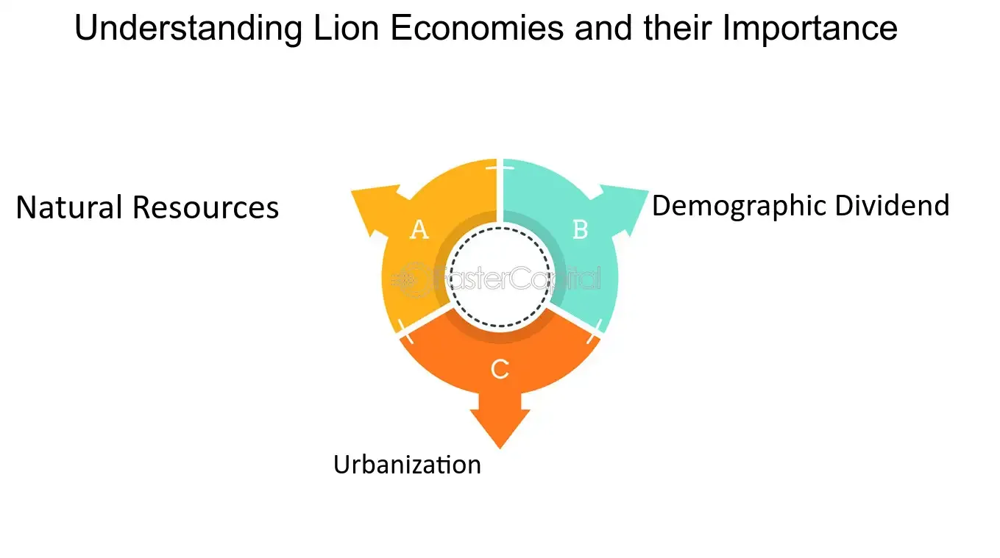

## Table of Contents

## What are Lion Economies?

Lion Economies is a term used to describe the fast-growing economies in Africa. These countries are seen as the next big markets for business and investment, much like the "Asian Tigers" were in the past. Countries like Kenya, Nigeria, and South Africa are often called Lion Economies because they are growing quickly and have a lot of potential.

These economies are important because they can help lift many people out of poverty. With more jobs and better infrastructure, people in these countries can have a better quality of life. Investors from around the world are interested in Lion Economies because they see a chance to make money and help these countries grow even more.

## Which countries are considered Lion Economies?

Lion Economies are countries in Africa that are growing quickly. Some of the main Lion Economies are Kenya, Nigeria, and South Africa. These countries are seen as good places for business and investment because they have a lot of potential to grow even more.

People are interested in Lion Economies because they can help create jobs and improve life for many people. When businesses invest in these countries, it can lead to better roads, schools, and hospitals. This is why investors from around the world are looking at Lion Economies as places to put their money.

Other countries that are sometimes called Lion Economies include Ghana, Ethiopia, and Rwanda. Each of these countries has its own strengths and is working hard to grow its economy. Together, these Lion Economies are helping to make Africa a more prosperous place.

## What are the key characteristics of Lion Economies?

Lion Economies are known for growing fast and having a lot of potential. They are in Africa and countries like Kenya, Nigeria, and South Africa are part of this group. These economies are attractive to investors because they offer a chance to make money and help the countries grow. The growth in these economies comes from things like more people working, new businesses starting, and better ways of doing things.

One important thing about Lion Economies is that they can help lift people out of poverty. When businesses invest in these countries, it can lead to more jobs and better services like roads, schools, and hospitals. This makes life better for the people who live there. The governments in these countries are also working hard to make their economies even stronger by making it easier for businesses to start and grow.

Some other countries that are sometimes called Lion Economies are Ghana, Ethiopia, and Rwanda. Each of these countries has its own strengths and is trying hard to grow its economy. Together, these Lion Economies are helping to make Africa a more prosperous place. They are important because they show that Africa can be a place for big business and investment, just like other parts of the world.

## How do Lion Economies differ from other emerging markets?

Lion Economies are different from other emerging markets because they are mainly in Africa. Countries like Kenya, Nigeria, and South Africa are part of this group. These countries are growing fast and have a lot of potential. They are seen as good places for business and investment because they can help lift many people out of poverty. When businesses invest in these countries, it can lead to more jobs and better services like roads, schools, and hospitals.

Other emerging markets, like those in Asia or Latin America, might also be growing fast, but they are different because they are in different parts of the world. They might have different challenges and opportunities. For example, the Asian Tigers like South Korea and Singapore grew quickly in the past, but they are not in Africa like the Lion Economies. Each group of emerging markets has its own special things that make them attractive to investors.

Lion Economies are important because they show that Africa can be a place for big business and investment, just like other parts of the world. They are working hard to grow their economies and make life better for their people. This is different from other emerging markets, which might have different goals and ways of growing. But all emerging markets share the idea of trying to become stronger and more prosperous.

## What are the main drivers of growth in Lion Economies?

The main drivers of growth in Lion Economies are more people working, new businesses starting, and better ways of doing things. When more people have jobs, they can spend more money, which helps the economy grow. New businesses bring new ideas and create more jobs. Also, when countries find better ways to do things, like using new technology or making things more efficiently, it helps the economy grow even faster.

Another important driver is investment from other countries. When businesses from around the world see the potential in Lion Economies, they invest money to start new projects or expand existing ones. This brings in more money and helps create more jobs. Governments in these countries also play a big role by making it easier for businesses to start and grow. They do this by building better roads, schools, and hospitals, which makes life better for everyone and helps the economy grow.

Overall, the growth in Lion Economies comes from a mix of more people working, new businesses, better ways of doing things, and investment from other countries. These things together help lift people out of poverty and make the countries stronger and more prosperous.

## What are the potential risks of investing in Lion Economies?

Investing in Lion Economies can be exciting because they are growing fast, but there are also some risks. One big risk is that these countries can be unstable. This means there might be changes in the government or even conflicts that can make it hard for businesses to operate. When things are unstable, it can be risky to invest money because you might not be sure if your investment will be safe.

Another risk is that the rules for businesses can change a lot. In some Lion Economies, the laws about how businesses can work might be different from what investors are used to. This can make it hard to plan and can lead to problems if the rules change suddenly. It's important for investors to understand these rules and be ready for changes.

Finally, there can be problems with money. The value of money in these countries can go up and down a lot, which can affect how much money investors make. Also, it can be hard to get money in and out of these countries. This means that even if a business does well, it might be hard to take the profits back home. So, while there are big opportunities in Lion Economies, investors need to be careful and think about these risks.

## What sectors offer the best investment opportunities in Lion Economies?

In Lion Economies, some of the best sectors for investment are in technology and communication. Many people in these countries are getting their first smartphones and using the internet for the first time. This means there are big opportunities for companies that provide internet services, mobile apps, and other tech solutions. For example, mobile banking and e-commerce are growing fast because more people want to use these services. Investing in these areas can help bring new technology to more people and create a lot of jobs.

Another good sector for investment is in infrastructure, like building roads, bridges, and power plants. Many Lion Economies need better infrastructure to keep growing. When companies invest in building these things, it helps the whole country. Better roads make it easier for businesses to move their goods, and more power plants mean more people can use electricity. This can lead to more jobs and a better quality of life for people in these countries. So, investing in infrastructure can be a smart choice for investors looking to help these economies grow.

Finally, the agriculture and food processing sector also offers great opportunities. Many Lion Economies have a lot of farmland and a growing population that needs more food. By investing in modern farming techniques and food processing, companies can help increase the amount of food available and improve how it gets to people. This can lead to more jobs in farming and food businesses, and it can help make sure everyone has enough to eat. So, agriculture and food processing are important areas for investment in Lion Economies.

## How can investors access the markets of Lion Economies?

Investors can access the markets of Lion Economies by working with local partners who know the area well. These partners can help investors understand the rules and find good opportunities. Sometimes, investors can also buy shares in companies that are already working in these countries. This way, they can invest without having to start their own business from scratch. Another way is to invest through funds that focus on Africa. These funds pool money from many investors and use it to invest in different businesses across Lion Economies.

It's also important for investors to do their homework before investing. They should learn about the local laws, the economy, and the culture of the country they want to invest in. This can help them make better decisions and avoid problems. Sometimes, investors can go to conferences or events where they can meet people from Lion Economies and learn more about the opportunities there. By taking these steps, investors can find good ways to put their money into these growing markets and help them develop even more.

## What are some successful case studies of investments in Lion Economies?

One successful case study of investment in Lion Economies is the story of M-Pesa in Kenya. M-Pesa is a mobile money service that lets people send and receive money using their cell phones. It started in 2007 and has grown to be used by millions of people. This investment helped many people who didn't have bank accounts to use financial services. It also created jobs and helped businesses grow. Investors saw that people in Kenya needed an easy way to handle money, and M-Pesa filled that need very well.

Another example is the investment in Ethiopian Airlines. Ethiopia has been working hard to grow its economy, and its national airline has been a big part of that. Investors helped the airline buy new planes and expand its routes to more places around the world. This made it easier for people and goods to move in and out of Ethiopia. The investment in Ethiopian Airlines helped the country's economy grow by creating jobs and bringing in more money from tourism and trade. It shows how investing in infrastructure, like airlines, can help a whole country develop.

## How do government policies impact Lion Economies?

Government policies can have a big impact on Lion Economies. When governments make rules that help businesses start and grow, it can lead to more jobs and a stronger economy. For example, if the government makes it easier to open a new business or build new roads, it can attract more investors. These investors can bring in money and new ideas, which can help the economy grow even faster. On the other hand, if the government makes rules that are too strict or hard to follow, it can slow down businesses and make it harder for the economy to grow.

Another way government policies affect Lion Economies is by helping to keep things stable. When the government works to avoid conflicts and make sure the country is safe, it can make investors feel more confident about putting their money there. Stable governments can also make good plans for the future, like investing in schools and hospitals, which can help the economy grow over time. But if the government is not stable or changes rules a lot, it can scare away investors and make it harder for businesses to plan for the future. So, good government policies are very important for the growth of Lion Economies.

## What are the long-term economic forecasts for Lion Economies?

The long-term economic forecasts for Lion Economies look promising. Many experts believe that countries like Kenya, Nigeria, and South Africa will keep growing fast over the next few years. This is because more people are getting jobs, new businesses are starting, and new technology is helping to do things better. Investors from around the world see a lot of potential in these countries and are putting money into them. This can help build more roads, schools, and hospitals, which makes life better for everyone and helps the economy grow even more.

However, there are also some challenges that could affect the long-term growth of Lion Economies. One big challenge is that these countries can be unstable at times. This means there might be changes in the government or even conflicts that can make it hard for businesses to operate. Another challenge is that the rules for businesses can change a lot, which can make it hard for investors to plan. Also, the value of money in these countries can go up and down a lot, which can affect how much money investors make. Despite these challenges, if Lion Economies can keep working on making things better and more stable, they have a good chance of becoming even stronger and more prosperous in the future.

## How can one mitigate the risks associated with investing in Lion Economies?

To mitigate the risks of investing in Lion Economies, it's important to do a lot of research first. Investors should learn about the local laws, the economy, and the culture of the country they want to invest in. This can help them understand what might go wrong and how to avoid those problems. Working with local partners who know the area well can also help. These partners can guide investors through the rules and help them find good opportunities. Another way to reduce risk is to spread out investments across different businesses and sectors. This way, if one investment doesn't do well, the others might still be okay.

Another strategy is to invest through funds that focus on Africa. These funds pool money from many investors and use it to invest in different businesses across Lion Economies. This can help spread out the risk because the fund managers are experienced and can make smart choices about where to put the money. It's also a good idea to keep an eye on the news and stay informed about what's happening in these countries. If there are signs of instability or big changes in the rules, investors might need to adjust their plans. By being careful and prepared, investors can find ways to make their investments in Lion Economies safer and more successful.

## How can investment strategies be integrated with algo trading?

Algorithmic trading, often referred to as algo trading, has emerged as a pivotal tool in enhancing investment strategies within Lion Economies. These economies, characterized by rapid growth and untapped market potential, present unique opportunities and challenges that can be efficiently navigated through the strategic implementation of [algorithmic trading](/wiki/algorithmic-trading).

Investors can leverage algo trading to improve decision-making processes, optimize execution speeds, and access market opportunities that are otherwise difficult to capture. By developing tailored algorithmic trading models, investors can address the specific dynamics of emerging markets. These models often incorporate factors such as market [liquidity](/wiki/liquidity-risk-premium), trading [volume](/wiki/volume-trading-strategy), and [volatility](/wiki/volatility-trading-strategies), which are distinct in Lion Economies. A simple model, for example, could focus on:

$$
\text{Expected Return} = \alpha + \beta \times \text{Market Volatility} + \gamma \times \text{Trade Volume}
$$

Adjusting parameters like $\alpha$, $\beta$, and $\gamma$ allows these models to be responsive to local economic indicators and trends rather than relying solely on global benchmarks.

The integration of big data and [machine learning](/wiki/machine-learning) further enhances the efficacy of algorithmic trading in these markets. Emerging technologies enable the processing of vast datasets to identify patterns, trends, and anomalies that may not be immediately apparent through traditional analysis. By implementing machine learning algorithms, such as neural networks and decision trees, investors can predict market movements and develop automated strategies that adapt to changing conditions.

Python, with libraries like TensorFlow and scikit-learn, provides a robust environment for developing such machine learning models. For instance, a trading strategy could begin by training a predictive model using historical market data:

```python
from sklearn.model_selection import train_test_split
from sklearn.ensemble import RandomForestRegressor
import pandas as pd

# Load market data
data = pd.read_csv('market_data.csv')

# Define features and target variable
features = data[['market_volatility', 'trade_volume']]
target = data['price_movement']

# Split data into training and testing sets
X_train, X_test, y_train, y_test = train_test_split(features, target, test_size=0.2, random_state=42)

# Initialize and train the model
model = RandomForestRegressor(n_estimators=100, random_state=42)
model.fit(X_train, y_train)

# Evaluate model on the test set
accuracy = model.score(X_test, y_test)
print(f'Model accuracy: {accuracy * 100:.2f}%')
```

The importance of real-time data and analytics cannot be overstated. In the fast-paced environments of emerging markets, access to up-to-date information is crucial for making informed investment decisions. Real-time analytics enable investors to adjust their strategies promptly to reflect new data or shifts in market conditions, thereby mitigating risks and capitalizing on immediate opportunities.

By harnessing the capabilities of algorithmic trading, investors in Lion Economies can develop sophisticated, data-driven strategies that align with the unique characteristics of these markets. This approach not only enhances the efficiency and effectiveness of investment activities but also supports the sustainable growth and integration of Lion Economies into the global financial system.

## References & Further Reading

[1]: Radelet, S. C. (2010). ["Emerging Africa: How 17 Countries Are Leading the Way"](https://www.cgdev.org/sites/default/files/1424419_file_EmergingAfrica_FINAL.pdf). Brookings Institution Press.

[2]: McKinsey Global Institute. (2016). ["Lions on the move II: Realizing the potential of Africa’s economies"](https://www.mckinsey.com/featured-insights/middle-east-and-africa/lions-on-the-move-realizing-the-potential-of-africas-economies).

[3]: Financial Times. (2021). ["Africa’s young population can drive global growth"](https://www.gktoday.in/assam-launches-mission-basundhara-3-0-for-land-rights/).

[4]: Auty, R.M. (1994). ["Economic Development and Industrial Policy: Korea, Brazil, Mexico"](https://searchworks.stanford.edu/view/2932912).

[5]: Lopez de Prado, M. (2018). ["Advances in Financial Machine Learning"](https://books.google.com/books/about/Advances_in_Financial_Machine_Learning.html?id=oU9KDwAAQBAJ).

[6]: United Nations Conference on Trade and Development (UNCTAD). (2020). ["World Investment Report 2020: International Production Beyond the Pandemic"](https://unctad.org/publication/world-investment-report-2020).

[7]: Asongu, S.A., & Nwachukwu, J.C. (2017). ["The role of governance in mobile phones for inclusive human development in sub-Saharan Africa"](https://www.researchgate.net/profile/Simplice-Asongu-2/publication/314566164_The_Role_of_Governance_in_Mobile_Phones_for_Inclusive_Human_Development_in_Sub-Saharan_Africa/links/5acac0834585151e80a92245/The-Role-of-Governance-in-Mobile-Phones-for-Inclusive-Human-Development-in-Sub-Saharan-Africa.pdf). Technological Forecasting and Social Change.

[8]: Khan, S.A., & Salahuddin, M. (2020). ["Algorithmic Trading: Opportunities and Pitfalls for the Emerging Markets"](https://pubmed.ncbi.nlm.nih.gov/32057788/). Springer Nature.