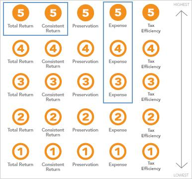

Investment analytics are fundamental to the financial sector, providing essential insights and tools that empower investors to make informed decisions. At the heart of these analytics are financial benchmarks, such as Lipper Indexes, which are critical for tracking the performance of managed fund strategies across various asset classes. Lipper Indexes serve as valuable references, enabling investors and fund managers to evaluate and compare mutual fund performance effectively.

In the era of technology-driven trading, algorithmic trading—commonly known as algo trading—has become a significant player in financial markets. Algo trading leverages financial benchmarks like Lipper Indexes to automate trading processes, enhance decision-making, and optimize trading strategies. By utilizing these benchmarks, algo trading systems can execute trades with improved efficiency and reduced human error, resulting in optimized financial outcomes.



This article aims to explore the intersection of Lipper Indexes, financial benchmarks, and algo trading. It highlights their integral roles in shaping the modern investment landscape, where precise data analysis and strategic decision-making are key to capitalizing on market opportunities and mitigating risks. As financial markets continue to evolve, the importance of these tools and methodologies in guiding investment strategies is ever-increasing.

## Table of Contents

## Understanding Lipper Indexes

Lipper Indexes serve as an essential tool for gauging mutual fund performance, offering a standardized metric across diverse investment strategies and asset classes. These indexes are crucial for investors seeking to benchmark the potential returns of mutual funds against established performance markers.

The construction of Lipper Indexes involves averaging the returns of the largest publicly accessible funds within a specific strategy. By doing this, Lipper Indexes create a representative performance measure that can be used as a benchmark by investors and fund managers alike. This approach ensures that the indexes reflect a broad sampling of market movements and the strategies employed by major funds, offering a reliable indicator of performance trends.

For investment managers, Lipper Indexes play a pivotal role in reporting and analysis activities. They provide a transparent, comparable basis for evaluating fund performance, which is essential for making informed investment decisions. By adhering to standardized measures, fund managers can present their performance in a manner that is easily comparable with peers, fostering transparency in the industry. This transparency helps ensure that investors are well-informed about where their investments stand relative to the broader market and competitors.

This widespread use of Lipper Indexes underscores their importance in the investment community. They facilitate the comparison of fund performance, thereby enhancing the ability of investors to track market trends and adjust their portfolios in response to changing market conditions. By providing a clear and consistent benchmark, Lipper Indexes empower both individual and institutional investors to make decisions grounded in data and comparative analysis.

## Role of Financial Benchmarks

Financial benchmarks serve as essential tools for evaluating the performance of investment funds, particularly in the context of actively-managed mutual funds. These benchmarks, including well-known examples like the Lipper Indexes, offer a standard against which fund performances can be measured, aiding investors in making well-informed decisions.

One of the primary roles of financial benchmarks is to provide a comparative framework. For investors, the assessment of a fund’s performance is not simply about absolute returns but also about how these returns stack up against similar investment opportunities. By leveraging benchmarks, investors can evaluate whether a fund manager is truly adding value or if the returns could have been obtained by merely tracking the benchmark. This relative performance analysis enables informed decision-making, guided by historical data and observable trends.

The functionality of benchmarks further extends to creating standardized comparisons across a myriad of funds. This standardization eliminates biases and inconsistencies that can arise when comparing funds without a common reference point. For instance, the Lipper Indexes’ methodology of averaging returns from a collection of the largest public funds within a specific strategy provides a robust benchmark for performance evaluation. The standardization is achieved through clear definitions and criteria that ensure comparability and objectivity.

Moreover, the utilization of these benchmarks allows for the identification of broader market dynamics. By analyzing data from benchmarks like the Lipper Indexes, investors can discern patterns and shifts in market trends, such as movements in equity, bond, and money markets. This knowledge not only aids in optimizing investment choices but also in risk management strategies.

In conclusion, financial benchmarks are indispensable for assessing fund performance. They provide a framework for relative performance evaluation and facilitate standardized comparisons, thereby enhancing the understanding of market dynamics. As a result, investors are better equipped to make data-driven decisions, aligning their portfolios with winning strategies.

## Integration with Algo Trading

Algorithmic trading (algo trading) is a significant part of modern financial markets, relying on quantitative models and pre-defined instructions to execute trades at speeds and frequencies that are impossible for human traders. The integration of Lipper Indexes into this domain enables more effective trading strategies and offers several tangible advantages. 

Lipper Indexes serve as a reliable source of performance data for a wide range of asset classes and fund strategies. This data is invaluable for algo trading models which demand accurate and timely information to function optimally. By incorporating Lipper Index performance data, these models can be programmed to automatically adjust trading strategies based on real-time market conditions. This capability enhances the system's responsiveness to market fluctuations, ensuring trades are executed at the most opportune moments.

The automation provided by [algorithmic trading](/wiki/algorithmic-trading) significantly reduces human error, which is often a [factor](/wiki/factor-investing) in trading losses due to emotional decision-making or simple mistakes. By utilizing robust financial benchmarks such as Lipper Indexes, algorithms can consistently apply trading strategies that align with historical patterns and market trends, fostering a disciplined approach.

Advanced analytics also play a critical role in extracting predictive insights from Lipper Index data. Leveraging [machine learning](/wiki/machine-learning) and [artificial intelligence](/wiki/ai-artificial-intelligence), algo trading systems can uncover intricate patterns and correlations within the financial markets. For example, a Python-based algorithm can be developed to identify clusters of high-performing funds or to forecast potential market movements based on Lipper Index trends.

```python
import pandas as pd
from sklearn.cluster import KMeans

# Sample data loading
# Assuming 'lipper_data.csv' contains historical performance data of mutual funds 
lipper_data = pd.read_csv('lipper_data.csv')

# Extracting relevant features for clustering
features = lipper_data[['annual_return', 'volatility']]

# Initializing and fitting the KMeans algorithm
kmeans = KMeans(n_clusters=3)
clusters = kmeans.fit_predict(features)

# Analyzing the clusters
lipper_data['Cluster'] = clusters
print(lipper_data.groupby('Cluster').mean())
```

In this script, KMeans clustering is used to find groups of mutual funds with similar performance metrics, a method that could help in identifying promising investment opportunities or anticipate market shifts.

Algorithmic trading systems that leverage Lipper Indexes are better equipped to maintain a competitive edge in financial markets. They can execute large volumes of trades with precision and consistency, often reaping benefits from minimal price discrepancies that human traders might overlook. As the investment landscape continues to evolve, the integration of Lipper Indexes into algo trading ensures investors have the tools necessary to achieve optimized results.

## Benefits of Using Lipper Indexes in Investment Strategies

Lipper Indexes are instrumental in enhancing investment strategies by providing comprehensive coverage and classification across various asset classes and fund strategies. This extensive coverage supports improved risk management and facilitates thorough investment due diligence.

One of the primary benefits of Lipper Indexes is their ability to serve as versatile benchmarking solutions. They cater to a wide range of financial products, including mutual funds, exchange-traded funds (ETFs), and pension funds. By providing benchmarks that reflect the performance of different fund categories, Lipper Indexes enable investors and fund managers to gauge the performance of their investments against industry standards.

Moreover, Lipper Indexes assist investors in identifying top-performing strategies. By using these indexes, investors can analyze historical performance data and trends to determine which strategies have been successful over time. This information is crucial for aligning their portfolios with strategies that have a proven track record of success.

For instance, in the context of mutual funds, Lipper Indexes classify funds into various groups based on investment objectives and geographic focus. This classification allows investors to compare the performance of a specific mutual fund against its relevant peer group. Such comparisons offer insights into whether a fund is outperforming or underperforming its peers, facilitating informed investment decisions.

Additionally, Lipper Indexes provide valuable inputs for risk management. By offering detailed performance data across different market conditions, investors can assess the [volatility](/wiki/volatility-trading-strategies) and risk-adjusted returns of their investments. This helps in constructing portfolios that align with the investor's risk tolerance and expected return profile.

To illustrate the practical application, consider a Python snippet that demonstrates how Lipper Indexes data can be used to compare mutual fund performance:

```python
import pandas as pd

# Sample data: Lipper Indexes performance
lipper_data = {'Fund': ['Fund A', 'Fund B', 'Fund C'],
               'Lipper Index Return': [8.5, 9.0, 7.5]}

# Sample data: Individual mutual fund performance
fund_data = {'Fund': ['Fund A', 'Fund B', 'Fund C'],
             'Fund Return': [8.7, 8.0, 7.8]}

# Convert data to DataFrame
lipper_df = pd.DataFrame(lipper_data)
fund_df = pd.DataFrame(fund_data)

# Merge data on 'Fund'
comparison_df = pd.merge(lipper_df, fund_df, on='Fund')

# Calculate performance difference
comparison_df['Performance Difference'] = comparison_df['Fund Return'] - comparison_df['Lipper Index Return']

print(comparison_df)
```

This code snippet demonstrates how to merge Lipper Indexes data with individual mutual fund returns and compute the performance difference. Such analyses help investors to evaluate and adjust their investment strategies accordingly, ensuring alignment with successful benchmarks.

In summary, the versatile nature and comprehensive coverage of Lipper Indexes make them invaluable tools for enhancing both the effectiveness and precision of investment strategies.

## Case Studies and Market Trends

Lipper Indexes have played a transformative role in shaping modern investment strategies, as demonstrated by several recent case studies. One notable example occurred during a period of increased market volatility, where fund managers successfully utilized Lipper Indexes to optimize their asset allocation strategies. By analyzing performance data from these indexes, managers identified sectors that were outperforming the broader market, allowing for timely reallocations that enhanced portfolio returns while mitigating risk.

A significant market trend observed from Lipper Indexes data is the shift in global equity performance. Historical data revealed a growing interest in emerging markets, which outpaced developed markets in terms of returns during certain periods. This shift prompted many investment firms to adjust their focus towards emerging market funds, leveraging the insights provided by Lipper Indexes to make informed decisions about entry and [exit](/wiki/exit-strategy) points. Similarly, in the bond market, Lipper Indexes highlighted the increasing appeal of green bonds, reflecting a broader move towards sustainable investing. This trend was driven by heightened investor awareness of climate-related risks and opportunities, leading to a reallocation of assets towards environmentally friendly bond funds.

Algorithmic trading has also been influenced by trends derived from Lipper Indexes data. For instance, traders have incorporated moving averages and return correlations from Lipper Indexes into their automated trading algorithms, facilitating more precise and responsive trading strategies. This integration not only improves execution efficiency but also enhances the predictive capability of these systems, as they can quickly adapt to market shifts highlighted by index data.

In the money market domain, Lipper Indexes have been critical in observing trends such as the changing dynamics of interest rates and [liquidity](/wiki/liquidity-risk-premium) conditions. By providing comprehensive data on the performance of money market funds, these indexes empowered traders to anticipate central bank actions and adjust their portfolios accordingly. This anticipatory capability is particularly beneficial in algo trading, where speed and accuracy of response to market signals are paramount.

Overall, the insights gleaned from Lipper Indexes have been instrumental in guiding investment strategies and optimizing trader decision-making processes. As markets continue to evolve, the application of index data in crafting responsive and informed investment strategies remains invaluable.

## Conclusion

Lipper Indexes have established themselves as essential components of investment analytics, acting as authoritative financial benchmarks. These indexes track the performance of a wide array of investment strategies, enabling investors to assess and compare mutual fund outcomes effectively. Additionally, their integration with algorithmic trading systems offers significant benefits. By providing consistent and reliable data, Lipper Indexes empower algorithmic traders to develop optimized strategies that minimize human errors and capitalize on market opportunities. The seamless interplay between Lipper Indexes and algo trading tools facilitates an environment where trading decisions are both data-driven and efficient.

As the financial world continues to evolve with technological advancements and changing market dynamics, the importance of utilizing robust benchmarks like Lipper Indexes grows. They provide a framework for understanding market behavior, allowing investors to make informed decisions even in highly complex scenarios. By leveraging these benchmarks, investors can effectively navigate market environments, calibrating their strategies in alignment with broader investment goals. With their proven track record and versatile applicability, Lipper Indexes will continue to play a pivotal role in shaping successful investment strategies for the future.

## References & Further Reading

[1]: ["Lipper Methodology"](https://lipperalpha.refinitiv.com/lipper/our-methodology/) on Lipper Alpha Insights, Refinitiv.

[2]: Marcos Lopez de Prado, ["Advances in Financial Machine Learning"](https://www.amazon.com/Advances-Financial-Machine-Learning-Marcos/dp/1119482089), Wiley, 2018.

[3]: David Aronson, ["Evidence-Based Technical Analysis: Applying the Scientific Method and Statistical Inference to Trading Signals"](https://www.amazon.com/Evidence-Based-Technical-Analysis-Scientific-Statistical/dp/0470008741), Wiley, 2006.

[4]: Stefan Jansen, ["Machine Learning for Algorithmic Trading"](https://github.com/stefan-jansen/machine-learning-for-trading), Packt Publishing, 2018.

[5]: Ernest P. Chan, ["Quantitative Trading: How to Build Your Own Algorithmic Trading Business"](https://www.amazon.com/Quantitative-Trading-Build-Algorithmic-Business/dp/0470284889), Wiley, 2009.

[6]: Stéphane Crépey, Tomasz R. Bielecki, and Damiano Brigo, ["Counterparty Risk and Funding: A Tale of Two Puzzles"](https://www.taylorfrancis.com/books/mono/10.1201/9781315373621/counterparty-risk-funding-tomasz-bielecki-damiano-brigo-st%C3%A9phane-cr%C3%A9pey), Springer, 2014.

[7]: ["Understanding the Role of Benchmarks in Financial Markets"](https://www.investopedia.com/terms/b/benchmark.asp) by CFA Institute.