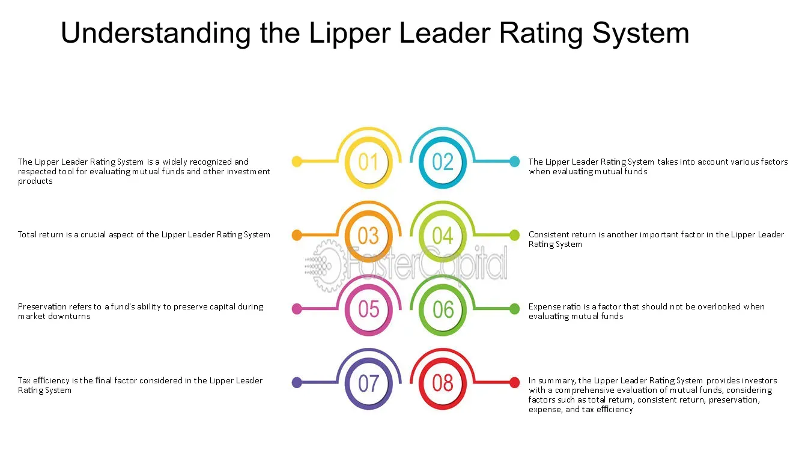

## Table of Contents

## What is a Lipper Leader?

A Lipper Leader is a rating system used to help investors understand how well a mutual fund or an exchange-traded fund (ETF) is doing compared to others. It looks at different parts of a fund's performance, like how much money it makes, how risky it is, and how much it costs to invest in it. This helps people see if a fund is good at making money without taking too many risks or costing too much.

The Lipper Leader system gives scores from 1 to 5, with 5 being the best. There are different categories they look at, like total return, consistent return, preservation, expense, and tax efficiency. For example, a fund with a high total return score means it has made more money than most other funds. This system makes it easier for investors to pick funds that match what they want, whether they care more about making money, keeping their money safe, or paying less in fees.

## Who created the Lipper Leader rating system?

The Lipper Leader rating system was created by Lipper, a company that is now part of Refinitiv. Lipper helps people who invest their money by giving them information and tools to make smart choices. They started the Lipper Leader system to make it easier for people to see how well mutual funds and ETFs are doing compared to others.

The system looks at different things like how much money a fund makes, how risky it is, and how much it costs to invest in it. This helps people pick funds that fit what they want. For example, if someone wants to make a lot of money and doesn't mind taking some risk, they might pick a fund with a high total return score. If someone wants to keep their money safe, they might look for a fund with a high preservation score.

## What are the different categories of Lipper Leader ratings?

The Lipper Leader system has five main categories that help people understand how good a mutual fund or ETF is. These categories are total return, consistent return, preservation, expense, and tax efficiency. Each category looks at a different part of the fund's performance. For example, total return shows how much money the fund has made over time, while consistent return looks at how steady those returns have been.

Preservation is about how well the fund keeps your money safe, which is important if you don't want to lose money. Expense looks at how much it costs to invest in the fund, including fees and other charges. A lower expense score means the fund costs less to own. Finally, tax efficiency tells you how much of the fund's earnings you get to keep after taxes. A high score in this category means the fund is good at reducing the taxes you have to pay.

Each category is scored from 1 to 5, with 5 being the best. This makes it easy for investors to see at a glance how a fund is doing in each area. By looking at these scores, people can pick funds that match what they want, whether it's making a lot of money, keeping their money safe, or paying less in fees and taxes.

## How are Lipper Leader ratings calculated?

Lipper Leader ratings are calculated by looking at how well a fund does compared to other funds in its group. They use numbers to see how the fund has done over the past three, five, and ten years. For total return, they check how much money the fund has made over these times. Consistent return looks at how steady those returns have been, making sure the fund doesn't go up and down too much. Preservation is about how safe the fund is, seeing if it loses less money than other funds when the market goes down.

For the expense category, Lipper Leader ratings look at how much it costs to own the fund, including any fees you have to pay. A lower score here means the fund is cheaper to own. Tax efficiency is about how much of the fund's earnings you get to keep after paying taxes. A high score means the fund is good at keeping your taxes low. Each category gets a score from 1 to 5, with 5 being the best. This helps people see at a glance how a fund is doing in each area and pick the one that fits what they want.

## What does a high Lipper Leader score indicate?

A high Lipper Leader score means that a mutual fund or ETF is doing well compared to other funds in its group. If a fund gets a high score in total return, it means it has made more money over time than most other funds. A high score in consistent return shows that the fund's earnings have been steady, not going up and down too much. This is good if you want your money to grow without big surprises.

If a fund has a high preservation score, it means it's good at keeping your money safe, which is important if you don't want to lose money. A high score in the expense category means the fund costs less to own, so you keep more of your money. And if a fund has a high tax efficiency score, it means you get to keep more of the fund's earnings after paying taxes. So, a high Lipper Leader score in any category shows that the fund is doing well in that area, helping you pick the right fund for what you want.

## How can investors use Lipper Leader ratings in their investment decisions?

Investors can use Lipper Leader ratings to help them pick the right mutual funds or ETFs for their money. By looking at the scores, investors can see how well a fund is doing in different areas like making money, keeping money safe, and how much it costs to own. For example, if someone wants to make a lot of money and is okay with some risk, they might look for a fund with a high total return score. If someone wants their money to grow without big ups and downs, they would pick a fund with a high consistent return score.

Lipper Leader ratings also help investors match their goals with the right funds. If keeping money safe is the most important thing, a fund with a high preservation score would be a good choice. For those who want to keep more of their earnings after taxes, a fund with a high tax efficiency score is what they should look for. And if someone wants to save on fees, a fund with a low expense score will help them keep more of their money. By using these ratings, investors can make smarter choices that fit what they want from their investments.

## Are Lipper Leader ratings applicable to all types of funds?

Lipper Leader ratings are mainly used for mutual funds and exchange-traded funds (ETFs). These ratings help people see how well a fund is doing compared to other funds in the same group. They look at things like how much money the fund makes, how steady those earnings are, how safe the fund is, how much it costs to own, and how much of the earnings you get to keep after taxes.

Not all types of funds get Lipper Leader ratings. For example, hedge funds or private equity funds usually don't get these ratings because they are different kinds of investments with different rules. But for mutual funds and ETFs, Lipper Leader ratings can be a helpful tool for people trying to pick the best fund for their money.

## How frequently are Lipper Leader ratings updated?

Lipper Leader ratings are updated every month. This means that every month, Lipper looks at how well each mutual fund and ETF has been doing and gives them new scores. This helps keep the ratings fresh and useful for people who want to know the latest about their investments.

Because the ratings are updated monthly, investors can see how funds are doing over time. If a fund's performance changes, the Lipper Leader scores will change too. This makes it easier for people to pick the best funds for their money based on the most recent information.

## What are the limitations of using Lipper Leader ratings?

Lipper Leader ratings are helpful, but they have some limits. They look at how a fund did in the past, but that doesn't always tell you how it will do in the future. Things like the economy or new rules can change how a fund does, and the ratings might not catch these changes right away. Also, the ratings compare funds to others in the same group, but that group might not be a perfect match for what you want. So, a fund might look good in its group but not be the best for you.

Another thing to think about is that Lipper Leader ratings focus on a few big things like how much money a fund makes, how steady those earnings are, how safe the fund is, how much it costs, and how much you keep after taxes. But there might be other things you care about that the ratings don't cover. For example, you might want to know about the fund manager's experience or the company's social responsibility. So, while Lipper Leader ratings are a good start, they shouldn't be the only thing you look at when picking a fund.

## How do Lipper Leader ratings compare to other fund rating systems?

Lipper Leader ratings are one way to see how well mutual funds and ETFs are doing. They look at things like how much money a fund makes, how steady those earnings are, how safe the fund is, how much it costs to own, and how much you keep after taxes. These ratings are updated every month, so they're pretty fresh. But they only cover mutual funds and ETFs, not other types of investments like hedge funds. Lipper Leader ratings are scored from 1 to 5, with 5 being the best. They're good for comparing funds to others in the same group, but they don't tell you everything about a fund.

Other rating systems, like Morningstar, also look at how funds perform but in different ways. Morningstar gives funds stars, from 1 to 5, based on how much money they make and how risky they are. They also look at things like the fund's past performance and how much it might cost you. Morningstar ratings are updated once a month too, but they cover more types of funds, including some that Lipper doesn't rate. Another system, like Zacks, focuses more on how well funds have done in the past and what they think will happen in the future. Each system has its own way of looking at funds, so it's good to look at more than one to get a full picture.

## Can Lipper Leader ratings predict future fund performance?

Lipper Leader ratings are based on how a fund did in the past, not on what will happen in the future. They look at things like how much money the fund made, how steady those earnings were, how safe the fund was, how much it cost to own, and how much you got to keep after taxes. But just because a fund did well before doesn't mean it will do well again. Things like changes in the economy or new rules can make a big difference in how a fund does, and the ratings might not catch these changes right away.

So, while Lipper Leader ratings can help you see how a fund has been doing, they can't tell you for sure what will happen next. It's a good idea to use these ratings along with other information when picking a fund. Looking at different rating systems and doing your own research can give you a better idea of what might happen with your investment.

## What advanced strategies can be employed using Lipper Leader ratings for portfolio management?

Lipper Leader ratings can be a helpful tool for managing a portfolio by giving you a quick way to compare how different mutual funds and ETFs are doing. You can use these ratings to pick funds that match your goals. For example, if you want to grow your money, you might choose funds with high total return scores. If you want to keep your money safe, you might look for funds with high preservation scores. By looking at the scores in different categories, you can build a mix of funds that balance making money, keeping money safe, and keeping costs low. This can help you make a portfolio that fits what you want.

Another way to use Lipper Leader ratings is to keep an eye on your portfolio and make changes when needed. Since the ratings are updated every month, you can check them regularly to see if your funds are still doing well. If a fund's scores start to go down, it might be a sign that you should think about switching to a different fund. Also, you can use the ratings to see how your funds are doing compared to others in the same group. This can help you decide if you should stick with what you have or try something new. By using Lipper Leader ratings smartly, you can keep your portfolio in good shape and make choices that help you reach your investment goals.

## What are Lipper Leader Financial Ratings and how can they be understood?

Lipper Leader ratings provide investors with an in-depth analysis of mutual funds through a set of well-defined metrics. These ratings are systematically designed to evaluate funds based on their consistent performance, capital preservation, tax efficiency, and expenses. Managed by Refinitiv, a financial data firm part-owned by Thomson Reuters, Lipper Leader ratings are widely regarded as essential benchmarks for financial professionals worldwide.

The ratings system grades mutual funds on a scale from 1 to 5, offering a straightforward approach for investors to compare and assess different funds. A fund that scores a 5 is perceived as the best within its category, indicating superior performance attributes when compared to its peers. This gradation simplifies the decision-making process for investors, particularly aiding them in distinguishing between top-performing funds and those that lag behind.

Key metrics considered in the Lipper Leader ratings include total return, consistency, and risk-adjusted returns. Total return measures the overall profitability of the fund, accounting for interest, dividends, and changes in market value. Consistency refers to the fund's ability to generate steady returns over time, minimizing volatility and adjusting to market fluctuations effectively.

Risk-adjusted returns are critical for understanding a fund's performance relative to its risk. The Sharpe Ratio is often utilized for this purpose, defined as:

$$
\text{Sharpe Ratio} = \frac{R_p - R_f}{\sigma_p}
$$

where $R_p$ is the expected return of the portfolio, $R_f$ is the risk-free rate, and $\sigma_p$ is the standard deviation of the portfolio’s excess return. This measure provides insights into how much excess return is received for the extra volatility endured by holding a riskier asset.

For long-term investors, Lipper Leader ratings serve as a guide in selecting mutual funds that align with their financial objectives and risk tolerance. By focusing on the methodologies and criteria outlined by these ratings, investors can make informed decisions that enhance the potential for achieving their financial goals. Whether an investor prioritizes consistent income, capital preservation, low expenses, or tax efficiency, Lipper Leader ratings offer a robust framework for evaluating all these aspects.

## References & Further Reading

[1]: ["Advances in Financial Machine Learning"](https://www.amazon.com/Advances-Financial-Machine-Learning-Marcos/dp/1119482089) by Marcos Lopez de Prado

[2]: ["Quantitative Trading: How to Build Your Own Algorithmic Trading Business"](https://www.amazon.com/Quantitative-Trading-Build-Algorithmic-Business/dp/1119800064) by Ernest P. Chan

[3]: ["Machine Learning for Algorithmic Trading"](https://github.com/stefan-jansen/machine-learning-for-trading) by Stefan Jansen

[4]: ["Evidence-Based Technical Analysis: Applying the Scientific Method and Statistical Inference to Trading Signals"](https://www.amazon.com/Evidence-Based-Technical-Analysis-Scientific-Statistical/dp/0470008741) by David Aronson

[5]: Bergstra, J., Bardenet, R., Bengio, Y., & Kégl, B. (2011). ["Algorithms for Hyper-Parameter Optimization."](https://dl.acm.org/doi/10.5555/2986459.2986743) Advances in Neural Information Processing Systems 24.