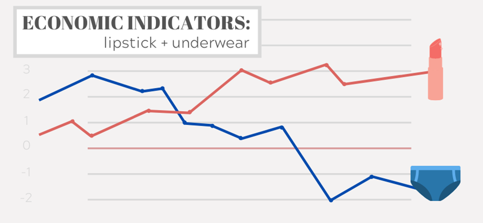

## Table of Contents

## What is the lipstick effect?

The lipstick effect is when people buy small luxury items, like lipstick, even when times are tough financially. It happens because people want to feel good about themselves, even if they can't afford bigger things. So, instead of buying expensive clothes or jewelry, they might choose to buy a new lipstick because it's cheaper but still makes them feel special.

This effect was first noticed during the Great Depression in the 1930s. Back then, lipstick sales went up even though many people were struggling to make ends meet. Researchers have seen this pattern during other economic downturns too, like the 2008 financial crisis. It shows that even in hard times, people still want to treat themselves to little things that boost their mood and confidence.

## How does the lipstick effect relate to economic indicators?

The lipstick effect is interesting because it can tell us something about how the economy is doing. When people start buying more small luxury items like lipstick, it might mean they are worried about money. They might not be able to buy big things like cars or houses, so they choose smaller, cheaper things that still make them feel good. This can be a sign that the economy might be getting worse because people are not spending as much on big purchases.

Economists look at the lipstick effect as one of many signs to understand the economy. If lipstick sales go up, it might mean people are cutting back on other spending. This can help economists predict if a recession is coming or if people are just being careful with their money. It's not the only thing they look at, but it's a helpful clue about what's going on with people's spending habits.

## Can you provide examples of the lipstick effect during past economic downturns?

During the Great Depression in the 1930s, people were struggling a lot with money. Jobs were hard to find, and many families could barely afford the basics. But even in those tough times, lipstick sales went up. Companies like Revlon saw their sales increase because people wanted to feel a bit better about themselves. They couldn't buy fancy clothes or jewelry, so they turned to cheaper luxuries like lipstick to lift their spirits.

Another time we saw the lipstick effect was during the 2008 financial crisis. The economy was in bad shape, and people were losing their jobs and homes. But again, sales of small luxury items like lipstick went up. A study by L'Oreal showed that their lipstick sales increased during this period. People were cutting back on big purchases, but they still wanted to treat themselves to something that made them feel good without spending too much money.

## What psychological factors contribute to the lipstick effect?

The lipstick effect happens because of how people feel when money is tight. When times are tough, people get worried about the future and might feel sad or down. Buying small luxury items like lipstick can make them feel a bit happier and more in control. It's a way to treat themselves and boost their mood without spending a lot of money. This small act of self-care can help them feel better about themselves and their situation.

Another reason is that people want to keep up their self-esteem, even when they can't afford bigger things. Lipstick and other small luxuries can make them feel pretty or handsome, which is important for their confidence. During hard times, these small purchases can be a way to maintain a sense of normalcy and personal identity. So, even if they can't buy new clothes or go out to fancy places, a new lipstick can still make them feel good about themselves.

## How do economists measure the lipstick effect?

Economists measure the lipstick effect by looking at sales data for small luxury items like lipstick during times when the economy is not doing well. They compare these sales numbers to other times to see if there's a big jump in sales when people are worried about money. For example, they might look at how much lipstick was sold during a recession and compare it to sales during better economic times. If they see that lipstick sales go up when the economy is down, it might mean people are turning to these small treats instead of bigger purchases.

To make sure they understand the lipstick effect correctly, economists also look at other economic indicators. They check things like unemployment rates, consumer spending on big items, and overall economic growth. By putting all this information together, they can see if the increase in lipstick sales really is a sign of economic worry or if other things might be causing it. This helps them get a fuller picture of what's going on with people's spending habits during tough times.

## What are the criticisms of the lipstick effect as an economic indicator?

Some people think the lipstick effect isn't a good way to tell if the economy is doing badly. One reason is that it's hard to know for sure if people are buying more lipstick because they're worried about money or if it's just because they like the new colors or brands that come out. There could be other reasons for the increase in sales that have nothing to do with the economy. So, relying only on lipstick sales might not give a clear picture of what's going on with people's money.

Another problem is that the lipstick effect might not happen the same way everywhere. In some countries, people might not buy more lipstick when times are tough. Instead, they might choose different small treats. Also, the lipstick effect might not work the same for everyone. Some people might not care about lipstick at all and choose other ways to feel better. So, it's tricky to use the lipstick effect to understand the economy because it can be different for different people and places.

## How does the lipstick effect vary across different demographics?

The lipstick effect can be different for different groups of people. For example, younger people might be more likely to buy things like lipstick because they want to feel good and fit in with their friends. They might not have a lot of money, so they choose small treats like makeup instead of bigger things. On the other hand, older people might not care as much about buying new lipstick. They might already have what they need and choose to save their money or spend it on other things that make them feel good, like a nice meal or a book.

Also, the lipstick effect can change depending on where people live and their culture. In some places, makeup might be a big deal, so people buy more of it when times are tough. But in other places, people might not care about makeup as much and choose different small treats. For example, in a country where tea is really important, people might buy more fancy tea during hard times instead of lipstick. So, the lipstick effect can look different for different groups of people because everyone has their own way of feeling better when money is tight.

## What are the implications of the lipstick effect for consumer behavior research?

The lipstick effect shows that even when money is tight, people still want to treat themselves to little things that make them feel good. This is important for people who study how people spend money because it helps them understand what people do when they are worried about their finances. Researchers can learn that even during tough times, people look for small ways to feel happy and in control. This can help them predict how people might act during economic downturns and plan better for the future.

Studying the lipstick effect also helps researchers see how different groups of people behave differently. For example, young people might buy more lipstick, while older people might choose other small treats. This tells researchers that people's age, where they live, and their culture can change how they react to economic problems. By understanding these differences, researchers can make better guesses about what people will do in the future and help businesses and governments plan better for economic changes.

## How has the lipstick effect been influenced by the rise of online shopping?

The rise of online shopping has changed the way the lipstick effect works. Now, people can buy small luxury items like lipstick from their homes without going to a store. This makes it easier for them to treat themselves even when they are worried about money. Online shopping also means more choices and sometimes cheaper prices, so people can find the perfect lipstick that makes them feel good without spending a lot.

Because of online shopping, the lipstick effect might be even stronger now. People can quickly see new products and deals online, which can make them more likely to buy something to feel better. But it also means that researchers need to look at online sales data to see if the lipstick effect is happening. This can be harder because online shopping data can be all over the place, but it's important to understand how people are spending their money in today's world.

## Can the lipstick effect be observed in other small luxury items besides cosmetics?

Yes, the lipstick effect can be seen in other small luxury items too, not just cosmetics. For example, during tough economic times, people might buy more fancy coffee or chocolate instead of big things like new furniture. These small treats can make them feel happy and special without costing too much money. People might choose a nice cup of coffee from a café or a special chocolate bar to lift their spirits when they can't afford bigger luxuries.

The same idea works for other small items like scented candles or small pieces of jewelry. When money is tight, people still want to treat themselves, so they might buy a candle that smells good or a pretty necklace. These things are not expensive, but they can make people feel better and more in control of their lives. So, the lipstick effect shows up in many different small luxury items, depending on what people like and what makes them feel good.

## How do global economic conditions affect the validity of the lipstick effect?

Global economic conditions can change how well the lipstick effect works as a sign of how people are feeling about money. When the whole world is going through a tough time, like during a global recession, people might be more worried about their money than usual. This can make them turn to small treats like lipstick even more. But it can also mean that they are so worried that they stop buying even these small luxuries, making the lipstick effect less clear.

Different countries can also have different ways of dealing with economic problems. In some places, people might still buy more lipstick when times are hard, but in others, they might choose different small treats like tea or snacks. This means that the lipstick effect might not be the same everywhere, and it can be hard to use it as a reliable sign of how the economy is doing around the world. So, while the lipstick effect can give us clues about how people are feeling, global economic conditions can make it tricky to use it as a sure way to understand the economy.

## What future research directions could enhance our understanding of the lipstick effect as an economic indicator?

To better understand the lipstick effect, researchers could look at more kinds of small luxury items, not just lipstick. They could study things like fancy coffee, chocolate, or small pieces of jewelry. By looking at a wider range of items, researchers can see if people are turning to different small treats when money is tight. This could help them get a fuller picture of how people behave during tough economic times and make the lipstick effect a more useful sign of how the economy is doing.

Another way to improve our understanding is by using better ways to collect and analyze data. With more people shopping online, researchers need to look at online sales data too. They could use new technology and methods to see how people are buying things on the internet. Also, researchers could do more studies in different countries and with different groups of people to see how the lipstick effect changes. This would help them see if the lipstick effect is a good sign of the economy everywhere or if it works differently in different places.

## References & Further Reading

[1]: Hill, S. E., Rodeheffer, C. D., Griskevicius, V., Durante, K. M., & White, A. E. (2012). ["Boosting Beauty in an Economic Decline: Mating, Spending, and the Lipstick Effect."](https://pubmed.ncbi.nlm.nih.gov/22642483/) Psychological Science, 23(1), 33-39.

[2]: Beracha, E., & Seiler, M. J. (2014). ["The Effect of the Economy on the Sale of Small Luxury Items."](https://link.springer.com/content/pdf/10.1007/s11146-013-9424-1.pdf) Journal of Real Estate Finance and Economics, 49(3), 339–354.

[3]: Rajagopal, P. (2020). ["The Lipstick Effect Revisited: Evaluating the Super Bowl Indicator of Recessionary Trends."](https://www.sciencedirect.com/science/article/pii/S0738081X21002443) SSRN Electronic Journal.

[4]: Lopez de Prado, M. (2018). ["Advances in Financial Machine Learning."](https://www.amazon.com/Advances-Financial-Machine-Learning-Marcos/dp/1119482089) Wiley.

[5]: Goodell, J. W., & Vähämaa, S. (2013). ["Does a Pro-Bowl Indicator Forecast Stock Market Returns?"](https://papers.ssrn.com/sol3/papers.cfm?abstract_id=2014823) The North American Journal of Economics and Finance, 26, 338-349.

[6]: Leonard Lauder's Theory on the Lipstick Index. ["Bloomberg Article Explaining the Lipstick Index"](https://www.bloomberg.com/opinion/articles/2024-08-09/is-beauty-thriving-don-t-count-on-lipstick-index-for-the-next-recession)

[7]: Taylor, C. R. (2015). ["Consumer Behavior and the Economy: Examining the Recessionary Impact on Small Luxuries."](https://www.sciencedirect.com/science/article/pii/S014829632300228X) Emerald Group Publishing Limited.

[8]: Chan, E. (2009). ["Quantitative Trading: How to Build Your Own Algorithmic Trading Business."](https://github.com/ftvision/quant_trading_echan_book) Wiley.