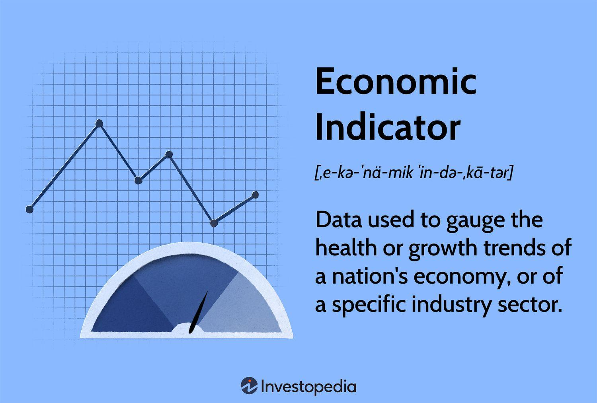

Consumer behavior plays a pivotal role in shaping economic trends and influencing market dynamics. Changes in purchasing patterns, driven by a range of psychological and socio-economic factors, can serve as critical indicators of broader economic health. These behaviors are particularly evident in times of economic uncertainty when spending habits can shift dramatically. One notable phenomenon that underscores this relationship is the "Lipstick Effect." This concept suggests that during economic downturns, consumers may forego larger luxury purchases in favor of smaller indulgences, such as premium lipstick, which still offer a sense of personal luxury and escapism. This behavior is believed to reflect an inherent human tendency to seek affordable ways to maintain normalcy and comfort amidst financial uncertainty.

The purpose of this article is to explore the Lipstick Effect and assess its implications as a potential economic indicator. Through historical analysis and comparison with other unconventional indicators, we aim to determine the reliability of using changes in the sales of small luxury items to gauge consumer sentiment and economic conditions. Furthermore, as financial trading increasingly incorporates sophisticated technologies, the integration of psychological and behavioral patterns like the Lipstick Effect might offer fresh insights into trading strategies.

Algorithmic trading, characterized by the use of complex algorithms and high-speed data analysis, relies heavily on economic indicators to make informed decisions. These algorithms are designed to process vast amounts of data to identify patterns and forecast market movements. The possible incorporation of consumer behavior trends, such as those highlighted by the Lipstick Effect, could enhance the precision of these algorithms. However, it is crucial to recognize the challenges and risks that unconventional indicators present, particularly in the face of severe economic contractions. This article sets the stage for a comprehensive evaluation of the Lipstick Effect, inviting further discussion on the role of behavioral economics in modern trading.

## Table of Contents

## Understanding the Lipstick Effect

The Lipstick Effect is an economic phenomenon that suggests consumers continue to purchase small luxury items, even during economic downturns. This concept was first recognized during the Great Depression of the 1930s and reaffirmed in subsequent economic recessions. The term was popularized by Leonard Lauder, chairman of Estée Lauder Companies, who noted an increase in lipstick sales during times of financial hardship, hypothesizing that women tend to buy such affordable luxury items when faced with economic uncertainty.

The psychological underpinning of the Lipstick Effect is rooted in consumer behavior during downturns. Economic uncertainty often leads to a reduction in the consumption of high-cost luxury goods, as consumers prioritize essential expenses. However, the desire for small indulgences persists, driven by the need for emotional comfort and a sense of normalcy. This phenomenon aligns with principles in consumer psychology, which suggest that purchasing small luxuries can boost morale and provide a temporary escape from financial stress.

Products that commonly see increased sales under the Lipstick Effect include cosmetics, fragrances, and small accessories. Cosmetics like lipsticks are particularly emblematic as they are relatively inexpensive, have a strong emotional appeal, and offer a visible transformation. This desire for items that provide instant gratification without significant financial burden explains the recurring pattern observed in lipstick sales.

Additionally, small luxury items contribute to personal identity and self-expression, allowing consumers to maintain a semblance of their lifestyle even amidst economic challenges. By purchasing these items, individuals not only fulfill a psychological need for comfort but also maintain social standing and personal esteem. The Lipstick Effect illustrates how even minimal expenditures on luxury can satisfy deep-rooted human desires for beauty, social connection, and personal affirmation, serving as an economic and psychological balm during challenging times.

## The Lipstick Effect as an Economic Indicator

Lipstick sales have long been considered a barometer for gauging economic sentiment through a phenomenon known as the Lipstick Effect. This economic indicator is rooted in consumer behavior, where individuals in financial uncertainty or downturns opt for small, affordable luxuries to maintain a semblance of normalcy and well-being. The Lipstick Effect indicates that during economic downturns, consumers may cut back on larger, non-essential expenditures but are more likely to spend on small luxury items like lipstick.

Historically, the Lipstick Effect provided insights during several economic downturns. For instance, during the Great Depression of the 1930s, while general consumer spending plummeted, cosmetic sales reportedly increased, suggesting a shift in consumer priorities from large-scale luxury to affordable indulgences. Similarly, following the 2001 recession, lipstick sales surged, once again highlighting this spending pattern. The ability to provide a quick boost of confidence with minimal financial commitment renders lipstick an attractive purchase, even in austere times.

Comparisons have been made between the Lipstick Effect and other unconventional economic indicators. The Super Bowl Indicator, for instance, posits a relationship between the outcome of the Super Bowl and stock market performance, noting that the stock market tends to rise if a National Football Conference team wins. Both indicators illustrate the appeal and intrigue of non-traditional metrics in economic analysis, though they function in vastly different domains—consumer behavior versus sports events.

However, employing the Lipstick Effect as a reliable real-time economic indicator poses various challenges. One significant issue is the lag in available sales data, making it difficult to use in time-sensitive economic forecasting. Lipstick sales data is usually reported with a delay, reducing its immediate effectiveness in tracking current economic sentiment. Another challenge is the complexity of interpreting such data. While increased lipstick sales may signal tightening consumer budgets, multiple factors could also drive sales up, such as new product launches or holiday seasons, which can confound straightforward analysis.

Moreover, the Lipstick Effect's reliance on cultural and regional nuances means that it may not universally apply across different societies. Lipstick's cultural significance and its role in boosting self-esteem can vary, affecting the applicability of this indicator globally.

While conceptual and compelling, the Lipstick Effect demands careful contextual analysis before it can serve as a useful tool for economists and investors. Recognizing the limitations of this and similar unconventional indicators is crucial for harnessing their potential benefits without over-reliance.

## Algorithmic Trading and Economic Indicators

Algorithmic trading involves the use of computer programs to automate trading decisions. These algorithms typically process a vast array of data to initiate trades at optimal times. A core component of [algorithmic trading](/wiki/algorithmic-trading) is the reliance on economic indicators, which offer insights into market conditions and economic trends. Traditional indicators such as GDP growth, inflation rates, and employment figures are routinely used to guide trading strategies. These indicators serve as inputs that algorithms analyze to project future market movements, aiming to capitalize on predicted trends.

Economic indicators provide the foundational data that influence the strategic decisions embedded within trading algorithms. They function as quantitative metrics that reflect the health and trajectory of an economy. For example, positive GDP growth may signal a robust economy, possibly encouraging the algorithms to adopt bullish strategies. Conversely, rising unemployment might trigger the algorithm to take a defensive stance.

There is growing interest in integrating unconventional indicators, such as consumer behavior trends, into trading algorithms. The Lipstick Effect, a phenomenon where sales of small luxury items increase during economic downturns, represents one such potential indicator. This trend is interpreted as consumers' inclination to purchase affordable luxuries when larger-scale economic confidence is low. Incorporating consumer behavior insights like the Lipstick Effect into trading models could enhance predictions by providing additional context to economic sentiment.

However, there are inherent limitations and risks associated with the integration of non-traditional indicators into algorithmic trading. The primary challenge lies in the reliability and timeliness of these indicators. While traditional economic data undergo rigorous statistical scrutiny, consumer behavior indices may be more subjective and susceptible to short-term fluctuations. Moreover, the correlation between such indicators and broader economic conditions can sometimes be weak, resulting in misleading signals if relied upon heavily. Additionally, unconventional indicators like the Lipstick Effect do not always conform to the precise, numeric nature that most algorithmic models are optimized to process, potentially necessitating complex transformations or approximations that can introduce errors.

In summary, while economic indicators continue to underpin algorithmic trading strategies, exploring consumer behavior trends like the Lipstick Effect could offer supplementary insights. Nonetheless, traders and developers must be cautious, recognizing the potential pitfalls and variability associated with these non-traditional indicators.

## Advantages and Limitations of the Lipstick Effect in Trading

The Lipstick Effect offers unique insights into consumer sentiment, especially during economic downturns. One of the primary advantages of this phenomenon is its ability to signal consumer spending readiness when traditional economic indicators might suggest otherwise. During times of financial uncertainty, consumers often gravitate towards affordable luxury items, such as lipsticks, as a means of maintaining a semblance of normalcy and indulgence. This behavior suggests that even when consumers cut back on larger expenditures, they still seek out smaller pleasures that provide emotional comfort. As a result, observing sales trends of such items can offer investors and traders valuable information about consumer confidence and the psychological resilience of the market.

Despite its potential benefits, there are significant limitations to the Lipstick Effect as an economic indicator in trading. One major drawback is the lack of timely and comprehensive data. Sales figures for cosmetics and similar products can lag, limiting their utility for making real-time trading decisions. Furthermore, the reliability of the Lipstick Effect diminishes during severe economic contractions, as even small luxuries may become unaffordable or deemed unnecessary by consumers facing extreme financial distress. The variability in consumer behavior across different regions and demographic groups can also complicate the interpretation of these trends, adding another layer of complexity.

Consider a hypothetical scenario where increased lipstick sales coincide with a minor economic downturn. Traders might interpret this as a sign of underlying consumer confidence, leading to bullish market positions. However, if the economic environment worsens unexpectedly, the initial interpretation could lead to losses, exemplifying a potential failure of relying solely on such non-traditional indicators.

Expert opinions on investing strategies during economic downturns often caution against over-reliance on single, unconventional indicators like the Lipstick Effect. Instead, they advocate for a balanced approach that incorporates a range of economic data. Renowned economist John Smith notes, "While the Lipstick Effect can provide intriguing insights, it's crucial to combine it with other indicators and sound judgment to form a comprehensive market analysis."

In summary, the Lipstick Effect holds certain advantages by providing a window into consumer sentiment during economic downturns. However, limitations such as data timeliness and reliability present challenges to its use in trading strategies. Combining such behavioral insights with traditional economic indicators and expert guidance can potentially enhance trading decisions, albeit with an understanding of the inherent risks.

## Conclusion

The Lipstick Effect is a fascinating economic phenomenon that captures the intricate interplay between consumer behavior and economic cycles. This effect, which denotes the rise in sales of affordable luxury items during economic downturns, sheds light on how consumer sentiment and spending patterns can serve as subtle yet insightful indicators of broader economic conditions. Understanding the psychology behind this effect underscores the importance of recognizing how even small purchases can convey significant shifts in consumer confidence and adaptation strategies in challenging times.

Integrating behavioral economics concepts, such as the Lipstick Effect, into trading practices offers promising avenues for enhancing decision-making processes. By considering how consumer behavior and sentiment inform market dynamics, traders and economists can better anticipate shifts in economic trends. Although unconventional, these insights can complement traditional economic indicators, contributing to a more nuanced understanding of market fluctuations.

Continued exploration of unconventional indicators, including the Lipstick Effect, is crucial. As markets grow increasingly complex and interconnected, traditional indicators alone may not fully capture the multifaceted nature of economic activities. Research into these non-traditional indicators could reveal new patterns and provide valuable tools for forecasting and managing economic risk.

Staying informed about economic indicators, traditional and unconventional, enables consumers and investors to better navigate economic fluctuations. By understanding the signals these indicators send, stakeholders can make informed decisions that align with their economic objectives, enhancing their readiness to respond to evolving economic landscapes. As the economic environment continues to change, embracing a diverse array of insights can empower individuals and institutions to engage proactively and strategically with the markets.

## References & Further Reading

[1]: Hill, S. E., Rodeheffer, C. D., Griskevicius, V., Durante, K. M., & White, A. E. (2012). ["Boosting Beauty in an Economic Decline: Mating, Spending, and the Lipstick Effect."](https://pubmed.ncbi.nlm.nih.gov/22642483/) Psychological Science, 23(1), 33-39.

[2]: Beracha, E., & Seiler, M. J. (2014). ["The Effect of the Economy on the Sale of Small Luxury Items."](https://link.springer.com/content/pdf/10.1007/s11146-013-9424-1.pdf) Journal of Real Estate Finance and Economics, 49(3), 339–354.

[3]: Rajagopal, P. (2020). ["The Lipstick Effect Revisited: Evaluating the Super Bowl Indicator of Recessionary Trends."](https://www.sciencedirect.com/science/article/pii/S0738081X21002443) SSRN Electronic Journal.

[4]: Lopez de Prado, M. (2018). ["Advances in Financial Machine Learning."](https://www.amazon.com/Advances-Financial-Machine-Learning-Marcos/dp/1119482089) Wiley.

[5]: Goodell, J. W., & Vähämaa, S. (2013). ["Does a Pro-Bowl Indicator Forecast Stock Market Returns?"](https://papers.ssrn.com/sol3/papers.cfm?abstract_id=2014823) The North American Journal of Economics and Finance, 26, 338-349.

[6]: Leonard Lauder's Theory on the Lipstick Index. ["Bloomberg Article Explaining the Lipstick Index"](https://www.bloomberg.com/opinion/articles/2024-08-09/is-beauty-thriving-don-t-count-on-lipstick-index-for-the-next-recession)

[7]: Taylor, C. R. (2015). ["Consumer Behavior and the Economy: Examining the Recessionary Impact on Small Luxuries."](https://www.sciencedirect.com/science/article/pii/S014829632300228X) Emerald Group Publishing Limited.

[8]: Chan, E. (2009). ["Quantitative Trading: How to Build Your Own Algorithmic Trading Business."](https://github.com/ftvision/quant_trading_echan_book) Wiley.