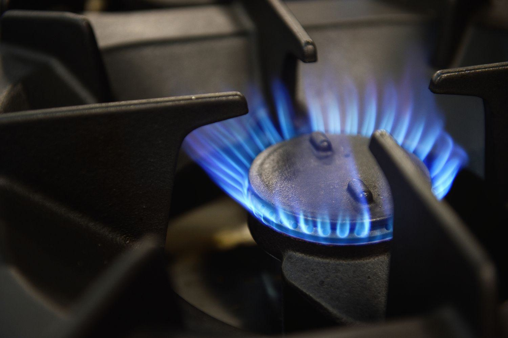

Liquefied Natural Gas (LNG) has become a significant element in the worldwide energy sector, playing a key role in the shift towards cleaner and more efficient energy sources. LNG is essentially natural gas that has been cooled down to a liquid state, which reduces its volume by about 600 times, facilitating its storage and transport across long distances. This characteristic makes LNG a vital link between regions abundant in natural gas and those with high energy demand, bridging geographical gaps and ensuring a stable energy supply.

In this article, we aim to provide a comprehensive understanding of LNG, beginning with its definition and the intricate process of liquefaction that enables natural gas to be transformed into this liquid state. Furthermore, we examine the global supply and demand dynamics that are influenced by top LNG-exporting countries like Australia, Qatar, and the United States, as well as major importing countries such as China, Japan, and South Korea. These dynamics are shaped by both economic considerations and geopolitical strategies, influencing how LNG is positioned within the broader energy market.

A modern development within this sphere is the rise of algorithmic trading. This method employs sophisticated algorithms to automatically execute trading transactions, enhancing both efficiency and profitability. In the context of LNG, where market volatility and complex logistics present unique challenges, algorithmic trading is becoming increasingly instrumental. It allows for precise price forecasts and the identification of arbitrage opportunities, ensuring that LNG remains a competitive and viable energy source in the fast-evolving market landscape.

Ultimately, as the global demand for LNG continues to grow, its role as a clean fossil fuel alternative is cemented. The future of LNG not only depends on technological advancements in production and trading but also on the strategic implementation of policies supporting a sustainable energy transition. Understanding the multifaceted aspects of LNG is essential for stakeholders across the energy sector as they navigate this pivotal period in the global energy market.

## Table of Contents

## What is Liquefied Natural Gas (LNG)?

Liquefied Natural Gas (LNG) is a form of natural gas that has been cooled to a liquid state at a temperature of approximately -260°F (-162°C). This cooling process reduces the volume of the gas by a factor of about 600, making it significantly more efficient to store and transport over long distances where pipelines are not feasible or economical. The liquefaction of natural gas results in a colorless, non-toxic, and non-corrosive liquid that is primarily composed of methane (CH₄), along with small amounts of other hydrocarbons such as ethane, propane, and butane. 

As the cleanest fossil fuel option available, LNG is increasingly favored over more polluting energy sources like coal and oil. This preference is driven by the substantially lower emissions of sulfur oxides (SOx), nitrogen oxides (NOx), and particulate matter when combusted. LNG also has a pivotal role in reducing greenhouse gas emissions, aiding global efforts to transition towards a more sustainable energy model. Its versatility makes it suitable for various applications, including electricity generation, heating, and as a transportation fuel, particularly in marine and heavy-duty vehicles.

The transition from gaseous to liquid form occurs through a complex series of cooling processes. The reduced [volume](/wiki/volume-trading-strategy) and safe characteristics of LNG allow it to be transported worldwide in specially designed cryogenic sea vessels, otherwise known as LNG carriers, and stored in highly insulated tanks to prevent evaporation.

Overall, the properties of LNG make it a crucial component in the global energy supply chain, particularly as nations seek to reduce their carbon footprints and shift towards greener energy solutions.

## How LNG Works: The Liquefaction Process

The liquefaction process of natural gas is a technological procedure that converts natural gas into a liquid state, primarily to make storage and transportation more efficient. This transformation is achieved by significantly lowering the temperature of the gas, thereby reducing its volume. Two notable processes employed in the liquefaction of natural gas are the cascade process and the Linde Method.

The cascade process is a sequential procedure where one cryogenic fluid is used to cool another in stages. Natural gas, initially at ambient temperature, is passed through a series of heat exchangers. Each stage uses a different refrigerant, each with progressively lower boiling points, to sequentially lower the temperature of the natural gas. As the natural gas transfers heat to each refrigerant, it undergoes phase changes from gas to liquid. This step-by-step cooling results in a cascading effect, effectively transforming the natural gas into a liquid state. The efficiency of the cascade process is due to its use of multiple refrigerants, each optimized for a specific range of temperatures, thus minimizing energy consumption.

The Linde Method, on the other hand, is a process that involves the repeated compression, cooling, and expansion of the gas until it reaches a liquid state. In this method, natural gas is first compressed, increasing its pressure and temperature. The hot, compressed gas then passes through a heat exchanger where it is cooled by a counter-current stream of already cooled gas. Upon cooling, the gas undergoes expansion through a Joule-Thomson valve, which reduces its temperature further as it performs work on its surroundings. This sequence of compression, cooling, and expansion is repeated until the natural gas reaches a sufficiently low temperature to become liquefied. The Linde Method is renowned for its simplicity and effectiveness in achieving the desired cryogenic temperatures necessary for liquefying natural gas.

Once liquefied, natural gas is stored in specialized cryogenic containers designed to maintain low temperatures and prevent vaporization. These containers ensure that LNG remains in its liquid state during storage and transportation. The reduced volume, approximately 1/600th of its gaseous state, and the non-pressurized nature of LNG make it economically viable to transport over long distances. Cryogenic shipping vessels and tanker trucks equipped with appropriate insulation are commonly used to transport LNG to global markets.

## Global LNG Market Dynamics

The global Liquefied Natural Gas (LNG) market is characterized by a complex interplay of supply, demand, and geopolitical factors. Key exporters of LNG include Australia, Qatar, and the United States. These countries leverage their substantial natural gas resources to dominate the international market. According to the International Gas Union's 2021 World LNG Report, Australia led global exports in 2020, closely followed by Qatar, with the United States rising as a formidable player due to its shale gas revolution.

The primary demand for LNG is concentrated in Asian countries such as China, Japan, and South Korea. These nations are significant consumers due to their extensive industrial bases, high-population densities, and limited domestic energy resources. In particular, Japan and South Korea are among the top LNG importers, driven by energy security concerns and a commitment to reducing dependence on nuclear energy post the Fukushima disaster. China's demand has surged as it shifts towards cleaner energy sources to combat severe air pollution and meet carbon reduction targets.

Globally, there is a noticeable strategic shift towards LNG as an alternative to coal. LNG offers a cleaner, more sustainable energy option, with lower carbon emissions in electricity generation. Moreover, LNG provides a reliable back-up for fluctuating renewable sources like wind and solar power. As countries aim to diversify their energy mix and enhance grid stability, LNG plays a crucial role in balancing intermittent renewable energy supply.

Geopolitical factors significantly influence LNG market dynamics. For instance, the Middle East's political climate, including Qatar's diplomatic relations, impacts global LNG pricing and supply stability. Meanwhile, economic policies, such as tariffs and trade agreements, also play a catalytic role. The U.S.-China trade tensions had notable consequences for LNG exports, as tariffs on U.S. LNG cargoes affected trade flows. Similarly, the European Union's energy policies, aimed at reducing reliance on Russian gas, have led to increased LNG imports, further reshaping global trade patterns.

In summary, the global LNG market is shaped by a combination of leading exporters, rising demand in Asia, strategic shifts towards cleaner energy, and the intricate web of geopolitical and economic policies. These dynamics continue to evolve, influencing both global energy security and environmental sustainability.

## Environmental Impact and Sustainability of LNG

Liquefied Natural Gas (LNG) is recognized for its lower emissions profile compared to traditional fossil fuels like coal and oil. The combustion of LNG emits significantly fewer greenhouse gases such as carbon dioxide (CO₂), and its cleaner-burning properties lead to reductions in sulfur oxides (SOx) and particulates. This makes LNG an attractive option for urban and industrial settings where air quality is a concern.

In power generation, the efficiency of natural gas-fired power plants, particularly those utilizing combined cycle technology, allows for a substantial decrease in CO₂ emissions per megawatt-hour of electricity produced. This efficiency, paired with the cleaner composition of natural gas, positions LNG as an effective bridge fuel in the transition towards a more sustainable energy future. The formula for determining carbon emissions from fuel combustion is as follows:

$$
\text{CO}_2 \text{ Emissions} = \text{Fuel Consumption} \times \text{Carbon Content} \times \left( \frac{44}{12} \right)
$$

where 44/12 is the molecular weight ratio of CO₂ to carbon.

LNG also aids in reducing pollutants that contribute to smog and acid rain. The near elimination of sulfur compounds in natural gas results in negligible sulfur dioxide (SO₂) emissions upon combustion, a stark contrast to the much higher levels produced by coal and oil. Thus, LNG serves as a practical solution for meeting stringent environmental regulations aimed at mitigating acidification.

Moreover, the infrastructure for LNG can be adapted over time to accommodate bio-LNG, or biomethane, thus enhancing its sustainability aspect. As biogas is upgraded into biomethane and cooled into a liquefied form, it can be integrated into existing LNG supply chains, further reducing the carbon footprint of end users.

Despite being a fossil fuel, LNG's role in the energy transition is underscored by its potential for decarbonization and flexibility. As energy markets evolve, LNG provides a reliable solution to balancing intermittent renewable sources, thereby ensuring a stable and cleaner energy supply in the pursuit of global sustainability goals.

## Algorithmic Trading in the LNG Market

Algorithmic trading in the LNG market represents a significant advancement in how liquefied natural gas is traded globally. By leveraging complex mathematical models, traders are able to automate the buying and selling processes, thus enhancing both the efficiency and profitability of LNG transactions. This automation is crucial in managing the inherent [volatility](/wiki/volatility-trading-strategies) and intricate logistics that characterize LNG trading.

One of the key advantages of [algorithmic trading](/wiki/algorithmic-trading) is its ability to process and analyze extensive datasets at high speed. This capability allows algorithms to detect patterns and trends that might be invisible to human traders. For example, through statistical models and [machine learning](/wiki/machine-learning), algorithms can forecast price movements and volatility in the LNG market, providing traders with a competitive edge. The predictive prowess of these models can be represented through various mathematical algorithms, such as:

$$
P_t = \mu + \beta_1X_1 + \beta_2X_2 + \ldots + \beta_nX_n + \epsilon
$$

Where $P_t$ is the predicted price at time $t$, $\mu$ is a constant, $\beta_n$ are the coefficients representing the impact of each [factor](/wiki/factor-investing) $X_n$ on the price, and $\epsilon$ is the error term. By consistently recalibrating these parameters in real-time, algorithms enhance prediction accuracy under different market conditions.

Furthermore, algorithmic trading enables the identification of [arbitrage](/wiki/arbitrage) opportunities within the LNG market. Given the global disparities in LNG pricing due to varying supply and demand conditions, algorithms can execute trades that exploit these differences faster and more efficiently than manual methods. The execution of arbitrage can be simplified through optimizing constraints in a linear programming model, ensuring maximization of profit while minimizing risk.

Another promising aspect of algorithmic trading in the LNG sector is the digitization and integration of data-driven technologies. This future of trading will likely be dominated by blockchain for secure transactions and [artificial intelligence](/wiki/ai-artificial-intelligence) (AI) for improved decision-making processes. By integrating AI, the trading algorithms can continually learn from market data and refine their strategies over time, ensuring agility in a dynamic market environment.

As LNG trading becomes more integrated with digital platforms, stakeholders will need to adapt to these technologies to remain competitive. The increased reliance on data analytics and algorithmic solutions will not only revolutionize LNG trading but also set the benchmark for other sectors in the energy markets.

## Conclusion

Liquefied Natural Gas (LNG) is pivotal in advancing the global transition towards a cleaner energy regime. As a less carbon-intensive fossil fuel, LNG helps to reduce emissions and serves as a practical substitute for coal and oil in various applications, thereby supporting global efforts to mitigate climate change. The strategic role of LNG is further accentuated by its ability to complement renewable energy sources, ensuring energy stability and meeting demand fluctuations.

As the demand for LNG continues to rise, driven by economic growth and energy needs in regions like Asia, the importance of algorithmic trading in the LNG market becomes increasingly significant. Algorithmic trading, with its capacity to process and analyze large volumes of data, is crucial for optimizing the efficiency and profitability of LNG transactions. By forecasting prices and identifying arbitrage opportunities, algorithmic trading can address the volatility and logistical complexities inherent in LNG markets.

For stakeholders in the energy sector, a thorough understanding of both the technological intricacies involved in LNG production and the advanced trading mechanisms like algorithmic trading is essential. Such knowledge equips them to navigate the evolving landscape of energy trading and capitalize on opportunities presented by market dynamics.

The future of LNG is poised to be shaped by ongoing innovations and supportive policies. Technological advancements will likely enhance the efficiency of LNG production and transportation, while regulatory frameworks will play a vital role in fostering an environment conducive to sustainable growth. These developments will be instrumental in ensuring that LNG remains a key component of the global energy mix, aiding the transition towards more sustainable energy systems.

## References & Further Reading

[1]: GIIGNL. (2021). ["The LNG Industry Annual Report."](https://giignl.org/document/giignl-2021-annual-report/) International Group of Liquefied Natural Gas Importers.

[2]: International Gas Union. (2021). ["World LNG Report 2021."](https://www.igu.org/resources/world-lng-report-2021/) International Gas Union.

[3]: Yergin, D. (2020). ["The New Map: Energy, Climate, and the Clash of Nations."](https://www.amazon.com/New-Map-Energy-Climate-Nations/dp/1594206430) Penguin Press.

[4]: EIA. (2021). ["Liquefied Natural Gas (LNG)."](https://www.eia.gov/todayinenergy/detail.php?id=52979) U.S. Energy Information Administration.

[5]: Lopez de Prado, M. (2018). ["Advances in Financial Machine Learning."](https://www.amazon.com/Advances-Financial-Machine-Learning-Marcos/dp/1119482089) Wiley.