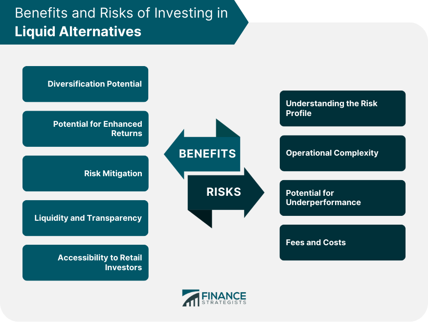

## Table of Contents

## What are liquid alternatives?

Liquid alternatives are investment options that are less risky than stocks but can give you more potential for growth than regular savings accounts. They are called "liquid" because you can easily turn them into cash whenever you need to. These investments often mix different types of assets, like stocks, bonds, and commodities, to help spread out the risk.

These types of investments are popular with people who want to protect their money from big losses but still want a chance to make more money. Examples of liquid alternatives include hedge funds, real estate investment trusts (REITs), and certain types of mutual funds. They can be a good choice if you want to balance safety and growth in your investment portfolio.

## What is the purpose of investing in liquid alternatives?

The main reason people invest in liquid alternatives is to find a middle ground between safety and growth. These investments are less risky than putting all your money in stocks, which can go up and down a lot. At the same time, they can offer better returns than keeping your money in a regular savings account. This makes liquid alternatives a good choice for people who want to protect their money but also want it to grow.

Liquid alternatives also help spread out risk. By mixing different types of assets like stocks, bonds, and commodities, these investments can cushion your portfolio against big losses. If one type of asset does poorly, the others might do well and balance things out. This diversification can give investors peace of mind, knowing their money is safer and still has the chance to grow.

## How do liquid alternatives differ from traditional investments?

Liquid alternatives are different from traditional investments because they mix different types of assets together. Traditional investments like stocks and bonds focus on one type of asset. For example, when you buy a stock, you're investing in one company. But liquid alternatives might include stocks, bonds, and commodities all in one investment. This mix helps spread out the risk so if one type of asset goes down, the others might help balance it out.

Another big difference is how easy it is to turn liquid alternatives into cash. Traditional investments like real estate can be hard to sell quickly. But with liquid alternatives, you can usually get your money out faster. This makes them good for people who might need their money sooner but still want to invest. Also, liquid alternatives often aim to protect your money more than traditional investments, which can be riskier but might offer bigger rewards.

## What are the main types of liquid alternative investments?

Liquid alternative investments include hedge funds, which are pools of money managed by professionals who use different strategies to try to make money. These strategies can include betting on stocks going up or down, using borrowed money to increase potential returns, and investing in things like currencies or commodities. Hedge funds are popular with people who want to make money even when the stock market is not doing well.

Another type of liquid alternative is real estate investment trusts (REITs). These are companies that own or finance income-generating real estate. When you invest in a REIT, you're buying a piece of a big real estate portfolio. This can give you regular income from rent and property sales without having to buy and manage properties yourself.

There are also mutual funds and exchange-traded funds (ETFs) that focus on alternative strategies. These funds might invest in a mix of stocks, bonds, and other assets, using strategies like short selling or using derivatives to try to make money. These funds are easier for regular people to buy into than hedge funds, which often need a lot of money to start investing.

## Can you provide examples of liquid alternative investments?

One example of a liquid alternative investment is a [hedge fund](/wiki/hedge-fund-trading-strategies). Hedge funds are managed by professionals who use different strategies to try to make money. They might bet on stocks going up or down, use borrowed money to increase potential returns, or invest in things like currencies or commodities. Hedge funds are popular because they can make money even when the stock market is not doing well. They are a bit more complicated and usually need a lot of money to start investing, but they can be a good choice for people who want to protect their money and still have a chance to grow it.

Another example is real estate investment trusts, or REITs. REITs are companies that own or finance income-generating real estate. When you invest in a REIT, you're buying a piece of a big real estate portfolio. This can give you regular income from rent and property sales without having to buy and manage properties yourself. REITs are easier to buy and sell than actual real estate, making them a liquid alternative.

Lastly, there are mutual funds and exchange-traded funds (ETFs) that focus on alternative strategies. These funds might invest in a mix of stocks, bonds, and other assets, using strategies like short selling or using derivatives to try to make money. These funds are easier for regular people to buy into than hedge funds. They offer a way to spread out risk and still have a chance to grow your money, making them another good example of liquid alternative investments.

## What are the potential benefits of liquid alternatives?

One big benefit of liquid alternatives is that they can help protect your money while still giving you a chance to make more money. These investments mix different types of assets like stocks, bonds, and commodities. If one type of asset goes down, the others might go up and balance things out. This can help keep your money safer than if you put it all in one risky investment like stocks. Liquid alternatives can be a good choice if you want to grow your money without taking too much risk.

Another benefit is that liquid alternatives are easy to turn into cash. If you need your money quickly, you can usually get it out faster than with other investments like real estate. This makes liquid alternatives a good choice for people who might need their money soon but still want to invest it. Plus, liquid alternatives can give you regular income, like from REITs that pay out rent money. This can be helpful if you're looking for a steady flow of money from your investments.

## What are the risks associated with liquid alternatives?

Liquid alternatives can be riskier than traditional savings accounts because they often use complex strategies to try to make money. These strategies might include betting on stocks going down, using borrowed money to increase potential returns, or investing in things like currencies or commodities. If these strategies don't work out, you could lose money. Also, some liquid alternatives, like hedge funds, might need a lot of money to start investing, which can be a risk if you don't have that much to invest.

Another risk is that liquid alternatives can be hard to understand. They mix different types of assets and use strategies that can be complicated. If you don't fully understand what you're investing in, you might make choices that aren't right for you. Plus, even though they are called "liquid," it might still take some time to get your money out, especially if a lot of people want their money back at the same time. This can be a problem if you need your money quickly.

## How can liquid alternatives be used to diversify an investment portfolio?

Liquid alternatives can help diversify an investment portfolio by mixing different types of assets together. Instead of putting all your money in one type of investment like stocks, you can spread it out across stocks, bonds, and commodities. This mix can help protect your money because if one type of asset goes down, the others might go up and balance things out. For example, if the stock market is doing badly, the bonds or commodities in your liquid alternatives might still do well, keeping your overall investment safer.

Using liquid alternatives can also help you find a middle ground between safety and growth. Traditional investments like stocks can be risky but offer big rewards, while savings accounts are safe but don't grow much. Liquid alternatives aim to give you a bit of both. They are less risky than stocks but can offer better returns than a savings account. By adding liquid alternatives to your portfolio, you can protect your money while still having a chance to make more money.

## What should investors consider before investing in liquid alternatives?

Before investing in liquid alternatives, investors should think about how much risk they are willing to take. Liquid alternatives can be riskier than savings accounts because they often use complicated strategies to try to make money. These strategies might not always work out, and you could lose money. It's important to understand how much risk you can handle and whether you have enough money to start investing in some liquid alternatives, like hedge funds, which might need a lot of money upfront.

Investors should also think about how easy it is to get their money back. Even though liquid alternatives are called "liquid," it might still take some time to turn them into cash, especially if a lot of people want their money back at the same time. This can be a problem if you need your money quickly. It's also important to really understand what you're investing in. Liquid alternatives can be hard to understand because they mix different types of assets and use strategies that can be complicated. If you don't fully understand what you're investing in, you might make choices that aren't right for you.

## How do the fees and costs of liquid alternatives compare to traditional investments?

Liquid alternatives often have higher fees and costs than traditional investments like stocks or bonds. For example, hedge funds, which are a type of liquid alternative, usually charge a management fee and a performance fee. The management fee is a percentage of the money you invest, and the performance fee is a percentage of any profits the fund makes. These fees can add up quickly, making liquid alternatives more expensive to invest in than traditional investments.

On the other hand, some liquid alternatives like certain mutual funds or ETFs might have lower fees than hedge funds but still cost more than traditional investments. These funds mix different types of assets and use strategies to try to make money, which can lead to higher costs for things like trading and managing the fund. When thinking about investing in liquid alternatives, it's important to look at all the fees and costs to see if the potential rewards are worth it compared to traditional investments.

## What role do liquid alternatives play in institutional investment strategies?

Liquid alternatives are important for big investors like banks and pension funds because they help spread out risk. These big investors, called institutions, have a lot of money to manage. They use liquid alternatives to mix different types of assets like stocks, bonds, and commodities. This mix helps protect their money because if one type of asset goes down, the others might go up and balance things out. Institutions like this because it helps them keep their money safer while still having a chance to make more money.

Institutions also like liquid alternatives because they can be turned into cash more easily than some other investments. This is helpful for big investors who might need to move their money around quickly. Liquid alternatives can also give institutions a way to make money even when the stock market is not doing well. By using these investments, institutions can find a middle ground between safety and growth, which is important for managing large amounts of money over a long time.

## How can performance of liquid alternatives be evaluated and measured?

To evaluate and measure the performance of liquid alternatives, investors often look at how much money they make or lose over time. They might compare this to how well other investments like stocks or bonds are doing. A common way to do this is by looking at the return on investment (ROI), which shows how much money you've made compared to what you started with. Another important thing to check is the risk-adjusted return, which looks at how much money you made compared to the risk you took. This helps see if the extra risk of liquid alternatives was worth it.

Another way to measure performance is by looking at the Sharpe ratio, which tells you how much extra return you get for each unit of risk you take. A higher Sharpe ratio means the investment did a good job of balancing risk and reward. Investors also look at how well the liquid alternative keeps up with or beats a benchmark, like a stock market index. This helps them see if the liquid alternative is doing better than just investing in the market. By using these measures, investors can get a clear picture of how well their liquid alternatives are doing.

## Question: Are you considering evaluating liquid alternatives for your portfolio?

When evaluating liquid alternatives for inclusion in an investment portfolio, it is crucial for investors to comprehensively assess several key dimensions. One of the primary considerations is the alignment of the investment objectives of the liquid alternative fund with the investor's own financial goals. This requires an understanding of the diversification benefits and potential risk-adjusted returns that such funds can offer.

**Risk Tolerance:** An investor’s risk tolerance is central to selecting the appropriate liquid alternative. These funds often employ sophisticated strategies that can lead to varying levels of risk exposure. Therefore, understanding the types of risks—such as market risk, credit risk, and liquidity risk—associated with different strategies (like long/short equity or managed futures) is critical. Investors should weigh these risks against their financial situation and appetite for volatility.

**Fund Management Performance:** The performance history of a fund’s management team offers valuable insights into their ability to navigate complex market environments and achieve consistent returns. Historical performance metrics like the Sharpe ratio, which measures risk-adjusted returns, can provide a quantifiable gauge of past performance. The formula for the Sharpe ratio is:

$$
\text{Sharpe Ratio} = \frac{E[R] - R_f}{\sigma}
$$

where $E[R]$ is the expected portfolio return, $R_f$ is the risk-free rate, and $\sigma$ is the portfolio standard deviation. A higher Sharpe ratio indicates better risk-adjusted performance.

**Fee Structures:** Evaluating fee structures is essential, as these can significantly impact net returns. Liquid alternatives may have higher fees compared to traditional mutual funds, often due to their active management strategies and complex investment approaches. Investors should carefully review both management fees and any performance fees, considering their combined effect on overall returns.

**Financial Instruments Used:** Understanding the financial instruments utilized within the fund’s strategy is vital. Liquid alternatives might invest in derivatives, commodities, or non-traditional asset classes to achieve their objectives. This complexity requires an investor to have a familiarity with these instruments and their associated risks.

To guide these evaluations, investors may leverage quantitative techniques and software tools. In Python, libraries such as NumPy and pandas can assist in analyzing performance data, while tools like Matplotlib can visualize historical trends. For example, calculating the historical [volatility](/wiki/volatility-trading-strategies) of a fund can be achieved with the following Python snippet:

```python
import numpy as np
import pandas as pd

# Example historical returns data
returns = pd.Series([0.02, 0.03, -0.01, 0.04, -0.02])

# Calculate annualized volatility
volatility = returns.std() * np.sqrt(252)  # 252 trading days in a year

print("Annualized Volatility:", volatility)
```

In conclusion, a meticulous evaluation of liquid alternatives involves a thorough understanding of these critical factors. By aligning the fund’s attributes with their personal investment strategy, investors can make more informed decisions and potentially enhance their portfolio’s performance.

## References & Further Reading

[1]: Bergstra, J., Bardenet, R., Bengio, Y., & Kégl, B. (2011). ["Algorithms for Hyper-Parameter Optimization."](https://dl.acm.org/doi/10.5555/2986459.2986743) Advances in Neural Information Processing Systems 24.

[2]: ["Advances in Financial Machine Learning"](https://www.amazon.com/Advances-Financial-Machine-Learning-Marcos/dp/1119482089) by Marcos Lopez de Prado

[3]: ["Evidence-Based Technical Analysis: Applying the Scientific Method and Statistical Inference to Trading Signals"](https://www.amazon.com/Evidence-Based-Technical-Analysis-Scientific-Statistical/dp/0470008741) by David Aronson

[4]: ["Machine Learning for Algorithmic Trading"](https://github.com/stefan-jansen/machine-learning-for-trading) by Stefan Jansen

[5]: ["Quantitative Trading: How to Build Your Own Algorithmic Trading Business"](https://www.amazon.com/Quantitative-Trading-Build-Algorithmic-Business/dp/1119800064) by Ernest P. Chan