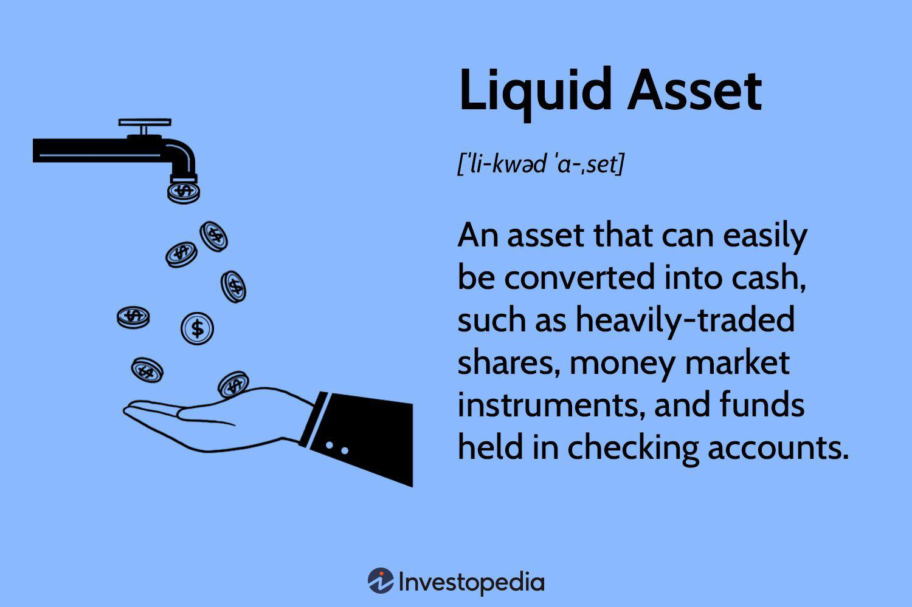

Investing in financial markets has undergone a profound transformation over the years. The advent of technology has introduced sophisticated strategies such as algorithmic trading, enabling traders to execute investments with unmatched precision and speed. Algorithmic trading, commonly referred to as algo trading, leverages complex algorithms and automated systems to make high-frequency trading decisions, revolutionizing the way investments are managed.

For modern investors, understanding the various components involved in financial markets is crucial. Central to this understanding are financial assets, which include a diverse array of investment vehicles like stocks, bonds, and derivatives. These assets represent ownership or rights to potential future cash flows, offering varying levels of risk and potential return. Liquid assets, a subset of financial assets, are particularly significant due to their flexibility. These assets, such as cash, treasury bills, and marketable securities, can be quickly converted to cash with minimal impact on their value, ensuring that investors maintain the financial agility necessary to meet short-term obligations.



Moreover, the integration of algorithmic trading into investment strategies has become imperative. This technology not only allows for faster transactions but also enables systematic, emotion-free trading, minimizing the risks associated with human errors. By capitalizing on this technology, investors can harness market efficiencies previously unattainable through traditional trading practices.

This article aims to explore these intertwined concepts, providing insights into navigating the multifaceted world of financial markets and crafting effective investment strategies. By examining the relationship between financial assets, liquid assets, and algorithmic trading, investors can better position themselves to capitalize on market opportunities and manage inherent risks in this dynamic environment.

## Table of Contents

## Understanding Financial Assets and Liquid Assets

Financial assets represent a diverse array of investment vehicles, each offering unique levels of risk and potential return. These assets can be broadly categorized into equity shares, fixed-income instruments such as bonds, and derivatives, which are financial contracts deriving their value from underlying assets like stocks or indices. Each type of financial asset carries distinct risk profiles and expected return characteristics, making them suitable for different investment strategies and risk tolerances.

A crucial subset of financial assets is liquid assets, which are characterized by their ability to be quickly and easily converted into cash with minimal impact on their market value. The liquidity of an asset is an important consideration for investors, as it affects their ability to respond to market changes and meet short-term financial obligations. Liquid assets typically include cash, treasury bills, and marketable securities. These assets are vital for maintaining financial flexibility, enabling investors to capitalize on immediate opportunities or cover unforeseen expenses without having to sell less liquid, long-term investments at a potential loss. 

For example, treasury bills, which are short-term government securities, can be sold with ease on the open market, making them highly liquid. Meanwhile, cash is the ultimate liquid asset, ready for use without any transaction effort. Marketable securities, such as stocks traded on major exchanges, also fall into the category of liquid assets because they can be sold quickly and with limited effect on price, assuming typical market conditions.

The importance of liquid assets in an investment portfolio cannot be overstated. They provide a safety net against market [volatility](/wiki/volatility-trading-strategies) by ensuring that investors have readily accessible funds to cover expenses or take advantage of market opportunities. This fluidity helps prevent the need to liquidate more volatile or low-[liquidity](/wiki/liquidity-risk-premium) investments, which could lead to unfavorable financial outcomes. Hence, maintaining an appropriate balance of liquid assets within a financial portfolio is essential for effective risk management and strategic financial planning.

## The Role of Liquid Assets in Investment Portfolios

Liquid assets play a critical role in investment portfolios by providing investors with the flexibility and agility required to navigate the ever-changing landscape of financial markets. These assets, which are easily convertible into cash with minimal impact on their value, act as a stabilizing [factor](/wiki/factor-investing) during periods of market volatility. The strategic inclusion of liquid assets in a portfolio allows investors to swiftly adjust their holdings in response to emerging opportunities or fluctuations in market conditions.

Investors often leverage liquid assets to seize immediate opportunities without the risk of significant value loss during the conversion process. For instance, a sudden market downturn might present a lucrative buying opportunity for undervalued stocks. Having a portion of a portfolio in liquid assets enables investors to capitalize on such opportunities swiftly, thus potentially enhancing returns.

Maintaining liquidity within an investment portfolio is crucial for efficient risk management. Liquid assets provide a cushion against unforeseen market events, allowing investors to meet short-term obligations or rebalance their portfolios with ease. This can be particularly important during economic downturns or periods of increased market volatility, where access to cash without substantial delay or loss becomes imperative.

To illustrate this strategic importance of liquidity, consider a hypothetical portfolio diversification strategy. An investor might allocate 20% of their portfolio to liquid assets such as treasury bills, cash, and money market instruments. The remaining 80% could be split between stocks and bonds. This allocation ensures that the investor can respond to market moves promptly while still targeting long-term growth through investments in less liquid assets.

Understanding the role of liquid assets in maintaining an optimal balance between risk and return can significantly enhance portfolio performance. By integrating liquid assets into investment strategies, investors can improve their ability to manage risks and achieve financial objectives efficiently.

## Algorithmic Trading: An Introduction

Algorithmic trading, commonly referred to as algo trading, leverages computer programs to execute trading orders at remarkable speeds according to pre-defined criteria. This approach is designed to optimize market conditions by enabling trades to be executed in milliseconds, far surpassing the pace achievable by human traders. By doing so, it significantly reduces latency, ensuring transactions are processed at the best possible prices. 

Algo trading is characterized by the minimization of human intervention, which allows for systematic and emotion-free execution of trades. This is particularly beneficial as it mitigates risks associated with human errors and impulsive decision-making. The foundation of effective [algorithmic trading](/wiki/algorithmic-trading) resides in the development of robust algorithms, which integrate complex mathematical models along with real-time [volume](/wiki/volume-trading-strategy) and price data. These algorithms analyze market conditions, identify trading opportunities, and execute orders across various trading platforms without the need for human input.

An algorithm in trading can be structured around various parameters, such as timing, price, quantity, and other mathematical models. For instance, a simple example could involve moving averages:

```python
# Example of a simple moving average crossover strategy in Python
import numpy as np
import pandas as pd

# Assume we have a DataFrame `data` with a column `price`
data = pd.DataFrame({'price': [/* list of prices */]})

# Calculate 50-day and 200-day moving averages
data['50_SMA'] = data['price'].rolling(window=50).mean()
data['200_SMA'] = data['price'].rolling(window=200).mean()

# Identify buy/sell signals
data['signal'] = 0
data.loc[data['50_SMA'] > data['200_SMA'], 'signal'] = 1  # Buy
data.loc[data['50_SMA'] < data['200_SMA'], 'signal'] = -1  # Sell
```

This example demonstrates a simple moving average crossover strategy, where buy signals are generated when a shorter-term moving average crosses above a longer-term moving average, and sell signals are generated when it crosses below.

The underlying success of algo trading is contingent upon the quality of the data fed into these algorithms and the accuracy of the models used. Sophisticated algo trading strategies may include elements such as statistical [arbitrage](/wiki/arbitrage), [machine learning](/wiki/machine-learning), and [artificial intelligence](/wiki/ai-artificial-intelligence), which require high levels of computational power and advanced programming skills.

In summary, algorithmic trading offers significant advantages, notably its speed, precision, and ability to operate around the clock without fatigue. It empowers traders to efficiently exploit small price differences in the market, significantly enhancing the overall trading process.

## Advantages of Algorithmic Trading

Algorithmic trading offers several advantages over traditional manual trading methods. One of the primary benefits is the ability to execute trades at optimal prices while significantly reducing transaction costs. This is achieved through the use of computer algorithms that can monitor market conditions in real-time, identify profitable opportunities, and execute trades at speeds and efficiencies unattainable by human traders. For instance, the algorithms can buy or sell large volumes of stocks at precise moments to take advantage of minute price differences, a process known as arbitrage.

The precision inherent in algorithmic trading also mitigates many risks associated with human error and emotion-based decision-making. Humans are prone to biases such as overconfidence or fear, which can lead to suboptimal trading decisions, particularly in volatile markets. In contrast, algorithmic trading is devoid of emotions, allowing trades to be executed based purely on data-driven analysis and pre-defined criteria. This systematic approach helps traders maintain discipline and consistency in their strategies.

Moreover, algorithmic trading systems possess the remarkable ability to backtest trading strategies against historical data. This capability is crucial for refining and optimizing trading strategies. By simulating how a strategy would have performed in the past, traders can identify potential weaknesses and make necessary adjustments before deploying the strategy in live markets. This increases the likelihood of achieving desired outcomes and minimizes the risk of unforeseen losses.

Here is a basic example in Python demonstrating how a trading algorithm might backtest a simple moving average crossover strategy:

```python
import pandas as pd

# Load historical data
data = pd.read_csv('historical_data.csv')

# Calculate moving averages
data['SMA50'] = data['Close'].rolling(window=50).mean()
data['SMA200'] = data['Close'].rolling(window=200).mean()

# Generate signals
data['Signal'] = 0
data.loc[data['SMA50'] > data['SMA200'], 'Signal'] = 1
data.loc[data['SMA50'] < data['SMA200'], 'Signal'] = -1

# Backtest strategy
data['Strategy_Return'] = data['Signal'].shift(1) * data['Close'].pct_change()

# Calculate cumulative returns
cumulative_return = (1 + data['Strategy_Return']).cumprod().iloc[-1]

print(f"Cumulative return of the strategy: {cumulative_return:.2f}")
```

In this example, the algorithm calculates the 50-day and 200-day simple moving averages of a stock's closing prices and generates buy and sell signals based on the crossover points of these averages. The returns from this strategy are backtested, allowing the trader to review the strategy's effectiveness over the analyzed period.

In conclusion, algorithmic trading not only facilitates efficient and disciplined trading by reducing human error but also offers the capacity for thorough strategy evaluation and refinement, contributing to more informed and potentially more lucrative trading decisions.

## Challenges and Risks in Algorithmic Trading

Algorithmic trading, while highly advantageous in terms of speed and efficiency, is not without its challenges and risks. A notable challenge is technical failures. Algorithmic systems rely heavily on complex software and hardware infrastructures. Any malfunction, such as a server failure or software bug, can result in erroneous trades and substantial financial losses. To mitigate these risks, it is imperative to implement robust oversight and fail-safes. Continuous monitoring and maintaining redundancy in systems can help avert catastrophic failures. Additionally, performing routine stress tests ensures that the system can handle extreme market conditions without compromising performance.

Another significant issue is latency. Latency refers to the delay between the initiation of a trading signal and the execution of the trade. In high-frequency trading environments, even microsecond delays can be costly. Strategies to minimize latency include proximity hosting, where trading systems are placed physically near exchanges, and the use of highly efficient algorithms written in low-level programming languages like C++ for faster execution. 

Beyond technical glitches, algorithmic trading also poses risks of market impact. Large algorithmic trades can inadvertently cause significant movements in asset prices, thus affecting market stability. This phenomenon, known as market impact, is particularly pronounced in less liquid markets. Traders need to design algorithms that can stealthily execute orders without moving the market, often using techniques such as volume-weighted average price (VWAP) or time-weighted average price (TWAP) strategies to mitigate this risk.

Additionally, the deterministic nature of algorithms makes them susceptible to manipulation by other market participants. Sophisticated trading entities may detect and exploit patterns in algorithmic trading strategies, a practice known as "algo-sniping". To avoid this, traders must ensure that their strategies are complex enough to mask their trading intentions.

In conclusion, while algorithmic trading offers significant advantages, traders must diligently address its inherent challenges and risks. Incorporating rigorous oversight, latency reduction measures, strategies to mitigate market impact, and mechanisms to protect against manipulation are essential to ensuring the reliability and profitability of algorithmic trading systems.

## Integrating Liquid Assets with Algorithmic Trading

Integrating liquid assets with algorithmic trading is an effective strategy for enhancing both liquidity management and trading efficiency. Liquid assets, by their nature, can be converted to cash quickly and without significant impact on their price. This characteristic allows them to serve as a buffer that supports the execution of algorithmic strategies, ensuring that trades can be conducted promptly without destabilizing a portfolio.

The main advantage of using liquid assets in algorithmic trading is the ability to optimize returns while maintaining agility in strategy adjustments. Algorithmic trading systems operate based on pre-defined criteria, which can be dynamically adjusted to respond to market conditions. Hence, maintaining a portion of the portfolio in liquid assets allows traders to execute trades swiftly in response to market changes, taking full advantage of emergent opportunities.

From a technical perspective, integrating liquid assets into an algorithmic trading strategy can be approached by incorporating liquidity constraints within the trading algorithm. For instance, a Python-based algorithm can continuously monitor liquidity levels and adjust trade executions accordingly:

```python
def execute_trade(asset, target_quantity, current_liquidity):
    if current_liquidity >= target_quantity:
        # Perform the trade if liquidity is sufficient
        return f"Executing trade for {target_quantity} units of {asset}"
    else:
        # Liquidity is insufficient; adjust trade quantity
        adjusted_quantity = current_liquidity
        return f"Executing trade for {adjusted_quantity} units of {asset}, adjusted due to liquidity constraints"

# Example usage
liquid_assets = {'cash': 10000, 'treasury_bills': 5000}
print(execute_trade('stock_XYZ', 1500, liquid_assets['cash']))
```

This integration facilitates real-time strategy adjustments, allowing traders to maintain portfolio stability while pursuing high-frequency trading opportunities. It inherently supports risk management by preventing significant shifts in portfolio allocations that could arise when trading less liquid assets. Through this synergy, traders leverage the dual benefits of algorithmic precision and liquidity flexibility, ultimately aiming to maximize returns in the financial markets.

## Conclusion

Investing in financial assets has been significantly enhanced by the use of liquid assets and algorithmic trading, providing a modern pathway for navigating the complexities of financial markets. These tools offer investors numerous advantages, enabling them to make well-informed decisions, manage risks effectively, and seize new market opportunities with agility.

Liquid assets, due to their ease of conversion into cash, allow investors to maintain financial flexibility and quickly adapt to market conditions. This liquidity is crucial for capitalizing on immediate investment opportunities without incurring substantial risks associated with value depreciation.

Algorithmic trading further complements this modern investment approach by automating trade execution. This method diminishes the impact of human error and emotional decision-making, while also optimizing trade precision and reducing transaction costs. By employing algorithms that analyze mathematical models, volume, and price data, investors can enhance their trading strategies and improve their financial outcomes.

To sustain success in this ever-evolving field, continuous education and an adaptive mindset towards technological advancements and market trends are essential. Investors must remain vigilant and proactive, ensuring their strategies evolve alongside the dynamic nature of financial markets. In summary, leveraging liquid assets and algorithmic trading equips investors with the necessary tools to navigate and thrive in today's competitive financial landscape.

## References & Further Reading

[1]: Bergstra, J., Bardenet, R., Bengio, Y., & Kégl, B. (2011). ["Algorithms for Hyper-Parameter Optimization."](https://papers.nips.cc/paper/4443-algorithms-for-hyper-parameter-optimization) Advances in Neural Information Processing Systems 24.

[2]: ["Advances in Financial Machine Learning"](https://www.amazon.com/Advances-Financial-Machine-Learning-Marcos/dp/1119482089) by Marcos Lopez de Prado

[3]: ["Evidence-Based Technical Analysis: Applying the Scientific Method and Statistical Inference to Trading Signals"](https://www.amazon.com/Evidence-Based-Technical-Analysis-Scientific-Statistical/dp/0470008741) by David Aronson

[4]: ["Machine Learning for Algorithmic Trading"](https://github.com/stefan-jansen/machine-learning-for-trading) by Stefan Jansen

[5]: ["Quantitative Trading: How to Build Your Own Algorithmic Trading Business"](https://www.amazon.com/Quantitative-Trading-Build-Algorithmic-Business/dp/1119800064) by Ernest P. Chan