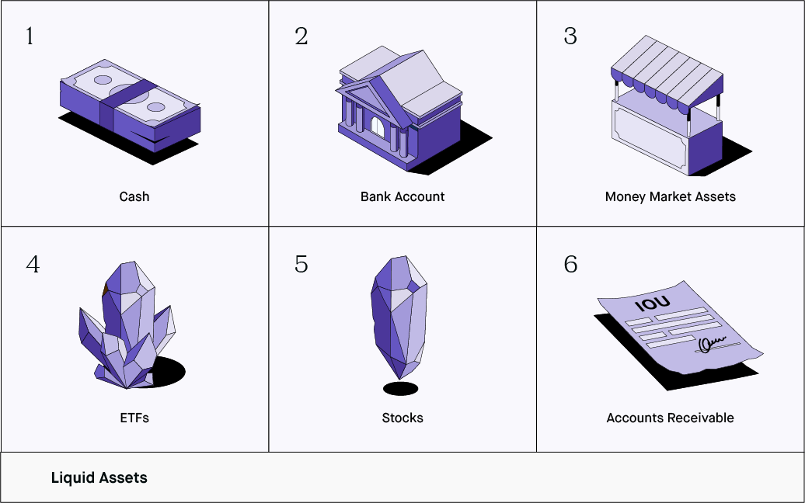

## Table of Contents

## What is a liquid asset?

A liquid asset is something you own that you can quickly turn into cash without losing much value. This can include money in your bank account, stocks, or even a savings bond. These assets are important because they help you pay for things you need right away, like bills or emergencies.

Having liquid assets is like having a safety net. If you lose your job or have an unexpected expense, you can use these assets to cover your costs without having to sell bigger things like your house or car, which can take a long time and might not give you the full value. Keeping some liquid assets is a smart part of managing your money.

## Can you provide examples of liquid assets?

Liquid assets are things you can turn into cash fast without losing much money. Some common liquid assets are money in your checking or savings account. This is the easiest to use because you can take it out or spend it right away. Another example is stocks. You can sell your stocks quickly through a stock market, and usually, you'll get the money in a few days.

Other examples of liquid assets include money market funds, which are like savings accounts but often give you a bit more interest. You can also think of government bonds or treasury bills as liquid assets. These are loans you give to the government, and you can sell them before they're due if you need cash. Even though it might take a little longer than cash, they're still pretty quick to turn into money.

Certificates of deposit (CDs) can be liquid assets too, but they might have a penalty if you take your money out early. So, they're not as liquid as cash or stocks, but they're still easier to turn into cash than selling a house or a car. Keeping some of these liquid assets can help you feel more secure because you know you can handle unexpected costs or emergencies.

## Why is liquidity important in assets?

Liquidity is important in assets because it helps you get cash quickly when you need it. Imagine you have an emergency, like a big medical bill or losing your job. If you have liquid assets, you can turn them into cash fast without losing much money. This means you can pay for what you need right away without waiting or selling bigger things like your house or car, which can take a long time and might not give you as much money as you need.

Having liquid assets also makes you feel more secure. Knowing you can cover unexpected costs or emergencies without stress is a big relief. It's like having a safety net. Plus, if you see a good investment opportunity, having liquid assets means you can jump on it quickly. So, keeping some of your money in liquid assets is a smart way to manage your finances and be ready for whatever comes your way.

## How do you measure the liquidity of an asset?

To measure the [liquidity](/wiki/liquidity-risk-premium) of an asset, you look at how quickly and easily you can turn it into cash without losing much value. The faster you can do this, the more liquid the asset is. For example, money in your checking account is very liquid because you can use it right away. Stocks are also pretty liquid because you can sell them quickly through the stock market, usually getting your money in a few days.

Another way to measure liquidity is by looking at how much the asset's value might drop when you sell it quickly. If an asset loses a lot of value when you need to sell it fast, it's less liquid. For instance, selling a house or a car can take a long time and you might not get as much money as you hoped. So, these are less liquid than cash or stocks. By understanding how quickly and easily you can turn an asset into cash, you can better manage your money and be ready for any unexpected needs.

## What is the difference between liquid and illiquid assets?

Liquid assets are things you own that you can turn into cash quickly and easily without losing much value. Examples include money in your bank account, stocks, or government bonds. These are important because they help you pay for emergencies or unexpected costs right away. If you lose your job or need money fast, you can use these assets without waiting or selling bigger things like your house.

Illiquid assets, on the other hand, are things that take a long time to turn into cash, or you might lose a lot of value if you need to sell them quickly. Examples include real estate, like your home, or a car. Selling these can take weeks or months, and you might not get as much money as you want. Having some illiquid assets is okay, but it's good to have liquid assets too, so you're ready for anything that comes up.

## How can an individual or business improve the liquidity of their assets?

An individual or business can improve the liquidity of their assets by keeping some money in easily accessible places like checking or savings accounts. This way, they can use the money right away if they need to. They can also invest in things like stocks or government bonds, which you can sell quickly on the stock market or through a financial institution. Having a mix of these liquid assets means you can turn them into cash without waiting or losing much value.

Another way to boost liquidity is to avoid putting all your money into things that are hard to sell, like real estate or special collections. If you need cash fast, selling a house or a rare item can take a long time and might not give you as much money as you need. Instead, keep some of your money in liquid assets so you're ready for emergencies or good investment opportunities. By balancing your assets, you can make sure you have enough liquidity to handle whatever comes your way.

## What role do liquid assets play in personal finance?

Liquid assets are really important in personal finance because they help you get cash quickly when you need it. Imagine you have an emergency, like a big medical bill or losing your job. If you have liquid assets, you can turn them into cash fast without losing much money. This means you can pay for what you need right away without waiting or selling bigger things like your house or car, which can take a long time and might not give you as much money as you need.

Having liquid assets also makes you feel more secure. Knowing you can cover unexpected costs or emergencies without stress is a big relief. It's like having a safety net. Plus, if you see a good investment opportunity, having liquid assets means you can jump on it quickly. So, keeping some of your money in liquid assets is a smart way to manage your finances and be ready for whatever comes your way.

## How do liquid assets affect a company's financial health?

Liquid assets are really important for a company's financial health. They help a company pay its bills and expenses quickly without having to sell big things like buildings or machinery. If a company has a lot of liquid assets, like money in the bank or stocks, it can handle emergencies or unexpected costs easily. This makes the company more stable and less likely to run into money problems. It's like having a safety net that lets the company keep running smoothly even when things go wrong.

Having good liquidity also makes it easier for a company to take advantage of new opportunities. If a good investment comes up, a company with lots of liquid assets can jump on it right away. This can help the company grow and make more money in the future. On the other hand, if a company doesn't have enough liquid assets, it might struggle to pay its bills on time or miss out on good deals. So, keeping a healthy amount of liquid assets is key to a company's financial health and success.

## What are the risks associated with holding too many liquid assets?

Holding too many liquid assets can be risky because you might miss out on making more money. Liquid assets like cash in a bank account usually don't grow much over time. If you keep all your money in these kinds of assets, it might not keep up with inflation, which means the value of your money could go down. Instead of growing, your money might actually be worth less in the future.

Another risk is that you might not be using your money in the best way. If you have too much money sitting in liquid assets, you could be missing out on better investment opportunities that could help your money grow faster. For example, investing in stocks or real estate might give you a better return over time, but if all your money is in liquid assets, you won't be able to take advantage of these opportunities. So, while it's good to have some liquid assets for emergencies, having too many can hold back your financial growth.

## How do market conditions affect the liquidity of assets?

Market conditions can change how easy or hard it is to turn your assets into cash. When the economy is doing well, more people want to buy things, so it's easier to sell your stocks or other investments quickly without losing much money. This makes your assets more liquid. But if the market is going down or there's a lot of uncertainty, people might not want to buy as much. This can make it harder to sell your assets quickly, so they become less liquid.

For example, during a financial crisis, people might panic and not want to buy stocks or other investments. This means you might have to wait longer to sell or accept a lower price, making your assets less liquid. On the other hand, in a strong market, you can sell things like stocks or bonds quickly and easily, keeping your assets very liquid. So, keeping an eye on market conditions can help you understand how liquid your assets might be at any given time.

## What strategies can be used to manage liquid assets effectively?

Managing liquid assets effectively means finding the right balance between having enough cash for emergencies and making your money grow. One good strategy is to keep some money in a checking or savings account where you can get it quickly. This way, you're ready for unexpected costs like medical bills or car repairs. But don't keep all your money there because it usually doesn't grow much. Instead, put some of your money into liquid investments like stocks or bonds. These can give you a better return over time while still being easy to turn into cash if you need to.

Another strategy is to regularly check and adjust how much money you have in liquid assets. Life changes, and so do your financial needs. If you get a new job or your family grows, you might need more liquid assets for emergencies. On the other hand, if things are stable, you might want to invest more money in things that can grow over time. By keeping an eye on your financial situation and the market, you can move your money around to make sure you have enough liquidity without missing out on growth opportunities.

## How do regulatory requirements impact the management of liquid assets in financial institutions?

Regulatory requirements play a big role in how financial institutions manage their liquid assets. These rules are made to make sure banks and other financial places can handle emergencies and keep the economy stable. For example, regulators might say that banks need to keep a certain amount of money in liquid assets, like cash or government bonds. This is so they can pay back people who want to take their money out quickly, especially during tough times. If banks don't follow these rules, they could get in trouble or even have to close down.

These regulations can make it harder for banks to use their money in other ways that might make more profit. For example, if a bank has to keep a lot of money in liquid assets, it can't invest that money in loans or other things that could bring in more money. But even though it might limit what banks can do with their money, having these rules helps keep the financial system safe and makes people trust banks more. So, while it can be a challenge, following these regulatory requirements is important for the overall health and stability of financial institutions.

## References & Further Reading

[1]: Bergstra, J., Bardenet, R., Bengio, Y., & Kégl, B. (2011). ["Algorithms for Hyper-Parameter Optimization."](https://papers.nips.cc/paper/4443-algorithms-for-hyper-parameter-optimization) Advances in Neural Information Processing Systems 24.

[2]: ["Advances in Financial Machine Learning"](https://www.amazon.com/Advances-Financial-Machine-Learning-Marcos/dp/1119482089) by Marcos Lopez de Prado

[3]: ["Evidence-Based Technical Analysis: Applying the Scientific Method and Statistical Inference to Trading Signals"](https://www.amazon.com/Evidence-Based-Technical-Analysis-Scientific-Statistical/dp/0470008741) by David Aronson

[4]: ["Machine Learning for Algorithmic Trading"](https://github.com/stefan-jansen/machine-learning-for-trading) by Stefan Jansen

[5]: ["Quantitative Trading: How to Build Your Own Algorithmic Trading Business"](https://www.amazon.com/Quantitative-Trading-Build-Algorithmic-Business/dp/1119800064) by Ernest P. Chan