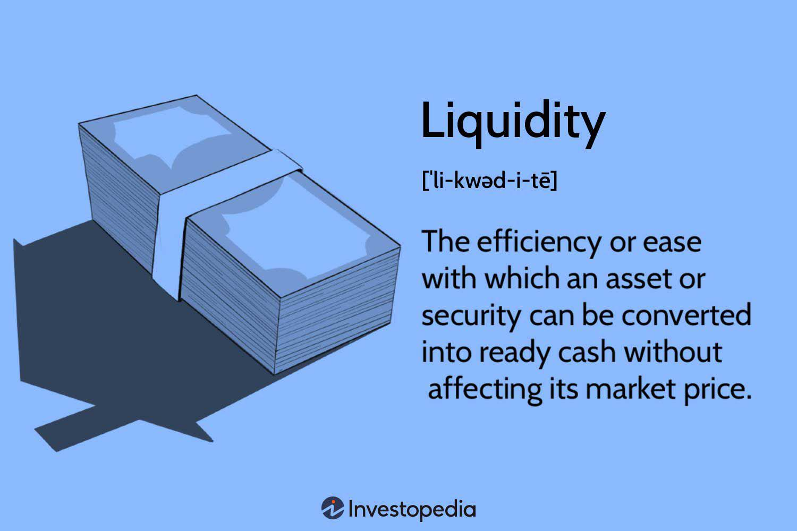

A liquid market is a fundamental concept in trading that signifies a marketplace where assets can be bought and sold quickly with minimal impact on their prices. The liquidity of a market is often evidenced by high trading volumes, narrow bid-ask spreads, and a significant number of participants actively engaging in transactions. Markets become 'liquid' when there is a steady influx of buyers and sellers, which ensures that trades can be executed rapidly and efficiently. This liquidity is crucial as it enhances market efficiency, facilitating better price discovery and reducing the volatility typically associated with executing substantial trades.

The importance of liquid markets cannot be overstated. They provide a fertile ground for trading opportunities, allowing traders to easily enter and exit positions. This dynamic nature of liquid markets means that they offer more robust platforms for both individual and institutional traders to achieve their trading objectives. For example, the rapid execution of trades ensures that investors can capitalize swiftly on market movements, leading to potentially higher returns.

Throughout this article, readers will gain insights into various aspects of liquid markets, including specific examples of some of the most liquid markets globally, such as the Forex and major stock markets. The discussion will also cover the benefits of trading in such markets, such as lower transaction costs and improved price discovery. Additionally, the role of algorithmic trading will be examined, showcasing how advanced technology leverages liquidity for executing large orders efficiently.

Understanding liquid markets is necessary for traders seeking to optimize their trading strategies. With the rise of technological advancements and innovative trading methods, grasping the nuances of these markets has become increasingly relevant for anyone involved in trading activities. Whether focusing on managing risks or seeking new trading opportunities, recognizing the characteristics and advantages of liquid markets can serve as a vital asset for both novice and seasoned trading participants.

## Table of Contents

## Understanding Liquid Markets

Liquid markets are defined by their ability to facilitate the quick and seamless exchange of assets without causing significant price changes. The efficiency of these markets is primarily attributed to two key characteristics: high trading volumes and narrow bid-ask spreads. High trading volume indicates the large number of shares or contracts traded within a given period, which ensures there are enough participants willing to buy or sell at any time. Narrow bid-ask spreads, the small difference between the buying price (bid) and the selling price (ask), signify the market's efficiency in aligning supply with demand.

The liquidity of a market is bolstered by several factors. The presence of diverse market participants, including individual traders, institutional investors, and market makers, enhances the depth and breadth of trading activities. Additionally, product standardization, such as having widely accepted specifications for assets like futures contracts or foreign exchange pairs, aids in ensuring that these products are easily traded.

Contrastingly, illiquid markets experience lower trading volumes and wider bid-ask spreads. For instance, real estate markets are often considered illiquid due to the lengthy processes involved in selling properties and the significant price fluctuations that can result from individual transactions. On the other hand, the foreign exchange market, which boasts a daily trading [volume](/wiki/volume-trading-strategy) exceeding $6 trillion, exemplifies a liquid market.

Market [liquidity](/wiki/liquidity-risk-premium) plays a crucial role in influencing market stability and [volatility](/wiki/volatility-trading-strategies). Liquid markets tend to be more stable since the continuous influx of buy and sell orders dampens large swings in prices. This stability arises because it is more challenging for any single trade to have a disproportionate impact on an asset's price. Conversely, illiquid markets can experience heightened volatility due to larger price movements caused by relatively small trades.

Technology and innovation are pivotal in enhancing market liquidity. The advent of electronic trading platforms and [algorithmic trading](/wiki/algorithmic-trading) has significantly improved access to markets, allowing for faster and more efficient trading. Innovations such as high-frequency trading systems ensure rapid execution of orders, thus maintaining high liquidity levels. Moreover, blockchain technology and decentralized finance (DeFi) platforms are emerging as influential elements in the liquidity paradigm, offering new avenues to bolster market participation and facilitate seamless transactions.

## Examples of Liquid Markets

The most liquid markets in the world include the Foreign Exchange Market (Forex), major stock exchanges, and futures markets. These markets are characterized by high trading volumes, seamless transaction processes, and low bid-ask spreads, making them attractive for various trading strategies.

### Forex Market

The Forex market is the largest and most liquid market globally, with a daily trading volume exceeding $6 trillion as reported by the Bank for International Settlements (BIS) in 2022. This high liquidity is primarily due to the global nature of currency trading, the involvement of numerous participants (including banks, financial institutions, corporations, and retail investors), and the 24-hour operation across different time zones. Major currency pairs like EUR/USD, USD/JPY, and GBP/USD exhibit particularly high liquidity, allowing traders to execute substantial orders with minimal price impact.

### Major Stock Markets

Stock markets such as the New York Stock Exchange (NYSE) and NASDAQ are among the most liquid equity markets. As of 2021, the NYSE reported an average daily trading volume of around 4.5 billion shares. Large-cap stocks like Apple (AAPL), Microsoft (MSFT), and Amazon (AMZN) are examples of highly liquid securities, frequently traded with narrow bid-ask spreads due to their high demand and supply. The proliferation of electronic trading and high-frequency trading ([HFT](/wiki/high-frequency-trading-strategies)) systems has further contributed to the liquidity of these markets.

### Futures Markets 

Futures markets also demonstrate significant liquidity, particularly in contracts linked to indices, commodities, and interest rates. The Chicago Mercantile Exchange (CME), one of the largest futures exchanges, facilitates diversified trading with contracts like the S&P 500 E-mini, which is highly liquid with millions of contracts traded daily. The standardization of futures contracts enhances market participation and accessibility, promoting high liquidity.

### Reasons for High Liquidity

The high liquidity in these markets can be attributed to several factors:

1. **Diverse Participants**: A wide range of institutional and retail investors contribute to the extensive trading volume.
2. **Regulatory Frameworks**: Well-regulated environments increase investor confidence and market integrity.
3. **Technological Advancements**: Algorithmic trading and electronic platforms streamline trading processes, increasing efficiency and participation.

### Trends and Changes

Recent trends indicate a growing influence of technology in maintaining market liquidity. The advancement of algorithmic trading strategies has leveraged [machine learning](/wiki/machine-learning) and quantitative analysis to optimize trade execution, further enhancing liquidity. Additionally, geopolitical events and economic policies can cause fluctuations in market liquidity, as observed during the COVID-19 pandemic, where initial volatility was followed by increased liquidity due to coordinated central bank interventions.

Understanding these liquid markets can greatly aid traders and investors in optimizing their strategies and ensuring efficient asset allocation.

## Trading Benefits in Liquid Markets

Liquid markets offer numerous advantages to traders, primarily due to their inherent characteristics of high trading volumes and narrow bid-ask spreads. One of the most significant benefits is lower transaction costs. Given the abundance of participants willing to buy and sell, traders in liquid markets can execute transactions swiftly without substantial price changes. This means that the cost of entering and exiting trades remains minimal, allowing traders to maximize their returns.

Moreover, liquidity plays a crucial role in facilitating better price discovery. In liquid markets, prices reflect all available information swiftly, as trades occur frequently, ensuring that securities are accurately priced. This efficiency reduces the likelihood of significant price discrepancies, making it easier for traders to make informed decisions. Additionally, the presence of numerous buyers and sellers ensures that the impact of large trades on market prices is minimized, preventing undue influence on price movements.

Liquid markets are also characterized by tighter spreads, the difference between the bid and ask prices, which further enhances trading profitability. Tighter spreads mean that traders can buy and sell more competitively, ensuring they capture more value in each transaction. For instance, if a stock has a bid price of $100 and an ask price of $100.01, the narrow spread signifies minimal costs for the trader, enhancing potential profits.

The high liquidity of these markets provides investors with greater flexibility and opportunity. With the ease of rapidly entering and exiting positions, traders can take advantage of transient market opportunities without being locked into long commitments. This flexibility allows for dynamic portfolio adjustments, accommodating both short-term tactical moves and long-term strategic shifts.

Risk management is another area where liquid markets provide significant benefits. In a liquid market, the ability to quickly enter or [exit](/wiki/exit-strategy) positions helps traders manage risk more effectively. For instance, in the event of an adverse market movement, a trader in a liquid market can swiftly sell off positions to minimize potential losses. This ability to react promptly to market changes is less feasible in illiquid markets, where executing large orders could result in unfavorable price slippage.

In summary, trading in liquid markets offers a multitude of benefits, including reduced transaction costs, enhanced price discovery, and improved profitability through tighter spreads. Furthermore, the flexibility and superior risk management options available in these markets underscore their importance to traders seeking efficient and effective market participation.

## Algorithmic Trading in Liquid Markets

Algorithmic trading, often referred to as algo trading, is the use of computer algorithms to execute trading orders in financial markets. These algorithms are designed to automate and optimize the trading process, enabling the execution of trades at speeds and frequencies beyond the capability of human traders. Algo trading is particularly prevalent in liquid markets due to their high trading volumes and narrow bid-ask spreads, which provide an ideal environment for executing large orders with minimal market impact.

One of the primary advantages of algorithmic trading in liquid markets is the ability to execute large orders efficiently. By breaking down large orders into smaller, more manageable sizes, algorithms can minimize the market impact, thus helping maintain the desired price level. This is particularly advantageous in markets like Forex and major stock exchanges, where even modest price shifts can be significant. The optimal execution of a large order $(V)$ can be achieved by minimizing the implementation shortfall, calculated as:

$$
\text{Implementation Shortfall} = (P_{\text{avg}} - P_{\text{init}}) \times Q
$$

where $P_{\text{avg}}$ is the average execution price, $P_{\text{init}}$ is the initial trading price, and $Q$ represents the quantity.

The technological infrastructure supporting algo trading includes powerful computing systems and high-speed connectivity, often facilitated by colocated servers that reside close to the exchange's data centers. This proximity reduces latency, thereby enabling faster data processing and execution. Such technological infrastructure provides significant advantages over traditional trading methods, allowing for real-time data analysis, pattern recognition, and rapid order execution.

Common algorithmic strategies employed in liquid markets include market-making, statistical [arbitrage](/wiki/arbitrage), and trend-following strategies. Market-making algorithms aim to provide liquidity by continuously quoting buy and sell prices, benefiting from the bid-ask spread. Statistical arbitrage involves the exploitation of price inefficiencies and correlations within multiple securities, often capitalizing on temporary anomalies. Trend-following strategies, on the other hand, seek to identify and ride sustained movements in the market, using technical indicators as triggers for trade execution.

Despite its advantages, algorithmic trading in highly liquid markets faces several challenges and risks. One significant challenge is the ever-present risk of algorithms behaving unexpectedly, known as algorithmic trading errors, which can lead to substantial losses. Moreover, as algorithms compete for execution speed, they may inadvertently contribute to market volatility and systemic risk, particularly during times of market stress. Additionally, with the increasing sophistication of algorithms, the complexity of maintaining and updating these systems intensifies, requiring significant investments in technology and expertise.

In summary, algorithmic trading leverages the inherent liquidity in markets to facilitate efficient, cost-effective trade execution. While it presents numerous advantages over traditional trading methods, it also poses distinct challenges that traders and financial institutions must manage effectively. Understanding these dynamics is crucial for anyone participating in or affected by financial markets.

## Conclusion

Liquid markets, characterized by high trading volumes and narrow bid-ask spreads, play a pivotal role in modern trading environments. These markets, exemplified by Forex, major stock exchanges, and futures markets, provide a robust foundation for both individual and institutional traders. Their abundant liquidity facilitates efficient trading by enabling quick entry and exit from positions, thereby supporting better price discovery and minimizing the adverse effects of large trades on market prices. 

Algorithmic trading, which has become increasingly prevalent in such liquid environments, leverages this liquidity to execute large orders with precision and speed, reducing market impact and transaction costs. The technological infrastructure supporting algorithmic trading offers significant advantages over traditional methods, ensuring not only efficiency but also enhanced profitability and risk management.

Understanding market liquidity is crucial for trading success. It equips traders with the knowledge to navigate markets efficiently, manage risks effectively, and capitalize on trading opportunities that liquid markets present. As traders plan their strategies, considering the benefits of liquidity can greatly influence their decision-making and potential outcomes.

Looking ahead, the future of liquid markets is intertwined with ongoing technological advancements. As technology continues to evolve, so too will the mechanisms that drive market liquidity, potentially paving the way for even more efficient, transparent, and accessible trading platforms. Emphasizing the dynamic interaction between technology and market liquidity will remain essential for sustaining the vitality and resilience of global financial markets.

## References & Further Reading

[1]: Lyons, R. K. (2001). ["The Microstructure Approach to Exchange Rates."](https://direct.mit.edu/books/monograph/2004/The-Microstructure-Approach-to-Exchange-Rates) MIT Press.

[2]: Bank for International Settlements. (2022). ["Triennial Central Bank Survey: Foreign exchange turnover in April 2022."](https://www.bis.org/statistics/rpfx22_fx.pdf)

[3]: Hasbrouck, J. (2007). ["Empirical Market Microstructure."](https://archive.org/details/empiricalmarketm0000hasb) Oxford University Press.

[4]: Aldridge, I. (2013). ["High-Frequency Trading: A Practical Guide to Algorithmic Strategies and Trading Systems."](https://www.amazon.com/High-Frequency-Trading-Practical-Algorithmic-Strategies/dp/1118343506) Wiley Finance.

[5]: Hull, J. (2017). ["Options, Futures, and Other Derivatives."](https://www.semanticscholar.org/paper/Options%2C-Futures%2C-and-Other-Derivatives-Hull/89bdee500c8623864fc9eb7a471546aa713acc44) Pearson Education.

[6]: Fabozzi, F. J., Kolm, P. N., Pachamanova, D. A., & Focardi, S. M. (2016). ["Robust Portfolio Optimization and Management."](https://onlinelibrary.wiley.com/doi/book/10.1002/9781119202172) Wiley Finance.