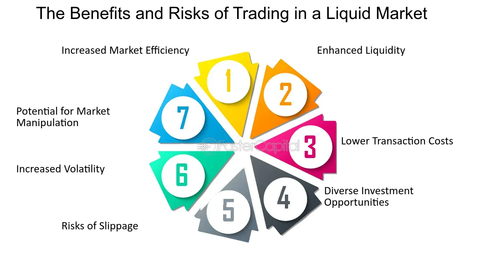

## Table of Contents

## What is a liquid market?

A liquid market is a market where you can easily buy or sell something without affecting its price too much. Imagine you want to sell your old bike. In a liquid market, you would find many people interested in buying it, and you could sell it quickly at a fair price. This is because there are lots of buyers and sellers, and the market is active.

In contrast, an illiquid market is like trying to sell that same bike in a small town where nobody wants one. It might take a long time to find a buyer, and you might have to lower your price a lot. So, a liquid market is important because it makes trading easier and helps keep prices stable.

## Why is liquidity important in trading?

Liquidity is important in trading because it makes it easier and quicker to buy and sell things. When a market is liquid, there are lots of people wanting to buy and sell, so you can find someone to trade with easily. This means you can get in and out of trades without waiting a long time. It's like being at a busy market where you can always find someone to trade with, rather than a quiet one where you might have to wait all day.

Also, [liquidity](/wiki/liquidity-risk-premium) helps keep prices stable. In a liquid market, when you want to buy or sell something, your action doesn't change the price much because there are so many other people doing the same thing. This is good because it means the price you see is likely to be the price you get. In an illiquid market, your trade could move the price a lot, which can be risky and make trading harder. So, liquidity is key for smooth and reliable trading.

## How does a liquid market benefit traders?

A liquid market benefits traders by making it easy to buy and sell things quickly. When there are lots of buyers and sellers, traders can find someone to trade with fast. This means they don't have to wait a long time to make a trade. It's like being at a busy market where you can always find someone to buy or sell to, rather than a quiet one where you might have to wait all day.

Also, in a liquid market, the price stays pretty stable. When you want to buy or sell something, your action doesn't change the price much because there are so many other people doing the same thing. This is good because it means the price you see is likely to be the price you get. In an illiquid market, your trade could move the price a lot, which can be risky and make trading harder. So, a liquid market helps traders by making trading smoother and more reliable.

## What are the characteristics of a liquid market?

A liquid market has a lot of buyers and sellers. This means there are always people ready to trade, so you can buy or sell things quickly without waiting. It's like being at a busy market where you can always find someone to buy or sell to, rather than a quiet one where you might have to wait all day.

In a liquid market, the prices stay pretty stable. When you want to buy or sell something, your action doesn't change the price much because there are so many other people doing the same thing. This is good because it means the price you see is likely to be the price you get. In an illiquid market, your trade could move the price a lot, which can be risky and make trading harder. So, a liquid market helps make trading smoother and more reliable.

## Can you provide examples of liquid markets?

The stock market is a good example of a liquid market. There are lots of people buying and selling stocks all the time. This means if you want to buy or sell a stock, you can usually do it quickly and at a price that's close to what you expected. For example, if you want to sell shares of a big company like Apple, you can find buyers easily because so many people are interested in trading that stock.

Another example is the foreign exchange market, where people trade different currencies. It's one of the most liquid markets in the world because there are always people and businesses that need to change one currency into another. This means you can trade currencies like dollars, euros, or yen quickly and at stable prices. It's like a busy market where you can always find someone to trade with.

## How do liquid markets affect price stability?

Liquid markets help keep prices stable because there are so many people buying and selling. When you want to buy or sell something, your action doesn't change the price much because there are so many other people doing the same thing. It's like adding a drop of water to a big lake – it doesn't change the level of the lake much. This means the price you see is likely to be the price you get, which makes trading easier and less risky.

In contrast, in an illiquid market, there are fewer people trading. When you buy or sell something, it can move the price a lot because there aren't as many other trades happening. It's like adding a drop of water to a small puddle – it can make a big difference. This can make prices jump around a lot, which can be risky for traders. So, liquid markets are important for keeping prices steady and making trading smoother.

## What is the difference between a liquid and an illiquid market?

A liquid market is like a busy marketplace where you can easily buy or sell things without waiting. There are lots of buyers and sellers, so you can find someone to trade with quickly. The prices in a liquid market stay pretty stable because your trade doesn't change the price much. It's like adding a drop of water to a big lake – it doesn't make a big difference. This makes trading easier and less risky because you can usually get the price you expect.

An illiquid market is the opposite. It's like a quiet market where there are fewer people wanting to buy or sell. If you want to trade something, it might take a long time to find someone interested. Also, when you do make a trade, it can move the price a lot because there aren't many other trades happening. It's like adding a drop of water to a small puddle – it can change the level a lot. This can make prices jump around, which can be risky and make trading harder.

## How can traders measure market liquidity?

Traders can measure market liquidity by looking at how easy it is to buy or sell something without changing its price too much. One way to do this is by checking the trading [volume](/wiki/volume-trading-strategy), which is the number of trades happening in the market. A high trading volume means lots of people are buying and selling, so the market is more liquid. Another way is to look at the bid-ask spread, which is the difference between the highest price someone is willing to pay and the lowest price someone is willing to sell for. A small bid-ask spread means the market is liquid because it's easy to trade at a stable price.

Another thing traders can do is look at how quickly they can make a trade. If they can buy or sell something right away, that's a sign of a liquid market. They can also use something called the market depth, which shows how many orders are waiting to be filled at different prices. A deep market, with lots of orders, means it's easier to trade without moving the price much. By keeping an eye on these things, traders can get a good idea of how liquid a market is and make better trading decisions.

## What role do market makers play in maintaining liquidity?

Market makers are like helpers in the market. They make sure there are always people ready to buy or sell things. They do this by always offering to buy and sell at certain prices. This means if you want to trade something, you can find a market maker to trade with right away. They help keep the market busy and make it easier for everyone to trade.

By being there all the time, market makers help keep prices stable. When you want to buy or sell something, the market maker's price doesn't change much because they are always ready to trade. This makes the market more liquid because it's easier to trade without moving the price a lot. So, market makers are important for making trading smoother and more reliable for everyone.

## How does liquidity impact transaction costs?

Liquidity affects how much it costs to make a trade. In a liquid market, there are lots of people wanting to buy and sell, so it's easy to find someone to trade with. This means the difference between the price someone is willing to buy at and the price someone is willing to sell at, called the bid-ask spread, is small. A small bid-ask spread means lower costs for traders because they don't have to pay much more to buy something than what they can sell it for.

In an illiquid market, there are fewer people trading, so it's harder to find someone to buy or sell to. This makes the bid-ask spread bigger because there's less competition. A bigger bid-ask spread means higher costs for traders because they have to pay more to buy something and get less when they sell it. So, liquidity is important because it helps keep trading costs low, making it easier and cheaper for everyone to trade.

## What strategies can traders use to take advantage of high liquidity?

When a market is very liquid, traders can use this to their advantage by making trades quickly and at stable prices. Because there are lots of buyers and sellers, traders can buy or sell things without waiting long. This means they can get in and out of trades faster, which can help them make money. For example, if a trader sees a good opportunity, they can take it right away because there will be someone ready to trade with them.

Another strategy is to use limit orders. In a liquid market, traders can set a specific price at which they want to buy or sell something, and it's more likely that their order will be filled at that price. This is because there are so many people trading that someone is likely to take the other side of the trade. Using limit orders can help traders get the best price and save on costs, making their trading more efficient and profitable.

## How do global events influence liquidity in financial markets?

Global events can shake up liquidity in financial markets. When big things happen around the world, like wars, economic crises, or pandemics, people might get scared and stop trading. This can make markets less liquid because there are fewer buyers and sellers. For example, if there's a big financial crisis, people might pull their money out of the market, making it harder to buy and sell things quickly. This can cause prices to move a lot and make trading riskier.

On the other hand, some global events can actually boost liquidity. If there's good news, like a country recovering from a crisis or a new trade deal being signed, more people might start trading again. This can make the market more liquid because there are more buyers and sellers. For instance, if a new technology is announced that everyone wants, it can bring more people into the market, making it easier to trade and keeping prices stable. So, global events can either help or hurt liquidity, depending on what's happening.

## What is Algorithmic Trading in Liquid Markets?

Algorithmic trading, often referred to as algo trading, is the use of computer algorithms to execute trading orders in financial markets. These algorithms are designed to automate and optimize the trading process, enabling the execution of trades at speeds and frequencies beyond the capability of human traders. Algo trading is particularly prevalent in liquid markets due to their high trading volumes and narrow bid-ask spreads, which provide an ideal environment for executing large orders with minimal market impact.

One of the primary advantages of [algorithmic trading](/wiki/algorithmic-trading) in liquid markets is the ability to execute large orders efficiently. By breaking down large orders into smaller, more manageable sizes, algorithms can minimize the market impact, thus helping maintain the desired price level. This is particularly advantageous in markets like Forex and major stock exchanges, where even modest price shifts can be significant. The optimal execution of a large order $(V)$ can be achieved by minimizing the implementation shortfall, calculated as:

$$
\text{Implementation Shortfall} = (P_{\text{avg}} - P_{\text{init}}) \times Q
$$

where $P_{\text{avg}}$ is the average execution price, $P_{\text{init}}$ is the initial trading price, and $Q$ represents the quantity.

The technological infrastructure supporting algo trading includes powerful computing systems and high-speed connectivity, often facilitated by colocated servers that reside close to the exchange's data centers. This proximity reduces latency, thereby enabling faster data processing and execution. Such technological infrastructure provides significant advantages over traditional trading methods, allowing for real-time data analysis, pattern recognition, and rapid order execution.

Common algorithmic strategies employed in liquid markets include market-making, statistical [arbitrage](/wiki/arbitrage), and trend-following strategies. Market-making algorithms aim to provide liquidity by continuously quoting buy and sell prices, benefiting from the bid-ask spread. Statistical arbitrage involves the exploitation of price inefficiencies and correlations within multiple securities, often capitalizing on temporary anomalies. Trend-following strategies, on the other hand, seek to identify and ride sustained movements in the market, using technical indicators as triggers for trade execution.

Despite its advantages, algorithmic trading in highly liquid markets faces several challenges and risks. One significant challenge is the ever-present risk of algorithms behaving unexpectedly, known as algorithmic trading errors, which can lead to substantial losses. Moreover, as algorithms compete for execution speed, they may inadvertently contribute to market [volatility](/wiki/volatility-trading-strategies) and systemic risk, particularly during times of market stress. Additionally, with the increasing sophistication of algorithms, the complexity of maintaining and updating these systems intensifies, requiring significant investments in technology and expertise.

In summary, algorithmic trading leverages the inherent liquidity in markets to facilitate efficient, cost-effective trade execution. While it presents numerous advantages over traditional trading methods, it also poses distinct challenges that traders and financial institutions must manage effectively. Understanding these dynamics is crucial for anyone participating in or affected by financial markets.

## References & Further Reading

[1]: Lyons, R. K. (2001). ["The Microstructure Approach to Exchange Rates."](https://direct.mit.edu/books/monograph/2004/The-Microstructure-Approach-to-Exchange-Rates) MIT Press.

[2]: Bank for International Settlements. (2022). ["Triennial Central Bank Survey: Foreign exchange turnover in April 2022."](https://www.bis.org/statistics/rpfx22_fx.pdf)

[3]: Hasbrouck, J. (2007). ["Empirical Market Microstructure."](https://archive.org/details/empiricalmarketm0000hasb) Oxford University Press.

[4]: Aldridge, I. (2013). ["High-Frequency Trading: A Practical Guide to Algorithmic Strategies and Trading Systems."](https://www.amazon.com/High-Frequency-Trading-Practical-Algorithmic-Strategies/dp/1118343506) Wiley Finance.

[5]: Hull, J. (2017). ["Options, Futures, and Other Derivatives."](https://www.semanticscholar.org/paper/Options%2C-Futures%2C-and-Other-Derivatives-Hull/89bdee500c8623864fc9eb7a471546aa713acc44) Pearson Education.

[6]: Fabozzi, F. J., Kolm, P. N., Pachamanova, D. A., & Focardi, S. M. (2016). ["Robust Portfolio Optimization and Management."](https://onlinelibrary.wiley.com/doi/book/10.1002/9781119202172) Wiley Finance.